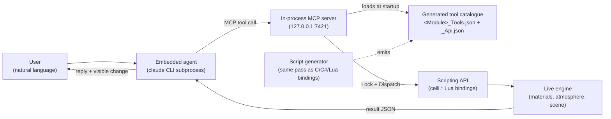

# AI Integration

This page is about a loop that closes on itself. Ceili ships an AI assistant
*inside* the running engine: an embedded agent that can preview a material,
adjust the atmosphere, or reshape a scene by talking to the live engine. And the
same assistant, in its coding form, builds the engine. The engine ships the
model; the model builds the engine. The two halves are the same story told from
two ends, and the connective tissue is the one you have already met: a scripting
API good enough to be driven, plus the [generator](ScriptGeneration.md) that
exposes it.

The unlock is that exposing the API well enough for an embedded agent to drive it
turned out to be the same work as exposing it well, full stop. The agent was a
forcing function, not a bolt-on.

---

## Two halves

The first half is a component like any other. Agents in Ceili follow the
[trunk-plus-backends pattern](Components.md#the-trunk--backends-pattern): a generic
`Agent` trunk declares the interface and a fallback, and concrete backends alias
themselves in when their DLL loads. The `Agent` package's `Module.h` declares the
generic id next to the fallback:

```cpp
// Agent/Module.h: CID_Agent is the generic "active agent" CID; each backend's
// module Initializer sets an alias (CID_Agent -> CID_<backend>) so SendMessage
// resolves to whichever backend is wired in via config.lua. CID_AgentNull is the
// fallback (hardcoded preview script) when no real backend loads.
CE_DECLARE_COMPONENT_ID(Agent)
CE_DECLARE_COMPONENT_ID(AgentNull)
```

The trunk points the generic id at its own no-op fallback so a headless build with
no backend still functions:

```cpp
// Agent/ModuleFactories.cpp: trunk default alias.
component::SetComponentAlias(agent::CID_Agent, agent::CID_AgentNull);
```

The `AgentClaude` backend overrides that alias to itself the moment its module
initializes, and `config.lua` pins the choice deterministically so DLL load order
cannot change the answer:

```cpp
// AgentClaude/ModuleFactories.cpp: backend override.
component::SetComponentAlias(agent::CID_Agent, CID_AgentClaude);
```
```lua
-- Bootstrap/Resources/Scripts/config.lua: the deterministic pin.
ceili.core.component.setComponentAlias(ceili.agent.CID_Agent, ceili.agent.claude.CID_AgentClaude)
```

Every backend implements one small interface. There is nothing model-specific in
it: send a prompt, reset the conversation.

```cpp
// Agent/Include/Agent.h
struct IAgent : component::IComponent
{
    virtual Result sendMessage(ConstStr Prompt) = 0;
    virtual void   reset() = 0;
};
```

> A note on what exists today, because the header's own doc-comment is ahead of
> the code. It mentions `CID_AgentOpenAI` and `CID_AgentOllama` as "(future)"
> backends: those do not exist yet. Only two are real, `AgentNull` (the trunk
> fallback, live as the default alias) and `AgentClaude`. The generic-CID pattern
> is what makes adding a third a matter of one alias line, not a refactor.

---

## Half one: the engine ships Claude

`AgentClaude` is the backend that turns `sendMessage` into a real conversation. It
does not link a model or embed an inference runtime; it spawns the `claude` CLI as
a child process and talks to it over pipes. The spawn is an ordinary
`core::process::Desc`:

```cpp
// AgentClaude.cpp: runSubprocess() builds a process Desc and spawns.
core::process::Desc desc{};
desc.executable     = "claude.cmd";
desc.args           = args_buf;
desc.redirectStdIn  = true;
desc.redirectStdOut = true;
desc.redirectStdErr = true;
desc.envAllowlist   = core::process::kStandardEnvAllowlist;
desc.treeKind       = core::process::tree::Kind::Tree;
```

The interesting part is the argument line, because it is where the engine decides
*what the agent is allowed to do*. `BuildArgs()` strips every built-in tool the
CLI ships with and allows only the engine's own tools back in:

```text
--dangerously-skip-permissions --strict-mcp-config --tools ""
--disallowedTools LSP
--allowedTools mcp__ceili-studio__ceili_agent_tools_ExecuteLua,
               ...ListApiNamespaces,
               ...DescribeApiNamespace
```

Read that as a policy statement. The embedded assistant has no filesystem, no
shell, no web: its entire universe is three engine tools. It can execute Lua
against the live engine, list the API's namespaces, and describe one in detail.
That is a deliberately small, deliberately powerful surface. The default model is
pinned in code and overridable at runtime:

```cpp
// AgentClaude.cpp
constexpr ConstStr kDefaultModel = "claude-opus-4-7[1m]"; // overridable via agent::SetModel
```

Argument quoting reuses Core's JSON string escaper rather than reinventing it,
which is the same discipline the rest of the engine follows (see
[Core: never reinvent escaping](Core.md)):

```cpp
// AgentClaude.cpp: QuoteArg wraps Core's json::EscapeString.
size_t QuoteArg(char* Dst, const size_t DstLen, ConstStr Src)
{
    Dst[0] = '"';
    const size_t inner_max = DstLen - 2;
    const size_t required  = core::json::EscapeString(Dst + 1, Src, inner_max);
    // ... close the quote, report required length snprintf-style ...
}
```

<!-- MEDIA: a short clip of the in-engine AI Assistant panel in Studio driving a
     live change -- the user types "make the sky warmer at sunset" or "preview the
     brushed-metal material", and the viewport updates as the agent executes Lua
     against the running engine. This is the whole pitch in ten seconds. -->

### The MCP server: the API as callable tools

Those three `mcp__ceili-studio__...` tools are served by an MCP server the engine
hosts *in-process*. When Studio is running it embeds the server as a plugin,
binding a loopback port shortly after the agent initializes:

```csharp
// StudioPlugins.Net/Plugins/Mcp/McpAppLauncher.cs: Studio embeds the MCP server,
// binding 127.0.0.1:7421 shortly after AgentClaude::init.
```

The server itself hosts a vendored MCP SDK over streamable HTTP in stateless mode.
Its job is small: load the tool catalogue, register each tool, and start the pump.

```csharp
// Mcp.Net/McpServer.cs
var tools = ToolCatalogue.LoadAll();
var tool_collection = new McpServerPrimitiveCollection<McpServerTool>();
foreach (var tool in tools) tool_collection.Add(tool);
var options = new McpServerOptions {
    ServerInfo     = new Implementation { Name = "ceili-mcp", Version = "0.1.0" },
    ToolCollection = tool_collection,
};
m_Server = SdkMcpServer.Create(m_Transport, options);
```

When a tool is invoked, a thin bridge takes the Lua VM lock and calls straight
into the C++ dispatcher, so the tool call and the engine's own scripting run
against the same interpreter without racing:

```csharp
// Mcp.Net/Bridge.cs: invocation takes the Lua lock, calls the C++ dispatcher.
Ceili.Scripting.Lua.Lock(h_script);
try     { dispatch_res = Ceili.Agent.Tool.Dispatch(p_name, p_args, p_result, (ulong)result_bytes.Length); }
finally { Ceili.Scripting.Lua.Unlock(h_script); }
```

For headless or Claude-Code-only runs where Studio's embedded plugin is not
present, `AgentClaude` lazy-launches a standalone MCP server against the frozen
Bootstrap exe instead (`AgentClaude/Src/Mcp/Launch.cpp`,
`EnsureMcpServerRunning`). Same catalogue, same tools; only the host differs.

### The tool catalogue is generated, not hand-authored

This is the crux, and the seam that links the two halves. The catalogue of tools
the MCP server exposes is not written by hand. It is emitted by the *same
generator pass* that produces the C, C#, and Lua bindings (see
[Script Generation](ScriptGeneration.md)). A function becomes a tool by wearing an
attribute in the header:

```cpp
// Agent/Include/Agent.h: CE_AGENT_TOOL marks the source of truth.
CE_AGENT_TOOL("Execute a Lua script in the Ceili engine. ... Returns the script's "
              "stdout/log output, or an error message on failure.")
inline ConstStr ExecuteLua(
    CE_AGENT_PARAM("Script", "The Lua script source to execute.") ConstStr Script)
```

A generator writer walks the AST for `CE_AGENT_TOOL`, alongside the writers that
emit the language bindings, and produces a `<Module>_Tools.json` per package:

```text
ScriptingGenerator/Src/Writers/Writer_ToolsCatalogue.cpp
   walks CE_AGENT_TOOL -> emits <Module>_Tools.json
   (sibling to Writer_ApiCatalogue.cpp, run in the same pass as the C/C#/Lua writers)
```

The output carries the engine's `-- Generated File` convention and is never
hand-edited:

```json
// ScriptingApi/Scripts/Agent_Tools.json (generated)
{
  "package": "Agent",
  "tools": [
    { "name": "ceili_agent_tools_ExecuteLua",
      "description": "...",
      "inputSchema": {
        "type": "object",
        "properties": { "Script": { "type": "string" } },
        "required": ["Script"] } },
    { "name": "ceili_agent_tools_ListApiNamespaces" },
    { "name": "ceili_agent_tools_DescribeApiNamespace" }
  ]
}
```

The catalogue loader simply enumerates every `*_Tools.json` the build emitted and
turns each entry into a live tool:

```csharp
// Mcp.Net/ToolCatalogue.cs
string dir = System.IO.Path.Combine(root, "Pkg", "Engine", "ScriptingApi", "Scripts");
foreach (var file in Directory.EnumerateFiles(dir, "*_Tools.json"))
{
    // ... tools.Add(new EngineTool(entry.Name, entry.Description, entry.InputSchema));
}
```

Alongside the tools, companion `<Module>_Api.json` files (for example
`Graphics_Api.json`) hold the full Lua-reachable surface: every function, struct,
enum, handle, and constant. The `ListApiNamespaces` and `DescribeApiNamespace`
tools read these at runtime, so the agent discovers the API the same way a human
would read the reference, by asking what exists and then asking for detail.

### How a request becomes a live change

Put the pieces in order and the flow is short. The agent lists namespaces, drills
into the one it needs, then executes Lua. The `execute_lua` handler runs the
script on the agent's *own* dedicated Lua state, isolated from the main-thread FFI
state to avoid an allocator race, and captures the output:

```cpp
// Agent/Src/Tools/ExecuteLua.cpp: run on the agent's dedicated Lua state.
const scripting::Handle h_script = GetAgentLuaScript();
scripting::lua::CaptureResult capture;
scripting::lua::ExecuteAndCapture(h_script, script, capture);
```

The result comes back as a small JSON shape the agent can reason about:
`{"status":"ok","output":"..."}`, or `returned` on a value, or `syntax_error` /
`runtime_error` with the message. Because the script runs against the real
`ceili.*` bindings, "adjust the atmosphere" is literally the agent calling
`ceili.graphics.env.atmosphere.*`, and "preview a material" is it calling the
material-preview functions, both discovered first via the catalogue. There is no
special agent path into the engine: it drives the same API a Lua script or a C#
plugin drives.



The diagram is the whole architecture: an embedded agent talks to an in-process
MCP server, which serves a tool catalogue that the binding generator emitted,
which dispatches into the scripting API, which drives the live engine. Every arrow
is a real hop in the code above, and the dotted arrow, the generator feeding the
catalogue, is the one that makes the rest cheap.

---

## Half two: the recursion

Here is the part that is easy to miss and hard to unsee once you have. The
assistant embedded in the engine is the coding assistant that *builds* the engine.
Not a cousin of it, the same tool. Claude Code writes the C++, the Lua, and the
C#; the engine then ships that same model, pointed at its own scripting API.

That symmetry is not a marketing flourish, it is a design constraint that paid
off. To embed an agent that can usefully drive the engine, the engine's API has to
be:

- **Discoverable**, so the agent can find a capability without being told where it
  lives. That is exactly what the generated `*_Api.json` catalogue and the
  `ListApiNamespaces` / `DescribeApiNamespace` tools provide.
- **Uniform**, so one mechanism (execute Lua against `ceili.*`) reaches everything.
  That is the [handle-based, C-like API](Core.md#strong-types-and-handles) the
  engine already committed to, crossing the script boundary cleanly.
- **Self-describing**, so a tool's inputs and description come from the source, not
  a separate doc that rots. That is `CE_AGENT_TOOL` plus the generator.

None of those three are agent features. They are just *good API* features. The
agent could not be bolted on unless they were already true, and wanting the agent
was what made the team pay for them everywhere instead of in the few places a human
happened to be looking. The embedded assistant is a fitness test for the API, run
continuously: if a subsystem is awkward for the agent to drive, it is awkward for
everyone, and the fix is the same fix.

This is the counterpoint to how the commercial heavyweights and the open-source
peers usually reach AI: as an editor plugin that generates code *next to* the
engine, or a chat window pasted onto the tool UI. Ceili's agent lives one layer
down, on the same generated API surface that scripts and plugins use, because the
API was built to be driven in the first place. The generator that made the
bindings made the tools; there was no second system to build.

The development-process side of this recursion, what it is actually like to build
an engine of this size with an AI pair over months, is its own story. The
[20-week case study](AI_Assisted_Engine_Development.md) covers the workflow, the
guardrails, the failure modes, and the numbers. This page is about the product of
that process pointing back at itself: the engine you built with the model now runs
the model.

---

## Where it sits, and where it does not

A few honest boundaries, because they matter for anyone reading the code:

- The system prompt and skills that shape the embedded assistant live as prompt
  content (`Agent/Resources/SystemPrompt.md`, plus skill files layered on top by
  the AI Assistant plugin). They are *content*, not mechanism. When the assistant
  needs to understand the API better, the durable fix is to improve the generated
  catalogue or the scriptgen path, not to hand-tune the prompt, because the prompt
  only paraphrases what the catalogue already states authoritatively.
- The tool surface is intentionally narrow (execute Lua, list, describe). Breadth
  comes from the API the Lua reaches, not from adding more tools. A new engine
  capability becomes agent-reachable the moment it is script-exported and
  cataloged, with no new tool and no prompt change.
- The agent runs its Lua on a dedicated interpreter state, deliberately isolated
  from the main-thread FFI state. That isolation is a correctness boundary, not an
  incidental one: it is what keeps the agent's mutations from racing the engine's
  own scripting through a shared allocator.

---

## Why this is the payoff of everything upstream

The embedded agent is not a new subsystem. It is the [component
system](Components.md) choosing a backend, the
[scripting API](Core.md#strong-types-and-handles) crossing a language boundary,
and the [generator](ScriptGeneration.md) emitting one more artifact next to the
bindings it already produces. Count the reuse:

- The **backend selection** is the generic-CID alias pattern, unchanged.
- The **tool catalogue** is a generator writer sitting beside the C/C#/Lua writers.
- The **invocation path** is the same Lua VM the engine already runs, under a lock.
- The **discovery surface** is the same reflected API surface a human reads.

Adding a tool is adding an attribute to a header. Reaching a new capability is
script-exporting it. That is the same "add a field, light up every feature"
economy that [Metadata](Metadata.md) delivers for the property grid and the
serializers, applied to the agent. And it closes the loop the whole project is
built on: the model that wrote the engine ships inside it, driving the very API it
helped make good enough to drive.

Next: [Script Generation](ScriptGeneration.md) for the generator that emits both
the bindings and the tool catalogue, [Component Architecture](Components.md) for
the backend-selection pattern, or the
[20-week case study](AI_Assisted_Engine_Development.md) for the other half of the
recursion. Back to the [documentation index](README.md).
