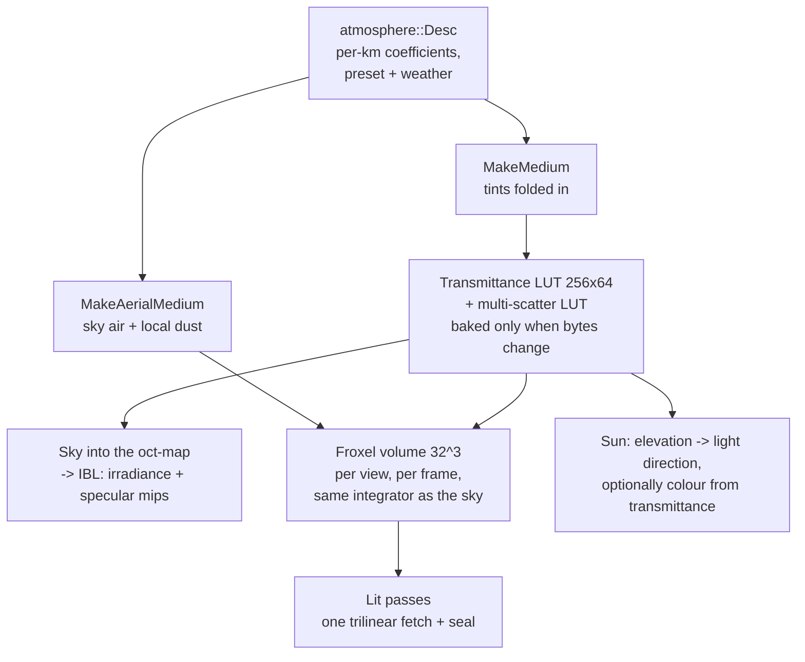

# Atmosphere

The sky in Ceili is a physical model of a planet's air, authored in real units.
The same medium that colours the sky also hazes the distant world and tints the
sun, and all three are integrated by one function, so they cannot disagree about
what the air is made of.

This page covers the model, the lookup tables that make it cheap, the froxel
volume that carries it onto geometry, the local dust layer that the volume sees
and the sky does not, the sun, and the horizon seal that dissolves a play area
into the sky.

The atmosphere is one of four environment sources a scene can pick, and it is the
default:

```cpp
// Include/Env/Env.h
enum class Source : uint8_t
{
    None = 0,   // no sky, no IBL prepass -- user lights only
    Atmosphere, // procedural atmospheric scattering sky (the default)
    Gradient,   // procedural gradient sky
    Hdri,       // prebaked HDRI environment, referenced by hdriName
```

The list continues with `Cubemap`, which bakes a six-face legacy skybox into the
same octahedral map the others produce, so every source feeds the same
image-based lighting chain downstream.

---

## The model, in kilometres

The scattering model is Hillaire's, and every coefficient is a published
physical value per kilometre rather than a tuned number:

```cpp
// Include/Env/Atmosphere.h
//-----------------------------------------------------------------------------
// THE MODEL IS HILLAIRE'S, AND THE UNITS ARE KILOMETRES.
//
// Every coefficient below is a published, per-kilometre physical value rather
// than a tuned number (reference: github.com/sebh/UnrealEngineSkyAtmosphere).
// The units are free to be real ones because the atmosphere renders into an
// oct-map from a synthetic observer - nothing in the world couples to
// planetRadius, so it costs nothing to make these numbers checkable.
```

Real units make the defaults checkable against a textbook, and they make a
preset a statement of fact. Mars is not a mood board:

```cpp
// Src/Env/Atmosphere.cpp
// Real Mars.  A CO2 atmosphere at about one percent of Earth's density scatters
// almost no blue, so the sky's colour comes from suspended DUST - which is Mie, not
// Rayleigh, and is exactly what mieTint is for.  Lower gravity gives it a taller
// scale height than Earth's despite the thinner air, and there is no ozone layer.
// sunBrightness is a fact rather than a mood: Mars receives 43 percent of Earth's
// insolation, so 0.43 * 20.
```

Three properties of the parameterisation are load-bearing, and the header names
them:

- **Scattering is separate from extinction.** The multiple-scattering transfer
  factor is a ratio of the two, so a model with one coefficient serving as both
  cannot express it at all.
- **Mie authors absorption, not extinction.** Extinction is derived as scatter
  plus absorb, so extinction is at least scattering for any authored value. That
  is the invariant the multiple-scattering series needs: a single-scatter albedo
  above one makes it diverge, and authoring extinction directly would put that
  divergence one slider drag away.
- **Ozone absorbs without scattering.** No combination of Rayleigh and Mie
  reproduces it, and it is the whole reason dusk and the blue hour work.

Every field carries a description written for two readers at once. The property
grid shows it as a tooltip, and the [AI agent](AiIntegration.md) reads the same
string from its generated API catalogue, so "push it up for haze" is written once
and serves both.

### Presets and weather

A preset stamps a named set of values into the fields and then leaves them free
to tune: Earth clear, overcast and sunset, Mars, an alien sky, and a `Classic`
preset tuned to reproduce the ported legacy content's painted dome. Two more,
`Sunrise` and `Midday`, also drive the scene's sun to their hour.

Weather is a second axis that modifies the stamped preset rather than replacing
it, so Mars under snow is still Mars, whiter and dimmer:

```cpp
// Src/Env/Atmosphere.cpp
// Each entry SCALES the resolved preset's aerosol rather than
// replacing it, so every preset keeps its identity under every weather (Mars under Snow is still
// Mars, whiter and dimmer), and the model's invariants survive by construction: scales are
// non-negative, so authored absorption stays non-negative and extinction >= scattering holds.
// The tint is a LERP toward a weather colour rather than a multiply, because a multiply could
// only darken channels -- Snow could never neutralise Classic's sand toward white.
```

Restamping always starts from the table, so flipping weathers never compounds.

---

## Two lookup tables, baked only when the air changes

Integrating scattering along every view ray every frame is expensive. The model
avoids it with two small tables that depend only on the medium.

The **transmittance table** stores, per altitude and view angle, how much of each
colour channel survives from a point out to the top of the atmosphere. It is 256
by 64 at RGBA16F, 128 KB, and wide in the angle axis because the air mass changes
fastest near the horizon.

The **multiple-scattering table** stores the light that has bounced more than
once. Hillaire's contribution is that this converges to a closed form, so higher
orders cost a lookup rather than a loop.

The bake runs only when the medium changes, and "changes" is decided by comparing
the medium's bytes:

```cpp
// Render/Atmosphere.cpp
const env::atmosphere::Desc& desc   = env::atmosphere::GetDesc(hScene);
const Medium                 medium = env::atmosphere::MakeMedium(desc);
if (!m_LutFilled || !m_MultiScatterFilled || heap::MemCmp(&medium, &m_LastMedium, sizeof(Medium)) != 0)
{
    const bool transmittance_ok = bakeTransmittanceLut(medium);
    const bool multi_scatter_ok = transmittance_ok && bakeMultiScatterLut(medium, m_hMultiScatterRt);
```

Sliding a field in the property grid rebakes both tables. Moving the camera does
not, and neither does moving the sun: the tables are indexed by sun angle, so the
sun is no part of what they are baked from. A pair of counters records bakes and
skips, because "a medium change rebakes and a sun move does not" is invisible to
every check that only looks at the picture.

The sky itself is a different matter. It is rendered into an octahedral map that
the IBL chain then convolves into irradiance and seven specular mips, and that
does re-run when the sun moves, since the sky's appearance depends on where the
sun is. That is why the sky's ray-march sample count defaults high: it runs on an
edit or a sun move, never per frame.

### One parameterisation, one file

The bake writes a texel per altitude and angle, and the sky shader reads back at
an arbitrary altitude and angle, so the two mappings must agree. A mismatch fails
silently and reads as a tuning problem rather than a bug, which is why the mapping
exists once:

```hlsl
// Resources/Shaders/atmosphereLut.hlsli
// The bake writes a texel per (radius, mu) and the sky shader reads back at an
// arbitrary (radius, mu), so the two mappings MUST agree. A mismatch is silent:
// nothing errors, the sky merely looks wrong in a way that reads as a tuning
// problem rather than a bug. That is why this lives here and not twice.
```

The table stores zero for a ray that meets the ground, and the choice of stored
quantity is what makes that safe. Because it stores transmittance, a reader
combines two readings by multiplying them, and zero is exactly representable. A
table of optical depth would be combined by subtraction, which needs a finite
sentinel for a blocked ray, and two blocked directions would give infinity minus
infinity: a NaN that the IBL prepass samples and that resets the GPU driver.
Multiplying rules that failure out by construction rather than by a careful
choice of constant.

---

## Aerial perspective: the air in front of the world

Distant geometry takes on the sky's colour and loses contrast, which is most of
what makes a large outdoor scene read as large. Ceili carries the atmosphere onto
geometry through a froxel volume: a 32 by 32 by 32 grid laid over the camera
frustum, where each cell stores what the air between the eye and that cell does
to whatever sits behind it.

```hlsl
// Resources/Shaders/atmosphereFroxel.comp
// One thread per froxel. Each marches the segment from the EYE to its own depth and stores what
// that column of air did to whatever sits behind it: rgb is the light scattered INTO the view
// along the way, a is the transmittance that survives it. Forward shading then needs one
// trilinear fetch per pixel to fog a surface correctly, which is the whole reason the volume
// exists rather than a screen-space march: the cost is the volume's own size, not the pixel
// count, so it does not multiply with a VR headset's two eyes.
```

A lit surface then applies aerial perspective with one trilinear texture fetch.
The volume is 256 KB and its cost is its own size, fixed, however many pixels the
view has.

**The froxel and the sky call the same integrator.** The march lives in the shared
LUT file, not in the compute shader, so the fog on a distant hill and the sky above
it integrate one medium through one function:

```hlsl
// Resources/Shaders/atmosphereFroxel.comp
// The march itself is NOT here - it is AtmosphereIntegrateSegment in atmosphereLut.hlsli, the
// same function the sky calls. That is what C2.2 hoisted it for: the fog on a distant hill and
// the sky above it integrate one medium through one integrator, so they cannot disagree.
```

### Slices, squared

The 32 depth slices are not spaced evenly. Aerial perspective changes fastest over
the first few hundred metres and barely at all past ten kilometres, so the slice
depth grows with the square of its index:

```hlsl
// Resources/Shaders/aerialPerspective.hlsli
float AtmosphereFroxelSliceDistance(uint Slice, uint NumSlices, float MaxDistance)
{
    const float unit = (float(Slice) + 1.0f) / float(NumSlices);
    return MaxDistance * unit * unit;
}
```

The build walks slice index to distance and the read walks distance back to a
slice coordinate. Both directions live in one file, because a write and a read
that must agree belong in one place. The volume reaches 32 km.

Unlike the tables, the volume is rebuilt every frame for every view. The tables
depend only on the air; every froxel is a ray through the camera, so the volume is
stale the moment the camera moves.

<!-- MEDIA: a ported outdoor scene with the froxel haze on and off, side by
     side, from a low camera looking across the terrain toward the horizon. The
     "large reads as large" point needs the comparison. -->

---

## Local dust: air only the ground sees

A dust bowl, a sandstorm, smoke over a town: these are scene-scale layers, not
planetary air. The sky tables are planet-wide, indexed by altitude and sun angle,
and have nowhere to put a local layer. The froxel volume marches real scene
distances and does. So the dust layer is authored on the atmosphere but seen only
by the volume:

```cpp
// Include/Env/Atmosphere.h
// - The LOCAL DUST LAYER: aerosol that ONLY the aerial-perspective volume marches, and the sky
//   deliberately does not.  A dust bowl, a sandstorm, smoke over a city: a scene-scale layer,
//   not planetary air.  It belongs to the froxel volume, which marches real scene distances,
//   rather than to the sky LUT, which is a planet-wide table indexed by radius and sun angle
//   and has nowhere to put a local layer at all.
```

Zero means off, and a scene that authors no dust renders exactly what it did
before the layer existed.

**Dust absorption is tinted separately from dust scattering**, and that split is
what makes the layer work at all. When scattering and extinction share one tint,
the tint warms what is scattered and cools what survives by the same factor, and
where the air is thick the two cancel. Measured on the ported DirtBox scene, taking
the shared aerosol tint all the way to orange moved the horizon hue by less than a
tenth of a level. A term that absorbs blue without scattering breaks the symmetry,
which is also what real airborne dust does: it eats blue on the way in and leaves
what it scatters warm.

**Dense dust needs its own multiple-scattering table.** The multiple-scattering
factor carries the albedo of the air it was baked from. DirtBox's dust scatters
about 130 times more than the sky's aerosol, and pairing the sky's table with the
dust's coefficient asked a thin aerosol's factor to describe a dense layer. With
the term forced off, multiple scattering turned out to be 82 percent of the haze,
so the mismatch owned most of it. The volume now bakes a second table from the
dust medium, and only when a scene has dust:

```cpp
// Render/Atmosphere.cpp
// NO DUST MEANS NO SECOND BAKE. MakeAerialMedium returns the sky's medium byte for byte when
// a scene authors none (Atmosphere_MakeAerialMedium_NoDustIsTheSkysOwnAir pins exactly
// that), so the compare below leaves every existing scene on the sky's table, bit-identical
// and at the cost of one MemCmp.
```

The dust also has its own phase function. The sky's aerosol draws the sun, since
there is no separate sun disc and the sun is the forward lobe of the Mie phase, so
it wants a tight lobe. A ported scene's dust stands in for a legacy fog that was
unlit and flat, so it wants a broad one. Sharing one value made a defined sun and
a flat haze mutually exclusive.

---

## The sun

The sun is authored as a time of day rather than as a rotated light. One elevation
from 0 to 1 sweeps an east-to-west arc, with named hours as snapping shortcuts, and
a scene system drives the first directional light from it:

```cpp
// Include/Env/Sun.h
enum class TimeOfDay : uint8_t
{
    SunRise = 0, // sunrise, east  (elevation 0.0)
    Time4am,     // early morning  (0.1)
    Time8am,     // mid-morning    (0.25)
    Midday,      // overhead       (0.5)
    Time4pm,     // afternoon      (0.75)
    Time8pm,     // evening        (0.9)
    SunSet,      // sunset, west   (1.0)
};
```

Rotating the light with the gizmo writes back to the elevation, so the two views
of the sun stay in step.

The light's colour can come from the sky instead of from the author. With
`Radiometry::Atmosphere`, the sun's colour is its brightness times the
transmittance table's value at the current elevation, so noon is a strong warm
white, sunset a dim red, and a storm that dims the sky's sun dims the light too.
The default is `Authored`, and there is a measured reason: a preset tuned to match
how a painted legacy sky *looks* extinguishes the key light far more than the
legacy game ever did, because legacy lit its ground with an authored sun and no
atmospheric extinction at all. A separate field sets how much of the sky's
extinction the coupled sun takes.

---

## The horizon seal

A play area has an edge, and the world must dissolve into the sky before that
edge shows, whatever the weather. That is a gameplay fade rather than a scattering
term, and it is authored in world units rather than kilometres, so retuning the
air or flipping a preset can never move the play boundary.

Two seals compose, and either one saturating dissolves the pixel:

- **The camera seal** fades by distance from the camera. It is simple and it has
  one flaw: as the player walks toward the boundary, the outside world comes back.
- **The world seal** fades by horizontal distance from a fixed point, an infinite
  vertical cylinder. A pixel beyond its outer radius is sky from anywhere the
  player can stand, and inside its inner radius the world term is exactly zero.
  The legacy importer derives it from the ported game's arena radii.

The seal also caps the [shadow cascades](Shadows.md): there is no point resolving
shadows on geometry the seal has already turned into sky, so the last cascade stops
at the seal where that is nearer than its authored reach.

---

## The whole path



Everything above the froxel is keyed by scene, because the edited scene, the
material preview and each thumbnail render a sky in the same frame, and Play mode
overlaps them. When the sky's output was process-global, a thumbnail's sky once
reached the main camera.

---

## What the atmosphere does not do

- **No clouds.** The medium is a clear or hazy shell. The source is candid about
  it: the overcast preset is "honestly the hazy white sky rather than the gloom",
  because what makes a real overcast day gloomy is cloud blocking the sun, and
  weather dims the sun to stand in for cloud cover the model cannot express.
- **No volumetric shadows in the haze.** The froxel march takes the sun's
  transmittance through the air, and does not test the shadow atlas, so terrain
  does not cast light shafts through the dust.
- **One sun.** The sky and the coupled light model a single star.
- **A moving sun is not free.** The tables stay put, but the sky's octahedral
  map and its IBL convolution re-render every frame the sun moves. A continuous
  time-of-day sweep is correct and is not the case that path was designed around.
- **The volume is fixed at 32 slices over 32 km.** Both numbers are defines shared
  between C++ and HLSL rather than settings, because the lit passes' constant
  blocks have almost no room left under Vulkan's push-constant cap.

Next: [Lighting](Lighting.md) for the ambient pass that applies the haze to the
G-buffer, [Shadows](Shadows.md) for the cascades the seal caps, or
[Post-Processing](PostProcessing.md) for the exposure and tonemapping downstream.
Back to the [documentation index](README.md).
