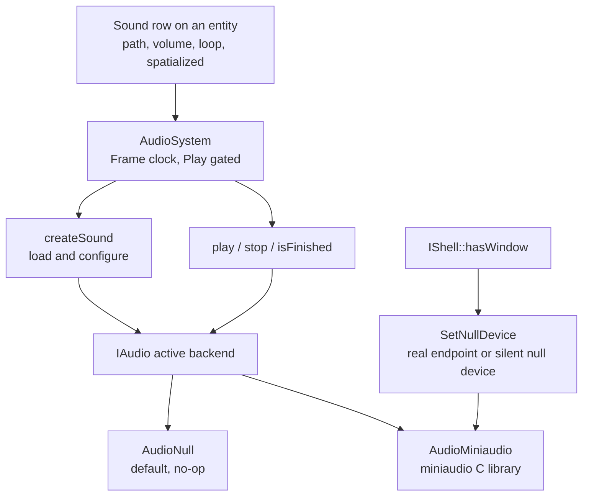

# Audio

Audio in Ceili follows the same trunk-plus-backend shape as
[Physics](Physics.md) and [Networking](Networking.md). The trunk, `IAudio`,
declares sounds and a listener. A Null default answers every call and opens no
device, so a headless build or a test runs without touching an audio card. A
backend package, `AudioMiniaudio`, plays real sound through the vendored
miniaudio library, a single-file C library.

A sound is authored on an entity. An entity carries a `Sound` row, the audio
system reads it each frame, and the row becomes a playing sound. The subsystem is
young. It went in during the summer of 2026, and one real bug shaped part of its
design: a headless run that opened a real Windows audio endpoint could hang for
ever on exit. The fix, and how it was found, is on this page.

---

## Trunk, backend, and one system

A consumer creates the generic id `CID_Audio` and gets whichever backend holds
the alias. With no backend DLL loaded that is the Null default. It opens no device
and hands back an invalid handle from `createSound`, and its other calls do
nothing:

```cpp
// Audio/AudioNull.cpp
    core::ConstStr getName() const override { return "Null"; }

    core::Result createSound(sound::Handle&                             OutSound,
                             [[maybe_unused]] const sound::Desc&        Desc,
                             [[maybe_unused]] core::ConstStr            Path,
                             [[maybe_unused]] const core::scene::Handle hScene) override
    {
        OutSound = sound::GetInvalidHandle();
        return core::results::success::Ok;
    }

    void destroySound([[maybe_unused]] const sound::Handle hSound) override {}

    void play([[maybe_unused]] const sound::Handle hSound) override {}

    void stop([[maybe_unused]] const sound::Handle hSound) override {}

    bool isFinished([[maybe_unused]] const sound::Handle hSound) const override { return true; }
```

Load `AudioMiniaudio` and it claims the alias and plays for real. It releases the
alias back to Null when its DLL unloads, in the ordered release the
[Physics](Physics.md) page describes. The
[Component Architecture](Components.md) page covers the alias mechanism, and
Physics uses the same one.

Audio runs a single scene system, and the id comment says why it needs only one
where Physics needs two:

```cpp
// Audio/Module.h
CE_DECLARE_COMPONENT_ID(Audio)     // generic alias target - what consumers create
CE_DECLARE_COMPONENT_ID(AudioNull) // no-op default backend, so a headless run still works
// ONE system, unlike Physics' two.  That split exists because a body handle is a process
// token the SimTick domain must not write; audio is presentation rather than simulation, so
// nothing here is SimTick and the contract never arises.
CE_DECLARE_COMPONENT_ID(AudioSystem) // Frame, both modes: rows -> sounds, and Play gates the body
```

Audio is presentation, so it has no simulation state that rolls back on Stop. The
one system runs on the Frame clock, and playback is gated to Play mode.



---

## Entity-authored sounds

The tuning a sound carries, `sound::Desc`, is a handful of plain fields. A sound
is flat or placed in the world, it loops or plays once, and it has a volume, a
pair of attenuation distances, and optional per-play variation:

```cpp
// AudioTypes.h
    bool spatialized{false};

    bool loop{false};

    // Forwarded verbatim to the backend's attenuation, exactly as legacy forwarded them to
    // FMOD's set3DMinMaxDistance.  There is no curve to port with them: `UseLinearRollOff`
    // is authored ZERO times across the whole corpus, so every legacy sound used FMOD's
    // built-in log/inverse rolloff, which is what miniaudio's default inverse model is.
    float minDistance{1.0f};
    float maxDistance{1000.0f};

    // Decibels, 0 meaning unattenuated.  The example package authors 0 everywhere and so
    // cannot exercise the conversion at all; prospector authors real negative values
    // (-0.5 to -2), which is what VolumeFromDb exists for.
    float volumeDb{0.0f};
```

The authorable row, `scene::Sound`, adds a resource name and two behaviour flags
on top of that tuning. It manages the backend sound by lifetime: the audio system
creates the backing sound once the row's bytes land, and the row's destructor
releases it on delete or entity destroy.

```cpp
// AudioTypes.h
    // The resource name, database-scoped so it dies with the arena the row dies with.  An
    // EMPTY name is not an error and logs nothing - it is how an unauthored legacy
    // MusicTrack lands, and a row with nothing to play should simply play nothing.
    core::ScopeDataString path;

    // Legacy `playmode = Playing` / `state = Playing`: start on the first Play-mode tick
    // after the row appears.  False leaves it silent until something calls play().
    bool autoPlay{true};

    // Destroys the ENTITY when the sound finishes, not just the sound - legacy's
    // end-of-channel callback called destroyEntity, so porting this as "stop the sound"
    // would be silently wrong.  Legacy also suppressed it while the scene was in the
    // editor, which here falls out of the system being Play-gated.
    bool destroyOnFinish{false};
```

Each frame in Play mode the system walks the `Sound` rows. It creates the backend
sound for a row that has none, positions it if it is spatialized, starts it once
if `autoPlay` is set, and destroys the entity when a `destroyOnFinish` sound has
finished:

```cpp
// AudioSystem.cpp
            if (p_sound->autoPlay && !p_sound->started)
            {
                p_audio->play(p_sound->hSound);
                p_sound->started = true;
                continue; // isFinished is not meaningful until the mixer has seen the start
            }

            // Polled, never callback-driven: a backend's end-callback runs on its own mixing
            // thread, and touching engine state from there would corrupt a write set the DAG
            // knows nothing about.  This is what P1's threading contract exists for.
            if (p_sound->started && p_sound->destroyOnFinish && p_audio->isFinished(p_sound->hSound))
            {
                m_PendingDestroy.push_back(key);
            }
```

Completion is polled through `isFinished`, never delivered by a callback. A
backend's end-callback runs on its own mixing thread, and touching engine state
from there would corrupt a write set the frame graph does not know about. See the
threading contract in
[Core](Core.md#tasks-threading-and-the-fixed-tick-clock).

---

## What the backend does with a sound

`AudioMiniaudio` loads a sound file into memory and configures it through
miniaudio's high-level engine, which mixes every playing sound and applies 3D
attenuation. Creating a sound sets its looping, its volume, its spatialization,
and its attenuation model and distances:

```cpp
// AudioMiniaudio.cpp
        ma_sound_set_looping(&m_Sound, Desc.loop ? MA_TRUE : MA_FALSE);
        ma_sound_set_volume(&m_Sound, m_BaseVolume);
        ma_sound_set_spatialization_enabled(&m_Sound, Desc.spatialized ? MA_TRUE : MA_FALSE);

        // miniaudio's default model already, spelled out because it is a PORTING decision
        // rather than an inherited default: UseLinearRollOff is authored zero times across
        // the whole legacy corpus, so every legacy sound used FMOD's built-in log/inverse
        // rolloff and there is no curve to port alongside the distances.
        ma_sound_set_attenuation_model(&m_Sound, ma_attenuation_model_inverse);
        ma_sound_set_min_distance(&m_Sound, Desc.minDistance);
        ma_sound_set_max_distance(&m_Sound, Desc.maxDistance);
```

Volume is authored in decibels and converted to a linear gain. A sound can vary
its pitch and volume slightly on each play, rolled by the engine so the roll
stays under one random generator. Playback is `play`, `stop`, and a polled
`isFinished`. A spatialized sound takes a world position, and the listener takes a
position and an orientation, so a 3D sound attenuates and pans by distance and
facing.

The listener is authored too. An entity carries a `Listener` row, and the audio
system pushes the first active one's position and orientation to the mixer each
frame, so a listener on the camera entity follows the view. A scene that has
spatialized sounds and no active listener warns once and leaves the listener at
the origin, which is a common authoring slip worth catching early.

---

## The Windows exit deadlock

A headless run is one with no window: a unit test, a command-line tool, a build
step that loads a scene. Such a run still creates the audio backend the first time
anything asks for a sound. On Windows that opened a real WASAPI endpoint, and a
real endpoint held by a process with no one listening could wedge on exit. The
trunk records the root cause where the fix lives:

```cpp
// Audio.h
// Ask the backend for a SILENT device -- no real playback endpoint -- because nobody is listening.
//
// THIS IS A DEADLOCK FIX, not a courtesy.  A headless run that holds a real WASAPI endpoint can hang
// FOREVER on exit: the device thread parks INFINITE inside `ma_device_write__wasapi` waiting for a
// device that has stopped consuming, so it never observes the stop flag, and teardown's join never
// returns.  Nothing outside the audio backend can break that wait -- the process becomes unkillable
// (TerminateProcess reports "no running instance" while it sits there) and keeps every build DLL
// mapped, so the NEXT build dies with LNK1104.  Measured from a dump 2026-08-06, both ends of the
// deadlock captured.  A device that is never opened cannot do this.
```

The chain is worth reading in order. The device thread waits inside the platform
write for a device that has stopped consuming. It never sees the stop flag, so the
join that teardown runs never returns. The process cannot be killed, and it keeps
every build DLL mapped, so the next compile fails at link with LNK1104. The bug
was measured from a dump dated the 6th of August 2026, with both ends of the
deadlock captured.

App owns the shell, and Audio deliberately knows nothing about shells, so App is
the layer that answers the question. It reads `IShell::hasWindow`, which is false
for a console or a test, and sets the flag before the first sound plays, because
the backend is created lazily on first use. A windowless run gets miniaudio's null
device, which has no such thread.

The fix keeps the miniaudio backend active. It changes only the device: a
windowless run opens the null device instead of a WASAPI endpoint, so a headless
test still loads, plays, and mixes exactly as before, with no card at the end. The
backend opens the null device through a context restricted to miniaudio's null
backend, so no WASAPI thread is stood up even briefly. A second guard stops the
device before teardown joins its thread, and the source is candid that this guard
is insurance rather than a proven cure for a real endpoint, so the null device is
what actually removes the hazard from headless runs.

A headless smoke test keeps the hazard from returning unseen. If audio ever opens
a real device under a windowless shell, the run fails:

```cpp
// HeadlessSceneApp.cpp
        if (core::StrCmp(device_backend, "Null", 5) != 0 && core::StrCmp(device_backend, "None", 5) != 0)
        {
            CE_LOG(log::Type::Error,
                   "HeadlessSceneApp: audio opened the REAL device backend '%s' under a windowless shell -- it should be the null device (audio::SetNullDevice, driven from IShell::hasWindow). This is the exit-deadlock hazard, not a preference.",
                   device_backend);
            return core::results::failure::Error;
        }
```

<!-- MEDIA: a still of the captured dump or the two deadlocked call stacks would
     illustrate this well if one can be shared; otherwise a short terminal capture
     of the headless smoke test passing (audio on the null device under a
     windowless shell) is enough. -->

---

## What is not built yet

The authored surface is a deliberate subset of what the old content used, and the
header names the fields left out until something sets them:

```cpp
// AudioTypes.h
// Every field here is authored by the legacy corpus.  That is a deliberate bound, not a
// coincidence: FModSound carries 24 properties and the corpus authors only 12 of them,
// Sound2D carries 9 and authors 3, so a faithful-looking port of the full class would be
// mostly inventing authoring nobody wrote (the D10 mistake).  Fields the corpus never
// authors - priority, stream, headRelative, pan, desiredFrequency, mute, group, velocity,
// UseLinearRollOff - are omitted until something actually sets them.
```

That list is the honest limit, stated plainly:

- **No streaming.** A sound file is decoded whole into memory. There is no
  streamed playback for a long music track yet.
- **WAV in practice.** The corpus is 16-bit PCM WAV, and that is what plays. The
  vorbis integration is present but its decoder is not vendored, so an `.ogg` does
  not play today:

  ```
  -- ModuleMiniaudio.lua
  -- OGG VORBIS IS THE ONE FORMAT NOT COVERED, and MA_NO_VORBIS in the source is
  -- misleading about it: miniaudio ships the vorbis INTEGRATION but not the decoder,
  -- gating it on stb_vorbis having been included first (MA_HAS_VORBIS is defined only
  -- #ifdef STB_VORBIS_INCLUDE_STB_VORBIS_H).  3rdParty/stb carries stb_image.h alone,
  -- so supporting .ogg means vendoring one more file.  Nothing needs it today - the
  -- corpus's single .ogg is orphaned - but do not read the MA_NO_VORBIS blocks as
  -- evidence that .ogg already works.
  ```

- **No pan, bus, or group.** A sound has no manual pan and no submix or bus to
  route through. Mixing happens in miniaudio's engine, and there is no engine-side
  effect graph, filter, or reverb on top of it.
- **No Doppler.** A sound and the listener have positions, but no velocity, so
  there is no pitch shift from relative motion.
- **Two source shapes.** A source is flat or a world point. The old content
  declared seven more shapes, and every one of them was commented out and never
  built.
- **The trunk ships no sounds.** The sound search folder is registered so a file
  dropped in it resolves, and the folder is empty today.

What runs is entity-authored WAV playback with looping, decibel volume, per-play
variation, and 3D position with distance attenuation, mixed through miniaudio,
behind a Null-safe trunk that opens no device when no one is listening.

Next: [Particles](Particles.md), or back to the [documentation index](README.md).
