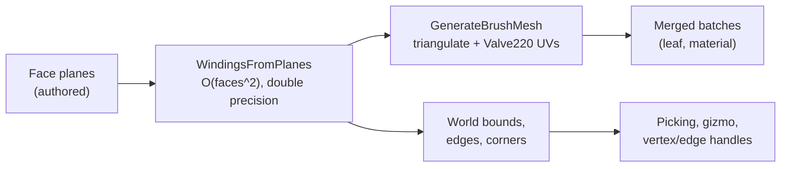

# Brush Editing

A **brush** is a convex solid defined by a set of outward-facing planes. You do
not model its vertices or its triangles; you declare the half-spaces, and the
geometry is whatever their intersection turns out to be. It is one of the oldest
ideas in level authoring, and it remains the fastest way a human has ever been
given to block out a world: drag a box, cut it, hollow it, texture a face, and
keep moving.

Ceili implements it as a first-class editing mode, and this page is about why the
plane-set representation keeps paying off in a modern engine, where the costs
show up, and what it took to make it interactive on a real level.

The thesis in one line: **planes are authoritative and everything else is
derived**, so the editor never maintains topology, and the whole system reduces to
one expensive pure function plus the caches that stop you paying for it twice.

<!-- MEDIA: a short animated webp loop (like the title-page banner) of the core
     loop: drag out a box brush in a 2D view, clip it, hollow it into a room, then
     pick a face and drag a material onto it from the Materials panel. A few
     seconds, no dialogs. -->

---

## The data model: what is stored, and what is not

A face stores its plane and its texturing. It does not store vertices, edges, or
adjacency:

```cpp
// Brush.h
struct BrushFace
{
    // Outward face plane (normal in xyz, distance in w): a point is INSIDE the
    // brush when dot(plane.xyz, p) + plane.w <= 0 for every face.  CE_HIDE: geometry, not a texture edit.
    math::Vec4 plane CE_HIDE = {0.0f, 0.0f, 0.0f, 0.0f};

    math::Vec4 uAxis CE_RANGE_DESC_STEP(-1.0f, 1.0f, 0.05f, 0.25f, "Valve220 U texture axis")   = {1.0f, 0.0f, 0.0f, 0.0f};
    math::Vec4 vAxis CE_RANGE_DESC_STEP(-1.0f, 1.0f, 0.05f, 0.25f, "Valve220 V texture axis")   = {0.0f, 1.0f, 0.0f, 0.0f};
    float uOffset    CE_RANGE_DESC_STEP(-10000.0f, 10000.0f, 0.1f, 1.0f, "Texture U offset")    = 0.0f;
    float vOffset    CE_RANGE_DESC_STEP(-10000.0f, 10000.0f, 0.1f, 1.0f, "Texture V offset")    = 0.0f;
    float scaleX     CE_RANGE_DESC_STEP(-10000.0f, 10000.0f, 0.05f, 1.0f, "Texture U scale")    = 1.0f;
    float scaleY     CE_RANGE_DESC_STEP(-10000.0f, 10000.0f, 0.05f, 1.0f, "Texture V scale")    = 1.0f;
    float rotation   CE_RANGE_DESC_STEP(-360.0f, 360.0f, 1.0f, 15.0f, "Texture rotation (deg)") = 0.0f;

    uint8_t materialIndex CE_HIDE = 0u;
    BrushFaceFlags flags CE_DESC("Texture lock") = BrushFaceFlags::None;
};
```

Those annotations are not documentation. `CE_RANGE_DESC_STEP` gives the property
grid its slider bounds, its drag step, and its tooltip, and `CE_HIDE` keeps the
raw plane out of the inspector because a plane is geometry, not a texture edit.
The face inspector in Studio is [the generic property grid](Metadata.md#the-property-grid-builds-itself)
pointed at this struct. Nobody wrote a face inspector.

The brush entity itself is unremarkable, which is the point:

```lua
-- studio/brush.entity
E.create("studio/brush", "", {
    components = {
        ["ceili::studio::Brush"] = {},
        ["ceili::math::Transform"] = {
            position = {0.0, 0.0, 0.0, 1.0},
        },
        ["ceili::graphics::scene::Visibility"]         = {},
        ["ceili::graphics::scene::VisibilityGeometry"] = {},
    },
})
```

A brush is a `Transform` plus visibility plus a brush marker, so it moves,
culls, selects, saves, and replicates exactly like any other entity. Nothing in
the renderer or the scene layer knows what a brush is.

One thing is missing from the `Brush` component, deliberately: the faces. A brush
holds a fallback material name and no face container, because a container field on
a scene component is unsafe here. The data layer copies row items by raw
`MemCpy`, which for a heap-backed array copies the *pointer*, aliasing storage the
caller is about to free. That was a real access violation, not a theoretical one.
Faces live instead as flat POD rows in a parallel multi-item table keyed by the
brush's own key, which is also how the per-brush 8-slot material palette is
stored. The lesson generalises: in a table store, a row should be trivially
copyable, and "it needs a variable-length child" means a second table, not a
container field.

---

## One expensive pure function

Everything visible about a brush comes from one derivation. Seed a large polygon
on each face's plane, clip it against every other face's inside half-space, and
what survives is that face's winding:

```cpp
// Brush.h (graphics)
CE_API bool WindingsFromPlanes(Windings&          OutWindings,
                               const math::Plane* pPlanes,
                               const uint32_t     NumPlanes,
                               const float        BaseExtent = 32768.0f);
```

```cpp
// Brush.cpp: the clip, in double precision.
        // Clip the seed by every OTHER plane's inside half-space.
        DVec3* cur   = buf_a;
        DVec3* other = buf_b;
        for (uint32_t j = 0; j < NumPlanes && count >= 3; ++j)
        {
            if (j == f)
            {
                continue;
            }
            const uint32_t nc  = ClipPolygon(other, cur, count, dplanes[j], clip_eps);
            DVec3* const   tmp = cur;
            cur                = other;
            other              = tmp;
            count              = nc;
        }
```

Two properties of this function carry most of the system.

**It is O(faces squared), and it is the only place geometry is computed.** Inputs
and outputs are `float`; the clip itself runs in `double`, because plane-distance
signs computed at different call sites under fast floating point can disagree,
and a face that is inside by one calculation and outside by another produces a
cracked solid. Widening only the classify-and-split math is the cheap fix for a
whole class of robustness bug.

**Superfluous planes delete themselves.** A plane that ends up contributing no
surface simply clips down to zero vertices and is pruned. That single property is
why the tools need no topology code at all: clipping a brush is *adding a plane*,
dragging a face is *moving a plane*, and any face that stops existing as a result
stops existing on its own. There is no edge list to repair, no adjacency to
rebuild, no degenerate-face special case to write.

From the windings, a mesh:

```cpp
// Shape.cpp: Valve220 UV projection, and the world-lock branch.
            // Valve220: project onto the (rotated) U/V axes, scale (divides), offset.  World-lock
            // (B7 T4) projects the UV from WORLD position so the texture stays pinned in world as the
            // brush moves; the POSITION written below stays LOCAL (the mesh rides the entity Transform).
            const math::Vec4 uvPos = face.worldLock ? TransformPoint(pos, WorldMatrix) : pos;
            const float      uu    = math::Vec4Dot3(uvPos, u_axis) / sx + face.uOffset;
            const float      vv    = math::Vec4Dot3(uvPos, v_axis) / sy + face.vOffset;
```

Texture lock is the toggle between "the texture is glued to the surface" and "the
texture is glued to the world", and it is exactly one branch: which point gets
projected. Vertex positions stay local either way, because the mesh rides the
entity transform like every other mesh.



---

## Where it got expensive, and the two caches that fixed it

On a real level (a 1,900-brush import) that pure function is the frame. A profile
of the worst load frame:

| Zone | Cost |
|------|------|
| `app::Frame` | 860.8 ms |
| `ReconcileDirtySurfaces` | 821.1 ms (95.4% of the frame) |
| `Merge.BuildGeometry` | 418.7 ms over 205 calls |
| `Merge.MemberMesh` | 403.6 ms over 1900 calls |

The cause was not that the derivation is slow. It is that **three independent call
sites were each deriving the same mesh from the same faces**: the scene reconcile,
the merged-batch builder, and the picking narrow phase. The fix is a memoised
acquire, keyed on a content hash:

```cpp
// Shape.cpp
    const uint64_t content_hash = g_pCache->contentHash(pFaces, NumFaces, pElements, NumElements, WorldMatrix);
    if (g_pCache->find(OutVerts, OutNumVerts, OutIndices, OutNumIndices, OutBounds, pOutEdgeIndices, pOutNumEdgeIndices, content_hash))
    {
        return true;
    }

    if (!GenerateBrushMesh(OutVerts, OutNumVerts, OutIndices, OutNumIndices, OutBounds, pFaces, NumFaces, pElements, NumElements, WorldMatrix, pOutEdgeIndices, pOutNumEdgeIndices))
    {
        return false;
    }

    g_pCache->store(content_hash, OutVerts, OutNumVerts, OutIndices, OutNumIndices, OutBounds, pOutEdgeIndices, pOutNumEdgeIndices != nullptr ? *pOutNumEdgeIndices : 0);
```

The load frame halved, from 861 ms to 427 ms, and `Merge.MemberMesh` went from
403.6 ms to 13.4 ms with byte-identical geometry.

A content-keyed cache is **self-validating**: there is no invalidation hook, no
generation counter, and no subscription to edits. Change a plane and the key
changes, so the entry misses and rebuilds. Two details in how the key is built are
worth stealing.

**Hash the struct's raw bytes, not its fields.**

```cpp
// Shape.cpp
uint64_t HashMeshInputs(const Face* pFaces, const uint32_t NumFaces, const uint64_t LayoutHash, const math::Mat4& WorldMatrix)
{
    uint64_t hash = HashBytes64(LayoutHash, &NumFaces, sizeof(NumFaces));

    bool any_world_lock = false;
    for (uint32_t i = 0; i < NumFaces; ++i)
    {
        hash           = HashBytes64(hash, &pFaces[i], sizeof(Face));
        any_world_lock = any_world_lock || pFaces[i].worldLock;
    }

    if (any_world_lock)
    {
        hash = HashBytes64(hash, &WorldMatrix, sizeof(WorldMatrix));
    }

    return hash;
}
```

A field-by-field hash silently ignores a field somebody adds later, which is a
false **hit**: stale geometry, returned confidently. Raw bytes cover new fields
for free and can only ever produce a false **miss**, which merely recomputes.
When a cache has to be wrong, make it wrong in the direction that costs time
rather than correctness.

**Fold in only the inputs that actually matter.** The world matrix is hashed only
when some face is world-locked, because otherwise the mesh does not depend on it.
Under the default face lock, a brush that merely *moved* still hits the cache and
pays nothing. Hashing the matrix unconditionally would miss on every frame of
every drag and buy exactly nothing, which is the difference between a cache that
works and a cache that looks like it works.

A second, independent cache sits one level up in Studio, keyed on the plane set
alone:

```cpp
// Brush.cpp (studio)
uint64_t HashBrushPlanes(const BrushFace* pFaces, const uint16_t N)
{
    uint32_t lo = core::HashBytesCombine(2166136261u, &N, sizeof(N));
    uint32_t hi = core::HashBytesCombine(0x9e3779b9u, &N, sizeof(N));
    for (uint16_t i = 0; i < N; ++i)
    {
        lo = core::HashBytesCombine(lo, &pFaces[i].plane, sizeof(pFaces[i].plane));
        hi = core::HashBytesCombine(hi, &pFaces[i].plane, sizeof(pFaces[i].plane));
    }
    return (static_cast<uint64_t>(hi) << 32) | static_cast<uint64_t>(lo);
}
```

This one exists because of a different seam: world bounds, edges, and corner
handles all need the **local** windings, and local windings do not depend on the
transform at all. Cache those, re-transform on every call (cheap), and re-derive
only on a genuine plane edit. Two tests pin exactly that behaviour, one asserting
a move hits the cache and one asserting a plane edit misses it. Before the cache,
selection bounds cost about 63 ms a frame for 1,900 selected brushes.

That 63 ms is worth a moment, because the bug behind it is a trap that any engine
can walk into. The bounds walk had a "cheap below N selected items" threshold,
sized when a selected item was a row read. Brushes made each item an O(faces
squared) geometry rebuild. The count still looked small; the cost had moved by
four orders of magnitude. **A threshold on count is not a threshold on cost**, and
the durable fix is to remove the per-element cost rather than to retune the
number.

Two 32-bit hash chains with different seeds are combined into a 64-bit key, which
makes a false hit negligible while keeping the arithmetic cheap.

---

## The tools

All of them are plane edits.

**Create.** Box (drag out in a 2D view, or from the ribbon) and N-sided prism
with a sides spinner, clamped to 64.

**Clip.** Add a plane; keep the positive side, the negative side, or split into
two brushes. Multi-brush, one undo entry.

**Face resize.** Drag a face or a corner and its plane translates along its
normal. Superfluous faces prune themselves, so pushing a face through the solid
does the right thing without a special case.

**Vertex and edge tools.** Drag a corner, or an edge (its two corners together).
This is the one that would normally require real topology code, and does not:


```cpp
// Brush.h -- the vertex tool's contract, verbatim.
// Move ONE corner of a convex brush and re-solve its whole plane set -- the vertex tool's geometry core (B6.1).
// The move is "move the point, re-hull the point set": reposition the dragged corner in the deduped corner
// list, re-weld it against its neighbours, and take the convex hull of the result as the new face planes.
// TrenchBroom's documented semantics then fall out with NO topology code, because the convex hull of a finite
// point set is ALWAYS a valid bounded convex solid: an incident face that can no longer hold the corner is
// chopped into a triangle fan, a corner pushed inside simply stops being a hull vertex (Deleted), and a corner
// landing on a neighbour welds into it (Fused).  See BrushVertexStatus -- the status drives the drag's lifetime.
```

Every behaviour a user expects from a vertex tool (a face fanning into triangles,
a corner disappearing when pushed inside, two corners fusing when dragged
together) is a *consequence* of taking the convex hull of a point set, not a case
somebody implemented. The tool reports which of those happened through a status
enum, and the drag's lifetime follows from it.


*The vertex tool live: each yellow handle is a corner of the plane set, the 2D and
3D views edit the same solid, and Vertex is the active tool in the Geometry ribbon.
Dragging a handle re-hulls the point set every frame.*

**CSG.** Cut (subtract the active brush from the other selected brushes), Hollow
(shell a brush into walls), and Merge (convex hull of everything selected).
Subtraction decomposes the result into convex fragments the classic way:

```cpp
// Brush.cpp
    // Decompose (T \ S) into convex fragments.  fragment_k = T + flip(S_k) + {S_0..S_{k-1}}.
    math::Plane candidate[kMaxPlanes];
    Windings    winding;
    for (uint32_t k = 0; k < NumToolPlanes; ++k)
    {
        const uint32_t nc = BuildFragmentCandidate(candidate, pTargetPlanes, NumTargetPlanes, pToolPlanes, k);
        if (!WindingsFromPlanes(winding, candidate, nc) || !BoundsHasVolume(winding.localBounds))
        {
            continue; // this fragment region bounds no (real) volume -- T lies inside S_k, or a sliver
        }
```

Note what the fragment builder calls to decide whether a fragment is real: the
same `WindingsFromPlanes`. Boolean subtraction is not a separate geometry kernel;
it is a plane-set construction validated by the one derivation everything else
uses. A through-hole is four fragments, and there is a test named exactly that.

**Face materials and UVs.** Per-face material assignment from an 8-slot palette,
UV offset/scale/rotation, justify and fit (including fit-to-world), repeat and
tile, texture-lock mode per face, and a copy-texturing clipboard that lifts one
face's texturing and applies it to others.

Every mutating operation above is one undo action, through
[the engine's action stack](Studio.md#undoredo-from-the-editors-side). Clip five
brushes at once and you undo it once.

---

## Numerical robustness is where the time really goes

Two failures worth recording, because they are the kind that make a brush editor
feel unreliable rather than broken.

**A weld tolerance must scale with the geometry.** Deriving corners from planes
means welding near-coincident intersection points. With a fixed epsilon, a
hexagonal prism with one corner pulled out derived 13 corners for 12 real ones,
and the phantom corner greyed out the vertex tool's handles. The fix scales the
tolerance with the plane set's own extent:

```cpp
// Brush.cpp
    double max_abs_d = 0.0;
    for (uint32_t i = 0; i < NumPlanes; ++i)
    {
        const double ad = (dp[i].d < 0.0) ? -dp[i].d : dp[i].d;
        max_abs_d       = (ad > max_abs_d) ? ad : max_abs_d;
    }
    const double scaled_weld = max_abs_d * 1.0e-5;
    const double weld_eps    = (scaled_weld > 1.0e-4) ? scaled_weld : 1.0e-4;
```

The identical bug and fix appeared independently in the convex hull used by
Merge, where a 16-sided prism hulled to 24 planes instead of 18 once its radius
passed 2048. A fixed epsilon is a bug with a delay on it, and the delay is however
long it takes somebody to build far from the origin.

**Repeated edits must not drift.** The vertex and edge tools re-solve the entire
plane set, which risks losing per-face texturing to floating-point drift across
many edits. Each newly solved plane is therefore reconciled onto the nearest-normal
face of the pre-edit set, and comes out bitwise identical when unchanged, so
material and UV assignments survive. The drag will not even start unless the brush
passes an identity check first (that hulling its own corners reproduces its own
planes exactly), because a brush that has already drifted cannot be edited safely
and the safe answer is to grey the handles rather than to corrupt the solid.

---

## Interactivity is a decision, not a limit

The live vertex drag re-hulls on every mouse move. That cost is cubic in the
corner count with no early out, and the code states the measurements plainly: 8
corners is microseconds, 32 is about 0.2 ms, 64 is about 3 ms ("tight, but
interactive"), and 128 is about 44 ms, which would visibly stall a drag.

So the tool refuses to latch above 64 corners, while the underlying operation
stays correct up to the brush's real ceiling. That distinction is deliberate and
sits in the right place: the geometry core has no opinion about frame rate, and
the *tool* owns the judgment about what still feels like dragging. Batch
operations on the same math are unrestricted.

This is the healthy version of a limit: measured, documented next to the number
that justifies it, scoped to the interactive path, and phrased as a refusal to
start rather than a stall you have to sit through.

---

## Getting brushes onto the screen

A level is thousands of small convex solids sharing a handful of materials, which
is a pathological input for a naive renderer: one draw per brush face group meant
774 emitted surfaces from 322 brushes, a 39x over-emission.

Brush surfaces are therefore merged into shared vertex and index buffers keyed by
(spatial leaf, material), so a room's worth of brushes with the same texture is
one draw. Selected brushes are extracted back out so they can draw themselves
highlighted. The merge is incremental: the per-brush idle cost measures flat at
roughly 187 to 209 nanoseconds across 128, 512, and 2,048 brushes, which is the
shape you want (linear in brushes, not quadratic in anything).

### Tool materials are a fact, not a policy

Caulk, nodraw, and portal are ordinary materials that happen to carry a `Tool`
flag ([Materials Viewer](MaterialsViewer.md#the-shape-of-the-data-behind-it)):

```lua
-- systemSurfaces.material
local caulk = PBR.roughness(0.9, {
    albedo     = "Studio/Caulk",
    metalRough = "predefined://mr_dielectric",
})
caulk.flags = {
    seals  = true,
    noDraw = true,
    tool   = true,
}
M.create("studio/caulk", "base/light/pbr", caulk)
```

The scene reconcile stamps a visibility bit from the resolved material, saying
only "this surface's material is authoring metadata". It does *not* say "hide
this". Whether the bit hides anything is decided where batches are built, by
folding it into a per-gather ignore mask, so the "show tool surfaces" toggle flips
with nothing re-stamped: no re-walk, no dirty pass, no stale rows. Hiding tool
surfaces measured 32% fewer merged vertices and 47% fewer indices on a test level.

This is a rule the engine applies everywhere: **a state row declares a fact, and
the consumer decides the policy.** The test for whether you have it backwards is
simple. If a user toggling a preference would force rows to be rewritten, the
decision is stored in the wrong place.

<!-- MEDIA: a before/after pair of the same level with "show tool surfaces"
     toggled off then on: first the finished geometry, then the same view with the
     caulk and nodraw faces revealed in their tool colours. The Brushes analytics
     panel showing the merged vertex/index counts dropping would sit well beside
     it. -->


---

## Tests

131 test cases cover this: 101 in Studio for the tools and 30 in Graphics for the
geometry core. The names read as a specification of the tricky cases rather than
the easy ones:

- `Brush_SubtractConvex_ThroughHoleIsFourFragments`
- `Brush_BrushVerticesFromPlanes_PulledCornerFanApexWeldsAcrossScales`
- `Studio_MoveBrushVertex_DraggingCornerOntoNeighbourFusesNotDeletes`
- `Studio_MoveBrushVertex_PushingCornerInsideDeletesIt`
- `Studio_MoveBrushVertices_NoFuseRefusesACollapseAndWritesNothing`
- `Studio_BrushClip_SplitTrimsOriginalAndOneUndo`
- `Studio_BrushHollow_ShellsBrushIntoWallBrushes`
- `Studio_GetBrushWorldBounds_CacheHitOnMoveSkipsRederive`
- `Studio_GetBrushWorldBounds_PlaneEditInvalidatesCache`
- `Studio_MergedBatches_ToolSurfacesAreNotMergedUnlessShown`
- `Studio_BrushBatcher_Perf_IdleTickScaling`

The two cache tests are the ones that matter most in the long run. An
optimisation that silently stops firing leaves every behavioural test green, so
the cache exposes its own hit and miss counters purely so a test can assert that
it fired. Without that, the 861-to-427 millisecond win could regress and nothing
would go red.

---

## What is not built

- **No compile bake.** There is a stub that tags brushes into a compiled layer,
  and it does not look at a face. Per-brush convex collision hulls are not
  generated, because there is no collision system yet.
- **No BSP or PVS.** The `Portal` and `Seals` material flags are authored and
  stored and currently drive nothing. They are placed for a compile step that is
  deliberately deferred in favour of the runtime merged-batch path.
- **Rotated brushes are partially supported.** Picking and bounds handle rotation
  correctly; the clip tool, 2D face resize, and the CSG operations are documented
  as axis-aligned or translation-only for now.
- **World-locked UVs on a rotated face can swim.** The local tangent frame stops
  matching the fixed world UV gradient, so normal-map highlights move. Pure
  translation is exact.
- **Multi-corner fusing is not supported** while multiple vertices are selected.
- **Mesh generation is main-thread only.** Going wide needs per-worker cache sets.

---

## Why this representation still wins

A triangle mesh is a better *output* format and a worse *authoring* format. The
plane set gives you three things that are hard to get any other way:

- **Validity by construction.** The intersection of half-spaces is a convex solid.
  There is no such thing as a non-manifold brush, an unclosed brush, or an
  inverted face, so entire categories of editor bug cannot be expressed.
- **Operations that are just plane arithmetic.** Clip adds a plane, resize moves
  one, subtract builds fragments from two sets, merge hulls a point set. Faces
  that stop mattering prune themselves.
- **A tiny, diffable, hashable representation.** A brush is a handful of planes,
  which is why the whole level fits in a text scene file, why a content hash makes
  a perfect cache key, and why undo can be small.

The cost is that the derivation is quadratic and precision-sensitive, and this
page is mostly the story of paying that cost exactly once instead of three times
per frame.

Next: [Studio](Studio.md) for the editor the tools live in, or back to the
[documentation index](README.md).
