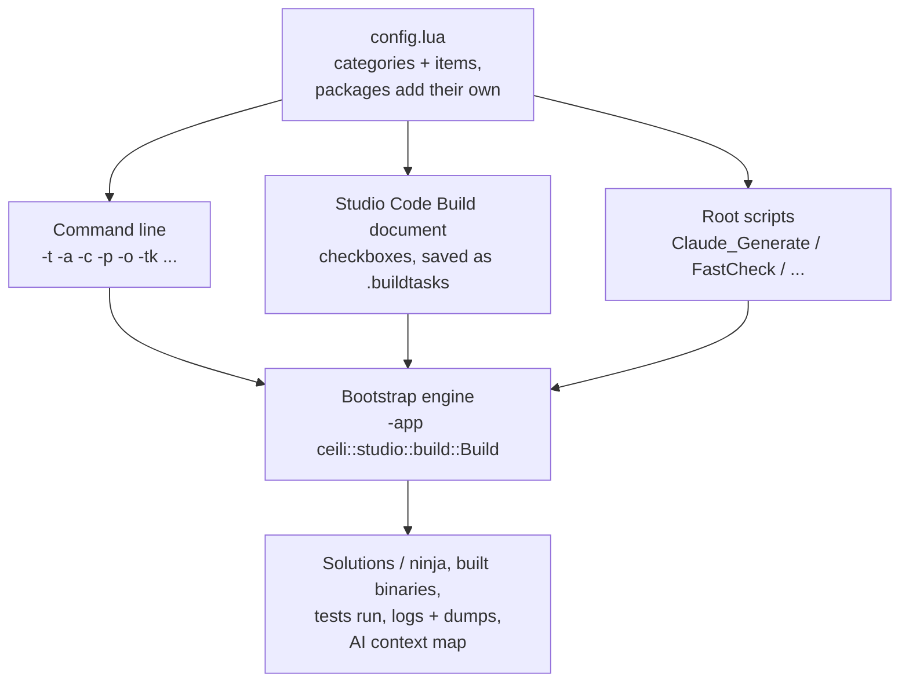

# Building Ceili

Ceili builds itself. The project generator, the material compiler, the shader
compiler and the script generator all run inside a prebuilt copy of the engine,
and the build configuration is a Lua table that the same engine reads. One table
drives a command line, a set of scripts, and a document you open in Studio, and
all three produce the same build.

This page covers the frozen toolchain, the GENie scripts and the table at their
centre, how a package or a build option is added and toggled, the build document
Studio persists, and why the arrangement suits a human at a keyboard and an AI
agent equally well.

---

## The Bootstrap: an engine that builds the engine

The repository carries a frozen, prebuilt copy of the engine under `Bootstrap/`.
Every build-time tool is that copy running in a particular mode. The everyday
generate step is one line:

```bat
:: Claude_Generate.cmd
Bootstrap\x64r\vs2026\IgnitionDotNet_vs2026.exe -app ceili::studio::build::Build -shell ceili::app::shell::win::ShellWinConsole -noconsole -rootPath "%~dp0Bootstrap" -rootDstPath "%~dp0." -t x64 -a vs2026 -c r -c d -c rds -c p -l All -p All -tp All -o PackageKindSharedLib -o Assert -o DebugBreak -o AVX -o ScriptGeneration -o MaterialCompiler -o EntityCompiler -o HotReload -o HeapTracking -o ArrayWatermarkTracking -tk Generate -e All -s All -ts All %*
```

Read it left to right. The executable is the Bootstrap's engine. `-app` picks the
headless `Build` app, `-shell` picks a console with no window, and `-rootPath`
and `-rootDstPath` say "run from the frozen copy, write into the live tree". The
rest is the build configuration, one switch per choice: target, IDE action,
configurations, packages, options, tasks.

**The frozen tools work off the live source**, and that one fact decides when the
Bootstrap needs refreshing. The script generator parses the live headers; the
material compiler reads the live `.material` files. So a struct layout change or a
new script binding needs no refresh at all. A refresh is needed only when a tool's
*own code* changes, such as the script generator's or the material compiler's
behaviour. The data a tool operates on never forces one.

Running the tools from a frozen copy has a second benefit: a change that breaks
the material compiler cannot also break the build that would compile its fix.

---

## GENie, running inside the engine

The solution generator is GENie, a Lua-scripted fork of premake. In Ceili it does
not run as a separate program. Its Lua executes in the engine's own Lua VM, which
is why the configuration script can ask the engine for its command line:

```lua
-- Tools/GENie/config.lua
local has_cmd_line_args = false
if ceili ~= nil then
    has_cmd_line_args = ceili.core.platform.getNumCommandLineArgs() > 1
end
```

Everything the build can do is declared in one table of categories and items.
Each category has a name, a sort order and a command-line switch; each item has a
trigger, a description and a set of flags:

```lua
-- Tools/GENie/config.lua
config.flags = {
    none            = 0,
    all             = bit.lshift(1, 0),
    toggle          = bit.lshift(1, 1),
    groupToggle     = bit.lshift(1, 2),  -- items with the same priorty can be placed in a group that'll use a radio button to check only one item in the group
    category        = bit.lshift(1, 3),
    default         = bit.lshift(1, 4),
    checked         = bit.lshift(1, 5),
    task            = bit.lshift(1, 6),
    target          = bit.lshift(1, 7),
    configuration   = bit.lshift(1, 8),
    action          = bit.lshift(1, 9),
    option          = bit.lshift(1, 10),
```

The categories and their switches:

| Category | Switch | Examples |
|----------|--------|----------|
| Target | `-t` | `x64`, Android arm64 |
| Action | `-a` | `vs2019`, `vs2022`, `vs2026` (the default), `ninja` |
| Configuration | `-c` | Debug, Release, RelDbgSym, Profile |
| Libraries / Packages | `-l` / `-p` | one item per package, contributed by the package |
| Third Party | `-tp` | yyjson, lua51, ImGui, GLFW |
| Options | `-o` | Jumbo Build, Assert, Heap Tracking, Hot Reload |
| Tasks | `-tk` | Clean, Generate, Build, Package, Run, Open, Export |
| Executables | `-e` | Ignition, Ignition .Net, Core Tests |
| Shells | `-s` | GLFW, Windows Console, Null, Android |

An item flagged `default` is checked when nothing on the command line says
otherwise. An item in a `groupToggle` behaves as a radio button within its group.
`promptOnDisable` asks before switching something off that other choices rely on.

The same table generates Visual Studio 2019, 2022 and 2026 solutions on Windows,
and ninja files for an Android arm64 build through the NDK. A further mode exports
the engine as a single-header distribution with a chosen set of packages and
features.

---

## Packages contribute themselves

Every package has a `Module.lua` beside its `Module.h`. It names the package,
declares its dependencies, and nothing else is needed for the build to find it:

```lua
-- Pkg/Engine/Audio/Module.lua
local module = dofile(path.join(paths.ceili.packages, constants.ceili.prefix, "Module.lua"))
module.name        = constants.ceili.prefix .. constants.ceili.audio
module.description = constants.ceili.audio
module.folder      = path.join(constants.ceili.prefix, constants.ceili.audio)
module.group       = constants.ceili.prefix
module.definition  = "CEILI_AUDIO"
module.wildcards   = "**.*" -- recursive: pick up Src/* + Tests/*
module.keywords    = {"audio", "sound", "music", "mixer", "spatial"}

function module.addModules()
    -- Math supplies Vec4, which the listener and 3D source positions are expressed in.
    -- Core arrives automatically from the Engine base module.
    -- ...
    config.addModule(module, constants.ceili.prefix .. constants.ceili.math)
end
```

Four fields do the work:

- **`addModules`** declares the dependency edges. A package names only what it
  uses, and the comment beside each edge says why, so an edge that should not exist
  is visible in review.
- **`definition`** becomes a preprocessor define in every project that links the
  package. Code that optionally uses audio tests `CEILI_AUDIO` rather than
  guessing whether the package was built.
- **`wildcards`** decides which files belong to it. Adding a source file needs no
  edit here, only a regenerate.
- **`keywords`** feed the AI context map described [below](#the-same-build-for-humans-and-agents).

The base module that every `Module.lua` starts from also contributes the
package's own toggle to the configuration table:

```lua
-- Pkg/Engine/Module.lua
function module.getConfig()
    local config = {
        libraries = {
            config.addItem("Library_" .. module.name, module.description, bit.bor(config.flags.toggle, config.flags.library, config.flags.default)),
        },
        packages = {
            config.addItem("Package_" .. module.name, module.description, bit.bor(config.flags.toggle, config.flags.package, config.flags.default)),
        },
```

**Adding a package** is a folder laid out like the others (see
[Philosophy](Philosophy.md#packages-self-contained-consistently-laid-out)), a
`Module.lua`, and a regenerate. The package appears in the solution, in the
command line as a `-p` value, and as a checkbox in Studio's build document, with
no central list to edit.

---

## Options: toggling one, adding one

An option is an item in the `Options` category. These are real entries:

```lua
-- Tools/GENie/config.lua
config.addItem("Option_HotReload",        "Hot Reload",            bit.bor(config.flags.toggle, config.flags.option, config.flags.default), 0, "Enable hot reload for development iteration."),
config.addItem("Option_ClaudeContextMap",       "Claude Context Map",           bit.bor(config.flags.toggle, config.flags.option, config.flags.default), 0, "Generate .claude/hooks/context-map.json for Claude Code context injection."),
config.addItem("Option_RenderDoc",               "RenderDoc",                    bit.bor(config.flags.toggle, config.flags.option), 0, "Compile the RenderDoc in-app capture hooks (loads renderdoc.dll before device creation; see Docs/FrameCapture.md)."),
config.addItem("Option_ScopeTracking",           "Scope Tracking",               bit.bor(config.flags.toggle, config.flags.option), 0, "Enable scope allocator tracking instrumentation."),
config.addItem("Option_HeapTracking",            "Heap Tracking",                bit.bor(config.flags.toggle, config.flags.option), 0, "Enable heap allocator tracking instrumentation."),
```

**Toggling** an option is passing it or not. `-o HeapTracking` on the command line,
or the Heap Tracking checkbox in Studio, turns it on for that generate.

**Adding** an option is three short edits, and following one through end to end
shows the whole path. The item above declares it. A query reads it:

```lua
-- Tools/GENie/config.lua
function config.isHeapTrackingEnabled()
    if _OPTIONS["Option_HeapTracking"] == "yes" then
        return true
    end
    return false
end
```

And the solution script turns it into a define the C++ can test:

```lua
-- Tools/GENie/solution.lua
if config.isHeapTrackingEnabled() then
    defines {
        "CE_USE_HEAP_TRACKING"
    }
end
```

From there `CE_USE_HEAP_TRACKING` gates the stack capture in the heap allocator
and the Heap tab in the [Memory panel](Profiling.md#memory-the-other-half-of-a-spike).
With the option off, the hooks compile to nothing. The option's description string
is the tooltip in Studio and the help text on the command line, written once.

<!-- MEDIA: Studio's Code Build document open on the Options category, with
     several toggles checked and the task list (Clean, Generate, Build, Run) below
     it, mid-build with its log streaming. -->

---

## Tasks, and building outside an IDE

A task is an item in the `Tasks` category, run in priority order:

```lua
-- Tools/GENie/config.lua
config.addItem("Task_Clean",                    "Clean",                        bit.bor(config.flags.toggle, config.flags.task, config.flags.action, config.flags.configuration, config.flags.default), 100),
config.addItem("Task_Generate",                 "Generate",                     bit.bor(config.flags.toggle, config.flags.task, config.flags.action, config.flags.default), 200),
config.addItem("Task_Build",                    "Build",                        bit.bor(config.flags.toggle, config.flags.task, config.flags.action, config.flags.configuration), 300),
config.addItem("Task_Package",                  "Package",                      bit.bor(config.flags.toggle, config.flags.task, config.flags.action, config.flags.configuration), 350, "Package the built target for its platform (Android: a signed APK)"),
config.addItem("Task_Run_Tests",                "Run (Unit Tests)",        bit.bor(config.flags.toggle, config.flags.task, config.flags.action, config.flags.configuration), 400, "-app ceili::tests::UnitTestsApp -shell ceili::app::shell::ShellNull -nostdoutloggging"),
config.addItem("Task_Run_IntegrationTests",    "Run (Integration Tests)", bit.bor(config.flags.toggle, config.flags.task, config.flags.action, config.flags.configuration), 450, "-app ceili::tests::IntegrationTestsApp"),
config.addItem("Task_Run_Studio",               "Run (Studio)",                 bit.bor(config.flags.toggle, config.flags.task, config.flags.action, config.flags.configuration), 500, "-app ceili::studio::Studio"),
config.addItem("Task_Open",                     "Open",                         bit.bor(config.flags.toggle, config.flags.task, config.flags.action, config.flags.default), 600, "Open the associated IDE"),
```

The flags on a task say what it varies over. A `configuration` task such as Build
runs once per checked configuration; an `action` task runs once per checked IDE
action. Run tasks carry the command line they launch in their extra field, so
"run the unit tests" is data rather than a script.

None of this needs the IDE open. The Build task finds Visual Studio with
`vswhere`, then drives MSBuild directly:

```csharp
// Plugins/Documents/Build/Tasks/Build.cs
var args = "/c " + '"' + vs_dev_cmd + '"' + " && msbuild " + sln + " /m /p:Configuration=" + Configuration + " /p:Platform=" + Target;
```

The Package task goes further for Android and produces a signed APK with no Java
toolchain. `Open` is the one task that launches the IDE, and it is a task like the
others: unchecked, it never runs.

---

## The build document in Studio

Studio presents the configuration table as a document, the **Code Build**
document. It runs the same GENie scripts and reads the same `config` table, so
each category becomes a section and each item a checkbox, with the description as
the tooltip.
Toggling one is an undoable action, like any edit in the editor (see
[Studio](Studio.md#undoredo-from-the-editors-side)).

Below the toggles sits a task list. Each task row records its state, its output,
its errors, and the time window it ran in, which the document uses to show that
task's own slice of the log. Building, running the unit tests and launching Studio
itself are rows you check and start.

**The document saves to a `.buildtasks` file, and that file is a data-table
database.** The task list is rows in the engine's own [table
store](Core.md#data-the-table-store-the-engine-is-made-of), written by the same
serializer that writes a scene:

```json
            "records": [
                {
                    "state": 0,
                    "logFilterTimeStart": {
                        "resolution": 3,
                        "value": 0
                    },
                    "logFilterTimeEnd": {
                        "resolution": 3,
                        "value": 0
                    },
                    "name": "",
                    "task": "Generate",
                    "taskTrigger": "Task_Generate",
                    "priority": 200,
                    "output": "",
                    "error": "",
                    "notes": ""
                },
```

The table around it names the record type, `ceili::studio::build::tasks::Base`,
with its stride and type hash, exactly as a scene's tables do. Three more tables
hold each task's target, action and configuration.

Beside the tables, the file carries a `config` object holding which triggers are
checked and the extra arguments a Run task passes:

```csharp
// Plugins/Documents/Build/BuildDocument.cs
private class ConfigSidecar
{
    public Dictionary<string, uint> triggers { get; set; }
    public string commandLineArgs { get; set; }
}
```

Reopening the document runs `config.lua` again and reapplies the saved triggers.
A team can keep a handful of these, one for "Debug, tests, headless" and one for
"Profile build with heap tracking", and switching between them is opening a file.

The document is not a second build system. It produces the same configuration the
command line does, and the command line runs the same `Build` app the document
drives. Nothing in the document reaches further than a switch could.

---

## The check tiers

On top of the build sit a few scripts at the repository root that build and then
verify, in increasing cost:

- **`Claude_FastCheck.cmd`** builds the RelDbgSym configuration, runs the unit
  tests (which cover C++, C# and Lua together), then a headless scene smoke on the
  null device. No GPU, no window, no language server, so it does not flake. This
  is the per-change gate.
- **`Claude_PreCommit.cmd`** adds three GPU smokes: a one-frame run on each
  backend and a scene teardown. Those cover the break class the fast tier cannot
  see, since it never initialises a real device.
- **`Claude_FullCheck.cmd`** adds the legacy-scene smoke and the full GPU and
  language-server roster. It takes twenty minutes or more and runs at reconcile
  time, once or twice a day, rather than per commit.

Each later phase is skipped when an earlier one fails, and each script ends in a
banner that states the verdict.

---

## The same build, for humans and agents

Every property that makes the build pleasant for a person also makes it usable by
an agent, and in a few places the build goes further on the agent's behalf.

**Everything is a command.** Generating, building, testing, packaging and launching
are all one line each, with no step that needs a click in an IDE. An agent runs
exactly what a person runs, and a person can paste the command an agent used.

**Everything headless is deterministic.** The Null shell and the null graphics
device mean the fast tier needs no window and no GPU, so it gives the same answer
on a build server, in an agent's sandbox and on a laptop with the lid shut.

**A failure says so in the log, in a form a tool can read.** A build step the
build must fail on prints `error : ...`, which MSBuild counts. The generated
project files append an exit-code check after every Bootstrap tool line, because
MSBuild runs a project's custom steps as one batch and reports only the last
exit code, so a crash followed by a tool that succeeded would otherwise read as
green. Every run writes a dated log, and a crash writes a minidump beside it. A
reader with only the log can tell what happened.

**The build hands an agent its context.** With the Claude Context Map option on,
Generate writes a map from keywords to source files, built from each package's
folder name, its subfolders and its `keywords` list. A Claude Code hook reads it
on every prompt:

```js
// .claude/hooks/gather-context.js
// gather-context.js - UserPromptSubmit hook for Claude Code
//
// Reads the user's prompt, matches keywords from context-map.json,
// and injects relevant file contents so Claude doesn't spend tokens
// discovering and reading files.
```

A prompt that mentions audio arrives with the audio package's public headers
already attached. The map is generated, so a new package is in it after the next
generate, and the hook skips re-sending a set it already sent in the same session.

**The configuration is data an agent can read.** Because the build is one Lua
table, an agent that needs to know which options exist, what each one does, or
which tasks a configuration runs can read `config.lua` and get the authoritative
answer, the same text a person sees as tooltips.



---

## Sharp edges

- **The Visual Studio solutions need a Windows host.** The Android build generates
  ninja files and runs on the NDK's clang; a Linux path compiles and runs Core's
  tests natively, which exercises the POSIX platform code.
- **A GENie Lua edit needs the Bootstrap copy too.** The engine loads GENie's Lua
  from disk, and a Bootstrap run reads the Bootstrap's copy rather than the live
  one.
- **A header the build generates needs a declared edge.** A package whose
  `Module.h` includes a generated header lists it in `scriptGenGeneratedInputs`,
  or a fresh checkout runs script generation before the step that produces the
  header.
- **Clean is destructive by design.** It removes the generated solution and
  intermediate files, and recovery is a regenerate. Delete a single intermediate
  folder instead when only one project is stale.

Next: [Script Generation](ScriptGeneration.md) for the bindings the build
generates, [Profiling](Profiling.md) for the instrumentation the build options
switch on, or [AI-Assisted Engine Development](AI_Assisted_Engine_Development.md)
for how this tooling shaped the development workflow. Back to the
[documentation index](README.md).
