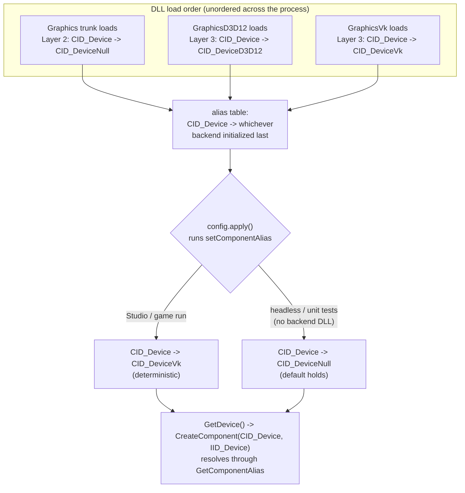
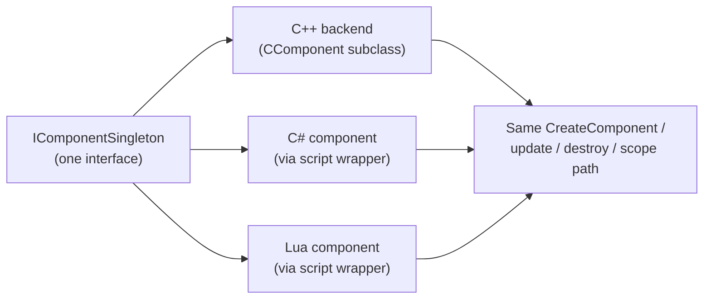

# Component Architecture

The component system is how Ceili delivers on the "plug and play: swap any
implementation" bet from [Philosophy](Philosophy.md). It is a small, deliberate
piece of machinery: an interface, a factory that makes instances of it, and a
runtime alias layer that decides which concrete implementation answers when
someone asks for the interface. That is enough to run two graphics backends off
one call site, let an AI agent be a hardcoded stub in tests and a live subprocess
in the editor, and let a component be authored in C++, C#, or Lua without the
caller knowing the difference.

The governing rule is narrow, and worth stating up front because it is what keeps
the system from sprawling:

> A component exists when there are, or credibly will be, **multiple
> implementations of an interface**. The interface drives the abstraction, not the
> other way around. One implementation with no sibling on the horizon does not
> need a component; it needs a function.

Everything below is in service of that rule.

---

## The interface surface

Every component implements `IComponentBase`, the lifecycle-and-identity contract
that the rest of the engine talks to. It is deliberately small: creation and
destruction, scope binding, an interface-cast, and the flag accessors.

```cpp
// Component.h
struct IComponentBase
{
    virtual ~IComponentBase()                                                              = default;
    virtual IComponentFactory* getComponentFactory() const                                 = 0;
    virtual void               setComponentFactory(IComponentFactory* const pVal, const InterfaceId InstanceInterfaceId) = 0;
    virtual scope::Handle      getScope() const                                             = 0;
    virtual void               setScope(const scope::Handle hScope)                         = 0;
    virtual InterfaceId        getInstanceInterfaceId() const                               = 0;
    virtual Result             getInterface(const InterfaceId InterfaceId, IComponentBase** ppInterface) = 0;
    virtual Result             destroy()                                                    = 0;
    virtual ComponentFlags     getComponentFlags() const                                    = 0;
    virtual void               setComponentFlags(const ComponentFlags Flags)                = 0;
    virtual void               addComponentFlags(const ComponentFlags Flags)                = 0;
    virtual void               removeComponentFlags(const ComponentFlags Flags)             = 0;
};
CE_DECLARE_INTERFACE_ID(ComponentBase)
```

Two derived interfaces add the parts most components actually want. `IComponent`
adds the update lifecycle; `IComponentSingleton` adds reference counting for the
one-instance-per-process case (systems, renderers, device singletons):

```cpp
// Component.h
struct IComponent : IComponentBase
{
    virtual Result init()                                         = 0;
    virtual Result update(const ComponentUpdate& ComponentUpdate) = 0;
};
CE_DECLARE_INTERFACE_ID(Component)

struct IComponentSingleton : IComponent
{
    virtual int getRefCount() const = 0;
    virtual int addRefCount()       = 0;
    virtual int removeRefCount()    = 0;
};
CE_DECLARE_INTERFACE_ID(ComponentSingleton)
```

Notice the `IID_` ids sit right next to the interfaces they name. That placement
is a convention, not an accident: `CE_DECLARE_INTERFACE_ID` goes alongside its
interface in the header, while `CE_DECLARE_COMPONENT_ID` (below) goes in a
module's `Module.h`. Both are just compile-time type hashes, the same
`TypeHash<T>()` idea from [Core](Core.md#hashing-and-type-hashes):

```cpp
// Macros/Component.h
#define CE_DECLARE_COMPONENT_ID(Type) \
    class Type;                       \
    constexpr ceili::core::component::ComponentId CID_##Type = ceili::core::component::MakeComponentId<Type>();

#define CE_DECLARE_INTERFACE_ID(Type) \
    constexpr ceili::core::component::InterfaceId IID_##Type = ceili::core::component::MakeInterfaceId<I##Type>();
```

A `ComponentId` names a *concrete implementation*; an `InterfaceId` names a
*contract*. The whole system is a lookup from the pair `{ComponentId,
InterfaceId}` to a factory. Hold that shape in mind: it is the entire model.

---

## CComponent: the base you inherit

You almost never implement `IComponentBase` by hand. You inherit `CComponent<I>`
(or `CComponentSingleton<I>`), which supplies the flag storage, the scope binding,
and default no-op lifecycle methods, and leaves you to override only what your
component actually does.

```cpp
// Component.h: the defaults CComponent<I> hands you.
ComponentFlags getComponentFlags() const override { return m_Flags; }
void           setComponentFlags(const ComponentFlags Flags) override { m_Flags = Flags; }
void           addComponentFlags(const ComponentFlags Flags) override { m_Flags |= Flags; }
void           removeComponentFlags(const ComponentFlags Flags) override { m_Flags &= ~Flags; }

virtual Result init() override { return core::results::success::Default; }
Result         destroy() final { return m_pComponentFactory->destroyComponent((IComponentBase*)this); }
virtual Result update([[maybe_unused]] const ComponentUpdate& ComponentUpdate) override { return core::results::success::Default; }

private:
    IComponentFactory* m_pComponentFactory   = nullptr;
    InterfaceId        m_InstanceInterfaceId = kNullInterfaceId;
    scope::Handle      m_hScope;
    ComponentFlags     m_Flags = ComponentFlags::Active;
```

`destroy()` is `final` for a reason: an instance is always freed by the factory
that made it, never by a raw `ceDelete`. That single rule is what lets the same
`destroy()` call work whether the instance is a C++ object, a scope-allocated
struct, or a script wrapper with function-pointer trampolines (more on that
later). `init()` and `update()` are the two hooks you override; both default to
success so a component that needs neither writes neither.

The engine's convention is to define these method bodies **inline in the class
declaration** in the implementation .cpp, not as out-of-line `App::method()`
definitions. Keeping declaration and definition together is easier to read and
keeps the component's behaviour in one place.

---

## The factory macros

A component registers itself with two macros. `CE_DECLARE_COMPONENT_ID` in the
`Module.h` mints the `CID_`. Then, in the .cpp, `CE_COMPONENT_FACTORY_DEFINITION`
wires the concrete class to its `{CID, IID}` pair:

```cpp
// Macros/Component.h
#define CE_COMPONENT_FACTORY_DEFINITION(ComponentID, InterfaceID, Implementation)                     \
    static int g_##Implementation##RefCount = 0;                                                       \
    Implementation##Factory::Implementation##Factory()                                                 \
    {                                                                                                   \
        if (g_##Implementation##RefCount++ == 0)                                                        \
        {                                                                                               \
            typedef ceili::core::component::ComponentFactory<Implementation> factoryType;               \
            ceili::core::component::IComponentFactory*  p_factory       = ceNew(factoryType, ComponentID); \
            ceili::core::component::InterfaceId         interface_ids[] = {InterfaceID};                 \
            ceili::core::component::RegisterComponentFactory(ComponentID, interface_ids, 1, p_factory);  \
            m_pFactory = p_factory;                                                                     \
        }                                                                                               \
    }                                                                                                   \
    Implementation##Factory::~Implementation##Factory()                                                 \
    { if (--g_##Implementation##RefCount == 0) { ceili::core::component::UnregisterComponentFactory(m_pFactory); } }
```

Registration runs at DLL load, driven by a nifty-counter struct that
`CE_COMPONENT_FACTORY_DECLARATION` places in the module. The construction of that
struct calls `RegisterComponentFactory`, and its destruction unregisters. There is
no central "register all components" list to maintain: linking the .cpp into the
build is what makes the component exist. `CE_SINGLETON_COMPONENT_FACTORY_DEFINITION`
is the same shape for `IComponentSingleton`, adding ref-count bookkeeping so the
singleton is created once and shared.

The net effect is that a new backend is a new file: declare the `CID`, inherit
`CComponent<IYourInterface>`, and drop a `CE_COMPONENT_FACTORY_DEFINITION` in the
.cpp. Nothing upstream changes.

---

## Creating a component

You ask for a component by handing `CreateComponent` a `{ComponentId,
InterfaceId}` pair and a pointer to fill. The scope argument decides which arena
the instance lives in (Bootstrap for engine-lifetime singletons, Level for
per-level components, and so on, from [Core's scopes](Core.md#allocators-and-scope)):

```cpp
// Component.h
CE_API Result CreateComponent(const ComponentId ComponentId, const InterfaceId InterfaceId,
                              IComponentBase** ppInterface, const scope::Handle hScope = scope::Handle());
CE_API Result CreateComponentFromInterfaceId(const InterfaceId InterfaceId,
                              IComponentBase** ppInterface, const scope::Handle hScope = scope::Handle());
CE_API Result CreateAllComponentsFromInterfaceId(const InterfaceId InterfaceId, const scope::Handle hScope = scope::Handle());
CE_API Span<IComponentBase*> GetScopeInstances(const InterfaceId InterfaceId, const scope::Handle hScope);
```

The important detail is inside the create call: the `ComponentId` is passed
through `GetComponentAlias` **before** the factory lookup. That single indirection
is the seam the whole backend-swapping story hangs on:

```cpp
// Component.cpp
Result CreateComponent(const ComponentId CID, const InterfaceId IID, IComponentBase** ppInterface, const scope::Handle hScope)
{
    IComponentFactory* p_factory = nullptr;
    {
        auto                         lock         = LockGuard(g_.Mutex);
        const ComponentId            component_id = GetComponentAlias(CID);
        ComponentFactories::iterator factoryIter  = g_.ComponentFactories.find({component_id, IID});
        if (factoryIter != g_.ComponentFactories.end())
        {
            p_factory = factoryIter->pFactory;
        }
    }
    if (p_factory != nullptr)
    {
        Result ier = p_factory->createComponent(IID, ppInterface, hScope);
        // ...
```

The other three functions cover the "many implementations" case directly.
`CreateAllComponentsFromInterfaceId` instantiates *every* component registered
against an interface, and `GetScopeInstances` returns the live instances of an
interface in a scope. This is exactly how the scheduler builds its system set: it
does not call a `RegisterSystem`; it asks the component system for every
`ISystem` created in the Bootstrap scope and schedules those. As
[Core notes](Core.md#tasks-threading-and-the-fixed-tick-clock), "registration
falls out of the component system." A typed helper makes the iteration clean:

```cpp
// Component.h
template <typename T>
Span<T*> GetScopeInstances(const InterfaceId InterfaceId, const scope::Handle hScope)
{
    Span<IComponentBase*> instances = GetScopeInstances(InterfaceId, hScope);
    return Span<T*>(static_cast<T**>(static_cast<void*>(instances.data())), instances.size());
}
```

---

## The trunk-and-backends pattern

Here is where the interface-drives-the-abstraction rule pays off. A package with
multiple swappable implementations is organized as a **trunk** (the manager
package that owns the interface and shared code) and **backends** (leaf packages,
each a concrete implementation). The graphics device is the canonical example:
`Graphics` is the trunk, `GraphicsD3D12` and `GraphicsVk` are the backends, and a
built-in **Null device** is the no-GPU fallback that unit tests, headless smoke
runs, and dedicated servers render against.

The problem the pattern has to solve is subtle. A caller wants to say "give me the
active graphics device" without naming Direct3D 12 or Vulkan. But which backend is
active depends on what DLLs loaded, and DLL static-init order across the process is
not guaranteed. So the resolution is layered, with four places each covering a
real scenario, and a config file getting the last word.

**Layer 1: the generic `CID` in the trunk's `Module.h`.** The trunk declares a
generic id next to its `Null` fallback id. Callers create through the generic one.

```cpp
// Pkg/Engine/Graphics/Module.h
// CID_Device is the generic "active device" CID; each backend's module
// Initializer aliases it to its own concrete CID (CID_DeviceD3D12 /
// CID_DeviceVk) so GetDevice() resolves to whichever backend is wired in.
// CID_DeviceNull is the trunk's no-GPU fallback for headless tests and servers.
CE_DECLARE_COMPONENT_ID(Device)
CE_DECLARE_COMPONENT_ID(DeviceNull)
```

**Layer 2: a default alias in the trunk's `ModuleFactories.cpp`.** The trunk
points its own generic id at the `Null` device, so the package works standalone
with no backend DLL loaded. This is the seam that makes the whole engine testable
without a GPU: unit tests, the headless smoke runs, and dedicated servers all hold
this default and still exercise every code path above the device line.

```cpp
// Pkg/Engine/Graphics/ModuleFactories.cpp: Initializer::Initializer()
// Default alias: CID_Device -> CID_DeviceNull.  The Null device is a no-op,
// no-GPU implementation, so a process that links no backend (a unit test, a
// headless dedicated server) still resolves a valid device and runs.
component::SetComponentAlias(graphics::CID_Device, graphics::CID_DeviceNull);
```

**Layer 3: each backend overrides the alias to point at itself.** When a backend
DLL loads, its initializer claims the generic id. This is what makes "just link
GraphicsVk" enough for a plain (non-editor) game executable to render on Vulkan:

```cpp
// Pkg/Engine/GraphicsD3D12/ModuleFactories.cpp: Initializer::Initializer()
component::SetComponentAlias(graphics::CID_Device, CID_DeviceD3D12);

// Pkg/Engine/GraphicsVk/ModuleFactories.cpp: Initializer::Initializer()
component::SetComponentAlias(graphics::CID_Device, CID_DeviceVk);
```

**Layer 4: `config.lua` pins the choice deterministically.** With two GPU backends
the need is obvious: link both `GraphicsD3D12` and `GraphicsVk`, and layer 3 alone
would hand the device to whichever DLL happened to initialize last. The runtime
config settles it. This line is the only load-order-independent one:

```lua
-- Resources/Scripts/config.lua (config.apply())
-- Both GPU backends may be linked; whichever DLL loads last would win by
-- static-init order alone, so pin the choice here (Vulkan, in this build).
-- Omit it and the default CID_Device -> CID_DeviceNull fallback holds, which
-- is exactly what a headless / unit-test process wants.
ceili.core.component.setComponentAlias(ceili.graphics.CID_Device,
                                       ceili.graphics.CID_DeviceVk)
```

The alias itself is a trivial map, resolved on every create with the mutex held:

```cpp
// Component.cpp
ComponentId GetComponentAlias(const ComponentId SrcComponentId)
{
    auto lock = LockGuard(g_.Mutex);
    const auto alias = g_.ComponentAliases.find(SrcComponentId);
    if (alias == g_.ComponentAliases.end()) { return SrcComponentId; }
    return alias->dst;
}

Result SetComponentAlias(const ComponentId SrcComponentId, const ComponentId DstComponentId)
{
    if (DstComponentId == kNullComponentId) { return core::results::failure::UnknownComponent; }
    auto lock = LockGuard(g_.Mutex);
    auto alias = g_.ComponentAliases.find(SrcComponentId);
    if (alias == g_.ComponentAliases.end()) { g_.ComponentAliases.insert({SrcComponentId, DstComponentId}); }
    else { alias->dst = DstComponentId; }
    return core::results::success::Ok;
}
```

Here is how the four layers settle across DLL load, with `config.lua` overwriting
whatever static init left behind:



Why all four? Remove any one and a real scenario breaks. Without layer 2, a
headless unit test or dedicated server with no GPU backend loaded could not create
a device at all; the Null device is what keeps the engine runnable with no
adapter. Without layer 3, linking `GraphicsVk` into a plain (non-editor) game
executable would not make it the active device. Without layer 4, with both GPU
backends linked the choice would depend on DLL load order, which is not stable.
Layer 1 is just the shared name they all agree to alias. Each covers a distinct
case, which is why the redundancy is real and not decoration.

Consumers never see any of this. They create through the generic id (or the
`GetDevice()` facade that wraps it):

```cpp
component::CreateComponent(CID_Device, IID_Device,
                           reinterpret_cast<component::IComponentBase**>(&g_pDevice));
```

Where a leading data-oriented sample would have you compile-time-select a backend
or thread a policy through templates, and the commercial heavyweights lean on a
module registry loaded from config, Ceili's version is one map lookup on a hashed
id, resolved at the create call. The cost is a mutex-guarded `find` per creation,
which is not on any hot path (components are created at load, not per frame), and
the benefit is that swapping a backend is a config line, not a rebuild.

---

## Components in C++, C#, or Lua

Because a component is reached only through its interface and its factory, the
language a component is *implemented* in is invisible to callers. A component can
be written in C++, C#, or Lua, and the create/destroy/update path is identical.

The bridge is a generated **script wrapper**: a C++ class that inherits the same
`CComponent<I>` base as any native component, but whose method bodies are
function-pointer trampolines that a script fills in. The script generator emits
one per script-facing interface (see [Script Generation](ScriptGeneration.md)):

```cpp
// Core_ScriptingC.cpp: header-marked "// Generated File - DO NOT MODIFY"
class ceili_core_component_IComponentSingletonScriptWrapper
    : public ceili::core::component::CComponent<ceili::core::component::IComponentSingleton>
{
public:
    ceili::core::Result init() override
    {
        CE_ASSERT(m_initFuncPtr != nullptr)
        if (m_OwnerTid != ceili::core::thread::kInvalidId && ceili::core::thread::GetCurrentId() != m_OwnerTid)
        {
            return ceili::core::results::failure::NotOnOwningThread;
        }
        const ceili::core::WeakResult_t res = m_initFuncPtr();
        return ceili::core::Result{res};
    }
    // ...
    using initFuncPtr = ceili::core::WeakResult_t (*)();
    initFuncPtr m_initFuncPtr;
};
```

The wrapper's factory is registered as a **clone template**: its create function
is null, and each script instance clones the template, wiring its own trampoline
pointers inside the clone's create callback before `init()` runs. A Lua or C#
component registers itself via `registerComponentFactoryFunctions(uniqueCID,
[IID], createCB, destroyCB)`, and from that point the instance is scope-allocated
and tracked in the same instance list as any native component. The engine
discriminates native from script instances by whether `getComponentFactory()`
returns null, and always tears a script instance down through `destroy()` (which
routes back to the factory), never a raw delete.

The consequence is the one that matters for [AI Integration](AiIntegration.md) and
gameplay scripting: a system, an agent backend, or a gameplay behaviour authored
in Lua is a first-class component. It schedules, updates, serializes, and swaps
exactly like the C++ ones, because to the rest of the engine it *is* one.



---

## ComponentFlags and instance state

`ComponentFlags` is the small bitfield every component carries, and today it holds
one meaningful bit, `Active`, defaulted on:

```cpp
// Component.h
CE_BITFIELD enum class ComponentFlags : uint32_t {
    None   = 0,
    Active = 1 << 0,
};
```

Being a `CE_BITFIELD` enum, it composes with the strongly-typed bit helpers from
[Core](Core.md) (`HasBitfield`, `|=`, `&= ~`) rather than raw integer masking. The
scheduler and renderers read `Active` to decide whether to tick or draw an
instance, so toggling it is how a system is paused without being destroyed.

Flags can be set per instance through `IComponentBase`, or per `ComponentId`
through free functions that fan the flag out to every live instance of that id:

```cpp
// Component.h
CE_API ComponentFlags GetComponentFlags(const ComponentId ComponentId);
CE_API void           SetComponentFlags(const ComponentId ComponentId, const ComponentFlags Flags);
CE_API void           AddComponentFlags(const ComponentId ComponentId, const ComponentFlags Flags);
CE_API void           RemoveComponentFlags(const ComponentId ComponentId, const ComponentFlags Flags);
```

```cpp
// Component.cpp
void SetComponentFlags(const ComponentId ComponentId, const ComponentFlags Flags)
{
    auto lock = LockGuard(g_.Mutex);
    // Apply to every scope-tracked instance of this CID.  Systems / renders are singletons
    // (one instance per CID), so this sets exactly one; a multi-instance component would have
    // all instances flagged alike -- the CID is the granularity callers reason about.
    for (const auto& entry : g_.ScopeInstances)
    {
        IComponentFactory* const p_factory = entry.pInstance->getComponentFactory();
        if (p_factory != nullptr && p_factory->getComponentId() == ComponentId)
        {
            entry.pInstance->setComponentFlags(Flags);
        }
    }
}
```

The CID is the granularity callers reason about: because systems and renderers are
singletons, "flag this component id" sets exactly one instance, and the loop reads
naturally as "flag this thing." Note the `getComponentFactory() != nullptr` guard,
the same discriminator that separates native instances from script wrappers.

---

## How it all composes

The component system is deliberately thin, and its leverage comes from how few
ideas it needs:

- An **interface** is a contract (`IID`), a **component** is an implementation
  (`CID`), and creation is a lookup on the `{CID, IID}` pair.
- The lookup runs the `CID` through an **alias** first, so the concrete backend is
  chosen at runtime, not compile time.
- **Registration falls out of linking**: a nifty-counter struct registers the
  factory at DLL load, so a new backend is a new file and nothing upstream changes.
- **Language is invisible**: a script wrapper is a `CComponent` like any other, so
  C++, C#, and Lua components share one create/update/destroy path.

That is the concrete realization of "swap any implementation" from
[Philosophy](Philosophy.md). Two places in the engine lean on it hardest and are
the best next reads: the graphics trunk running D3D12 and Vulkan backends off one
generic device id ([Rendering](Rendering.md)), and the agent trunk swapping a
hardcoded `Null` stub for a live subprocess backend
([AI Integration](AiIntegration.md)). Both are the same four-layer alias pattern,
pointed at different work.

Next: [Rendering](Rendering.md), or back to the
[documentation index](README.md).
