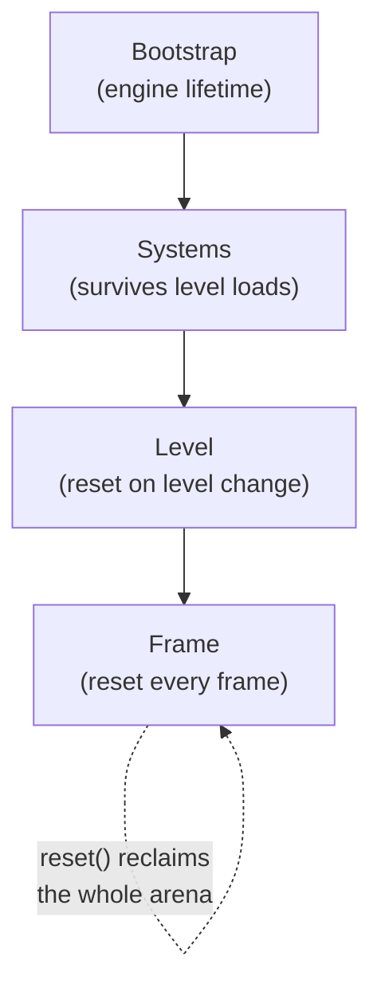
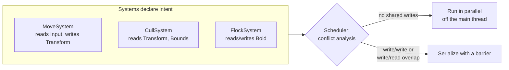

# Core

Core is the foundation every other package builds on. It is where the engine's
opinions about memory, data, error handling, and concurrency live. If
[Philosophy](Philosophy.md) is the set of bets, Core is where they are cashed in.

This is a long page, because Core is a lot of surface area and it rewards
understanding. It moves from the small primitives (containers, handles, results)
up to the two subsystems that most of the engine is really made of: the **data
table store** and the **task scheduler**.

---

## The no-STL bet, stated honestly

Ceili ships no STL. Its own containers, strings, and allocators stand in for
`std::vector`, `std::string`, and friends. This is the single most
questioned decision, so here is the honest trade-off:

- **The con:** the STL is familiar. Every C++ programmer knows `std::vector`'s
  interface, its iterators, its guarantees. Rolling your own means new code to
  learn and new code to maintain.
- **The pro:** you control the runtime *and* compile-time cost. Engine hot paths
  care about exact allocation behaviour, contiguous layout, and growth policy;
  the STL's abstractions and header weight are not free on either axis.

Ceili resolves the tension by keeping the *interfaces* STL-shaped (containers
match STL method names and semantics where it helps, and a couple even alias
into `namespace std` so familiar code compiles) while owning the
implementation. You get the muscle memory without the baggage.

```cpp
// Array.h: the engine's vector, aliased so std-shaped code just works.
namespace std
{
template <typename T, size_t Size = 0, typename size_type = size_t,
          typename allocator = ceili::core::Allocator<T>>
using vector = ceili::core::Array<T, Size, size_type, allocator>;
}
```

---

## Containers: contiguous by default

The container set covers the usual shapes, and the default layout is always
**contiguous memory**, because linear scans over packed data are what modern CPUs
are fastest at.

| Ceili | Closest STL | Notes |
|-------|-------------|-------|
| `Array` | `std::vector` | Dynamic or fixed-size; contiguous on the heap allocator, linked-block under a scope allocator. |
| `String` | `std::string` | Owned, growable character string; contiguous storage, same allocator model as `Array`. |
| `SortedArray` | (none) | Sorted storage with O(log n) `find()`; backed by `Array`, so still contiguous. |
| `MapArray` | `std::map` | Sorted `Array<Pair<K,V>>`, keys and values interleaved, contiguous. |
| `FlatMap` | `std::flat_map` | Structure-of-arrays: separate contiguous key and value arrays. |
| `ChunkArray` | (none) | Byte blocks addressed by runtime stride; varying types in one container. |
| `Pool` | (none) | `Array`-backed with an intrusive free list; push/pop without reallocation. |
| `Ring` | (none) | Fixed circular buffer over `Array<T, Size+1>`. |
| `Span` | `std::span` | Non-owning contiguous view. |

Two design choices are worth calling out because they show up all over the
codebase.

**Containers take a `size_type` template parameter.** You pick the index width at
declaration, so `size()` and `operator[]` return the right type and you never
scatter `static_cast`s at call sites (the build treats the `size_t`-to-narrower
narrowing warning as an error). An `Array<T, 0, uint16_t>` indexes with a
`uint16_t`, honestly.

**`SortedArray` lives on the struct it sorts.** When a type needs sorted, keyed
storage, the compare functions and the array alias are embedded in the type
itself, keeping them co-located with the data:

```cpp
// Component.cpp: a real example.
struct ComponentAlias
{
    ComponentId src;
    ComponentId dst;

    static int Compare(const ComponentAlias& Lhs, const ComponentId& Rhs)
    {
        return core::Compare(Lhs.src, Rhs);
    }

    using Array = SortedArray<ComponentAlias, ComponentId, Compare>;
};
```

`find()` is then a one-liner returning an iterator you compare against `end()`.
When your code looks like "accumulate, then sort at the end," the answer is
almost always to store a `SortedArray` and `insert` instead: lookups become
O(log n), iteration comes out in key order, and the manual sort pass disappears.

---

## Allocators and scope

Memory is arena-based. Rather than a general-purpose allocator servicing
individual `new`/`delete` calls, the engine binds a **scope** (a bump allocator
over chunked memory), and allocations flow into whichever scope is active. A
scope is reclaimed all at once by resetting it. There is no per-object free.

The scopes correspond to lifetimes:

```cpp
// Allocator.h
enum class Kind : uint8_t
{
    Bootstrap = 0, // Engine lifetime -- component factories, core subsystem state
    Systems   = 1, // Long-lived shared resources -- survives level transitions
    Level     = 2, // Per-level data -- entities, material instances
    Frame     = 3, // Per-frame scratch -- reset every frame
    Studio    = 4, // Studio -- independent of levels
    Ui        = 5, // UI assets -- isolated from Bootstrap
    Test      = 6,
    Count
};
```



The payoff is **fast startup and instant teardown**. Loading a level allocates
into the Level scope; unloading it resets that scope in one operation, no
destructor storm. The per-frame scratch scope is reset at the top of every frame,
which is how the engine took frame-scope allocation from roughly 13.9 GB/frame to
about 60 MB/frame: transient work stopped hitting the general heap and started
landing in an arena that is wiped for free each frame.

A container opts into a scope by naming it as its allocator. The adapter reports
that it cannot free individual allocations and uses linked storage:

```cpp
// Allocator.h: the container-facing adapter for a scope.
template <Kind ScopeKind>
class Scope
{
public:
    static constexpr bool supports_dealloc   = false;
    static constexpr bool use_linked_storage = true;
    CE_NODISCARD static uint8_t* allocate(const size_t Count);
    static void deallocate(uint8_t*) { /* no-op -- freed with the scope */ }
};
```

That `use_linked_storage = true` line is where these arenas pull ahead of a naive
bump allocator. When a scope-backed container outgrows its current block, the
scope links a *new* block onto it instead of overflowing, asserting, or forcing a
relocation. A `reserve()` up front still gives you a single contiguous block for
the common case; exceeding it is graceful growth across a block boundary, not a
hard wall. Many arena and bump-allocator implementations treat the initial
reserve as a fixed ceiling that fails when crossed. Here it is a hint:
correctness never depends on sizing it perfectly, only performance does (a
container that spans multiple blocks trades its single-contiguous-run guarantee
for the ability to keep going).

Two subtleties the engine handles carefully, because they bite:

- **Scope memory is raw bytes.** Objects placement-new'd into a scope are *not*
  destructed when the scope is reset. Types that own a resource (a mutex, say)
  must be destructed explicitly, or held in a container whose destructor iterates.
- **File-scope globals that a startup step touches** are held in an
  `AlignedBuffer<T>` and explicitly constructed from an `Init()` and destructed
  from a `Shutdown()`, rather than relying on C++ static-init order (which is
  unordered against the subsystem initializers that read them):

```cpp
// The pattern used across Core (Log.cpp, Data.cpp, Core.cpp, ...).
types::AlignedBuffer<Globals> g_buffer;
Globals&                      g_ = reinterpret_cast<Globals&>(g_buffer);
// ... placement-new'd in an Initializer(), destructed in ~Initializer().
```

---

## Strong types and handles

The engine leans hard on the type system to prevent mix-ups the compiler would
otherwise wave through. A **strong type** wraps a primitive so two logically
different `uint32_t`s cannot be swapped:

```cpp
// Macros/Core.h
#define CE_STRONG_TYPE(Strong, Weak) \
    struct Strong##_Tag {};          \
    using Strong = ceili::core::StrongType<Weak, Strong##_Tag>;
```

A **handle** is a strong type with a sentinel and optional generation bits. It is
the token the public APIs hand out instead of pointers (see
[Philosophy: Handles, not objects](Philosophy.md#handles-not-objects)):

```cpp
// Handle.h
static constexpr value_type kInvalid = MaxValue<value_type>();
constexpr bool isValid()   const noexcept { return m_Handle != kInvalid; }
constexpr void invalidate()      noexcept { m_Handle = kInvalid; }
```

```cpp
// A real declaration: 12-bit index + 4-bit generation.
CE_HANDLE(Handle, uint16_t, 4) // 4096 slots, 16 generation cycles
```

Generation bits catch use-after-free: when a slot is recycled its generation
increments, so a stale handle from the previous occupant no longer validates. A
`uint16_t` token also crosses the C / C# / Lua boundary trivially, which a C++
object with a vtable does not; handles are what make the interop story
tractable.

`Result` is itself a strong type. Errors are values, not exceptions:

```cpp
// Result.h
CE_STRONG_TYPE(Result, WeakResult_t)                     // uint32_t under the hood
CE_INLINE bool Failed(const Result R)    { return (R & 0x80000000) == 0x80000000; }
CE_INLINE bool Succeeded(const Result R) { return !Failed(R); }
```

A result's value is a hash of its name with the top bit meaning failure, so
results are cheap to compare and self-describing. You declare them with a macro
and return them early:

```cpp
CE_DECLARE_SUCCESS(Ok)
CE_DECLARE_FAILURE(OutOfMemory)
// ...
const Result ier = DoThing();
if (Failed(ier)) { return ier; }
```

---

## Hashing and type hashes

A single case-insensitive string hash (djb2) is used pervasively, for resource
names, material identity, result codes:

```cpp
// Hash.h
uint32_t constexpr Hash32(const char* Text, const size_t Length = UINT32_MAX)
{
    uint32_t hash = 5381;
    for (size_t i = 0; /* to len or NUL */; ++i)
    {
        unsigned char c = static_cast<unsigned char>(Text[i]);
        if (c >= 'A' && c <= 'Z') { c += 'a' - 'A'; }
        hash = ((hash << 5) + hash) + c; // hash * 33 + c
    }
    return hash;
}
```

More interesting is the **compile-time type hash**. The engine derives a stable
id for any C++ type by hashing its compiler-spelled name, with no macros or
registration at the type's definition:

```cpp
// Core.h
template <typename T>
constexpr Hash TypeHash()
{
    const TypeNameStr type_name = TypeName<T>();   // parsed from __FUNCSIG__ / __PRETTY_FUNCTION__
    return Hash(Hash32(type_name.start, type_name.len));
}
```

This is the quiet linchpin of the next section: a data table is keyed by
`TypeHash<T>()`, so a component *type* is its table id. No enum of component ids,
no manual registry. The type is the key.

---

## Extending without a central enum: FourCC ids

Type hashes turn a *type* into an id. `FourCC` turns a *four-character tag* into
one, and it is the tool the engine reaches for whenever a new kind of thing needs
a stable, orderable id that a downstream package (or a game) can mint without
editing an engine enum.

```cpp
// Core.h
template <typename T>
constexpr T FourCC(int b0 = ' ', int b1 = ' ', int b2 = ' ', int b3 = ' ');
// packs 4 chars into a uint32_t-based strong type T

template <typename T>
constexpr T PriorityFourCC(uint32_t Priority, int b0 = ' ', /* ... */ int b3 = ' ');
// packs Priority (high 32 bits) + a FourCC (low 32 bits) into a uint64_t strong type T
```

Two properties make this more than a packing trick. First, both are templated on
the strong type `T`, so a `serialize::Format` FourCC and a `draw::pass::Type`
FourCC are *different types* that cannot be compared or confused, even though both
are just packed bytes underneath. Second, `PriorityFourCC` sorts by value: the
priority band first, then the tag. Sort a list of them and you have a pipeline
order for free, with the tag disambiguating within a band.

That is why several of the engine's "registries" are not enums at all, just lists
of `constexpr` FourCC ids that anyone can extend:

```cpp
// A render pass is a priority + tag. Adding one is a single line, and its place
// in the frame's pipeline falls out of the packed value.  (Graphics.h)
CE_STRONG_TYPE(Type, uint64_t)
constexpr Type kDepthPrePass     = PriorityFourCC<Type>(priority::kDepth,    'D','P','R','E');
constexpr Type kDeferredLighting = PriorityFourCC<Type>(priority::kLighting, 'D','L','I','T');

// A serializer format is a FourCC, so it doubles as the binary stream's header. (Serializer.h)
constexpr Format kJson = FourCC<Format>('J','S','O','N');
constexpr Format kBin  = FourCC<Format>('B','I','N',' ');

// A system's scheduling priority is a band + tag, and a GAME can mint its own
// without touching any engine code. (System.h)
constexpr Priority kCull = PriorityFourCC<Priority>(band::kCull, 'C','U','L','L');
```

The system scheduler makes the intent explicit: two systems that land on the same
`Priority` trip an assertion telling you to give them distinct FourCCs. The engine
ships a set of ids, but the *scheme* is open. A downstream package adds a render
pass, a serializer format, a spatial-index kind, or a game-system priority by
minting a new tag, never by editing a switch statement at the center.

---

## Delegates and events

A `Delegate` is a type-erased callable with 32 bytes of inline storage. It binds
any of the three C++ callable shapes, and the callable is placement-constructed
into that inline buffer, so binding one never touches the heap:

```cpp
// Delegate.h: one Delegate type, three ways to bind it.
Delegate<void, int> d1 = &FreeFunction;              // a free function
Delegate<void, int> d2 = [captured](int x) { ... };  // a lambda (copied into the buffer)
Delegate<void, int> d3 = { &object, &Type::method }; // an object + member function

template <typename RetType, typename... A>
using Delegate = DelegateBase<RetType, size_t, kDelegateMaxStackSize /*32*/, A...>;
```

The distinctive part is the last mile: **a delegate can be backed by a script
function.** Because the `Delegate` layout is mirrored byte-for-byte across C++,
C#, and Lua, the script generator emits a small shim per delegate type, so any
`Delegate<...>` an engine API accepts can be satisfied by a Lua function or a C#
method. A Lua callback is `ffi.cast` to the delegate's signature (wrapped in a
`pcall`, so a script error is logged rather than crashing native code) and handed
across; a C# method is passed as an `[UnmanagedFunctionPointer]` and pinned so the
garbage collector cannot move it. Native C++ then invokes it exactly like a C++
callable, never knowing the implementation lives in a script.

That is the mechanism behind cross-language component and system implementations
(see [Component Architecture](Components.md) and [Script Generation](ScriptGeneration.md)):
a component written in C# or Lua registers its lifecycle as delegates, and the
engine calls them through the same 32-byte handle it would use for native code.

An `Event` is a priority-sorted list of delegates fired high-to-low.
`EventSingleFire` erases a delegate once it returns true, the shape you want for
"notify me once, then forget me" (shutdown hooks, one-shot load callbacks):

```cpp
// Event.h
template <typename R, typename... A> using Event           = EventBase<R, ..., false, A...>;
template <typename R, typename... A> using EventSingleFire = EventBase<R, ..., true,  A...>;
```

---

## Data: the table store the engine is made of

If one subsystem in Core deserves the most attention, it is `core::data`. It is a
columnar, archetype-style table store (the same family as the data-oriented ECS
stacks), and an enormous amount of the engine (scenes, serialization, undo/redo,
network replication) is really just this store viewed through different lenses.

The primitives: a **database** holds **tables**; a table holds **records** keyed
by a `Key` handle; each record's storage is a stride of raw items.

```cpp
// Data.h
CE_STRONG_TYPE(DatabaseId, Index)
CE_STRONG_TYPE(TableId, WeakTableId_t)
CE_HANDLE(Key, Index)

struct Record { void* pItems; Index itemIndex; Index itemCount; /* ... */ };
```

Tables are keyed by type. The typed API keys a table by `TypeHash<T>()`, so a
component type *is* its table:

```cpp
// Data.h: the ECS type -> table binding, no registry required.
constexpr TableId table_id = TableId(TypeHash<type>());

template <typename... A>
Result CreateRecordItems(const DatabaseId DatabaseId, const Key Key, A&&... Args);
```

You read across tables with a **view**. `GetView<A, B>` returns rows that have all
of components A and B, and `record.get<T>()` is checked at compile time so you
cannot read a column the view did not request:

```cpp
// Data.h
template <typename... A>
auto GetView(const DatabaseId database_id, const Span<const TableId> FilterTables = {});
// record.get<T>() static_asserts T is one of A...
```

Views hit an archetype fast path and a generation-validated thread-local cache,
so repeated per-frame iteration does not re-resolve membership.

Mutations are tracked. A table can opt into **dirty tracking**, mutations mark
keys dirty, and a consumer drains the dirty set instead of rescanning everything:

```cpp
// Data.h
void EnableDirtyTracking(DatabaseId, TableId);
void MarkRecordDirty     (DatabaseId, TableId, Key);
void DrainDirtyKeys      (DatabaseId, TableId, Array<Key, 0, Index>& Out);
```

That single "what changed?" primitive is the seam that undo/redo, the property
grid, serialization, and network replication all attach to. It is exactly the payoff
promised in [Philosophy](Philosophy.md): one metadata-and-data model, many
features. See [Metadata & Reflection](Metadata.md).

---

## Tasks, threading, and the fixed-tick clock

Work is expressed as tasks over a worker pool. The primitive is `Create`: give it
a delegate, a name, and how many worker threads to run it on.

```cpp
// Tasks.h
using Delegate = core::Delegate<Result, const Index /*ThreadIndex*/>;
Handle Create(const Delegate& Body, ConstStr Name = nullptr,
              const Index NumRequestedThreads = 1_threads, const Flags Flags = Flags::None);
```

One task on one worker, then join:

```cpp
const Handle h = tasks::Create(&DoWork, "DoWork");   // NumRequestedThreads defaults to 1
tasks::BlockWait(h);
```

Ask for more threads and the *same* body runs once per worker, each invocation
handed its own thread index, so a fan-out is just slicing the work by that index:

```cpp
const Handle h = tasks::Create([](const Index t) { ProcessSlice(t); return Ok; },
                               "Wide", 8_threads);   // 8 invocations, thread index 0..7
tasks::BlockWait(h);
```

(The `_threads` literal suffix just makes the count read as what it is.)

`ParallelFor` is the convenience you reach for most. Rather than compute a slice
from a thread index yourself, you hand it a total count and a body over a
half-open range `[Begin, End)`; it splits the range across the pool and joins for
you:

```cpp
// Tasks.h
Result ParallelFor(const Index Count, const RangeDelegate& Body, ConstStr Name = nullptr,
                   const Index NumTasks = 0, const color::ColorU32 ProfileColor = kModuleProfileColor);
```

Some work must run on the main thread only: script VMs, GPU submission. Tasks
carry an affinity flag, and the main thread drains those through a participating
wait:

```cpp
// Tasks.h
enum class Flags : uint8_t
{
    None = 0, DestroyOnCompletion = 1 << 0,
    MainThread = 1 << 1, // script VMs, GPU submission; never on a worker
};
```

Above the raw pool sits the part that makes concurrency *safe by construction*.
Systems declare, in the type system, which data they read and which they write,
via a `Contract`: a `const` component is a read, a non-const component is a write.
The scheduler reads those sets and fans out systems whose reads and writes do not
conflict:

```cpp
// Scene/System.h: reads vs writes, partitioned at compile time.
static constexpr size_t kNumReads =
    (size_t(0) + ... + (core::types::IsConstV<Ts> ? 1 : 0));
static core::Span<const core::Hash> getReads();
static core::Span<const core::Hash> getWrites();
```



Simulation runs on a **fixed-tick clock** so behaviour is deterministic
regardless of frame rate, while presentation stays smooth via an interpolation
factor:

```cpp
// Scene/System.h
struct FixedTickPlan
{
    uint32_t numSubTicks = 0;    // fixed sim ticks to run this frame
    float    alpha       = 0.0f; // [0,1): blend previous/current tick for display
};
void  SetFixedTickRate(const float Hz);
float GetFixedTickDelta();       // 1 / Hz
```

Sim-domain systems run `numSubTicks` times at a fixed `dt`; frame-domain systems
run once with `alpha`, which the renderer uses to blend between the last two
simulated states. This is what lets 100,000 boids simulate at a fixed rate and
still render buttery between ticks. See
[The Road to 100k Boids](Performance_100kBoids.md).

> One accuracy note for the curious: there is no `RegisterSystem` call. Systems
> are Bootstrap-scope components created once at startup by interface id and
> gathered by the scheduler; registration falls out of the component system,
> covered in [Component Architecture](Components.md).

---

## The support cast: logging, profiling, time, hot reload

**Logging** is a macro over a lock-free ring buffer with pluggable sinks:

```cpp
// Log.h
enum class Type : uint32_t { Verbose = 0, Info, Warning, Error, Critical, _COUNT_ };
#define CE_LOG(Type, Message, ...) \
    ceili::core::log::WritePrintf(Type, CE_FUNC_NAME, Message, __VA_ARGS__)
```

A file sink writes every run to `<logs>/<AppPrefix>_<date>_<pid>.log`, flushed per
record. Paired with the on-crash minidump, this is the engine's standard
autonomous-debugging primitive: the log shows what led up to a failure, the dump
shows the stack at it. Read both before asking anyone to reproduce.

**Profiling** is an RAII zone you drop at the top of a function; it compiles away
entirely when profiling is off:

```cpp
// Macros/Profile.h
#define CE_PROFILE /* static zone id + ProfileScopeGuard for this __LINE__ */
```

**Hot reload** closes the iteration loop. A file watcher notifies on change, and
per-type reloaders re-ingest the changed file, all drained at a single per-frame
point:

```cpp
// Resources/HotReload.h
struct IReloader { virtual void onFileChanged(ConstStr FilePath) = 0; };
Handle Register(const RegisterDesc& Desc); // keyed on (sourceDir, extensions[])
void   UpdateAll();                        // one drain point per frame
```

Edit a `.material` or a `.lua` script, save, and the change is live in the running
editor next frame. Tight iteration is a first-class goal, not a nicety.

---

## How Core compounds

The primitives are unremarkable on their own: everyone has a vector and a hash.
The leverage is in how few ideas the rest of the engine needs:

- A **type** is an id (`TypeHash<T>()`), so a component is a table with no registry.
- A **table store** with dirty tracking is the one substrate that scenes,
  serialization, undo, and replication all read through.
- **Scopes** make lifetimes explicit and teardown free.
- **Contracts** turn "is this safe to parallelize?" into a compile-time question.

Everything downstream ([Materials](Materials.md), [Metadata](Metadata.md),
[Studio](Studio.md), the [100k-boids](Performance_100kBoids.md) result) is these
Core pieces, composed.

Next: [Component Architecture](Components.md), or back to the
[documentation index](README.md).
