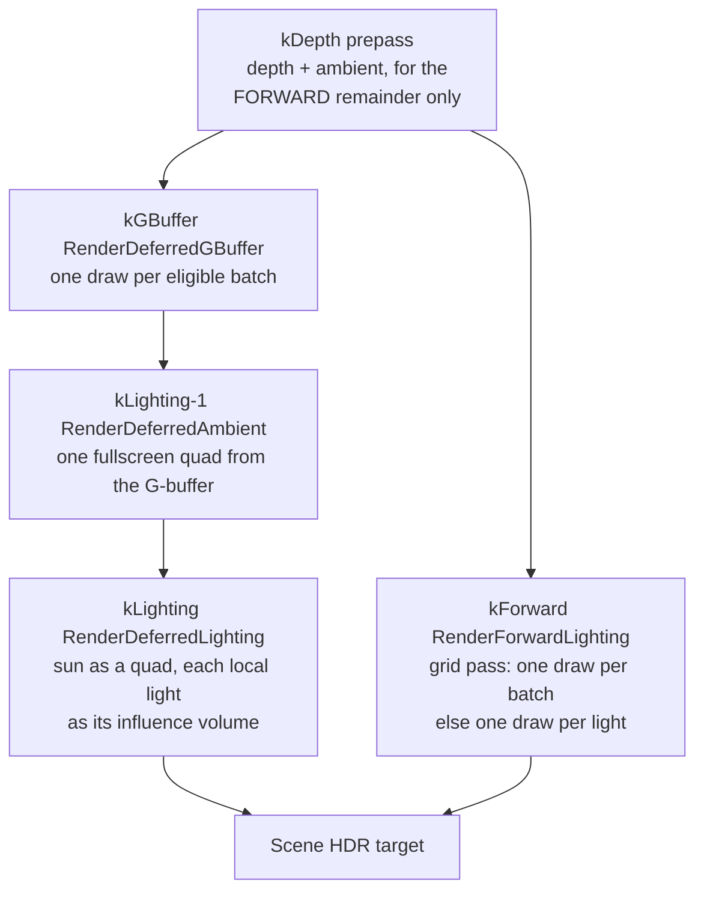

# Lighting

A lit pixel in Ceili can be shaded three ways, and all three run in the same
frame. A batch can be drawn once per light that reaches it, drawn once with a
shader that loops the lights in its screen cell, or written into a G-buffer and
lit afterwards from the screen. Which one a batch takes is decided per view and
per material, and the picture is meant to be the same whichever it takes.

This page walks the three paths, the light grid they share, and the measured
reason each one exists. Shadows have [their own page](Shadows.md); this one
covers how a light reaches a surface.

---

## Where the paths came from

Ceili lit forward only until September 2026. `RenderPrePassIBL` wrote depth and
ambient into the scene HDR target, and `RenderForwardLighting` then drew every
lit batch once per light, additively. That is correct and it scales badly: a
scene with many small lights redraws the same geometry once for each of them.

Two changes landed ten days apart, and both are on in the shipped default:

- **The deferred renderer** (8 September). A batch whose material carries an
  eligible G-buffer pass writes its surface parameters once, and the lighting is
  a screen-space pass afterwards.
- **The forward light grid** (18 September). A lit batch draws once through a
  pass whose fragment shader loops the lights its screen cell lists.

Both are hybrid by construction. A material family with no grid pass keeps the
per-light path in the same view, and a family with no G-buffer pass stays forward
lit in the same view. Cloth and clear-coat stay forward by decision. That is what
lets the paths be compared live against each other on real content.

---

## A light, as the shader reads it

A light is an entity row like any other, authored in the property grid and
serialized with the scene. What the grid uploads is a flat record:

```cpp
// Include/LightGrid.h
struct Row
{
    // Point and spot: the point the light shades FROM (light::scene::Light::lightPos).  Directional: the unit
    // direction TO the light (lightDir).
    math::Vec4 position;
    // rgb: the colour the light shades with (light::ResolveLitColor).  a: the authored ambient.
    math::Vec4 color;
    // The world -> light-clip rows and the falloff row, as light::Update caches them on the light's row.
    math::Vec4 projectionS;
    math::Vec4 projectionT;
    math::Vec4 projectionR;
    math::Vec4 projectionQ;
    math::Vec4 falloffS;
    // Bindless heap indices of the cookie's projection and falloff textures.
    uint32_t projectionIndex = 0;
    uint32_t falloffIndex    = 0;
    // The animated cookie's slice, or -1 when the projection is not an array.
    float projectionSlice = -1.0f;
    // Which shadow the light casts, or kNoShadow.
    uint32_t shadowIndex = kNoShadow;
};
```

The row carries the projection matrix a spot light's cookie needs and the
bindless indices of its projection and falloff textures, so a grid-lit pixel gets
the same cookies a per-light draw would give it.

The layout is pinned by a test rather than by care. The shader side is
`lightGrid.hlsli`, and a unit test reads the member offsets back out of the
compiled SPIR-V and compares them with `offsetof` on the C++ struct. A member
that drifts fails a test instead of shading with the wrong value.

---

## The light grid

The grid covers the view with tiles, cuts each tile into depth slices, and lists
in every cell the local lights whose influence volume can reach it. A fragment
looks up its own cell and loops that list.

```cpp
// Src/Render/LightGrid.h
// The nominal tile edge in pixels.  A view gets ceil(size / this) tiles along each axis, so a tile is at most this big.
constexpr uint32_t kTilePixels = 64;
// Tiles along one axis at most: a 4096-pixel view at the nominal tile size.
constexpr uint32_t kMaxTilesPerAxis = 64;
// Depth slices for a perspective view.  An orthographic view has no depth to slice by clip w, and gets one.
constexpr uint32_t kNumSlices = 24;
// The deepest the last slice may end, in world units.  A light farther than this still lands in the last slice, which
// then covers everything past it; without the cap one distant light would stretch every slice and pack the near
// lights, which are the ones large on screen, into a few of them.
constexpr float kMaxDepthCap = 2048.0f;
```

The lists are deliberately loose. A light lands in a cell if the corners of its
influence volume reach it, so a cell can list a light that does not actually
light any pixel in it. That is safe because the fragment shader still tests each
listed light's own volume, exactly as the per-light passes do. **The grid narrows
the set of lights a pixel tests; the volume test still decides which of them
light it.**

Directional lights sit outside the cells. They are the first rows, and every
pixel loops all of them.

### One piece of maths, two languages

The CPU decides which cell a light lands in. The shader decides which cell a
pixel is in. If those two disagree about where a slice boundary sits, a light
goes missing along the seam. Ceili removes the possibility by compiling the
shader's own source as C++:

```cpp
// Src/Render/LightGridMath.h
// Resources/Shaders/lightGridMath.hlsli is written in the subset HLSL and C++ share, and this header compiles it as
// C++.  The CPU decides which cell a light lands in with these functions and the fragment shader decides which cell it
// is in with the same text, so the two cannot disagree about a slice or a tile edge.  Include after Module.h.
```

The header defines the handful of intrinsics the shared text spells through
macros, includes the `.hlsli` file, and undefines them again. There is one
definition of the cell maths in the tree.

### What it bought

Measured on the RedMines scene, which is ported legacy content with many small
lights:

| Path | Forward draws | `Frame.Gpu` change |
|------|---------------|--------------------|
| Per light | 42,570 | reference |
| Light grid | 3,330 | -35% Vulkan, -44% D3D12 |

`RenderForwardLighting::process` dropped about 90 percent on both backends, over
36 of 36 measured pairs. PBR, Blinn and terrain all light through the grid.
Cloth and blended overlays keep the per-light passes.

Finding that needed real content. The Blinn slice's own coverage turned up a
material-system defect on the way: a second parent's pass removal merged onto the
first parent's pass of the same type, so every material built on the cloth family
had silently lost its grid pass.

### The device decides

The grid needs two structured buffers readable from the fragment stage. That is
free on D3D12 and conditional on Vulkan:

```cpp
// Include/DeviceCaps.h
// The fragment stage can read the light grid's two structured buffers (Include/LightGrid.h).  Always on D3D12,
// where they are root SRVs.  On Vulkan they are a FIFTH descriptor set, which needs maxBoundDescriptorSets of 5
// or more (the spec minimum is 4; Adreno reports 7).  A view on a device without it keeps per-light lighting.
FragmentStorageBuffers = 1u << 11,
```

The capability is probed once at device creation and published into a trunk-owned
latch. A strategy resolves its automatic setting against that latch and never
against a device name.

---

## The deferred path

A view carrying `ViewDescFlags::Deferred` writes eligible batches into a
G-buffer at the `kGBuffer` priority, then lights the screen. Eligibility is one
decision, shared by the pass that draws and the pass that skips, so a batch is
lit exactly once.

### One layout for two lighting models

Ceili carries a physically based model and a legacy Blinn model side by side (see
[Materials](Materials.md)). The G-buffer serves both from one layout:

```cpp
// Include/GBuffer.h
// The deferred G-buffer: ONE layout for both lighting models.  The view's enabled pass flags
// (display::Settings::enabledPassFlags) fix which model every pixel was written with, exactly as
// they fix which forward pass draws, so the lighting pass never needs a per-pixel model id.
//
//   RT0 kAlbedo  RGBA8 sRGB   The DIFFUSE colour, with every material variant folded at write:
//                             PBR albedo * (1 - metallic) (so a metal writes black), a legacy
//                             PBR surface its albedo, Blinn its diffuse map.
//   RT1 kNormal  R10G10B10A2  rg = the world-space SHADING normal, OCTAHEDRAL.
//                             b (10 bits) = the surface's MATERIAL TABLE ROW over 1023, 0 meaning
//                             no shading-model constants - so the row is its own enable flag and
//                             costs no separate bit.
//   RT2 kParams  RGBA8 sRGB   PBR: rgb = F0, a = roughness.  Blinn: rgb = the specular map,
//                             a = specularPower / 256.
//   depth        the SHARED scene depth - the G-buffer render target attaches it and never owns it.
//                REVERSE Z: depth 0 is the far plane.
```

Three decisions in that layout are worth pulling out.

**Folding at write time.** Every material variant resolves its diffuse and its
F0 in the G-buffer pass, so a metal writes black diffuse and its albedo as F0.
The lighting pass is then one formula per model rather than a switch over the
variants.

**The targets are sRGB-typed.** A linear RGBA8 measured two levels darker on
every dark flat surface against the forward path, and that was the larger half of
the whole forward-versus-deferred difference. The encoding applies to RGB only,
so the alpha band on RT0 and the roughness in RT2 stay linear.

**The normal is octahedral.** Two 10-bit channels hold a unit direction at least
as well as the three channels the old `xyz * 0.5 + 0.5` encoding spent, which
wasted its range on the interior of a cube when only the sphere's surface is
reachable. Freeing the third channel is what paid for the material table row.

The G-buffer is never cleared. Every texel that passes the depth-equal test is
overwritten, and a texel that does not (the sky) keeps whatever the previous
frame left there. So every reader tests the scene depth first and treats far as
"no surface". RT0's alpha carries a second mark for the same question, and the
debug view paints magenta wherever depth says a surface is there and the alpha
says nothing wrote: a batch the forward pass skipped as deferred-eligible that
the G-buffer pass then did not draw.

### Ambient first, then lights

The deferred frame lays the ambient down one priority slot before the lights, as
a single fullscreen draw:

```cpp
// Include/Graphics.h
// The deferred AMBIENT pass (RenderDeferredAmbient, base/deferred/ambient): one fullscreen draw
// per view that WRITES each G-buffer pixel's base value - the split-sum IBL / Blinn ambient with
// both aerial terms and the horizon seal - from the G-buffer, where RenderPrePassIBL draws the
// geometry a second time for it.  One slot BEFORE the lights (kLighting - 1): it lays the base
// down that the light draws add to.  Authored twice, per lighting model, like the lights.
constexpr Type kDeferredAmbient  = PriorityFourCC<Type>(priority::kLighting - 1, 'D', 'A', 'M', 'B');
```

The two aerial terms are the [atmosphere's](Atmosphere.md) haze between the eye
and the surface, read from the froxel volume. The ambient occlusion, the specular
mask and the split-sum horizon fade all ride in the G-buffer's spare bits for this
pass alone. The lights never read them.
They are what the forward IBL prepass computed from the surface's own samples,
carried across so the ambient can be lit from the screen without drawing the
geometry a second time.

Then the lights. The sun is a fullscreen quad. A point or spot light draws its
influence frustum as a unit box unprojected in the vertex shader, back faces
only, with no depth test, which gives the exact screen footprint whether the
camera is inside the volume or outside it. The fragment shader rejects a pixel
outside the light's volume before it reads the albedo, normal and params.

<!-- MEDIA: the G-buffer debug grid (albedo, normal, params, depth in four
     quadrants) beside the finished frame. One image explains the layout section
     better than the table does. -->

### Clustered deferred, and the honest result

The same grid that lights forward batches can light the G-buffer: one fullscreen
draw whose fragment shader loops each pixel's cell, in place of one draw per
light. It works, and it is off by default, because the measurement did not
support turning it on.

On RedMines, 3,776 light draws become 236. `RenderDeferredLighting::process`
drops 61 percent on Vulkan and 60 percent on D3D12, at 36 of 36 pairs. `Frame.Gpu`
moves -2.1 percent and -1.0 percent, at 17 and 19 of 36, which is a coin flip.

The reason is plain once stated: the per-light deferred path is already bounded
by its scissor and its influence volume, so clustering removes draw-call overhead
and not shading work. That is exactly what made the forward numbers different,
where clustering removed whole redraws of the geometry. It stays behind a toggle
until a device says otherwise.

---

## The frame, with all three paths



An eligible batch is drawn once, in the G-buffer, and the forward pass skips it.
Everything else takes the forward path in the same view. Previews, thumbnails and
the 2D orthographic views stay forward, because the flag is per view.

---

## Parity, and how it is held

Two paths that shade the same surface will drift, and the drift is invisible
until someone measures it. Ceili gates it: two smoke tests compare the deferred
and forward images on one calibrated scene, the ambient pass at a tolerance of
0.007 and the direct lighting at 0.012.

Those gates exist because of what held the deferred path back for four sessions.
One line in `deferredLighting.material` handed the shadow function a
`float3(0, 0, cos)` as a tangent-space light vector, and that function reads the
cosine as `normalize(v).z`, which is 1 for every positive cosine. So the
normal-offset shadow bias was inert across the whole deferred path, and every
deferred-lit surface self-shadowed about 12 percent dark. It was diagnosed as an
ambient gap first, which was wrong because the three ambients agree to 0.007, and
then as a lighting-model gap, which was wrong because the same quads agree with
shadows off. One intermediate reading of 8.7 percent turned out to be the post
chain's vignette, measured because two probes sat at different distances from the
frame centre.

The lesson that became a rule: put the probes on a calibrated circle, and always
carry a control that the change under test cannot possibly affect.

---

## What lighting does not do yet

- **Local lights cast no shadows.** Point and spot shadow passes are declared and
  not rendered, so every local row carries `kNoShadow`. See
  [Shadows](Shadows.md).
- **Clustered deferred is off by default**, on the measurement above.
- **Cloth and clear-coat have no G-buffer pass**, by decision. They stay forward
  lit, and an id-free fourth target is the path if content needs them deferred.
- **The grid's cell list is capped.** A cell lists as many lights as its count
  field's 8 bits allow, and a light past that is dropped from the cell and
  counted. The counter is reported, so an overflowing scene says so.

Next: [Shadows](Shadows.md) for the atlas these lights sample,
[Materials](Materials.md) for how a material declares its passes, or
[Rendering](Rendering.md) for the frame around all of it. Back to the
[documentation index](README.md).
