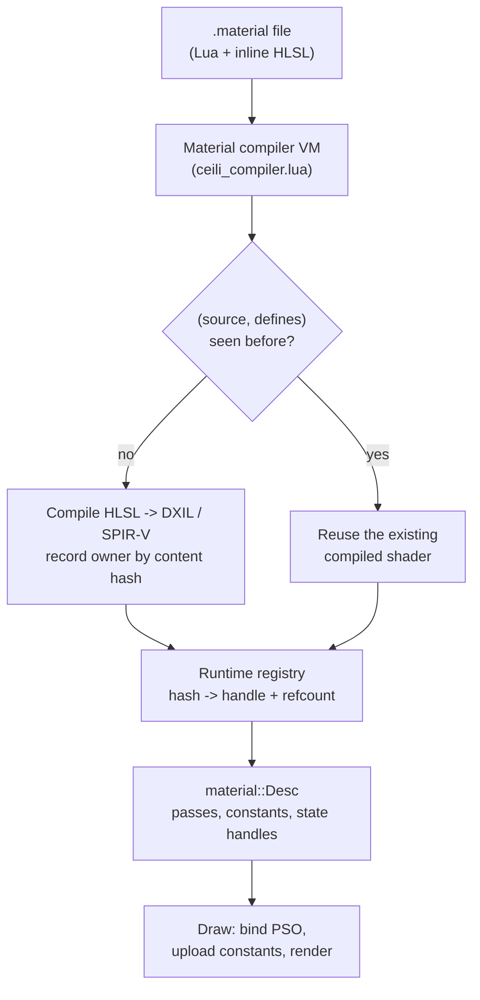

# Materials

Most engines treat a material as data: a fixed shader plus a bag of parameters
you fill in. Ceili treats a material as a **program**. A `.material` file is a
Lua script that builds the material (its passes, its render states, its
constants) and embeds its HLSL shader source inline. Materials inherit from one
another, constants can be driven by live script, and identical shaders and
constant blocks are de-duplicated automatically.

This is the most distinctive single feature in the engine, so it is worth seeing
in full.

<!-- MEDIA: the Studio material preview panel showing a PBR sphere, ideally a
     short clip cycling through a few materials (chrome, iron, dielectric) and one
     of the live script-driven materials pulsing. This is the money shot for this
     page. -->

---

## A material is a Lua program

Here is the shape of a real one. `baseLightPBR.material` declares an inline
vertex shader as a value, then creates materials from it:

```lua
local M  = ceili.material
local P  = M.Pass
M.include("lightCommon")

local dirVertexShader = M.inlineShader([[
    #include "lightCommon.hlsli"
#ifdef INSTANCED
    PUSH_CONST(LightDirInstancedVSConstants, vsc);
    INSTANCE_BUFFER(instanceTransforms);
    LightDirInterpolants main(in LightVertex In, uint InstanceId : SV_InstanceID)
    {
        float4x4 world         = instanceTransforms[InstanceId];
        float4x4 worldViewProj = mul(world, vsc.viewProj);
        return LightDirVS(In, worldViewProj, world, world, ...);
    }
#else
    ...
#endif
]])

M.create("base/light/pbr", { flags = { lit = true, ... },
                             [P.kClusteredForward] = { ... } })
```

The HLSL lives right next to the Lua that uses it. The `#ifdef INSTANCED` is a
real preprocessor branch: the same source compiles to an instanced or a
per-surface variant depending on the defines a pass requests, and (as we will
see) both variants are de-duplicated if their `(source, defines)` pair matches
something already compiled.

> **Shader convention.** Ceili's `math::Mat4` is row-major with row-vector
> semantics, so the canonical multiply order in shaders is `mul(v, M)`, vector
> first. `o.Position = mul(pos4, WorldViewProj);`. `mul(M, v)` compiles fine and
> silently transposes your matrix; if a projection lands off-screen, check this
> first.

## The compiler VM

Calling a `.material` file "a program" is literal: the file is executed in a Lua
VM. The material compiler boots a minimal VM that loads the Core and Graphics
bindings and the material DSL itself, then runs each `.material` file so its
`M.create` calls register the material:

```lua
-- ceili_compiler.lua: minimal Lua VM startup for the material compiler.
ceili._resolveOnly = true
-- Load the material DSL, then run every .material file against it.
ceili.material = dofile(path.join(ceili.packagesPath, "Graphics",
                                  "Resources", "Materials", "core.material"))
```

`core.material` is not a material; it *is* the DSL. `M.create`, `M.inlineShader`,
`M.include`, the `PBR.*` helpers, the pass and binding tables: all of it is Lua
defined in `core.material`, so authoring a material is calling into a small
library, not filling in a fixed schema. The same DSL runs at runtime for hot
reload, which is why editing a `.material` and saving shows up in the running
editor the next frame (the hot-reload path described in [Core](Core.md)).

## Inheritance

A material can derive from another by naming it as the second argument to
`M.create`. The child inherits the parent's passes and shaders and overrides only
what differs (here, a preprocessor define and a flag):

```lua
M.create("base/light/pbr",      { flags = { lit = true, ... }, ... })

M.create("base/light/pbrMetal", "base/light/pbr",
         { flags = { metal = true, definitions = "PBR_METAL" } })

M.create("base/light/pbrLegacy","base/light/pbr",
         { flags = { definitions = "PBR_LEGACY" } })
```

Concrete materials then derive from those bases and supply textures and constant
values through helper functions, so authoring a new material is a couple of
lines:

```lua
M.create("pbr/test/iron_smooth", "base/light/pbrMetal",
         PBR.metalWithTextures("iron", { metalRough = "predefined://mr_metal" }, 0.1))
```

## Constants driven by live script

A material constant does not have to be a static value. Its `binding` can be an
**expression**: a Lua function evaluated with a per-frame context. This material
pulses its colour every frame with a sine wave, entirely from the `.material`
file, no C++ involved:

```lua
fragmentShaderConstants = {
    { name = "pulseColor", valueType = VT.Float4, semantic = S.Color,
      binding = B.Expression,
      value = function(ctx)
          local t     = ctx and ctx.time or 0
          local pulse = 0.5 + 0.5 * math.sin(t * 2)
          return { pulse, 0.5, 0.5, pulse }
      end },
    { name = "textureIndex", valueType = VT.UInt, binding = B.Texture },
},
```

Other bindings cover the common cases: `B.User` (a value the property grid
edits, with a `default`), `B.Texture`, and `B.Expression` (the live function
above). The same declarative constant list drives editable parameters, texture
slots, and animated values alike.

<!-- MEDIA: a short clip of the pulse material animating in the preview, side by
     side with the ~8 lines of Lua that produce it. Shows "authored as data,
     alive at runtime" in one glance. -->

## Dedup: shaders and constants are content-addressed

An engine with hundreds of materials would drown in duplicate shader binaries and
constant layouts if each material compiled its own. Ceili avoids that by making
the **content** the identity.

A shader's identity is the pair `(source, defines)`. The first pass to claim a
pair owns the compiled file; every later pass or material sharing that pair reuses
it, even across different passes:

```lua
-- core.material (the material DSL)
-- Identity is (source, definitions): same pair produces identical compiled
-- output, so the first PASS claiming a pair owns the compiled shader file and
-- later passes / materials sharing the pair reuse that file.
inl.sourceHash = bit.bxor(hash32(pd.fragmentShader.source), fs_defs_hash)
```

On the C++ side the runtime registry is a set of hash-to-handle maps with
refcounts, so a state block or shader shared by 500 materials is stored once and
released when the last reference drops:

```cpp
// Material.h: namespace registry
MapArray<uint32_t, material::shader::Handle> shaderHashToHandle;
MapArray<uint32_t, material::Handle>         materialHashToHandle;

struct BlendSlot : core::slot::RefCounted<states::blend::Handle> {
    states::blend::Desc desc;
    uint32_t            descHash{0};
    Array<uint32_t, 0, uint8_t> nameHashes;  // reverse-alias bookkeeping
};
```

The identity even works *across* passes. An instanced pass whose fragment-shader
`(source, defines)` pair matches its per-surface sibling resolves to the
sibling's already-compiled shader, so the two variants share one binary. Each
inline shader records its source hash and its defines as the key:

```cpp
// Material.h: an inline shader's identity is its source hash plus its defines.
struct InlineSource {
    ConstStr source{nullptr};
    uint32_t sourceHash{0};
    String   definitions;  // e.g. "PBR_METAL;PBR_LEGACY"
};
```

Sharing raises a lifetime question: if 500 materials share one blend state, when
is it freed? Each registry entry is reference counted and keeps the list of name
hashes that alias it, so releasing the last material that references a state block
drops it in O(K), without scanning the whole registry.

## The pipeline, end to end



At the bottom sits the C++ data model. A `Desc` is a named list of passes; a
`Pass` carries its compiled shader and state handles plus the declared constant
elements; a `ConstElement` describes one constant and its authoring metadata:

```cpp
struct ConstElement {
    String                       name;
    shader::constants::ValueType valueType;
    shader::constants::Binding   binding;      // User / Texture / Expression / ...
    bool                         hasExpression;
    String                       annotation;   // range / enum / description, from Lua
    Array<uint8_t>               defaultValue;
};

struct Pass {
    String                            name;
    states::blend::Handle             hBlend;
    states::depth::Handle             hDepth;
    shader::Handle                    hVertexShader, hFragmentShader;
    Array<ConstElement, 0, uint8_t>   vsConstants, fsConstants;
    // ...
};
```

## Authored once, used everywhere

Look again at `ConstElement`: alongside the GPU-facing `valueType` and `binding`
it carries an `annotation`, a range or enum or description piped straight from the
Lua declaration. That one field is why the **property grid builds itself** from a
material. When the editor inspects a material it walks the constant elements, and
each one already knows its widget, its bounds, and its tooltip. No separate editor
schema, no per-material inspector code.

So a single constant declaration in a `.material` file drives four things at once:
the GPU constant binding, the value the serializer saves, the value the network
layer replicates, and the widget the property grid renders. That is the
[Metadata](Metadata.md) philosophy (one declaration, one Read/Write funnel, many
consumers) reaching all the way into graphics.

One practical corollary worth knowing: a surface references its material by
*name*, and an unregistered name resolves to an invalid handle, which the render
passes skip silently. If a surface renders nothing, an unregistered material name
is the first thing to check. Name resolution is device independent, so this is
catchable headless (see [Rendering & Visibility](Rendering.md)).

## Output and post-processing

Materials render into an HDR scene target, which the tonemapper and post chain
turn into the final image, in SDR, HDR10, or scRGB depending on the display:

```cpp
enum class OutputMode : uint8_t { Ldr = 0, Sdr = 1, Hdr10 = 2, Scrgb = 3 };
```

The post-processing chain (bloom, depth of field, tonemap, lens flare, 3D-LUT
grading) is itself authored as a list of `.material` passes wired together by
their input/output slots. That is its own story:
[Post-Processing & HDR](PostProcessing.md).

---

## Why this is unusual

Pulling the pieces together: a material in Ceili is a **live, inheriting,
de-duplicated program** whose declaration simultaneously drives the GPU pipeline,
the serialized data, the network representation, and the editor UI, from a
single Lua file with the HLSL inline. Most engines split those into a shader
file, a material asset format, a separate parameter UI schema, and a C++ binding
layer. Collapsing them into one authored artifact is what makes iteration fast:
edit the `.material`, hot-reload, see the result.

Next: [Post-Processing & HDR](PostProcessing.md), or back to the
[documentation index](README.md).
