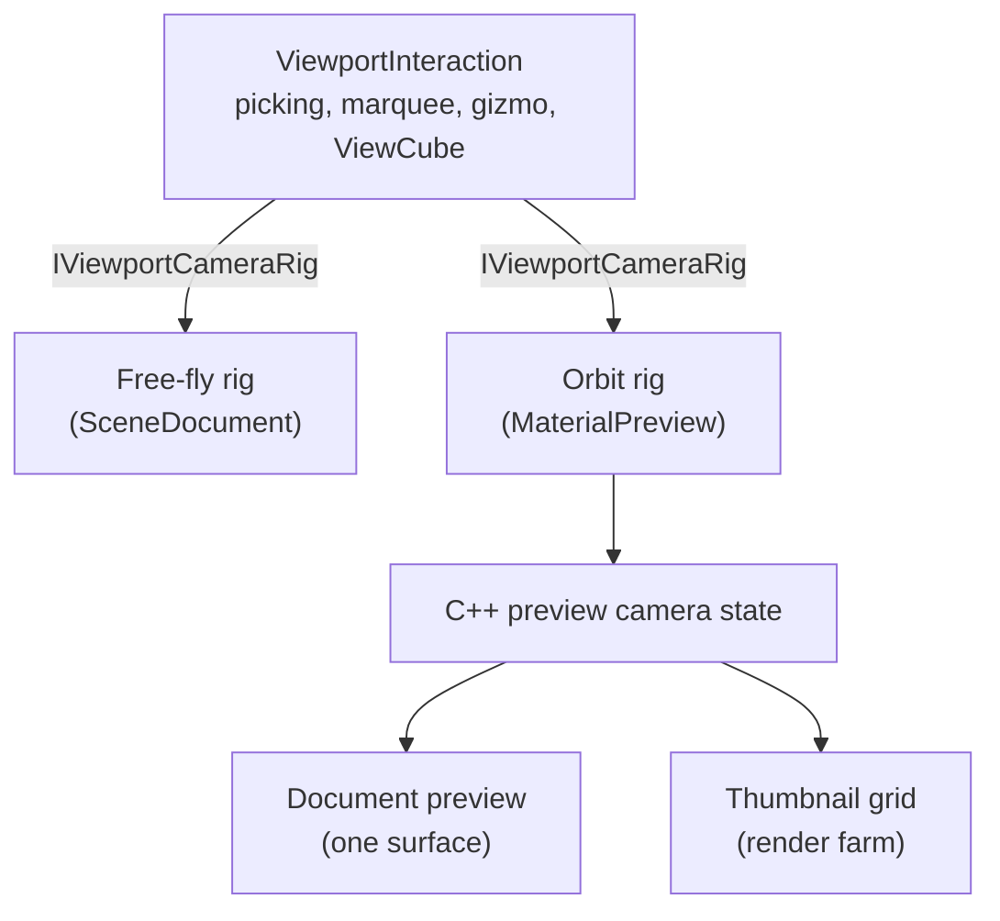
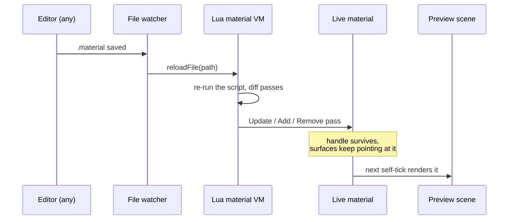

# The Materials Viewer

[Materials](Materials.md) covers what a material *is* in Ceili: a Lua program with
embedded HLSL, compiled at build time into a generated header and registered by
name at runtime. This page covers what you actually look at while authoring one.

The short version is the founding bet made concrete. Because there is no split
between the runtime and the tools, the material preview is not a preview widget
with a bespoke renderer. It is **a real scene**, with its own camera, lights,
environment, and render target, running the real render path, driven by the same
viewport interaction code as the main 3D view. Select a surface in it. Drag a
gizmo in it. Orbit it with the ViewCube. It is a scene, so all of that already
works.

Then the same machinery is instanced into a grid, and the material browser is a
render farm of preview scenes.

<!-- MEDIA: the money shot for this page is a single screenshot of Studio with
     the Materials panel (thumbnail grid, filters, cell-size slider) on one side,
     the Camera panel showing the live orbiting preview of the picked material in
     the middle, and the material's .material source open in a text document with
     inline HLSL syntax-highlighted. One frame, the whole loop. -->

---

## A preview is an instance, not a singleton

Creating a preview allocates a scene, an offscreen render target, and a camera:

```cpp
// MaterialPreview.h
struct InstanceDesc
{
    uint32_t                   width{256};
    uint32_t                   height{256};
    uint16_t                   maxCells{1};                                   // pre-spawned cell surfaces; a grid instance's thumbnail render farm (set to kThumbRenderFarm); 1 = the single-surface document preview
    graphics::primitive::Shape cellShape{graphics::primitive::Shape::Sphere}; // the mesh a grid instance's cell surfaces use (Sphere/Quad/Box); full-screen materials ignore it
};
```

`maxCells` is the interesting field. A value of 1 gives the single-surface preview
that the material document shows. A larger value pre-spawns a farm of cell
surfaces in one scene, which is how the browser renders a grid of thumbnails
without paying for a scene per material.

The instances are slot-table backed, mirroring `graphics::renderTarget::Create`,
so a preview is a handle like everything else
([Philosophy: handles, not objects](Philosophy.md#handles-not-objects)).

The preview scene **self-ticks**. It is registered once as a per-frame delegate
rather than being pumped by whichever document happens to be focused:

```cpp
// Material.cpp: the preview keeps reconciling and rendering with no document open.
core::chrono::NewFrameDelegate(&MaintainPreviewState)
```

That is why the thumbnail grid stays live and navigable when nothing is open, and
why a hot-reloaded material updates on screen whether or not you are looking at
its source. In an engine where preview rendering is a special editor path, "keep
it live in the background" is work. Here it is a scene that ticks, like scenes do.

---

## The camera seam: one interaction state machine, two rigs

Studio has a viewport interaction state machine that handles pick-ray
accumulation, click and marquee selection, gizmo hover and drag, and the
orientation ViewCube. It is about 1,100 lines of C# (cross-language plugins are
covered in [Studio](Studio.md#cross-language-plugins)), and the material preview
uses all of it.

It manages that without knowing what kind of camera it is driving, because the
camera sits behind an interface:

```csharp
// ViewportInteraction.cs
public interface IViewportCameraRig
{
    // The camera pose this frame: world position + forward/right/up (unit, orthonormal,
    // left-handed -- right = cross(worldUp, forward), up = cross(forward, right)).
    void GetBasis(out Vector3 Position, out Vector3 Forward, out Vector3 Right, out Vector3 Up);

    // The live vertical FOV in degrees (matches the rendered projection, so pick rays and
    // world->screen projections line up with the image).
    float FovDegrees { get; }

    // ViewCube snap write-back: point the camera along WantForward so Focus sits centred at
    // Distance (Focus/Distance framed from bounds by the caller).  The rig maps this onto its
    // own parameterisation -- free-fly decomposes to yaw/pitch + position, an orbit rig to
    // yaw/pitch/distance about its pivot.
    void SnapTo(Vector3 WantForward, Vector3 Focus, float Distance);

    void Look(float DeltaX, float DeltaY);
    void Move(Vector3 WorldDelta);
}
```

The scene document plugs in a free-fly rig. The material preview plugs in an
orbit rig. Everything above the interface (picking, marquee, gizmo, ViewCube)
is written once and gets both.

Read the comment on `SnapTo` again, because it is the reason this composes
rather than leaking: the ViewCube says "point along this vector and frame this
bounds", and each rig decides what that means in *its* parameterisation. The
free-fly rig decomposes it to yaw, pitch, and a position. The orbit rig maps it
to yaw, pitch, and a distance about its pivot. The interaction layer never learns
that two kinds of camera exist.

The orbit rig itself forwards into C++ preview-camera state rather than holding
its own, so the document's viewport and the browser's thumbnail grid drive one
camera and cannot drift apart. Right-drag on a thumbnail orbits every thumbnail
in the grid at once, which sounds like a bug until you see it: it is one preview
camera, and you are turning all the spheres.

The preview also builds the *rendered* camera transform from the rig's own basis
rather than from a parallel copy, so, in the code's words, "the rendered view and
the picks can never drift apart". Any editor that has ever had a pick ray a
degree off from the image it was drawn over will recognise the bug being designed
out here.



Not every material gets the full treatment. Interactivity is gated on the
material actually being lit 3D geometry:

```csharp
// MaterialPreview.cs
bool is_2d = Studio.Material.GetFullScreenPassIndex(h_preview_material) >= 0;
Scene.Handle h_preview_scene = Studio.Material.GetPreviewScene();
bool interactive = !is_2d && preview_h > 0 && Scene.IsValid(h_preview_scene) &&
    (Graphics.Material.GetFlags(h_preview_material) & Graphics.Material.Flags.Lit) != 0;
```

A full-screen material (the shadertoy-style kind, where the vertex shader is
screen-space) has no geometry to select or orbit, so it renders straight to a
quad and the interaction layer stays out of the way. Unlit 3D materials get a
simpler left-drag orbit, since there is no selection system to own the left
button.

<!-- MEDIA: a short animated webp loop (like the title-page banner) orbiting the
     lit-sphere preview of a PBR material with the ViewCube and a selection gizmo
     visible on the surface, to make the point that the preview is a real
     interactive scene and not a static thumbnail. Swapping the preview primitive
     (sphere -> box -> cylinder) in the same loop would reinforce it. -->


---

## The panel it draws into, and who owns it

There is one Camera panel, and documents compete for it. The resolution is a
two-slot delegate:

```cpp
// Camera.h
using RenderDelegate = Delegate<void, const component::ComponentUpdate& /*ComponentUpdate*/>;

// The PRIMARY delegate -- what the focused document draws into the Camera panel.  Set every frame by
// whichever document is active, cleared when it closes.
CE_API void SetRenderDelegate(const RenderDelegate& Delegate);
CE_API void ClearRenderDelegate();

// The FALLBACK delegate -- drawn only when no document has claimed the primary.  Exists so the panel
// is not blank whenever nothing is open: the material preview registers one that renders the active
// picked material, which is what makes clicking a thumbnail show something with no document open.
CE_API void SetFallbackRenderDelegate(const RenderDelegate& Delegate);
CE_API void ClearFallbackRenderDelegate();
```

The primary delegate is a **per-frame claim**, not a registration: the focused
document re-asserts it every frame and it lapses when the document stops. That
removes an entire class of editor bug, where a closed or crashed document leaves
a stale renderer wired to a panel. Nobody has to remember to unregister.

The material preview takes the fallback, so the panel is never blank: pick a
material in the browser with no document open and you still see it, lit, orbiting.

---

## The browser: a thumbnail is rendered once

The Materials panel is the largest single file in Studio's plugin set, and most
of it is a browser: a thumbnail grid with filters (all, favourites, in-scene,
browse), a configurable cell size, a refresh cadence of slow, fast, or live, and
per-pass constant editing through the property grid.

The performance story is a lesson in what "the tools are the runtime" costs if
you take it literally. The first version re-rendered every visible material's
geometry as you scrolled. That was not just expensive: because scrolling changed
which previews rendered in a frame, and the previews shared environment lighting
state, the *lighting shifted while you scrolled*.

The fix was to render each material's thumbnail once into a cached texture and 2D
blit the cache while scrolling. Cells that are not currently being rendered are
excluded from the draw with an explicit visibility bit rather than the older trick
of parking them off to the side, which a rotated perspective camera could still
see.

That visibility bit is an instance of a rule that shows up across the engine:
[state rows declare a fact, and the consumer decides the policy](Rendering.md#visibility-a-hot-cold-split).
"This cell is not being rendered right now" is a fact stamped on the row; whether
that means the draw skips it is decided where the draw is built.

<!-- MEDIA: a short animated webp loop scrolling the thumbnail grid at a large cell
     size, showing it stay smooth and the lighting stay stable, then right-dragging
     to orbit every thumbnail at once. -->

---

## What you can actually edit, live

The preview scene is a scene, so the property grid can edit it directly. That
gives the viewer a feature set that would each be bespoke work elsewhere:

- **Environment and lighting.** The env source, atmosphere, gradient, irradiance,
  and sun are rows on the preview scene's environment entity, added straight to
  the property grid. Preview point lights can be added and removed.
- **Camera lens.** The preview camera's row (field of view and friends) is
  exposed, mostly read-only because it is driven per frame.
- **Preview geometry.** Swap between quad, sphere, box, cylinder, torus, spike,
  wedge, and arch. Changing the shape re-frames the orbit.
- **Per-pass toggles and constants.** Hide individual passes; edit each pass's
  shader constants through the grid, with the ranges and tooltips the material
  author declared as annotations (see
  [Materials: constants driven by live script](Materials.md#constants-driven-by-live-script)).

None of that needed a material-specific editor UI. It is
[the property grid](Metadata.md#the-property-grid-builds-itself) pointed at rows
that happen to belong to a preview scene.

The one honest limit: preview geometry is the built-in primitive set. There is no
arbitrary mesh import for previewing a material on your actual asset yet.

---

## The hot-reload round trip

Editing a `.material` file, in Studio or in any other editor, is live. The loop
has three parts.

<!-- MEDIA: a split-screen animated webp: the .material source (with an inline HLSL
     block) on one side, the live preview on the other, editing a constant or a
     shader line and Ctrl+S, and the preview updating on the next frame. The
     round-trip latency is the point. -->


A file watcher, registered per material search directory, notices the change and
re-runs the file through the Lua VM:

```cpp
// Material.cpp
void MaterialReloader::onFileChanged(ConstStr FilePath)
{
    char filename[256];
    StrCpy(filename, core::path::GetPathHead(FilePath), sizeof(filename));

    scripting::Handle h_script = scripting::GetScript(scripting::types::Lua, 0);
    if (!h_script.isValid())
    {
        return;
    }

    CE_LOG(log::Type::Info, "MaterialHotReload: Reloading '%s'", filename);
    scripting::lua::ExecuteCommand(h_script, 0, "ceili.material.reloadFile([[%s]], [[%s]])", filename, FilePath);
    g_MaterialFileChanged = true;
}
```

The Lua side diffs the new pass list against the live material and emits the
minimum set of `UpdateMaterialPass`, `AddMaterialPass`, and `RemoveMaterialPass`
calls rather than tearing the material down and rebuilding it. The live handle
survives, so every surface already pointing at that material keeps pointing at it.

The open document then notices and catches up:

```csharp
// MaterialDocument.cs
// Auto-compile when a material file was externally modified
// (e.g. edited in another editor and hot-reloaded by the file watcher).
// Skip when the change came from our own Save -- the editor buffer is
// already up to date and Save already triggered compilation.
if (Graphics.Material.GetAndClearMaterialFileChanged())
{
    if (this.savedInternally)
    {
        this.savedInternally = false;
    }
    else
    {
        Studio.Document.Text.Reload(this.hText);
        this.Compile();
    }
    // Invalidate all cached constants buffers -- layout may have changed
    this.materialConstantsStates.Clear();
}
```

Note the `savedInternally` latch. Saving from inside Studio already triggered
compilation, so the watcher event that its own write produced must not trigger a
second one. Every hot-reload system meets this problem; it is worth showing the
one-flag answer rather than pretending the loop is free.

The constants cache invalidation on the last line is the other subtlety: a
material reload can change the *layout* of a pass's constants, not just their
values, so any cached buffer built against the old layout has to go.



Because `.material` files are Lua with embedded HLSL, the document editing them is
a text document backed by real language servers: a Lua server for the script and
clangd for the inline shader blocks, treated as virtual documents. That machinery
is [Studio's](Studio.md#text-documents-backed-by-real-language-servers), not the
material system's, which is the point.

---

## Resolution by name, and the loud failure

Surfaces reference materials **by name**, never by handle, because a name is
authoring data that survives a save and a handle is a per-process token. The
resolve happens during the scene reconcile.

When a name does not resolve, the engine does the useful thing rather than the
polite one:

```cpp
// SceneSystems.cpp
material::Handle resolved = material::GetMaterialHandle(Wrap.materialName);
if (!resolved.isValid())
{
    // Authored name resolves to nothing -> the missing-material checkerboard, so the
    // surface draws a loud placeholder instead of being rejected at batch classification
    // (Draw.cpp -- an invisible surface, not a diagnostic one). ...
    resolved = ResolveMissingMaterial();
}
```

A pink and black checkerboard is a bug report. An invisible surface is an
afternoon. The comment records exactly which failure mode was traded away.

The preview panel behaves differently on purpose: given an invalid handle it
renders nothing at all, because it has no scene to be a placeholder in.

---

## The shape of the data behind it

For completeness, what the viewer is showing you:

```cpp
// Material.h
struct Desc : core::slot::Lifecycle<Handle>
{
    String                          name;
    Flags                           flags{Flags::None};
    Array<Pass, 0, uint8_t>         passes;
    Array<TextureInfo, 0, uint16_t> textureInfos;

    uint32_t                    passHash{0};
    Array<uint32_t, 0, uint8_t> nameHashes;
};
```

Up to 8 passes per material. The flags are a bitfield that recently outgrew a
byte:

```cpp
// Material.h
CE_BITFIELD enum class Flags : uint16_t {
    None        = 0,
    Lit         = 1 << 0,
    Metal       = 1 << 1,
    HDR         = 1 << 2,
    ClearCoat   = 1 << 3,
    PostProcess = 1 << 4, // Material is a post-process chain pass; consumed by RenderPostProcess instead of the geometry render queue

    NoDraw      = 1 << 5, // never emitted into the render mesh AT BAKE -- Studio still draws it (that is the point of a nodraw texture)
    NoCollision = 1 << 6, // never emitted into a collision hull
    Portal      = 1 << 7, // an area boundary: the compile filters these into the BSP as the cut between areas
    Seals       = 1 << 8, // blocks visibility -- seals the level so the compile can cull behind it (Quake's `surfaceparm opaque`)

    Tool = 1 << 9,
};
```

The first five drive rendering and the viewer reads them today. The next four
(`NoDraw`, `NoCollision`, `Portal`, `Seals`) are authored and stored, and are
waiting on systems that do not exist yet: a compile bake, a collision system, and
area-based visibility. They are editable in the grid and currently affect nothing,
which is worth knowing before you go looking for their effect. `Tool` marks
authoring-only surfaces (see [Brush Editing](BrushEditing.md#tool-materials-are-a-fact-not-a-policy)).

There are 39 `.material` files in the tree today, and the flag set is one of the
places where a build-time detail leaks: because the material *compiler* runs out
of the frozen bootstrap toolchain, a newly added flag does not exist in the
compiler's bindings until they are regenerated and synced. The Lua guards every
flag assignment accordingly, which means a missed sync silently drops the flag
rather than erroring. Two tests exist purely to catch that, asserting that the
system materials come back carrying their expected flag values.

---

## What this page is not claiming

- **No arbitrary mesh preview.** Primitive shapes only.
- **No dedicated automated coverage of the interactive preview.** The material
  registry has unit tests (`Material_State_*`, `Material_Flags_*`); the preview,
  the interaction rig, and the thumbnail grid are exercised by a runtime smoke
  harness rather than by unit tests. That harness's shader semantic-token check
  is deliberately non-fatal, because clangd's HLSL frontend rejects the engine's
  semantic annotations.
- **The deferred G-buffer pass in the standard PBR material is commented out**,
  pending multi-render-target pipeline support. The engine renders forward today.
- **Bulk constant update from a struct is a stub.** The per-constant path is what
  is used.

---

## The pattern worth stealing

The material viewer is maybe two thousand lines of its own code. It behaves like
a great deal more, and the reason is that almost nothing in it is about
materials:

- The preview is **a scene**, so it renders, lights, ticks, and reloads like one.
- The camera is **an interface**, so the viewport interaction written for the main
  view works unchanged.
- The panel claim is **per-frame**, so ownership cannot go stale.
- The editable surface is **the property grid over reflected rows**, so lighting,
  environment, camera, and every shader constant are editable with no viewer-side
  code.
- The reload path is **the engine's file watcher plus the material VM**, so live
  editing is inherited, not implemented.

Each of those is a decision made elsewhere in the engine, for other reasons. The
viewer is what it looks like when they compose.

Next: [Materials](Materials.md) for how a material is authored and compiled, or
back to the [documentation index](README.md).
