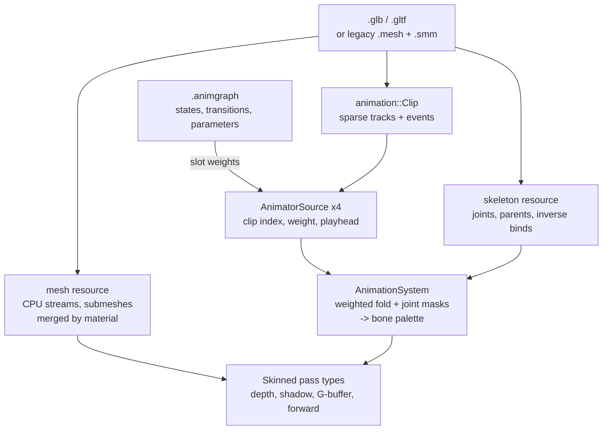

# Meshes and Animation

A mesh stack and an animation stack were built from nothing over the summer of
2026. A model loads from glTF or from a legacy XML format, renders as one entity
with many drawable items, and can carry a skeleton, animation clips, joint masks
and a state machine authored as an asset. Skinning runs in the vertex shader on
every pass that draws the model, with a compute path behind a switch.

This page walks the data path from file to posed pixel, and states what the
system has and has not been exercised on.

---

## One mesh resource, many formats

A mesh needs no per-backend implementation, because a vertex buffer is a vertex
buffer. What varies is the file format, and that is what the resource-provider
pattern already abstracts:

```cpp
// Include/Meshes/Mesh.h
// Unlike a texture, a mesh needs no per-backend implementation - a vertex
// buffer is a vertex buffer - so there is deliberately NO IMesh interface and no
// D3D12 / Vk leaf.  What varies is the FILE FORMAT, and that is exactly what the
// resource-provider pattern abstracts: one provider per format (glTF primary,
// legacy Instinct XML, a predefined error-box fallback), selected by priority and
// extension probing, all riding core::resources::Resources<> for async load,
// name-coalesced dedup, refcounted caching and search paths - the same machinery
// texture:: uses.
```

Three providers are registered: glTF first, the legacy Instinct XML reader
second, and a predefined error-box that always succeeds. The error box is the
same idea as the checkerboard texture a bad material name gets. A mesh that fails
to load is visible in the viewport rather than absent from it.

The resource holds the mesh in CPU memory as separate streams plus one index
array, and it keeps them after upload. The selection narrow phase needs positions
and indices, and baking a second vertex layout from the same mesh needs all of
them. Freeing the data would trade memory for a re-parse.

**A submesh is a material group, not the file's own split.** The legacy exporter
emitted one submesh per 3ds Max object, which fans out badly: the worst case in
the corpus is 623 submeshes over 27 distinct materials. Providers merge by
material before creating the resource, so the submesh count is the draw count,
and that terrain model is about 27 draws.

---

## One entity, many drawable items

A model with 27 material groups used to spawn 27 surfaces with minted keys, and
every consumer that cared about "which entity is this surface part of" needed a
resolver to walk back. Selection, the gizmo, the property grid and the cull each
had one.

The model is now one entity key carrying N drawable items. The brush editor's
producer works the same way, so a [brush](BrushEditing.md) emits N surface items
on its own key with one shared face record.

When the last consumer moved over, all three resolvers turned out to be exact
identity functions, because both producers write the owner's own key as the
surface key. They were deleted rather than kept, and so were both consumers'
deduplication passes, which existed only to collapse an owner's N surfaces back
into one.

---

## Getting content in: the converter

The corpus is legacy `.mesh` XML with a `.smm` material sidecar. A converter
promotes it to glTF, and the numbers are worth quoting exactly because the first
estimate was wrong by a factor of two.

| Measure | Result |
|---------|--------|
| Corpus files converted | 338 of 339 |
| Total size | 231.6 MB to 55.9 MB |
| Reduction | 4.14x overall, median 3.70x per file |
| Spec problems, independent validator | 0 |

The original estimate was 10x. What actually goes is the XML verbosity; the
vertex data is uncompressed float32 on both sides, so mesh quantisation is the
next lever rather than the container.

**The methodology finding matters more than the number.** Two writer defects
reached a green test suite and were caught only by running the converter on real
assets and having a non-engine reader check the output:

- The legacy exporter ships literal `(-1, -1, 1)` tangent placeholders, length
  1.73, which glTF forbids.
- Some tangents are about 1.8e-24, whose square underflows float32. They cannot
  be normalized, and passing them through would have made every emitted file a
  NaN generator for any consumer that normalized in single precision.

Neither is visible in a round trip through the engine's own reader, because the
engine's reader makes the same assumptions the writer does.

---

## Skeletons, clips and the pose

A skeleton is its own resource: joints, the parent chain, a decomposed bind pose,
and inverse binds taken from the file's skin or derived when it has none. A clip
is sparse per-channel tracks with per-channel interpolation, bound to joints by
name, with the source file's event track carried through verbatim.

A model's pose is a weighted fold over up to four animation sources:

```cpp
// Include/Animation/AnimationScene.h
struct AnimatorSource
{
    ceili::graphics::animation::ClipIndex clipIndex CE_HIDE CE_NOSERIALIZE;

    // RELATIVE.  Nothing normalises on write - the fold divides by its running total - so a
    // caller drives two weights for a crossfade and never has to make them sum to one.
    //
    // <= 0 both SILENCES the source and FREEZES its playhead, which is what lets a controller
    // park an idle clip mid-cycle and resume it where it left off.
    float weight CE_HIDE CE_NOSERIALIZE = 0.0f;

    // Seconds into THIS source's clip.  Per source and not per model, which is the whole reason
    // the span exists: a crossfade's OUTGOING clip has to keep running while it fades out.
    ceili::graphics::animation::TimePoint playhead CE_HIDE CE_NOSERIALIZE{0.0f};
```

The four slots are reserved when the entity spawns, so the per-frame path only
writes item contents. No structural change means the animation system stays
eligible to run on a worker thread. See
[Core's scheduler](Core.md#tasks-threading-and-the-fixed-tick-clock) for why that
distinction decides where a system runs.

The slots live on a `graphics/animatedMesh` template rather than on
`graphics/mesh`, and that is the whole reason the second template exists: boids
and static props derive `graphics/mesh` in their thousands and must not each
carry four idle slots.

Every field is runtime state, hidden from the property grid and skipped by every
serializer. A save that captured a mid-crossfade weight would reload a character
stuck between two clips. What serializes is the clip name on the animator row,
which is what a designer edits.

### Joint masks

An additive layer that should reach the upper body and leave the legs alone needs
per-joint weights. Those are an authored asset:

```cpp
// Include/Animation/JointMask.h
// A NAMED SET OF PER-JOINT WEIGHTS - what an animation source's contribution is scaled by, per
// joint, so an aim layer reaches the upper body and leaves the legs alone (AN4.5).
//
// A named authored resource rather than something derived from the skeleton, and that is the
// user's explicit call: a mask is content, an artist tunes it, and the alternative - "root joint
// plus a feather depth", derived from the hierarchy - can only ever express a subtree.
```

A file names a handful of joints. The fold indexes by joint index, so the sparse
list resolves into a dense per-joint array once per mask-and-skeleton pair and is
cached.

---

## The state machine is an asset

Until this landed, code drove every weight. The legacy engine did the same: its
soldier's whole ten-clip graph was hand-written C++, and its third-person
controller crossfaded three locomotion states through a literal 3x3 transition
matrix.

A graph is now a Lua-authored asset. Here is a real one, trimmed to its shape:

```lua
-- Pkg/Example/Resources/AnimGraphs/soldier.animgraph
AG.create("soldier/locomotion", {
    entry = "idle",
    parameters = {
        { name = "speed", default = 0.0 },
        { name = "fire",  default = 0.0 },
    },
    states = {
        { name = "idle", clip = "idleanim" },
        { name = "walk", clip = "soldierwalk" },
        { name = "run",  clip = "soldierrun", speed = 1.6 },
        { name = "fire", clip = "firinganim", loop = false },
    },
    transitions = {
        { to = "fire", duration = 0.1, conditions = {
            { param = "fire", op = ">", value = 0.5 },
        } },
        { from = "fire", to = "idle", duration = 0.2, exit = 0.95 },
```

Four decisions in that file are worth naming.

**The machine's whole output is a pair of slot weights.** It drives the same
`SetAnimatorSourceWeight` API a controller would, so the fold, the pose compose
and the bone palette did not change at all to accommodate it. That is why the
graph is an asset rather than a system.

**A graph declares its parameters.** A condition stores an index, so a typo is a
load-time failure rather than a transition that silently never fires.
`EndGraph` is the one validation point: an unresolvable state or parameter name
fails the whole graph, which then stays invisible rather than half-usable.

**Transition order is priority**, first match wins. The fire reaction is written
first because it has to interrupt locomotion. Conditions in one transition are
ANDed, and OR is spelled as a second transition to the same target rather than as
an operator.

**A transition with no condition can fire on exit time.** The one-shot fire state
leaves at 95 percent of its clip's duration, expressed as a fraction so the graph
does not need to know how long any particular rig's clip is.

### Events

Clips carry the source file's event track. The engine does not keep a list of
fired events. Each source records the interval its last advance swept, as a
previous playhead and an advance, and a query returns the events that interval
crossed.

Recording the interval has three consequences. There is no ceiling on events per
frame, so no buffer to reserve. The interval is half-open, closed where the
playhead was and open where it lands, so an event on a boundary fires once. And
the advance is clamped to one clip duration, so a frame-time spike cannot
multiply a gameplay event the way a per-wrap gather would.

### Root motion

A clip's root channel can drive the entity instead of the pose. The engine zeroes
the root's contribution to the pose and drains the displacement to a query the
game reads.

The corpus had no root-motion content at all: both rigged assets, eleven clips,
not one root channel. So the test content is synthesized and reproducible from
its generator, and the soldier's walk and run were upgraded by additive channel
surgery.

The stride measurement that work started from was inverted, and the correction is
the interesting part. The estimator used `max(-dz/dt)`, which cannot determine a
sign, because both that and `max(+dz/dt)` are positive on a walk cycle. It locks
onto the swing foot and assumes the answer. Three independent lines agree the
soldier faces and travels +Z in model space: the toes lead the ankle by 0.155,
the head leads the pelvis by 0.114, and the lower foot drifts that way. Under the
old sign a root-motion soldier moonwalks.

<!-- MEDIA: a short clip of the soldier in Play mode, turning, walking, breaking
     into a run and firing, with the animgraph document open beside it showing
     the state that is active. The asset-drives-behaviour point needs motion. -->

---

## Skinning

A skinned vertex's four influences index a per-model bone palette, which is
`inverseBind[j] * animModel[j]` for each joint, written by the animation system
into a data table on the model's key. The palette rides in the same vertex-stage
structured buffer the instance transforms use, and there is no conflict: a
skinned batch is a singleton, so it draws with an instance count of one and needs
no instance transforms.

Skinning needs a pass type at every stage that draws the model. Missing one is a
visible defect rather than a lost optimisation:

```cpp
// Include/Graphics.h
// SKINNED sibling of kDepthPrePass: the VS blends the vertex by the bone palette before
// applying worldViewProj.  NOT optional, and for the same reason kClusteredForwardInstanced
// is not: the prepass and the forward pass must write and test the SAME position.  Skinning
// only the lit pass leaves the prepass writing the BIND pose, so the animated body fails the
// readNearerEq test against its own stale depth and disappears into it.
constexpr Type kDepthPrePassSkinned   = PriorityFourCC<Type>(priority::kDepth, 'D', 'P', 'R', 'S');
```

Skinned siblings exist for the depth prepass, the directional forward pass, the
clustered forward pass, the deferred G-buffer pass and the
[shadow bake](Shadows.md). Per-group skinning is what stops a rigidly attached
prop being transformed twice: a rocket launcher attached to a hand follows its
joint through the drawable item's local transform, while the body skins.

### The copy that cost more than the work

The first measured baseline was 400 skinned batches of 402, 17,600 bone matrices,
and zero batches missing a palette. The zero is the load-bearing figure: every
skinned batch got its palette, and none silently fell back to the unskinned pass.

Then the frame cost was measured, and it was not where anyone was looking. On an
8.2 ms frame, `Draw.GatherBonePalette` took 3.7 ms while the entire animation
system took 0.84 ms. The palette build was cheap; the palette copy was 4.4 times
the whole animation system.

The fix read the whole run in one call instead of 44 per-item reads, and resolved
the table once per walk instead of once per batch:

| Measure | Before | After |
|---------|--------|-------|
| `Draw.GatherBonePalette` | 3.73 ms | 0.42 ms |
| Frame | 8.2 ms | 4.7 ms |
| Design mode | 15.1 ms | 6.9 ms |

The batch split was unchanged, so nothing about what was drawn moved. A later
pass deleted the copy entirely rather than making it faster: the batch records a
palette count, and the upload reads the table run directly.

### Compute skinning

Vertex-shader skinning re-poses every vertex once per pass that draws the model.
A model in a lit, shadowed scene is posed for each shadow cascade, the depth
prepass, the IBL prepass and the forward pass. A compute path poses it once:

```cpp
// Include/Skinning/PosedBuffers.h
// One POSED vertex buffer per skinned model INSTANCE, written once a frame by a compute pass and
// read by every drawing pass afterwards.  That view-independence is the whole point: today a
// skinned vertex is re-posed in the vertex shader once per PASS - each shadow cascade, the depth
// prepass, the IBL prepass, the forward pass - and this poses it once for all of them.
```

It is off by default, because vertex-shader skinning is the path with the
coverage. The setting's own description states the honest expectation: the image
must be identical either way, and on a CPU-bound scene the frame rate correctly
does not move. Watch the per-pass GPU rows instead.

Both the posed buffers and the bone palettes are per scene. When they were one
cache for the whole process, two scenes rendering in the same frame posed each
other's models, and a smoke test now holds that fixed.

---

## The data path



---

## Honest limits

- **One real rigged asset carries the coverage.** The whole system has been
  exercised end to end on a single ported character. The rest of the ported
  content carries no animations at all: 124 converted models in one package, none
  animated.
- **Only 1 of the corpus's 39 authored game events has ever reached the engine**,
  for the same reason.
- **Root-motion test content is synthesized.** No source clip in the corpus has a
  root channel.
- **A state names one clip.** A crossfade uses two of the four source slots,
  which leaves two for additive layers. A 1D blend space inside a state would
  need all four, so it waits on a blend-tree node.
- **Compute skinning is off by default**, with vertex-shader skinning as the
  covered path.
- **No mesh quantisation.** Vertex data is uncompressed float32 through the
  converter and at runtime.

Next: [Shadows](Shadows.md) for the skinned bake these models cast through,
[Rendering](Rendering.md) for the pass and batch machinery, or
[Brush Editing](BrushEditing.md) for the other producer of many drawable items on
one key. Back to the [documentation index](README.md).
