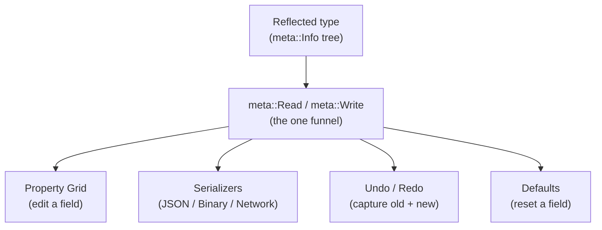
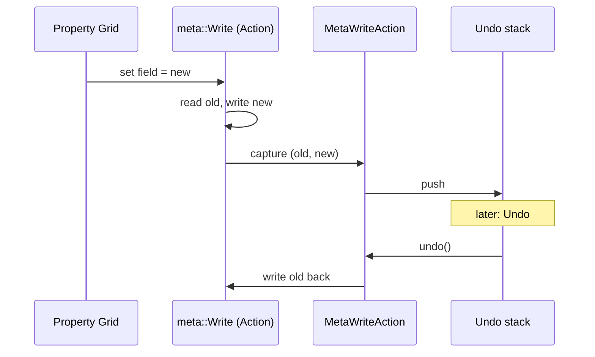

# Metadata & Reflection

This is the milestone that ties the engine together. On its own, reflection
(knowing a type's fields at runtime) is unremarkable. What makes it the spine of
the editor is a single design rule, stated in the engine's own notes: **keep the
`Read()` and `Write()` code paths to a minimum, and funnel everything through
them.** One metadata tree, walked by one funnel, drives the property grid, every
serializer, and undo/redo. Add a field to a struct and it becomes editable,
saveable, networkable, and undoable, with no extra code.

This page shows how that funnel is built and how four features fall out of it.

---

## The metadata tree

Every reflected type has a tree of `meta::Info` nodes, one per field. An `Info` is
a compact descriptor: a name, a size and offset into the instance, a type, a hash,
links to parent and child nodes, flags, and an optional annotation.

```cpp
// Meta.h
struct Info
{
    char        name[kMaxNameLen + 1] = {};
    Size        size                  = 0;
    union { Size offset = 0; Size enumValue; };
    data::Key   count;                 // element count / nesting depth for containers
    types::Meta type     = types::Meta::None;
    Hash        typeHash = 0;
    Entry       entry, parent, children;   // tree links
    Flags       flags    = Flags::None;
    char        annotation[kMaxAnnotationLen + 1] = {};
    IContainer* pContainer = nullptr;  // container vtable, if this field is one
};
```

A type registers its fields once, at startup. The registration is *generated*
from the header by the script generator (see [Script Generation](ScriptGeneration.md)),
so you never hand-write it. Conceptually it is one `Create` per member:

```cpp
const auto root = Create<WriteActionParams>();
Create(root, &WriteActionParams::pInstance, "pInstance", {}, Flags::None);
// ... one line per field, emitted by the generator ...
```

The flags are where a lot of the power hides, because the *same* flag mechanism
controls the editor and the serializer at once:

```cpp
// Meta.h
enum class Flags : uint8_t
{
    NoSerialize = 1u << 0, // reflected, but the serializer skips it
    ReadOnly    = 1u << 2, // shown in the grid, not editable
    Hide        = 1u << 3, // reflected, but the grid skips it
    Enum        = 1u << 4,
    HasDefault  = 1u << 5,
    Bitfield    = 1u << 7,
};
```

You set these declaratively in the header with attributes the generator parses,
and the runtime-only fields of a scene struct carry both at once, so save-load and
the property grid can never disturb them:

```cpp
// Surface.h -- a live handle: hidden from the grid AND skipped by the serializer.
material::Handle hMaterial CE_HIDE CE_NOSERIALIZE;
```
```cpp
// Range and description annotations drive the grid's slider bounds and tooltip.
#define CE_RANGE(Min, Max)            Attribute(Range:Min,Max)
#define CE_RANGE_DESC(Min, Max, Text) Attribute(Range:Min,Max;Description:Text)
```

The one primitive everything else is built on is child iteration:
`GetInfoSpan(node.children)` returns a field's members, and recursing it walks any
type to any depth.

```cpp
// Meta.h
using InfoSpan = Span<const Info, DynamicExtent, Size>;
CE_API InfoSpan GetInfoSpan(const Entry Entry);
```

---

## The funnel: one Read, one Write

Every field access in the engine routes through two functions. Not "should"
route: *does*. The property grid, the serializers, the defaults system, and undo
all call these and nothing else to touch a field:

```cpp
// Meta.h -- the single choke point.
CE_API Result Write(void* pInstance, const Info& MemberInfo, const void* pValue,
                    const Hash ValueTypeHash, const Size ValueCount, const Size ValueSize,
                    const SizeSpan MemberValueIndex = {}, const WriteFlags Flags = WriteFlags::None);

CE_API const void* Read(const void* pInstance, const Info& MemberInfo, const Hash ValueTypeHash,
                        const SizeSpan MemberValueIndex = {}, Size* pValueCount = nullptr,
                        Size* pValueSize = nullptr, const ReadFlags Flags = ReadFlags::None);
```



Because there is exactly one way in and one way out of a field, a behaviour added
at the funnel is a behaviour every feature gets for free. Undo, below, is the
clearest example: it is a flag on `Write`, not a subsystem.

---

## The property grid builds itself

The property grid is not configured. It walks the metadata tree and renders a
widget per field, recursing into composites. There is no separate editor schema to
keep in sync with the data, because the data *is* the schema.

```cpp
// PropertiesGrid.cpp -- dispatch a widget off the field's type bits.
meta::Flags Input(const meta::Info* pInfo, const Type& Type, const uint8_t* pData,
                  const Delegate* pTypeDelegate)
{
    meta::Flags flags = pInfo->flags;
    if (pTypeDelegate)                                   flags |= (*pTypeDelegate)(pInfo->typeHash, pData, *pInfo);
    else if (HasBitfield(pInfo->type, types::Meta::Bool))  { /* checkbox */ }
    else if (HasBitfield(pInfo->type, types::Meta::Float)) { /* float drag  */ }
    // ... one branch per primitive type ...
}
```

The annotations from the header show up here: a `CE_RANGE` becomes the slider
bounds, a description becomes the tooltip. Enum fields resolve their options and
current label through `meta::GetEnumName`. `Hide` fields are skipped;
`ReadOnly` fields render disabled. And a field's delegate can read its *siblings*
through `meta::GetParentInstance` (walk back from a member pointer to its parent
sub-object), which is how one field can grey out another, for example disabling an
HDRI-name combo unless a sibling `source` field is set to `Hdri`:

```cpp
// Meta.h
CE_API const void* GetParentInstance(const void* pInstance, const Info& MemberInfo);
```

<!-- MEDIA: a screenshot of the Studio PropertyGrid inspecting a rich object (a
     material or a light), showing sliders with ranges, an enum dropdown, and a
     greyed-out conditional field. This is the "no glue code did this" money shot. -->

This is where Ceili diverges from engines that carry a separate UI schema or a
hand-written inspector per type. Here the grid is a few hundred lines that work
for *every* reflected type, forever, including types that do not exist yet.

---

## Serializers: one walk, many formats

Saving and loading also route through the metadata tree. A single base class owns
the tree walk; each format is a small set of overridden hooks. From the package's
own design note: a shared base "owns the single meta-tree walk. Backends inherit
from this and override the protected hooks."

```cpp
// SerializerBase.h -- the one traversal; backends only override the hooks.
core::Result walkChildren (const void* pInstance, const meta::Info& ParentInfo);
core::Result walkMember   (const void* pInstance, const meta::Info& MemberInfo);
core::Result walkContainer(const void* pContainerInst, const meta::Info& ContainerInfo);
// hooks: beginObject/endObject, beginArray/endArray, writeLeaf/readLeaf
```

The public interface is one `serialize` / `deserialize` pair, and the facade
`Read` / `Write` takes the type and a format id, dispatching to the chosen
backend:

```cpp
// Serializer.h
struct ISerializer : core::component::IComponent
{
    virtual Result serialize  (IByteStream&, const void* pInstance, const Hash TypeHash) = 0;
    virtual Result deserialize(IByteStream&,       void* pInstance, const Hash TypeHash) = 0;
};

constexpr Format kJson = core::FourCC<Format>('J', 'S', 'O', 'N');
constexpr Format kBin  = core::FourCC<Format>('B', 'I', 'N', ' ');
constexpr Format kNet  = core::FourCC<Format>('N', 'E', 'T', ' ');
```

Three backends sit on that one walk, each suited to a job:

- **JSON** is the human-readable text format for scenes and templates. Its leaf
  printers/parsers are a hash-keyed registry, "the JSON equivalent of
  `meta::RegisterToString`."
- **Binary** is the compact format for fast load.
- **Network** is a bit-packed, quantizing wire format that "reuses the same
  `SerializerBase` meta walk."

What lets one walk serve all three is the **leaf gate**: composites that are
logically primitives (a `Vec2`, an enum, a string) are stamped as single leaves
rather than recursed, so each backend decides how to emit a leaf and the structure
above it is shared.

```cpp
// Serializer.h -- IsLeafType keeps Vec2/enum/string as one value, not a sub-tree.
```

The result is that a new field serializes to JSON, binary, and the wire the moment
it is reflected, and a new *format* is a class of hook overrides, not a rewrite.
That is the opposite of the common engine pattern, where each format is its own
hand-maintained code path drifting quietly out of sync with the others.

---

## Undo/redo is the funnel watching itself

Here is the payoff. Undo/redo is **not** a separate system that has to be taught
about every editable field. It is a flag on `meta::Write`.

When a write is tagged `WriteFlags::Action`, the funnel reads the old value first,
performs the real (un-flagged) write, and fires a delegate carrying both the old
and new bytes:

```cpp
// Meta.cpp -- change capture lives inside Write itself.
if (HasBitfield(WriteFlags, WriteFlags::Action) && g_.WriteActionDelegate.hasDelegate())
{
    const void* p_old = Read(pInstance, MemberInfo, ValueTypeHash, MemberValueIndex, ...);
    MemCpy(old_value_buffer, p_old, ...);
    Write(/* ... */, stripped_flags);         // the real write, Action bit removed
    WriteActionParams params{ .pOldValue = old_value_buffer, .pNewValue = pValue };
    g_.WriteActionDelegate(params);
}
```

That delegate turns each captured change into an `IAction` and pushes it onto the
undo stack. An action is a tiny interface, and the stacks are two arrays:

```cpp
// Action.h
struct IAction : component::IComponent
{
    virtual Result   run()  = 0;
    virtual Result   undo() = 0;
    virtual ConstStr getDescription() const = 0;
};
```

The concrete `MetaWriteAction` stores the old and new bytes and reverts by writing
the old ones back, again through the same funnel:

```cpp
// MetaWriteAction.cpp
Result undo() override
{
    return core::meta::Write(m_pInstance, *p_member_info, m_OldValue.data(),
                             m_ValueTypeHash, m_OldValueCount, m_ValueSize, idx, m_WriteFlags);
}
```

It even builds its human-readable label ("Roughness: 0.30 to 0.45") by walking the
parent chain and stringifying through `meta::ToString` and `meta::GetEnumName`:
the same metadata, a fourth time. Container edits (insert, erase, clear) undo
through a parallel path backed by the container's capture/restore vtable.



No editable field ever has to opt into undo. If it goes through the property grid,
it goes through `Write`, so it is undoable. That is the whole design in one
sentence.

---

## The wire, and the "what changed?" seam

Per-instance serialization covers save, load, and undo. Live networking needs one
more thing: deltas. The scene snapshot layer captures a database's table rows and
can emit either a full snapshot or a delta against a baseline, and, crucially, the
delta stream is the *same wire format* as a full snapshot, so applying a delta and
restoring a snapshot are the same operation:

```cpp
// Snapshot.h -- "With PCodecs == nullptr this is exactly Restore."
CE_API Result Restore   (const data::DatabaseId, IByteStream& In);
CE_API Result ApplyDelta(const data::DatabaseId, IByteStream& In, const RowCodecTable* PCodecs = nullptr);
```

This is the row-level counterpart to [Core's dirty tracking](Core.md#data-the-table-store-the-engine-is-made-of):
mutations mark rows dirty, the snapshot layer drains them, quantizes per-table via
row codecs, and ships the delta. The same "what changed?" question that powers
undo powers replication, which is exactly why one field-level change-capture layer
can feed both networked multiplayer and live collaborative editing, the promise
made back in [Philosophy](Philosophy.md).

---

## Why this is the keystone

Count the features that share one metadata tree and one Read/Write funnel:

- The **property grid** renders any reflected type with no per-type code.
- **Serialization** to JSON, binary, and the wire is one walk with pluggable leaf
  hooks.
- **Undo/redo** is a flag on `Write`, not a subsystem.
- **Defaults**, **stringification**, and **network delta** all read the same tree.

Adding a field to a struct lights up all of them at once. Most engines pay for
each of these separately: an inspector schema, a serialization code path, an undo
command per action, a replication descriptor. Collapsing them onto one funnel is
what makes the editor cheap to extend, and it is the clearest expression of the
engine's central bet that the runtime and the tools are one thing.

Next: [Component Architecture](Components.md), or back to the
[documentation index](README.md).
