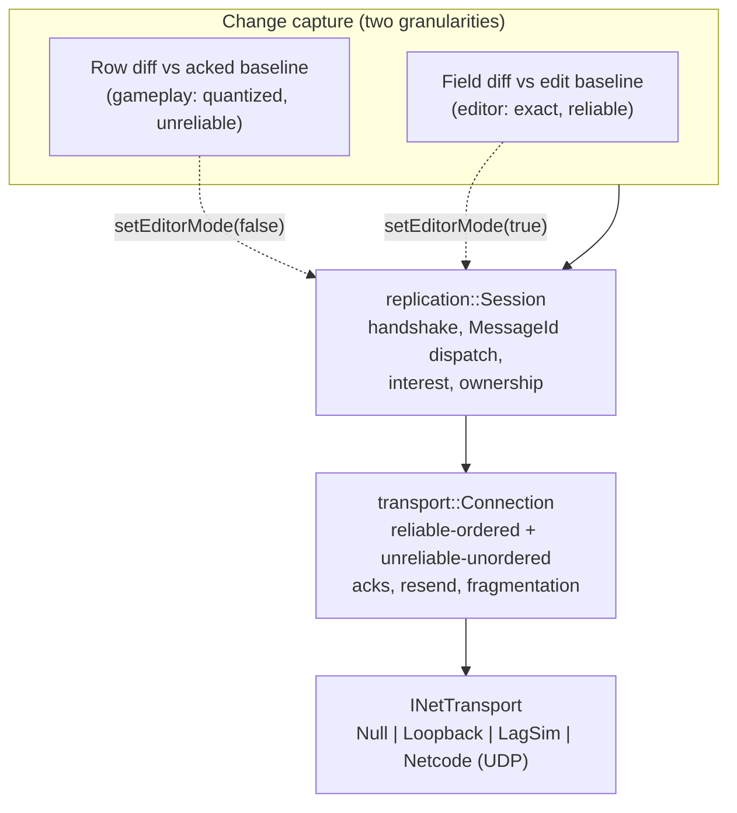
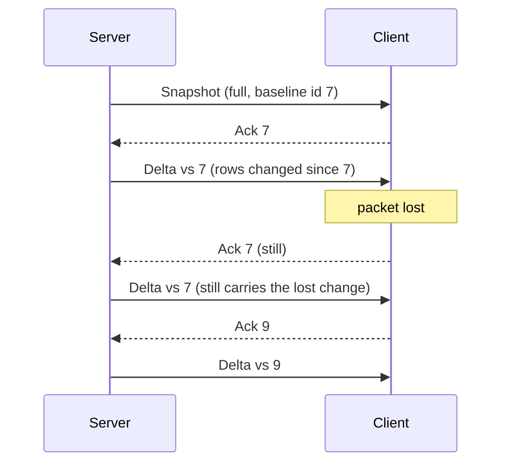

# Networking

Most engines ship two unrelated networking stories. There is a *multiplayer*
stack (transports, snapshots, interest management, prediction) owned by the
gameplay team, and there is a *collaborative editing* story (usually absent,
sometimes bolted on as a separate service with its own document model) owned by
the tools team. They share a marketing page and nothing else.

Ceili has one. The same `replication::Session` object, over the same channel,
framing messages the same way, serves both. A boolean flips which of two change
sources feeds it:

```cpp
// Replication.h: the fork, in one call.
CE_API void setEditorMode(const bool Enabled);
```

That is possible because both consumers are asking the same question of the same
data. "What changed on this entity?" is answered by walking the metadata tree
described in [Metadata & Reflection](Metadata.md), over rows in the table store
described in [Core](Core.md). Gameplay replication and editor collaboration are
two diff granularities over one reflected data model, not two codebases.

This page is the honest version of that claim, including where the two paths
genuinely differ.

---

## The stack, four layers



Roughly 12,600 lines sit under `Pkg/Engine/Network`, and 5,853 of those are
tests. The implementation-to-test ratio is close to 1:1, which for a subsystem
whose failure mode is "works on my machine, desyncs on yours" is the only
sustainable way to build.

---

## Layer 1: transport

`INetTransport` is deliberately small. It moves opaque datagrams and reports
connection events. It knows nothing about reliability, ordering, entities, or
ticks:

```cpp
// Transport.h
struct INetTransport : core::component::IComponent
{
    virtual core::ConstStr getName() const = 0;
    virtual core::Result send(const ConnectionId Connection, const void* pData, const uint32_t Size) = 0;
    virtual bool poll(Event& OutEvent) = 0;
    virtual core::Result listen(const ServerConfig& /*Config*/) { return core::results::failure::NotImplementated; }
    virtual core::Result connect(const ClientConfig& /*Config*/) { return core::results::failure::NotImplementated; }
```

Four backends implement it, selected at runtime through the generic-CID alias
pattern described in [Component Architecture](Components.md):

| Backend | Package | Purpose |
|---------|---------|---------|
| `NetTransportNull` | Network | Headless no-op, so tests and tools link without a socket. |
| `NetTransportLoopback` | Network | In-process paired endpoints, with seeded drop and reorder simulation. |
| `NetTransportLagSim` | Network | A decorator wrapping any backend with latency, jitter, and loss. |
| `NetTransportNetcode` | NetworkNetcode | Real, encrypted UDP (netcode + libsodium). |

The important consequence is that the entire stack above the transport is
testable in-process, deterministically, with seeded packet loss. A test can
drop every third packet and assert convergence without touching a socket or a
clock. `NetTransportNetcode` living in a *sibling* package (reached only through
the generic CID) also keeps the vendored crypto dependency out of the Network
package entirely.

Note the `LagSim` decorator is a first-class backend rather than a debug flag.
Wrapping the real UDP backend in 120 ms of jitter is a configuration change, so
"how does this feel on a bad connection?" is a question you can answer at your
desk.

---

## Layer 2: the channel

`transport::Connection` multiplexes two delivery guarantees over raw datagrams.
The wire header is three bytes:

```cpp
// Channel.cpp
enum class PacketKind : uint8_t
{
    Unreliable   = 0, // [u8 kind][u16 seq][payload]
    ReliableData = 1, // [u8 kind][u16 messageId][payload]
    ReliableAck  = 2, // [u8 kind][u16 messageId]
};
...
constexpr uint32_t kHeaderBytes = 3; // kind (1) + seq / messageId (2)
```

Unreliable traffic is sequence-stamped and drops anything stale or duplicated; it
never buffers, because a late position update is worthless. Reliable traffic runs
a 256-slot ack and resend window with in-order delivery and fragmentation for
anything over the 1200-byte safe UDP payload (up to 255 fragments per message).

The detail worth copying: **time is injected, never read.**

```cpp
// Replication.h / Transport.h: every tick-driven call takes the tick.
void update(const NetTick Tick);
```

`NetTick` is a strong type ([Core](Core.md#strong-types-and-handles)) supplied by
the caller. Nothing in the channel calls a clock. Retransmit timing, timeout
detection, and interpolation windows are all functions of a value the test
controls, so "does the reliable channel recover from a 12-packet burst loss?" is
a unit test that runs in microseconds and never flakes. The engine minted four
distinct network tick domains as separate strong types precisely so a sim tick
and a transport tick cannot be swapped by accident.

---

## Layer 3: the session, and messages that register themselves

Above the channel, `replication::Session` runs a handshake
(`Hello` / `Welcome` / `Reject`, gated on protocol version), then pumps once per
tick: drain received messages, dispatch them, and, if it is a server in Play
mode, emit a state delta.

```cpp
// Session.cpp
void Session::update(const NetTick Tick)
{
    if (m_pConn == nullptr) { return; }
    transport::Connection& conn = *m_pConn;
    m_Link.lastTick             = Tick;
    conn.update(Tick);

    transport::ChannelKind ch;
    const uint8_t*         p_data = nullptr;
    uint32_t               size   = 0;
    while (conn.receive(ch, p_data, size))
    {
        PacketStream    in(p_data, size);
        const MessageId id = ReadMessageId(in);
        dispatchMessage(id, in, Tick);
    }
```

Every payload is framed by a 4-byte `MessageId`, and this is where the metadata
system pays off again: **a message's id is its type hash.**

```cpp
// Messages.h
struct Message
{
    MessageId messageId CE_NOSERIALIZE;

    core::Result encode(serialize::IByteStream& Out) const { return serialize::wire::EncodeMetaBody(Out, this, messageId.get()); }
    core::Result decode(serialize::IByteStream& In) { return serialize::wire::DecodeMetaBody(this, In, messageId.get()); }
};
```

`MakeMessageId<T>()` is `meta::TypeHash<T>()`, the compile-time hash of the
type's own name. Dispatch is a registry lookup, not a switch statement, and a new
message type needs no central enum, no registration list, and no coordination.
The engine declares 14 message types in `Messages.h`; game and example code
declares 9 more (`game::InputMsg`, `example::net::FireIntentMsg`,
`example::boids::ChecksumMsg`, and so on) entirely outside the Network package.
A downstream game can mint its own without touching engine code, the same
open-registry property that [FourCC ids](Core.md#extending-without-a-central-enum-fourcc-ids)
give render passes and serializer formats.

The body of a flat message is encoded by `SerializerNetwork`, the bit-packed
quantizing backend of the one metadata walk. Adding a field to a message struct
puts it on the wire; there is no parallel wire-format declaration to keep in sync.

---

## Precision is a property of the field

The single best illustration of the "one data model" thesis is how the wire
learns what precision to use. It is not configured in the network layer. It is
authored on the field, as metadata, next to the field:

```cpp
// Transform.h: the wire precision of a transform, declared where the transform is.
Vec4 position CE_NET_QUANTIZE_BITS(-4096, 4096, 21) = {0.0f, 0.0f, 0.0f, 1.0f};
Quat rotation CE_NET_QUAT(10)                       = {};
```

When a session is told which tables to replicate and is given no explicit codec
table, it derives one by reflecting over those annotations:

```cpp
// Session.cpp
    else
    {
        // No explicit codecs: DERIVE quantization from the replicated types' CE_NET_* annotations (D4 --
        // precision flows into the wire automatically via reflection).
        m_AutoCodecs.build(Tables);
        m_Link.pCodecs = m_AutoCodecs.empty() ? nullptr : &m_AutoCodecs.table();
    }
```

Compare this with the usual arrangement, where a replication descriptor lives
apart from the struct and drifts from it. Here the compression rule and the data
are the same declaration, so a field added to `Transform` cannot be forgotten by
the network layer, and a field whose range changes cannot silently keep an
obsolete quantization.

<!-- MEDIA: a side-by-side screenshot of the Transform struct in the header (with
     the CE_NET_QUANTIZE_BITS annotation visible) next to the Studio network
     metrics panel showing the resulting per-entity byte cost. The point: one
     line of metadata, one number on the wire. -->

---

## Path A: gameplay replication

The server captures a **baseline**: the raw (or quantized) bytes of every
replicated row at a given tick. Each delta is computed against the baseline the
client has most recently **acknowledged**, not against the previous frame:

```cpp
// Snapshot.cpp: a row is "changed" if its live bytes differ from the acked baseline.
bool IsRowChanged(const core::data::DatabaseId       DatabaseId,
                  const core::data::TableId          TableId,
                  const uint16_t                     Stride,
                  const core::data::Key              Key,
                  const Baseline&                    Against,
                  const RowCodec*                    PCodec,
                  core::Array<uint8_t, 0, uint32_t>& QuantScratch,
                  const void*&                       PLive,
                  uint32_t&                          LiveItems)
{
    core::data::Index count = 0;
    PLive                   = core::data::ReadRecordItems(DatabaseId, TableId, Key, &count);
    LiveItems               = (PLive != nullptr) ? static_cast<core::data::Index>(count) : 0u;

    uint32_t       base_len = 0;
    const uint8_t* p_base   = Against.findRow(TableId, Key, base_len);
```

That choice is what makes the unreliable channel safe. Nothing is explicitly
retransmitted: if a delta packet is lost, the client's ack does not advance, so
the very next delta is still computed against the older baseline and naturally
re-includes the missing change. Packet loss costs latency, never correctness, and
there is no reliability layer duplicating the one below it.



Three more mechanisms sit on that core:

**Interest scoping.** A server can set a per-connection key set, so a client
receives only what it can perceive. Selection is priority-ordered and
starvation-safe: a key that keeps losing the budget race ages until it wins, with
a `kMaxPriorityAge` of 1024 ticks capping the tail. The per-delta body budget
defaults to 1024 bytes, so a delta fits a datagram and the frame cost of
replication is bounded by configuration rather than by scene size.

**Send rate decoupled from sim rate.** `setSendInterval(N)` divides the sim tick
to get a snapshot rate (the code documents the target as roughly 64 Hz sim,
20-30 Hz snapshots). The simulation stays deterministic at its fixed tick while
the wire runs slower.

**Client-side smoothing.** An 8-sample interpolation buffer (about a 100 ms
window) renders remote entities between received states, while the *owned* entity
is excluded from interpolation and instead eased or snapped toward the server's
truth. That split is the network-facing half of the same interpolate-for-the-eye,
tick-for-correctness separation described in
[Rendering & Visibility](Rendering.md).

Full client prediction with re-simulation lives one layer up, in game code
(`PlayerNetSystem`), not in the Network package. The package supplies the
primitives it needs: the last input sequence the server processed, and the
reconcile-toward-authoritative call.

---

## Path B: collaborative editing

Now the same session, in editor mode. Per-tick state deltas are suppressed. When
a property grid commit or a gizmo drag completes, the editor walks the entity's
metadata and diffs field by field against the pre-edit buffer:

```cpp
// Studio/Scene.cpp: the editor's change capture, one field at a time.
for (const core::meta::Info& field : core::meta::GetInfoSpan(p_comp->children))
{
    if (core::HasBitfield(field.flags, core::meta::Flags::NoSerialize))
    {
        continue; // runtime state -- never crosses the wire (matches the serializer)
    }
    const uint32_t field_off = static_cast<uint32_t>(component.offset) + static_cast<uint32_t>(field.offset);
    ...
    const uint8_t* p_new = Staged.data() + field_off;
    const uint8_t* p_old = Baseline.data() + field_off;
    if (heap::MemCmp(p_new, p_old, field.size) == 0)
    {
        continue; // unchanged this commit
    }
    ...
    session.sendEdit(key, component.typeHash, field.name, p_new, field.typeHash, value_count, field.size, ...);
```

Two things in that fragment are worth pausing on. The `NoSerialize` skip is the
*same* flag the save-file serializer honours (see
[Metadata](Metadata.md#the-metadata-tree)), so a field marked as runtime-only is
excluded from save, from the property grid, and from the wire by one declaration.
And the message carries the field by **name and type hash**, not by offset, so
peers are not required to agree on struct layout, only on the reflected schema.

On the receiving peer, applying the edit is a call into the same funnel the
property grid uses:

```cpp
// Session.cpp: a remote edit lands through meta::Write, like every other edit.
core::meta::Write(p_row,
                  *p_field,
                  PValue,
                  core::Hash(ValueTypeHash),
                  static_cast<core::meta::Size>(ValueCount),
                  static_cast<core::meta::Size>(ValueSize),
                  /*Idx*/ {},
                  core::meta::WriteFlags::None);
```

That single line is most of the argument for the whole design. A remote peer's
edit is not a special case anywhere downstream: it is a `meta::Write`, so it
updates the row, refreshes the grid, and propagates to whatever else watches that
field, exactly as a local edit would.

Editor traffic goes reliable-ordered (an editor cannot tolerate a dropped
rename), batches into an `EditBatchMsg` when a commit touches many fields (capped
at 16,384 entries or 64 KB), and reports back-pressure as a `Result` rather than
silently dropping. Selection is broadcast too, up to 4,096 keys, which is how
peers see each other's highlighted objects.

For more than two participants the host is a **star relay**: one session per
peer, each received edit rebroadcast to every other peer, with the originator
suppressed:

```cpp
// Session.cpp
void Host::onPeerEdit(Session& Origin, const EditMessage& Msg)
{
    for (Session* const p_session : m_Sessions)
    {
        if (p_session != &Origin)
        {
            const core::Result relay_res = p_session->sendEdit(Msg.key,
                                                               Msg.componentTypeHash,
                                                               Msg.fieldName,
                                                               ...
```

Peers never relay to peers, so there is no loop to break and no message-id
deduplication to get wrong.

[](https://youtu.be/KSBlixbFRqg)

*Two Studio instances in one co-op session (click to watch): selections, gizmo
transform drags, and undo/redo replicate reliably in Design mode, then pressing
Play runs the deterministic boids simulation in lockstep on both peers. This is
the whole thesis of the page in under a minute: the same session object that
mirrors an editor edit is the one that keeps a live simulation in sync.*

---

## Where the two paths actually meet, and where they don't

The claim "one change-capture layer feeds both" is worth stating precisely,
because the interesting engineering is in the seam:

| | Gameplay replication | Collaborative editing |
|---|---|---|
| Diff granularity | Whole row, `MemCmp` against acked baseline | Single field, `MemCmp` against edit baseline |
| Trigger | Every N sim ticks | On commit (grid, gizmo, undo/redo) |
| Channel | Unreliable unordered | Reliable ordered |
| Precision | Quantized via `CE_NET_*` annotations | Exact bytes |
| Skips | Interest set, budget | `CE_NOSERIALIZE` fields |

**Shared:** the reflected metadata tree, the `CE_NOSERIALIZE` contract, the
table store the rows live in, the `MessageId` framing, the channel, the transport,
the session object, the handshake, the host relay, and the session manager.

**Not shared:** the two diff passes themselves. They are separate
implementations, deliberately, because they answer different questions. A
gameplay tick asks "what moved, cheaply, right now?" over thousands of rows,
where a whole-row `MemCmp` against a contiguous baseline is the fast answer. An
editor commit asks "exactly which field did the user change?" over one entity,
where per-field precision matters and cost does not.

This is the honest shape of the win, and it is still a large one. Nothing above
the diff is duplicated, the data model is the same, and turning on multiplayer
does not fork the editor's understanding of an entity. What an incumbent would
ship as two subsystems with two schemas is one subsystem with two entry points.

`SessionManager` makes the fork mechanical: it hangs off the scene's mode-change
hook, so every peer's mode follows the scene's:

```cpp
// SessionManager.cpp
const bool editor_collab = IsEditorCollab(cur_mode);
for (Peer* const p : entry.peers)
{
    p->session.setEditorMode(editor_collab);
}
```

Press Play in a collaborative session and every peer's session switches from
field edits to state deltas, in one place, with no per-feature plumbing.

---

## Scaling: one baseline, N peers

A detail that only shows up under load. Each peer needs deltas against *its own*
acked baseline, which naively means capturing one baseline per peer per tick. At
100,000 entities that capture is the frame.

The fix is that the baseline capture is per **scene**, not per peer: the session
manager captures once per tick into a shared ring, and each peer's session reads
whichever ring entry its ack points at.

```cpp
// Snapshot.h
class BaselineRing
{
public:
    explicit BaselineRing(const uint16_t Capacity = 3) { m_Entries.resize(Capacity); }

    CE_API core::Result push(const uint32_t                              Id,
                             const core::data::DatabaseId                DatabaseId,
                             const core::Span<const core::data::TableId> Tables,
                             const RowCodecTable*                        PCodecs = nullptr);

    CE_API const Baseline* find(const uint32_t Id) const;
```

Capture cost becomes O(rows) instead of O(rows x peers), and peers on different
acks cost nothing extra. The ring runs 16 deep in practice, which is how far a
lagging client is allowed to fall behind before it is caught up with a full
snapshot instead.

---

## Testing a thing that fails intermittently by nature

67 test cases live in the package, plus more in Studio for the editor consumer.
Because the transport is a component and time is a parameter, they are ordinary
deterministic unit tests, not integration runs. A sample of the names, which
double as a specification:

- `Channel_Reliable_DeliversExactlyOnceInOrderUnderLoss`
- `Channel_Reliable_MessageIdWrapsPast65535InOrder`
- `Channel_Independence_UnreliableDeliveredWhileReliableStalled`
- `Channel_Reliable_FragmentsAndReassemblesUnderLoss`
- `Channel_MalformedDatagramsAreIgnoredAndTrafficSurvives`
- `Replication_StateSync_ConvergesUnderLoss`
- `Replication_StateSync_QuantizedFromAnnotations`
- `Replication_InterestPriority_CountingSortMatchesComparatorAcrossStarvationCap`
- `Replication_Ownership_OwnedEntityAlwaysRelevant`
- `Replication_EditSync_PropertyEditConverges`
- `Replication_EditSync_LateJoinSnapshotCatchup`
- `Replication_Collab_HostRebroadcastsEditToAllPeers`
- `SessionManager_ThreePartyServerAcceptsBothClientsSyncsPlayAndRelaysEdits`
- `SessionManager_PlayRequestRunsSynchronizedCountdown`
- `Gizmo_Collab_UndoRedoBroadcastsReliableCommit`

Two of those encode real incidents rather than imagined ones. Reliable message
ids are 16 bits, so `MessageIdWrapsPast65535InOrder` guards a wrap that a long
session reaches naturally. And the client connect timeout was raised from the
library default of 5 seconds to 30 after a Studio breakpoint (or a long pipeline
compile) silently killed a live session: a debugger pause is not a disconnect.

---

## What is not there yet

Stated plainly, because a networking page that only lists wins is not useful:

- **No per-field mask on the gameplay wire.** A changed row is currently sent
  whole (quantized), not as a sub-row field mask. The mask is designed and
  outstanding.
- **Editor conflicts are last-writer-wins**, sequenced by the server. There is no
  operational transform or CRDT. Two people dragging the same object resolve to
  whoever the server heard last.
- **Tick sync is adopt-at-handshake**, not a drift-estimating clock. The client
  takes the server's tick on `Welcome` and follows.
- **Star topology only.** No peer-to-peer relay, no NAT traversal, no matchmaker.
  The secure backend's protocol id and key are a shared development pair, which is
  fine for a LAN or a test and is not a shipping arrangement.
- **No reconnect flow.** A dropped transport latches and warns; resuming means a
  fresh connect.

---

## Why this ends up cheap

Count the things that did not have to be built. There is no replication
descriptor language, because the fields are already reflected. No wire schema,
because a message id is a type hash and the body is the metadata walk. No
compression configuration, because precision is authored on the field. No
separate collaboration document model, because the editor edits the same rows the
game replicates. No per-message dispatch table, because dispatch is a hash lookup
against types that register themselves.

What is left is the part that is genuinely hard, and can then get the attention:
baselines and acks, interest and budgets, ordering guarantees, and the smoothing
that hides the wire from the player.

Next: [Studio](Studio.md), or back to the [documentation index](README.md).
