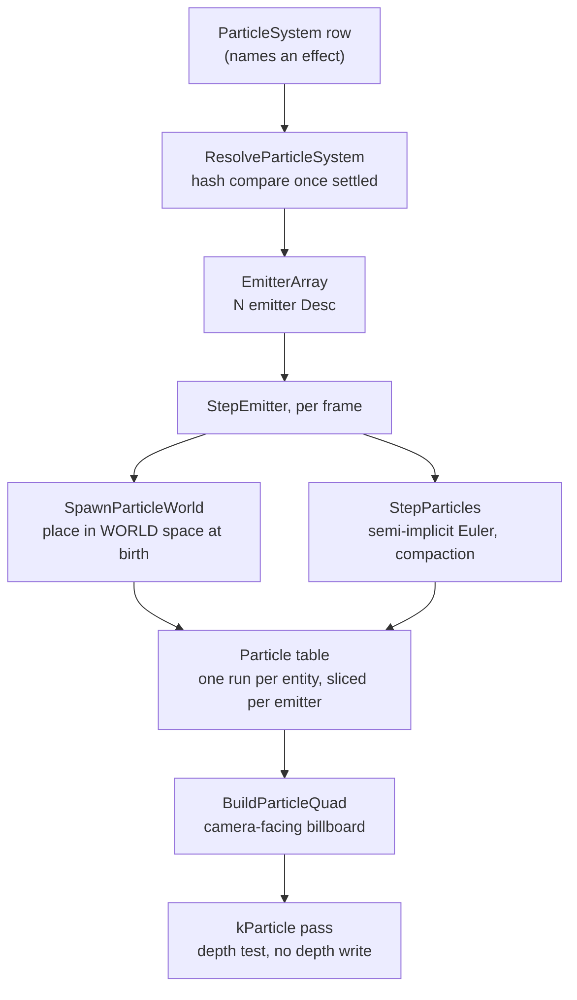

# Particles

A particle system in Ceili is an entity that spawns camera-facing billboards: a
fire, a spark shower, a dust cloud, a swinging swarm of motes. It is young. It
went in during the summer of 2026, and the code still reads as a first pass with
its scope written down where the reader can see it.

The subsystem does not have its own package. It lives inside
[Graphics](Rendering.md), because a particle is a thing that draws and its
whole cost is the draw. The simulation, the storage, and the billboard build all
sit under `Pkg/Engine/Graphics`.

One decision shapes everything else on this page: particles simulate in **world
space**. A particle is placed in the world once, at birth, and never moved into a
new frame after that. So an emitter that travels leaves its particles behind it,
and the exhaust of a moving rocket trails the rocket instead of riding along with
it. That choice sets how the storage works, what the renderer has to do, and
where the cost lands.

---

## The shape of a frame

An entity carries one `ParticleSystem` row. The row names an effect. The effect
resolves to an array of emitters, and each emitter owns a slice of one shared run
of live particles, keyed by the entity. Every frame does two things to that run:
it spawns new particles into world space, and it integrates the live ones.



The effect name is resolved every frame rather than once at insert. When the row has
settled the resolve is a single hash compare, and paying it each frame is what
lets an effect register after its row already landed, rather than never.

---

## Storage: a database table

An earlier version kept a bespoke heap store for particles: a per-scene slot
array, recycled-handle stamping, a scene destroy hook, about 150 lines. That is
gone. Particle storage is a plain table in the scene's own database, one that
holds many `Particle` items per entity key. The header states the change and the
reason:

```cpp
// ParticleSimulation.h
// The word "pool" is deliberately gone from this API. The row type IS Particle and the table is
// literally "ceili::graphics::particle::Particle", so "pool" was only ever an informal alias -- and
// once an entity carries N emitters, each owning a SLICE of one shared run, it became an actively
// wrong one. There is no pool per emitter.
//
// An entity's particles are a MULTI-ITEM RECORD in the scene's own database, keyed by the entity's
// key -- the BrushFace / BrushMaterial shape.
```

Two properties fall out of using the table store described in
[Core](Core.md#data-the-table-store-the-engine-is-made-of). The particles of a scene live in one
storage block, so each emitter's slice stays contiguous and reads back as a plain
array. And the table is scoped to the scene's memory arena, so destroying the
database drops the particles with it. There is no destroy hook to write and no
teardown path to get wrong.

A `Particle` is flat plain-old-data, chosen so the store can recycle a dead slot
by moving the last live particle over it:

```cpp
// ParticleSimulation.h
// Age is carried as `life` counting DOWN plus the `lifeSpan` it started with, rather than as
// a normalized 0-1 age, because the retirement test is then `life <= 0` -- exact at the
// boundary -- while normalized age stays a derived value (AgeFraction below).
struct Particle
{
    // WORLD space, both of them. Placed once at birth by SpawnParticleWorld and never
    // re-transformed, which is what leaves a moving emitter's particles behind it as a trail.
    math::Point3 position{0.0f, 0.0f, 0.0f};
    math::Point3 velocity{0.0f, 0.0f, 0.0f};
    float        life{0.0f};     // seconds remaining
    float        lifeSpan{0.0f}; // seconds this particle started with
```

Each emitter clamps its own live count to a hard ceiling of 4096
(`kMaxActiveParticlesLimit`), so a mis-authored spawn rate is bounded rather than
free to allocate. The default per-emitter ceiling is 64. The table starts at
8192 items, sized so a whole scene of emitters fits one block. A scene with no
emitter creates no table and pays nothing.

---

## World space is what makes a trail

A particle is born in the emitter's local frame, then transformed into world
space once and stored there. The spawn function carries the design note:

```cpp
// ParticleSimulation.h
// THIS IS WHAT MAKES A TRAIL. Particles are transformed ONCE, at birth, and then live in world
// space, so an emitter that moves LEAVES THEM BEHIND. Simulating in the emitter's local frame and
// transforming at draw instead makes a moving emitter carry its whole cloud along -- a rocket then
// wears its exhaust like a blob instead of trailing it, which is what this engine used to do and
// what legacy never did (CEmitter::spawnParticle births at the emitter's current world position and
// never re-transforms).
//
// It is also the cheaper half of that trade: the transform was previously paid per LIVE particle
// per FRAME at draw, and is now paid once per particle for its whole life.
CE_API Particle SpawnParticleWorld(const Desc& Desc, uint32_t& RandomState, const math::Mat4& EmitterWorld);
```

The position is transformed as a point, so the emitter's translation places it.
The velocity is transformed as a direction, so a rotated emitter throws its
particles the way it faces. After that the particle is on its own. Because the
particle already holds a world position, the renderer reads no emitter transform
at draw time, and the per-frame matrix multiply that a draw-time transform would
cost is gone.

The applied force follows the same rule. Force is world-space acceleration, so an
authored gravity points down the world rather than down the emitter's tilted axis.

---

## The step

`StepParticles` runs once per emitter per frame. It ages each particle, retires
the dead ones, and integrates the rest:

```cpp
// Particles.cpp
        // Semi-implicit Euler: velocity first, then position from the UPDATED velocity. Stable
        // under a constant force where explicit Euler drifts. Wobble rides the same accumulator
        // as the authored force -- it IS an acceleration, unlike damping below.
        particle.velocity.x += (Desc.force.x + particle.wobble.x) * DeltaSeconds;
        particle.velocity.y += (Desc.force.y + particle.wobble.y) * DeltaSeconds;
        particle.velocity.z += (Desc.force.z + particle.wobble.z) * DeltaSeconds;

        // Damping is an OPERATOR, applied to the integrated velocity rather than folded into the
        // accumulator -- a force cannot express "scale whatever speed you ended up with".
        particle.velocity.x *= damping_scale;
        particle.velocity.y *= damping_scale;
        particle.velocity.z *= damping_scale;

        particle.position.x += particle.velocity.x * DeltaSeconds;
        particle.position.y += particle.velocity.y * DeltaSeconds;
        particle.position.z += particle.velocity.z * DeltaSeconds;
```

Gravity has no field of its own. The `force` accumulator points down to make it.
Damping scales the speed the particle ended up with, which a force cannot
express, so it is applied as a separate operator after integration. Wobble is a
held random kick that lasts an authored interval, which reads as turbulence,
where a fresh random kick every step would average out to jitter.

Retirement uses swap-with-last compaction. When a particle's `life` reaches zero,
the last live particle is copied over it and the live count drops by one:

```cpp
// Particles.cpp
        particle.life -= DeltaSeconds;
        if (particle.life <= 0.0f)
        {
            // Swap-with-last compaction: O(1) per death and no shuffle. Particle ORDER is
            // therefore not stable across a step, so nothing may key off an index between
            // steps. Do NOT advance i -- the element just swapped in has not been stepped.
            --live;
            particle = pParticles[live];
            continue;
        }
```

The cost of retiring a particle is constant and there is no shuffle. The price is
that particle order is not stable across a step, so nothing downstream may key off
a particle's index between frames. The step also clamps its delta to 0.1 seconds
(`kMaxStepSeconds`), so a stalled frame from a scene load or a shader recompile
does not integrate a whole second of motion in one go.

---

## Colour and size over life

A particle changes colour and size as it ages. Both use a three-key ramp over the
particle's normalized age, sampled at spawn, half life, and death:

```cpp
// Particles.h
struct ColorRamp
{
    color::ColorF32 startColor  CE_DESC("Colour at spawn")     = {1.0f, 1.0f, 1.0f, 1.0f};
    color::ColorF32 middleColor CE_DESC("Colour at half life") = {1.0f, 1.0f, 1.0f, 1.0f};
    color::ColorF32 endColor    CE_DESC("Colour at death")     = {1.0f, 1.0f, 1.0f, 0.0f};
};
```

`AgeFraction` gives the age: 0 at spawn, 1 at death. The ramp is piecewise
linear in two segments, from the start key to the middle key over the first half
of life and from the middle key to the end key over the second. A caller does not
pre-clamp, because the sampler clamps outside the range.

`SizeRamp` has the same three-key shape for the quad's world-space size. One
primitive covers both colour and size, and neither needs an on-off flag, because
three equal keys already spell a constant. There is deliberately no separate
constant-colour or constant-size field, so there is no second field to ask which
one wins.

---

## Finite one-shots

An emitter is continuous by default. An explosion, a puff, a single spark burst
are not: they emit a fixed count and then stop. Two authored fields carry that:

```cpp
// Particles.h
    // FINITE EMISSION. An emitter that is not infinite spawns numberToEmit particles IN TOTAL and
    // then stops for good -- legacy's Emitter_Spawning_InfiniteParticles and NumberToEmit, which
    // 111 corpus emitters author. Without it every one-shot effect in the corpus ports as a
    // continuous one: an explosion emits smoke for ever at its impact point, and no effect can be
    // given a "destroy when finished" lifetime, because none of them ever finishes.
    //
    // NOT a burst, despite what a one-shot looks like: the count is emitted AT particlesPerSecond,
    // so the legacy explosion's 4 particles at 10/second take 0.4 seconds.
    bool infiniteParticles CE_DESC("Emit for ever, ignoring numberToEmit")    = true;
    uint32_t numberToEmit  CE_DESC("Total particles a finite emitter spawns") = 100;
```

A finite emitter does not burst all at once. Its count is emitted at the same
`particlesPerSecond` rate as a continuous one, so four particles at ten per
second take four tenths of a second to appear. The spawn count each frame is
clamped to the budget first, then to the free room in the slice:

```cpp
// Particles.cpp
    // BUDGET first. A finite emitter that has spent its count is done, and stays done -- there is
    // no path that resets numEmitted short of the storage being rebuilt.
    if (!Emitter.infiniteParticles)
    {
        const uint32_t remaining = (State.numEmitted >= Emitter.numberToEmit) ? 0 : (Emitter.numberToEmit - State.numEmitted);
        if (requested > remaining)
        {
            requested = remaining;
        }
    }

    // ROOM second, and it does NOT consume budget: a particle the full pool refuses is one the
    // one-shot still owes. Legacy's decrement sits inside the same guard.
    if (requested > Room)
    {
        requested = Room;
    }
```

The order matters. A particle the full slice refuses does not count against the
budget, so a one-shot still owes it once room frees up. An entity can set
`destroyOnFinish`, and when every emitter has spent its budget and no particle
is still alive, the system destroys the entity. So a one-shot cleans itself up.

---

## Billboards

Every particle draws as a quad that faces the camera. The renderer reads the
camera's right and up axes from the view matrix and expands each particle's
world position into four corners:

```cpp
// Render/Particles.cpp
        // World-space camera right / up, from the view matrix's basis. Mat4LookAtLH stores the
        // view with column 0 = right and column 1 = up (the rotational part is the inverse of the
        // camera's world rotation, so its COLUMNS are the world-space camera axes), and in the
        // flat row-major float[16] a column is a stride-4 read. Taking the ROWS instead reads the
        // transpose and every quad faces a direction that sweeps as the camera turns.
        const float* const vm = View.viewMatrix;
        const math::Point3 camera_right{vm[0], vm[4], vm[8]};
        const math::Point3 camera_up{vm[1], vm[5], vm[9]};
```

The quad is built by scaling the two camera axes by the particle's half size and
adding them to the world centre at four corners. An emitter can align its quads
to the camera plane or to the particle's velocity, and each particle carries its
own spin so two born together do not turn in lockstep.

The particles draw in a dedicated pass, `kParticle`, which tests depth but does
not write it:

```cpp
// Render/Particles.cpp
    // One draw per emitter. The pass depth-TESTS but does not depth-WRITE (particle.material), so
    // solid geometry occludes particles while two overlapping particles both contribute to the
    // blend -- which is also why no sort against the scene is needed here. Particles WITHIN an
    // emitter are submitted in pool order, which swap-with-last compaction does not keep stable;
    // for the additive-ish ramps the corpus authors that is invisible, and a proper back-to-front
    // sort belongs with the per-emitter sort mode a later slice adds.
```

Solid geometry occludes a particle because the pass tests depth, and two
overlapping particles both add to the blend because it does not write depth. So
the particle pass needs no sort against the rest of the scene.

<!-- MEDIA: a short clip of a single emitter dragged across the viewport in
     Studio, showing the live particles staying put in the world while the
     emitter moves, so the trail is visible. Capture the same effect once
     stationary and once moving, side by side if it fits. -->

---

## What is not built yet

The particle files carry no `TODO` markers. The scope is drawn in prose and in
the shape of the code, so the honest list is what the source does not do:

- **Billboards only.** Every particle is a camera-facing quad. There is no mesh
  particle, and no ribbon or trail built from connected geometry. A trail here is
  the world-space smear of separate billboards rather than a connected strip.
- **The simulation runs on the CPU.** The step, the spawn, and the quad build all
  run on the main thread. There is no compute-shader or GPU simulation path.
- **No collision.** A particle does not test the world. It follows its force and
  its damping until it ages out.
- **No sub-emitters.** A particle cannot spawn an effect of its own, and there is
  no event-driven or child-effect spawn.
- **No animated texture.** A particle carries one static texture coordinate. There
  is no atlas flipbook and no scrolling UV.
- **No per-emitter sort yet.** Particles inside an emitter draw in storage order,
  which compaction does not keep stable. For the additive-leaning ramps that
  effects author this is invisible, and a back-to-front sort waits on a
  per-emitter sort mode.
- **No culling for emitters yet.** The renderer walks the emitter rows directly
  rather than through the sorted surface path, so an emitter is not stamped by the
  cull system. Culling an emitter needs world bounds recomputed from the live
  particles each frame, which is a later slice.

The list is short because the subsystem is. What is here is a world-space CPU
simulation with colour and size ramps, finite one-shots, and a billboard pass,
built on the scene's own table store so it inherits that store's lifetime rules
for free.

Next: [Rendering & Visibility](Rendering.md), or back to the
[documentation index](README.md).
