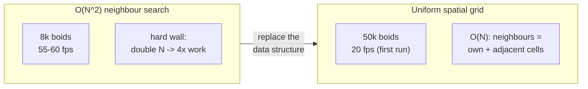
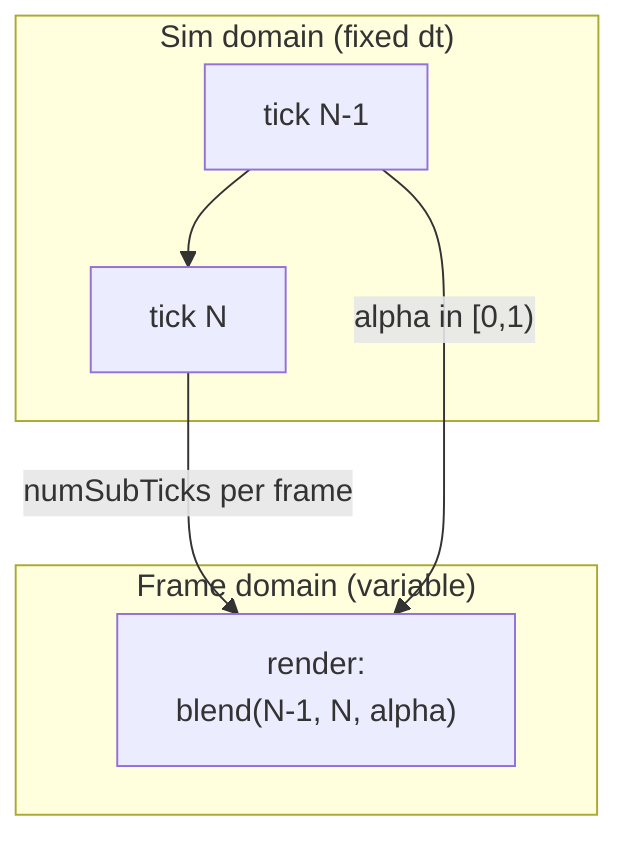

# The Road to 100k Boids

This is the page where the engine's bets pay a number. Everything in
[Core](Core.md) (the table store, scopes, contracts, the fixed-tick clock) and
everything in [Rendering](Rendering.md) exists to make results like this
possible. So here is a result, told honestly, as an arc of measured deltas
rather than a highlight reel.

The target: **100,000 fully-featured entities**, simulated live and drawn inside
the editor, through a 3D perspective camera and a 2D wireframe view at the same
time, at interactive frame rates. Not a particle system. Real scene entities,
each with a rendered surface, each a row in the [Core data store](Core.md#data-the-table-store-the-engine-is-made-of),
each individually selectable and inspectable in the [property grid](Metadata.md#the-property-grid-builds-itself).

<!-- MEDIA: the 100k flock clip -- the full flock swirling in the 3D viewport
     with the 2D wireframe view live alongside it, fps counter visible. This is
     the headline asset for the whole docs set; reuse it here. -->

---

## The challenge, stated precisely

A "boid" here is a bird-like agent following three classic flocking rules
(separation, alignment, cohesion). The demanding part is not the rules; it is
that every boid is a first-class citizen of the engine:

- It is a **scene entity**, a row in a `core::data` table, not a lightweight
  particle in a bespoke buffer.
- It has a **rendered surface** that goes through the same draw path as any mesh
  in a level.
- It is **live in the editor**: the simulation ticks while you fly the camera,
  select entities, and edit their properties.
- It is drawn **twice per frame** in the worst case, once through the 3D camera
  and once through a 2D orthographic wireframe view, because that dual-view
  editor layout is the honest working case, not a benchmark pose.

That framing matters, because it means the flock cannot cheat. Every
optimization has to hold up against the general-purpose scene, cull, and draw
machinery the rest of the engine uses. Nothing here is a special path bolted on
for the demo.

---

## The starting wall: O(N^2)

The first implementation was correct and fully threaded, and it hit a wall
almost immediately. The flocking rules need each boid's neighbours, and the
naive way to find them is to compare every boid against every other boid: an
all-pairs, O(N^2) search. Threading it across the whole worker pool bought some
headroom, but the quadratic term always wins in the end:

> Start: a brute-force O(N^2) flock, fully threaded, topped out at ~8k boids at
> 55-60 fps - the all-pairs neighbour search was the hard wall.

Eight thousand boids. Doubling the flock quadruples the neighbour work, so there
was no amount of thread count that would push this to six figures. The problem
was algorithmic, and the CLAUDE.md rule applies squarely here:
["simplest design first" means the simplest design that actually solves the
problem](Philosophy.md), not the smallest diff. The fix was not a faster
inner loop. It was a different data structure.

---

## The unlock: a uniform spatial grid

The replacement is a **uniform spatial grid** sized to the neighbour radius. Bin
each boid into the grid cell that contains it; a boid's neighbours can only be in
its own cell and the immediately adjacent ones, so the search collapses from
"every other boid" to "the handful in the neighbouring cells." That turns the
neighbour query from O(N^2) into O(N).

The flock builds its bins each frame through the engine's shared spatial index,
the same index that serves picking and ray narrow-phase, not a private copy:

```cpp
// BoidsSystem.cpp: the O(N) flock structure -- bin every boid into a
// uniform-grid cell sized to the neighbour radius, then read the OWN cell's
// aggregate: one read, NO per-neighbour RecordSet::find.
static uint32_t buildBins(graphics::spatial::ISpatialIndex& Grid, ViewT& View,
                          core::Array<math::Vec4>& Pos, core::Array<core::data::Key>& Keys,
                          const float CellSize, const math::Bounds& WorldBounds, const uint32_t NumTasks)
{
    // ...
    Grid.buildPoints(Pos.data(), Keys.data(), n, CellSize, WorldBounds, NumTasks);
    Grid.setBuiltFrame(static_cast<uint64_t>(core::chrono::GetFrameCount()));
}
```

The grid immediately unlocked the scale the O(N^2) build could never reach. But
"unlocked the scale" is not the same as "shipped the result":

> The FIRST run of the grid at 50k boids ran at 20 fps.

Fifty thousand boids, at twenty frames per second. That is the real starting line
for this page. Everything that follows is the story of taking that
50k-at-20fps grid build to 100k in a dual 2D/3D editor at interactive rates.



The same grid does double duty. It is what picking and the ray narrow-phase
descend for hit-testing, with a kd-tree descent that splits each node into the
entities fully inside a leaf versus those straddling a boundary. One spatial
structure, several consumers: the [DRY principle](Philosophy.md) applied to
space itself.

---

## The optimization arc: a sequence of measured deltas

From 50k-at-20fps to 100k-in-a-dual-view-editor was not one clever trick. It was
a sequence of profiler-guided changes, each attacking whatever subsystem the
profiler said was now the tallest bar. The honest way to present this is as a
table of **per-change deltas**: each row is the improvement that change bought
*at the time it was made*, against the bottleneck it targeted. They are not
additive into a single headline number (fixing the second-tallest bar does not
help until the tallest is gone), but together they tell the whole story.

| Subsystem | Change | Measured delta |
|-----------|--------|----------------|
| Flock neighbours | all-pairs O(N^2) -> spatial grid O(N) | 8k cap -> 50k+ (then 20fps) |
| Visibility refresh | serial per-row -> parallel + dense | ~7ms -> ~1us |
| Worker occupancy | keep-hot workers (parking fix) | 8-10 -> 26-32 workers |
| Flock view prologue | GetView ctor -> dense by-key view | ~1.4ms -> ~1us |
| BuildBatches grouping | SortedArray O(n^2) -> MapArray buckets | ~12ms -> ~0.8ms |
| BuildBatches gather | full rebuild -> cross-frame cache | ~6ms -> ~2ms (skips) |
| Gather scatter | material-keyed batch fast-path | ~2ms -> ~1ms |
| Instancing | upload-per-pass -> upload-once | ~2ms -> ~0.8ms |
| Cull chain-walk | parallel arrays -> interleaved AoS | ~5ms -> ~2ms |
| Cull bucket sizing | 16384 cap -> sized to cell count | chainSteps 445k -> 162k |
| Wireframe re-gather | full gather/frame -> churn tolerance | ~40 -> 43-46 fps |

The rest of this section walks the changes that carried the most weight.

### Cull: the concurrent AoS hashmap win

Culling 100k entities against a frustum every frame is itself a big linear pass,
and the way its acceleration structure is laid out in memory dominates its cost.
The original layout stored the cull grid's cell key, its next-slot link, and its
value in **parallel arrays**, so walking a hash chain touched three separate
cache lines per step. Interleaving them into a single struct, one entry per
overlapped cell, put the whole walk on one cache line:

```cpp
// SpatialGrid.cpp: one GridCellEntry {cellKey, slot, entityKey} per overlapped
// cell into a per-frame array, then radix-sorted by the 64-bit cell key.
core::Array<GridCellEntry> m_CellSorted;
core::Array<GridCellEntry> m_CellSortScratch;
// ...
GridCellEntry* const p_sorted = m_CellSorted.data();
core::RadixSortByU64Key(m_CellSorted, m_CellSortScratch,
                        [](const GridCellEntry& Entry) { return Entry.cellKey; });
```

The array of structs (AoS) cut the chain-walk cost from roughly **5ms to 2ms**.
A second, separate change stopped the hash buckets being oversubscribed: the old
build used a fixed 16384-bucket cap regardless of scene size, which at 100k
entities packed many cells into each bucket and produced long chains. Sizing the
bucket count to the actual cell count dropped the total chain-step count from
about **445k to 162k** steps per build. Same algorithm, honest sizing.

### BuildBatches: a cross-frame cache and a counting sort

`BuildBatches` turns the visible set into draw batches grouped by material and
mesh. Two things made it expensive at flock scale, and each got its own fix.

First, the grouping. The original grouping inserted into a `SortedArray`, whose
`insert` is O(n) per element and therefore O(n^2) for a bulk load of same-keyed
items. Switching to `MapArray` buckets (accumulate into per-key buckets, sort
each bucket once) took grouping from roughly **12ms to 0.8ms**.

Second, and larger, the gather. A flock only writes each boid's `Transform`
every frame; the *structure* of the batches (which surfaces, which materials,
which meshes) does not change frame to frame. So the batch gather learned to skip
itself entirely when the structure is unchanged, refreshing only the per-batch
world matrices from the moved rows:

```cpp
// Draw.cpp: cross-frame fast refresh. When the cached batch structure is still
// valid (same scene, fully covered, unchanged surface-structure gen + visible
// count) AND the visible SET membership is unchanged (the order-independent key
// fingerprint matches), SKIP the whole gather + group and refresh ONLY each
// batch's surfaceWorld from the moved VisibilityGeometry rows.
const bool structure_matches = fresh_list && coverage_ok && cache.structValid &&
                               cache.structScene == View.scene && cache.structGen == gen;
if (structure_matches && cache.structVisibleCount == vis.count)
{
    FingerprintVisibleKeys(fp_sum, fp_xor, vis);
    fp_valid = true;
    // ...
}
```

The membership check is an **order-independent fingerprint** (a sum and an xor
over the visible keys): if the set of visible entities is the same, even in a
different order, the structure cache stands and the gather is skipped. That took
the dominant per-view cost for a Transform-only flock from about **6ms to 2ms**,
and a material-keyed batch fast-path in the scatter shaved another **~2ms to
~1ms** on top.

This is a direct application of the
[single-source-of-truth rule](Core.md#how-core-compounds): the fresh-build path
and the incremental-refresh path funnel through one finalisation, so the cache
can never silently diverge from a full rebuild.

### Instance transforms: upload once, bind per pass

With the batch structure cached, the next tall bar was uploading instance
transforms to the GPU. In the dual-view case the same batch is drawn in multiple
passes (3D camera, 2D wireframe), and the naive path re-uploaded the identical
matrix buffer for each pass. The fix keys a persistent GPU buffer by a stable
per-batch id and uploads only when the transforms actually changed:

```cpp
// InstanceUpload.h: draw::UploadInstances tags every INSTANCED batch with a
// STABLE per-batch id + whether its transforms changed this frame. The backend
// keeps a per-batch PERSISTENT instance buffer keyed by that id: a batch
// unchanged for longer than the backend's frames-in-flight is uploaded ONCE and
// thereafter only BOUND -- no per-frame re-upload of identical matrices.
```

Upload-once/bind-per-pass took instancing from about **2ms to 0.8ms**, and it is
the win that makes an *idle* editor cheap: a paused flock re-uploads nothing.

### The generic visibility refresh

Every moving surface needs its world-space bounds recomputed so the cull and the
draw see it in the right place. The first version did this serially, per row, in
a boids-specific companion system gated on a hand-written `(count, scene, mode)`
condition. Both problems were fixed at once by making the refresh **generic and
change-detected**, running in parallel before the flock:

```cpp
// SceneSystems.cpp
class VisibilityRefreshSystem final
    : public graphics::scene::SystemVisibilityRefresh<VisibilityRefreshContract>
{
public:
    core::ConstStr getName() const override { return "visibilityRefreshSystem"; }
    core::scene::system::Priority getPriority() const override
    {
        return core::PriorityFourCC<core::scene::system::Priority>(
            core::scene::system::band::kPreSim, 'V', 'R', 'E', 'F');
    }
    // no update() override -- inherits the template's change-detected parallel
    // compose. Change-detection replaces the boids companion's (count, scene,
    // mode) gate generically.
};
```

The template's `ScopeContract` is doing real work here: it both scopes the
per-frame view to the system's entity set and declares its read/write set to the
scheduler. Because the refresh reads `Transform` in the `kPreSim` band, before
the flock, it is the flock's **predecessor**, so the scheduler knows the flock
can overlap freely with cull and draw downstream. That is the
[Core scheduler's contract mechanism](Core.md#tasks-threading-and-the-fixed-tick-clock)
turning "is this safe to parallelize?" into a compile-time answer, applied to a
subsystem that used to be a serial 7ms and is now about 1 microsecond.

None of these are boids code. The visibility refresh, the cull, `BuildBatches`,
and instance upload are all general engine machinery. The flock just happens to
be the workload that made every one of them worth sharpening, which is the point:
the demo pushed the *engine* forward, not a demo-only fast path.

---

## The role of Core: fixed tick, smooth frame

There is a subtlety that a raw fps number hides. Simulating 100k boids at a fixed
rate and rendering them at a variable, higher frame rate would look juddery if the
renderer just drew wherever the last tick left each boid. The engine avoids that
with the [fixed-tick clock from Core](Core.md#tasks-threading-and-the-fixed-tick-clock):
the simulation advances in whole ticks at a fixed `dt`, and the renderer blends
between the previous and current tick using an interpolation factor `alpha`:

```cpp
// Scene/System.h
struct FixedTickPlan
{
    uint32_t numSubTicks = 0;    // fixed sim ticks to run this frame
    float    alpha       = 0.0f; // [0,1): blend previous/current tick for display
};
```

Sim-domain systems (the flock) run `numSubTicks` times at the fixed rate;
frame-domain systems (the renderer) run once with `alpha` and interpolate. The
flock's behaviour is therefore deterministic and frame-rate-independent, while
presentation stays smooth no matter how the frame rate floats above the tick
rate. This is why the boids can simulate at a stable fixed cadence and still
render buttery between ticks. See [Rendering](Rendering.md) for how the frame
domain consumes `alpha`.



---

## The scoreboard

Here are the numbers, dated, because performance claims without a date and a
configuration are marketing, not engineering. These are the figures from
2026-07-09, after the optimizations above landed:

| Configuration | Result (2026-07-09) |
|---------------|---------------------|
| Fullscreen 4K game view, entire flock visible, no Studio / 2D view | **85+ fps** |
| 100k boids, dual 2D wireframe + 3D camera, live editor (worst case) | **55+ fps** |
| 100k boids, typical in-editor case (camera in the flock, partly culled) | **150+ fps** |
| 3D camera only | **65+ fps** |
| A leading data-oriented ECS sample, same hardware | 25-28 fps |

All 100,000 entities. The comparison row is a well-known data-oriented ECS
sample running a comparable flock on the same machine; against it, Ceili is
roughly **3x like-for-like**, and still about **2x** even in the dual-view editor
worst case where Ceili is paying for a second full render pass the comparison is
not.

Two points of honesty about these figures:

- **The mid-journey numbers were lower, and the retrospective says so.** Earlier
  in the arc, before the 2026-07-09 optimizations, the same worst case measured
  43-46 fps and the typical case around 100+ fps. Those are real, dated
  measurements too; they are simply superseded by the numbers above. Presenting
  only the final figures without the arc would hide where the work went.
- **The deltas in the arc table are per-change, not additive.** Each row is the
  win against the bottleneck of the moment. You cannot sum them into a single
  speedup, because fixing the second-tallest bar does nothing until the tallest
  is gone. The scoreboard above is the composed end state; the table is the path.

<!-- MEDIA: a before/after comparison -- ideally the O(N^2)-era 8k flock as a
     stuttery slideshow next to the 100k grid-era flock running interactively,
     side by side, both with fps counters. The slideshow -> interactive contrast
     is the single most legible way to show the arc. -->

---

## What actually did this

It is tempting to read this page as "a fast flocking demo." It is not. There is
almost no boids-specific performance code in the result. What carried 50k-at-20fps
to 100k-in-a-dual-view-editor was, in order of weight:

- A better **data structure** (the uniform grid) for the neighbour query, which
  is the same spatial index picking uses.
- The [Core table store's dirty tracking and views](Core.md#data-the-table-store-the-engine-is-made-of),
  which let the visibility refresh and the batch gather drain what changed
  instead of rescanning everything.
- The [Core scheduler's contracts](Core.md#tasks-threading-and-the-fixed-tick-clock),
  which fan the flock, cull, and refresh across a full worker pool safely,
  because the read/write sets say when overlap is legal.
- The [fixed-tick clock](Core.md#tasks-threading-and-the-fixed-tick-clock) and
  frame-domain interpolation, which keep it deterministic and smooth.
- General [rendering](Rendering.md) machinery (cull, `BuildBatches`, instancing)
  sharpened against the hardest workload the engine had.

Every one of those is a Core or Rendering feature that every other scene in the
engine also gets. The flock did not get a private fast path; it forced the shared
path to be fast, and everything downstream inherited the result. That is the
[central bet](Philosophy.md) paying out: one engine, no runtime/tools split, so
sharpening the general machinery for a demanding demo sharpens it for everyone.

Worth noting for anyone curious how the arc was actually run: much of this
optimization sequence was driven with AI assistance in the loop, profiler reading
and hypothesis-ranking included. That story is its own page:
[AI-Assisted Engine Development](AI_Assisted_Engine_Development.md).

Next: [Rendering](Rendering.md) for the draw path this result leans on, or
[AI-Assisted Engine Development](AI_Assisted_Engine_Development.md) for how the
arc was driven. Back to the [documentation index](README.md).
