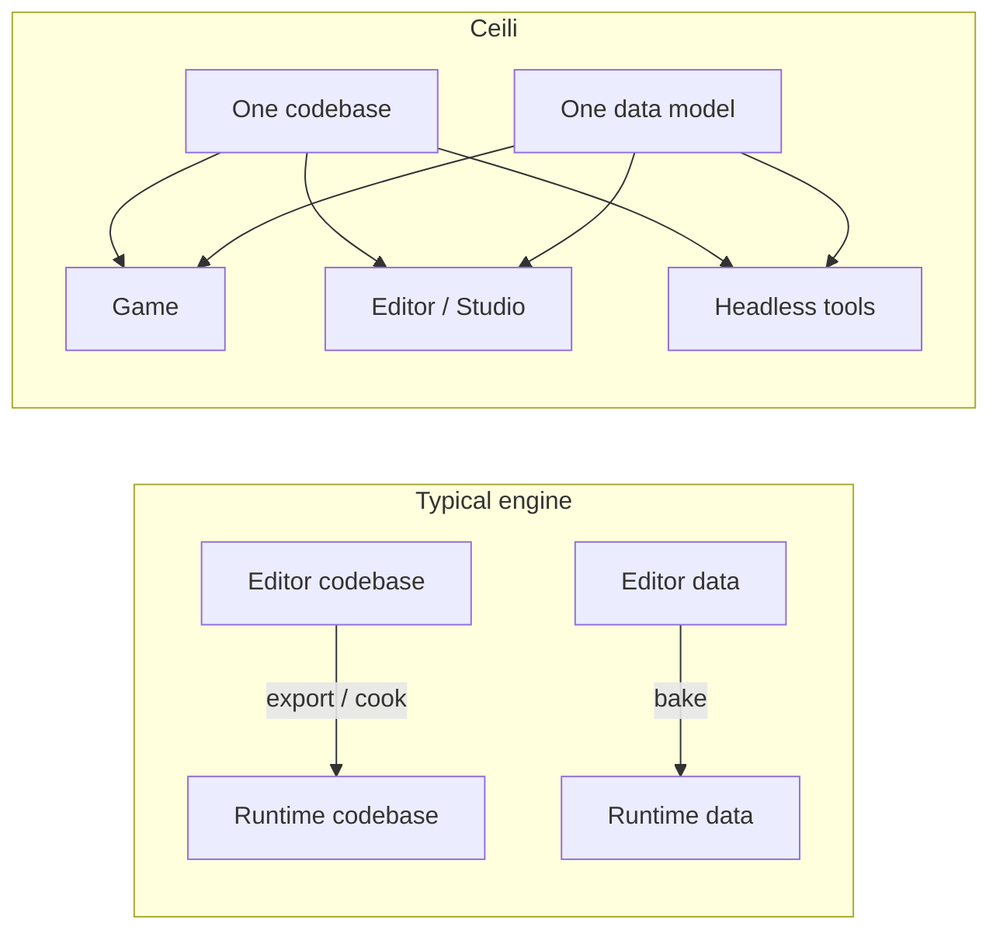

# Philosophy

Every engine is a stack of trade-offs. Ceili's are chosen deliberately and
applied consistently, because consistency is what lets a small team (here, one
developer and an AI collaborator) move like a large one. This page is the set of
bets the rest of the engine is built on.

---

## Performance is king

Runtime performance is the top priority, and every design decision is evaluated
through that lens. Not "fast enough": fast enough loses to the commercial
heavyweights. The engine competes on frame time.

The corollary is the one people miss: because **there is no separate tools
build** (see below), tools performance *is* runtime performance. The editor
renders through the same path as the game, allocates through the same
allocators, and iterates the same data tables. Making the runtime fast makes the
editor fast for free, and a slow editor is treated as the bug it is.

This is why the flagship stress test is not a tech demo running in isolation. It
is 100,000 flocking agents, each a real entity with a rendered surface,
simulated and drawn **live inside the editor**, through a 3D camera and a 2D
wireframe view at once. See [The Road to 100k Boids](Performance_100kBoids.md).

## The runtime is the tools

There is no distinction between the runtime and the tools. Same code, same data.
Some data may be optimized at build time, replacing its source representation,
but there is no separate "editor build" of the engine and no separate "cooked"
runtime that behaves differently from what you author against.



This single decision pays out everywhere. One metadata system and one entity
database, shared by the game and the editor, mean a single field-level
change-capture layer can feed **both** networked multiplayer and live
collaborative scene editing, two things every incumbent engine treats as
unrelated codebases. Undo/redo, serialization, the property grid, and network
replication all reduce to the same question: "what changed?"

## Packages: self-contained, consistently laid out

The engine is a set of packages. Each one is a self-contained unit of code and
resources, and each follows the *same* layout: a `Module.h` that defines it, an
`Include/` of public headers, a `Src/` of implementation, a `Resources/` of
authored data (materials, scenes, entity templates), `Tests/`, and factory
registration. Learn one package and you can navigate any package.

That regularity is not tidiness for its own sake. It is what makes the codebase
legible to a newcomer, safe to refactor in bulk, and buildable in
configurations: because packages declare their own dependencies and resources,
the engine can be assembled from just the packages a given product needs.

```
Pkg/Engine/<Module>/
    Module.h            module definition + build config
    Include/            public API headers
    Src/                implementation
    Resources/          data authored for the module
        Materials/      .material files (Lua + inline HLSL)
        Scenes/         .scene files
        Entities/       .entity templates
    Tests/              unit tests (doctest)
    ModuleFactories.*   component factory registration
```

## Plug and play: swap any implementation

Wherever there is (or might be) more than one way to do something, it lives
behind an interface, and the concrete implementation is chosen at runtime. The
rendering backend is D3D12 or Vulkan. The transport is real UDP or a lag
simulator wrapping it. An agent is a null stub or a live Claude process. None of
the calling code knows which.

The pattern is a generic component ID aliased to a concrete one, with the final
say given to a runtime config so load order across dynamic libraries never
decides behaviour:

```cpp
// The trunk declares a generic ID and a default backend.
component::SetComponentAlias(agent::CID_Agent, agent::CID_AgentNull);

// A backend package, when its library loads, points the alias at itself.
component::SetComponentAlias(agent::CID_Agent, CID_AgentClaude);
```
```lua
-- config.lua has the deterministic final word.
ceili.core.component.setComponentAlias(ceili.agent.CID_Agent,
                                       ceili.agent.claude.CID_AgentClaude)
```

Consumers only ever ask for `CID_Agent`; the alias chain resolves it. Swapping a
subsystem is a configuration change, not a code change. See
[Component Architecture](Components.md).

## C+-: C plus the good bits of C++

Ceili is written in what we half-jokingly call **C+-**: C, plus the good parts
of C++, minus the bad. Concretely:

- **No STL.** The engine ships its own containers, strings, and allocators
  (contiguous by default; see [Core](Core.md)). The STL's interfaces are
  familiar, but its runtime and compile-time costs are not what an engine wants.
- **No exceptions** (`_HAS_EXCEPTIONS=0`). Error handling is a strong `Result`
  type and early returns, not stack unwinding.
- **C-like public APIs.** The surface of every subsystem is free functions over
  opaque handles, not exposed C++ objects (next section).
- **Arena/scope allocators** as the memory strategy: one arena for bootstrap, one
  for tooling, one per level. Fast startup, instant teardown, minimal need for
  destructors.

The payoff is threefold: fast code, fast builds, and a surface small and regular
enough that it can be projected automatically into C#, .NET, and Lua (see
[Script Generation](ScriptGeneration.md)).

## Handles, not objects

Public APIs do not hand out C++ objects. They hand out opaque, type-safe
**handles** (small integer tokens) and free functions that operate on them.

```cpp
// Not this: a caller holding a Surface* with vtable, lifetime, and ABI baggage.
// This: an opaque token, and functions that take it.
surface::Handle h = surface::Create(desc);
surface::SetMaterialName(h, "pbr/test/iron_smooth");
const HandleArray& all = surface::GetSurfaces();
```

Handles are per-process tokens: they are never serialized, never sent over the
wire, never assumed valid across a load. Authoring data references resources *by
name*; the engine resolves names to live handles each frame. This is what keeps
save files, network packets, and the property grid all speaking the same stable
language while the live handles churn underneath.

Handles also make the interop story tractable. A `uint16_t` token crosses the
C / C# / Lua boundary trivially; a C++ object with a vtable does not.

## A testing ethos

Every subsystem carries doctest unit tests, and the build runs them. But the more
important habit is that changes are **verified against behaviour**, not just
compiled: a fast inner-loop check builds, runs the unit tests (covering C++, C#,
and Lua together), and runs a headless scene smoke test on every change; a fuller
gate adds one-frame GPU smokes on both backends before a commit.

Because the runtime is the tools, a headless run exercises the real engine, not a
mock. A test that spawns a surface, stamps its bounds, and checks it lands in the
right cull-tree leaf is testing the same code the editor and the game run.

---

## How these compound

None of these bets is novel on its own. The leverage is in taking them together
and never breaking them:

- *Performance is king* + *runtime is the tools* means one fast path serves
  everything, and the editor is a first-class performance target.
- *Self-contained packages* + *plug-and-play* means the engine is a
  configuration of swappable modules, not a monolith.
- *C+-* + *handles* means the whole surface is small, fast, and projectable into
  three scripting languages from one source of truth.

The result is an engine where a sweeping change (a cross-package rename, a new
serializer, a swapped backend) is a normal Tuesday, not a quarter-long project.
That velocity is the whole point.

Next: [Core](Core.md), the foundation everything else is built on, or
[Materials](Materials.md), the most distinctive single feature.
