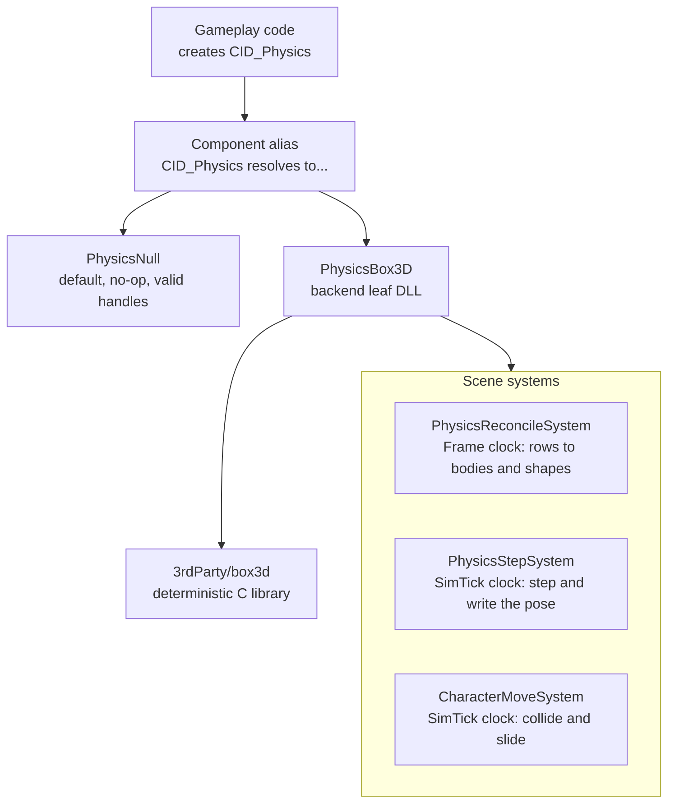

# Physics

Physics in Ceili is a small trunk interface with a real backend behind it. The
trunk, `IPhysics`, declares bodies, shapes, joints, queries, and a capsule mover.
A Null default answers every call with a neutral result, so a headless build or a
test links and runs without a physics library. A backend package,
`PhysicsBox3D`, supplies the real simulation from a vendored deterministic C
library. This is the same trunk-plus-backend shape that
[Networking](Networking.md) uses for its transport, and `PhysicsBox3D` is a leaf
package that mirrors the `NetworkNetcode` backend.

The subsystem is young. It went in during the summer of 2026 and has run on thin
content: small scenes, a capsule that walks and jumps, a few colliders and
joints. The interface is drawn wider than the backend fills, and the gaps are
written down in the source rather than hidden. This page covers what runs and
names what does not.

---

## Trunk, backend, and two clocks

A consumer creates the generic component id `CID_Physics` and gets whichever
implementation currently holds the alias. With no backend loaded that is the Null
default. Load the Box3D DLL and it becomes Box3D.



The component ids and the systems are declared together:

```cpp
// Physics/Module.h
CE_DECLARE_COMPONENT_ID(Physics)     // generic alias target - what consumers create
CE_DECLARE_COMPONENT_ID(PhysicsNull) // no-op default backend, so a headless run still works
// Two systems, because the D7 contract requires it: a body handle is a process token and must
// not be written by the SimTick domain (whose write set is the state that rolls back on Stop).
CE_DECLARE_COMPONENT_ID(PhysicsReconcileSystem) // Frame, both modes: rows -> bodies + shapes
CE_DECLARE_COMPONENT_ID(PhysicsStepSystem)      // SimTick, Play only: steps and writes the pose
CE_DECLARE_COMPONENT_ID(CharacterMoveSystem)    // SimTick, Play only: collide-and-slide capsules
```

Physics runs across two clocks, and the split is deliberate. The reconcile system
runs on the Frame clock and turns authored rows into live bodies and shapes. It
writes the body handle, which is a per-process token. The step and character
systems run on the sim clock in Play mode, and the sim clock's write set is the
state that rolls back when the scene stops. A body handle must not live in that
set, or a Stop would drop the handle that the reconcile pass created. See
[Core](Core.md#strong-types-and-handles) for handles and the fixed-tick clock,
and [Component Architecture](Components.md) for the generic-id alias.

The Null default is careful about what it promises. It does nothing, and it says
so by handing back invalid handles rather than plausible garbage:

```cpp
// Physics/PhysicsNull.cpp
// The contract it keeps is "nothing happens", NOT "nothing is valid": create calls hand
// back INVALID handles and every accessor answers with a neutral value.  A backend that
// returned garbage for an unsimulated body would make caller code that reads a transform
// back look like it worked.
```

The backend claims the alias when its DLL loads, and hands it back to Null when it
unloads. The order of the two release steps is load-bearing:

```cpp
// PhysicsBox3D/ModuleFactories.cpp
        // Release here instead, while this image is still valid.  The two lines are ordered:
        // hand the generic CID back to the trunk's own Null default FIRST, so a late
        // GetActive() - a CollisionShape row destructed after this point reaches one - cannot
        // build a fresh Box3D component out of a detaching DLL; then drop the cached instance,
        // whose destructor frees every world and hull it still owns so nothing is left for
        // heap::ReportLeaks to find.
        component::SetComponentAlias(CID_Physics, CID_PhysicsNull);
        ResetActive();
```

That release order came from a real crash. With Box3D active, the loader unloads
the backend DLL before the trunk it links against, so a world the trunk still
held would be destroyed through a vtable in unmapped memory. Handing the alias
back to Null first closes that window.

---

## The capsule character controller

A player or an NPC moves as a capsule that collides with the world and slides
along it. The controller is trunk code. The backend supplies three primitives,
and the trunk owns the loop that calls them:

```cpp
// Physics.h
    // Gather the contact planes a capsule at Origin would hit. Returns the count written.
    virtual uint32_t collideMover(mover::Contact* pOutContacts, const uint32_t MaxContacts, const world::Handle hWorld, const math::Vec4& Origin, const float Radius, const float HalfHeight, const QueryFilter& Filter) const = 0;

    // Resolve the position that satisfies those planes, returning the achievable translation.
    virtual math::Vec4 solveMoverPlanes(mover::Contact* pContacts, const uint32_t Count, const math::Vec4& TargetDelta) const = 0;

    // Remove the components of Velocity that the planes forbid. Planes with zero push, or with
    // clipVelocity false, are skipped - which is what makes a soft contact push without braking.
    virtual math::Vec4 clipMoverVelocity(const math::Vec4& Velocity, const mover::Contact* pContacts, const uint32_t Count) const = 0;
```

The controller re-gathers contact planes each iteration and runs a fixed three
passes, so a capsule that slides into a new wall on one pass sees that wall on the
next:

```cpp
// PhysicsSystem.cpp
    for (uint32_t iteration = 0; iteration < kMoverIterations; ++iteration)
    {
        // The capsule is queried at the position it is trying to LEAVE, and the solver decides
        // how much of `remaining` survives - so the skin width is added to the radius here rather
        // than being subtracted from the motion.
        const uint32_t count = Physics.collideMover(contacts,
                                                    kMaxMoverContacts,
                                                    hWorld,
                                                    out.origin,
                                                    Character.radius + Character.skinWidth,
                                                    Character.halfHeight,
                                                    Character.filter);

        const math::Vec4 moved = Physics.solveMoverPlanes(contacts, count, remaining);
        out.origin += moved;
```

The authored `CharacterController` row holds the shape and the rules: a radius and
a half height, a `stepOverHeight` for obstacles the capsule climbs rather than
blocks, a `maxSlopeDegrees` above which a surface is a wall, and a `skinWidth`
that keeps a small clear margin so the solver does not rest exactly on a surface
and jitter. A driver, which can be a locomotion system, an AI, or a script,
writes `desiredVelocity` each tick. That value is horizontal, because the mover
owns the vertical through gravity and jump.

A jump is a request rather than a direct velocity write. The step consumes it
before gravity integrates, so the apex does not depend on the tick rate:

```cpp
// PhysicsSystem.cpp
    if (Character.pendingJumpSpeed > 0.0f)
    {
        velocity.y                 = Character.pendingJumpSpeed;
        Character.pendingJumpSpeed = 0.0f;
        Character.grounded         = false;
    }
```

Stepping up a stair is a retry. When a grounded move falls short of its
horizontal target, the controller lifts the capsule by `stepOverHeight`, slides
again from there, and settles it back down if the raised path went further. A
ladder suppresses the fall and lets `desiredVelocity.y` drive the climb. The
runtime fields, `velocity` and `grounded`, are hidden and non-serialized, so a
save-load round trip or a property-grid edit cannot disturb a character
mid-motion.

<!-- MEDIA: a short clip of a capsule in a test scene walking up a short flight of
     steps, sliding along an angled wall, and jumping, with the physics debug view
     on so the capsule and the contact are visible. -->

---

## Colliders

A collider is one shape from a fixed set. The backend reads the kind and the
extents off the row:

```cpp
// PhysicsTypes.h
enum class Kind : uint8_t
{
    Box = 0,      // extents = half-extents
    Sphere,       // extents.x = radius
    Capsule,      // extents.x = radius, extents.y = half-height along local Y
    ConvexHull,   // geometry supplied by the caller as a vertex span
    TriangleMesh, // static geometry, vertex + index span
};
```

Box3D has no separate box primitive, so a box collider is built as a transformed
hull. A convex hull and a triangle mesh take their geometry as a vertex span rather
than a mesh handle, because Physics depends only on Core and Math and cannot reach
the mesh types. A triangle mesh may only sit on a static body: Box3D registers mesh
contact against spheres, capsules, and hulls, and none against another mesh, so a
moving mesh has no contact to compute. A moving concave shape is not supported;
use a convex hull for a moving body.

---

## Joints

Two joint kinds exist. Others were declared once and taken out again, and the
header keeps the reason so the removal is not mistaken for an oversight:

```cpp
// PhysicsTypes.h
// Revolute / Prismatic / Distance were declared here from P1 and never implemented, which is a
// worse version of the same problem: a value an author can select and the backend cannot build.
// The mesh-collider slice spent a session clearing exactly that for shape::Kind, so they are
// removed rather than left as a trap. box3d ships all three (b3CreateRevoluteJoint /
// PrismaticJoint / DistanceJoint), so re-adding one is a case in the backend switch plus its
// limit mapping - do that when something authors one, not before.
//
// Fixed stays despite being unauthored because it is the DEFAULT: an unset row is a Fixed joint,
// so leaving it unbuilt would make an authoring slip a runtime failure rather than a still object.
enum class Kind : uint8_t
{
    Fixed = 0, // all degrees of freedom locked (box3d's weld joint)
    Spherical, // translation locked, rotation free (legacy's swinging light)
};
```

A `Fixed` joint locks every degree of freedom and maps to Box3D's weld. A
`Spherical` joint locks translation and leaves rotation free, with optional cone
and twist limits. A joint anchors a body to the world: the backend makes a static
anchor body per world when the second body is invalid. A break force and break
torque are thresholds that raise an event when crossed, and the joint stays alive,
so the game decides what a break means.

---

## Raycast and shape queries

The query interface is three calls, and the header is plain that they block:

```cpp
// Physics.h
    // Queries - SYNCHRONOUS, and said plainly. The legacy header's own doc comment promised
    // "asynchronous collision tests" while every single implementation was a blocking call
    // straight into PhysX; a contract that lies is worse than none.
    virtual query::Hit castRay(const world::Handle hWorld, const math::Vec4& From, const math::Vec4& To, const QueryFilter& Filter) const                                                      = 0;
    virtual query::Hit castShape(const world::Handle hWorld, const shape::Desc& Shape, const math::Vec4& From, const math::Vec4& To, const QueryFilter& Filter) const                          = 0;
    virtual uint32_t   overlapShape(query::Hit* pOutHits, const uint32_t MaxHits, const world::Handle hWorld, const shape::Desc& Shape, const math::Vec4& At, const QueryFilter& Filter) const = 0;
```

`castRay` returns the closest hit along a segment. `castShape` sweeps a shape and
reports where it first touches. `overlapShape` writes every shape that overlaps a
pose. A `Hit` carries the shape and body it found, the world position and normal,
the distance and the 0-to-1 fraction along the ray, and the `owner` entity handle.
The reconcile pass stamps that owner onto each shape, so a caller learns which
entity it hit rather than only that it hit something. A `QueryFilter` selects
which layers a query sees.

---

## The debug view

Physics owns the shapes and may not depend on Graphics, and Graphics owns the
lines and does not know about colliders, so the debug view lives in App, the one
package above both. Two toggles sit in the app settings registry. `drawColliders`
draws every collision shape at its authored pose. `drawCharacters` draws every
character capsule from its own row, so a character's mover and its collider
capsule can be told apart when they disagree.

The draw is off by default, and off costs one branch before any table is read:

```cpp
// App/PhysicsDebug.cpp
void DrawScene(const core::scene::Handle hScene)
{
    const Settings& settings = GetSettings();
    if (!settings.drawColliders && !settings.drawCharacters)
    {
        return; // OFF costs one branch, before any table is touched
    }
```

With a toggle on, the view walks the shape rows and draws a box as an oriented
wireframe, a sphere and a capsule as wire outlines, colliders in green and
character capsules in turquoise. A mesh-backed shape draws nothing, because its
geometry is a vertex span the row does not carry and any outline would be a guess.

<!-- MEDIA: a screenshot of a small scene in Studio with the Physics Debug
     settings panel open and drawColliders + drawCharacters on, showing green
     collider wireframes and a turquoise character capsule over the lit scene. -->

---

## Determinism and the fixed timestep

Box3D was chosen because it simulates deterministically, and that property is the
reason the step runs on the sim clock. `PhysicsStepSystem` ticks at the fixed sim
rate and calls `b3World_Step` with four internal substeps. The delta is clamped,
so a stalled frame does not integrate a large jump in one step.

Determinism needs the compiler to leave the math alone. The whole solution builds
with fast floating point, which Box3D documents as unsupported, so the physics
projects override it back to precise:

```lua
-- 3rdParty/ModuleBox3D.lua
-- FLOATING POINT - the one flag that matters.
-- config.buildFlags() sets FloatFast at SOLUTION scope (Tools/GENie/solution.lua),
-- emitting <FloatingPointModel>Fast</FloatingPointModel> for every project.  Box3D
-- documents -ffast-math as UNSUPPORTED because it breaks the cross-platform
-- determinism the library is being adopted for.
```

The override is honest about its own limit. Precise pins the floating-point
model, but FMA contraction is a separate axis that is not yet controlled on the
Microsoft compiler. So the physics today is correct, and it is not yet bit-for-bit
reproducible across machines. The source flags this to be re-checked before
anything depends on exact reproduction, such as prediction or lockstep.

---

## What is not built yet

The interface is wider than the backend fills. Stated plainly:

- **Contact and sensor events are not delivered.** The interface declares them and
  the backend has a place for them, but both return an empty span today. Only
  joint-break events carry data.

  ```cpp
  // PhysicsBox3D.cpp
  core::Span<const event::Contact> getContactEvents([[maybe_unused]] const world::Handle hWorld) const override { return {}; }

  core::Span<const event::Sensor> getSensorEvents([[maybe_unused]] const world::Handle hWorld) const override { return {}; }
  ```

  A caller that polls `getContactEvents` or `getSensorEvents` gets nothing from
  Box3D. Box3D's own comment calls that translation loop a small job, so this is
  wiring left to do rather than a design question.

- **A convex hull or a triangle mesh cannot be the casting shape.** They are
  hittable as targets, but `castShape` and `overlapShape` have no proxy form for
  them yet and log a warning.

- **Mesh colliders have no converted content.** A triangle mesh is static-body
  only, and it ignores scale, because no other shape reads scale yet and one that
  did would be the odd one out. No asset pipeline produces a mesh collider today.

- **Joints anchor to the world only.** There is no entity-to-entity joint, and
  only `Fixed` and `Spherical` exist.

- **Physics under networking is not correct yet.** The sim systems are replayed
  under prediction, and replaying a step without restoring the world would
  integrate it twice:

  ```cpp
  // PhysicsSystem.cpp
  // Known consequence, recorded rather than discovered later: SimTick systems are REPLAYED
  // under prediction, and replaying a step without restoring the world would integrate it
  // twice.  Box3D ships world_snapshot.c for exactly that, and wiring it is the prediction
  // phase; until then this is only reachable with networking on.
  ```

  Box3D ships a world-snapshot facility for exactly this, and wiring it is the
  prediction phase. Single-player physics does not reach that path.

What runs is a capsule character controller with collide-and-slide, step-up, and
jump, a set of box, sphere, capsule, and hull colliders with a static mesh, fixed
and spherical joints, synchronous ray and shape queries, and a debug view. It
sits on a deterministic backend behind a Null-safe trunk, and the parts that are
still open are named in the code.

Next: [Audio](Audio.md), or back to the [documentation index](README.md).
