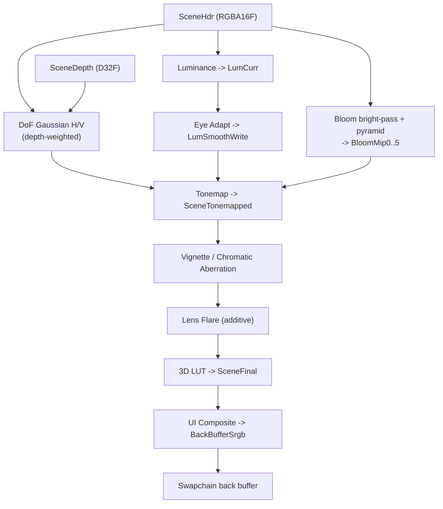

# Post-Processing & HDR

The post-processing chain is the last thing that touches a frame before it reaches
the display. In most engines it is a fixed pipeline compiled into the renderer:
bloom, tonemap, and grade wired together in C++, tuned by a scattering of console
variables. Ceili takes the same position here that it takes for surface shading:
**the post chain is authored as data, not baked into code.**

Every pass is a `.material` file (see [Materials](Materials.md)). Each pass names
the slots it reads and the slot it writes. The whole chain, in order, is a list
assembled in a Lua config function. Reordering the chain, disabling a stage,
swapping in a different tonemapper, or hot-reloading a pass's shader is a data edit,
not a rebuild. This page walks that model end to end: the slot graph, the default
chain stage by stage, and the HDR output path that the chain feeds.

---

## The chain is a list of passes wired by named slots

A post pass is a full-screen draw: sample some input textures, run a fragment
shader, write one output. The only thing that makes a *chain* out of a pile of
passes is agreement on names. Ceili gives every intermediate render target a
**slot**: a four-character id that a pass reads from or writes to.

```cpp
// PostProcess.h: slots are FourCC ids, one per intermediate target.
namespace slots
{
constexpr Slot SceneHdr       = core::FourCC<Slot>('S', 'H', 'D', 'R');
constexpr Slot SceneHdrB      = core::FourCC<Slot>('S', 'H', 'D', 'B');
constexpr Slot SceneDepth     = core::FourCC<Slot>('S', 'D', 'P', 'T');
constexpr Slot LumCurr        = core::FourCC<Slot>('L', 'U', 'M', 'C');
constexpr Slot LumSmoothPrev  = core::FourCC<Slot>('L', 'M', 'S', 'P');
constexpr Slot LumSmoothWrite = core::FourCC<Slot>('L', 'M', 'S', 'W');
constexpr Slot SceneTonemapped  = core::FourCC<Slot>('S', 'T', 'N', 'M');
constexpr Slot SceneTonemappedB = core::FourCC<Slot>('S', 'T', 'N', 'B');
constexpr Slot Lut3d          = core::FourCC<Slot>('L', 'U', 'T', '3');
constexpr Slot SceneFinal     = core::FourCC<Slot>('S', 'F', 'N', 'L');
constexpr Slot UiOverlay      = core::FourCC<Slot>('U', 'I', 'O', 'V');
constexpr Slot BackBufferSrgb = core::FourCC<Slot>('B', 'B', 'S', 'R');
// BloomMip0 .. BloomMip5 -- the bloom pyramid.
}
```

The `FourCC` id is the same construction the metadata serializers use for format
tags (see [Metadata: format ids](Metadata.md#serializers-one-walk-many-formats));
a four-character code is small, printable, and cheap to compare. A slot is not a
texture, it is a *promise* of one: something later resolves the slot to a live
render target handle. That indirection is the whole trick, and we come back to it
when we reach HDR.

A single pass is a `ChainEntry`. It names the material to run, the slot it writes,
the slots it reads (bound to material texture slots), an optional shader-constants
override, and a set of flags:

```cpp
// PostProcess.h: one pass in the chain.
struct ChainEntry
{
    char         materialName[kMaxMaterialNameLen + 1]{};
    char         label[kMaxLabelLen + 1]{};
    bool         enabled{true};
    Slot         output{slots::BackBufferSrgb};
    uint8_t      numInputs{0};
    InputBinding inputs[kMaxInputBindings]{};   // kMaxInputBindings == 4
    material::shader::constants::Handle current;
    struct BlendState { /* ... constants cross-fade for live tuning ... */ } blend;
    char         groupName[kMaxGroupNameLen + 1]{};
    Flags        flags{Flags::None};
};
```

An `InputBinding` is just `{ Slot source; uint8_t materialSlot; }`: "feed the target
currently in slot `source` into texture slot `materialSlot` of my shader." Four
bindings is the cap, which is comfortably more than any single full-screen pass
needs.

The flags are small but load-bearing:

```cpp
// PostProcess.h
CE_BITFIELD enum class Flags : uint32_t
{
    None              = 0,
    HdrOnly           = 1u << 0, // dropped from the chain in the legacy LDR path
    RequiresLiveInput = 1u << 1, // needs a live-sampled input (e.g. lens flare)
    Additive          = 1u << 2, // blends onto its output rather than overwriting
};
```

`HdrOnly` is how a stage says "I only make sense in the HDR pipeline." `Additive`
is how a pass says "add me on top of what is already there" instead of replacing
it. `RequiresLiveInput` marks a pass that samples a target still being written this
frame. These are single bits checked with `core::HasBitfield`, the same strongly
typed bitfield helper used everywhere else in the engine (see
[Core: strong types](Core.md#strong-types-and-handles)).

---

## The chain is assembled in config, not compiled

The default chain is built in `postProcessConfig()` in `config.lua`. Passes are
appended in execution order. The engine exposes two append entry points (one for
the active chain, one for an inactive pool of passes you can toggle on), and the
config wraps both in a small `appendGroup` helper so related passes (the five
bloom downsamples, say) share a group label in the chain editor:

```lua
-- config.lua: the grouping wrapper over the raw append calls.
local function appendGroup(group, materialName, label, output, inputs, numInputs, hConstants, enabled, entryFlags)
    local flags = entryFlags or pp.Flags.None
    if enabled then
        pp.appendToChainWithBindings(materialName, label, output, inputs, numInputs, hConstants, true, flags)
        pp.setEntryGroup(pp.getChainSize() - 1, group)
    else
        pp.appendToInactive(materialName, label, output, inputs, numInputs, hConstants, flags)
        pp.setInactiveEntryGroup(pp.getInactiveSize() - 1, group)
    end
end
```

`appendToChainWithBindings` takes exactly the `ChainEntry` fields: the material
name, a label, the output slot, an input-binding array plus its count, a constants
handle, the enabled flag, and the pass flags. Because this is Lua and not C++, the
entire pipeline is data that loads at runtime and reloads on edit. Adding a pass is
one more line in this function; there is no renderer code to touch. This is the
same authored-as-data, hot-reloadable story as [Materials](Materials.md), lifted up
one level to the pipeline that strings materials together.

And because the chain is data rather than compiled code, `config.lua` only
supplies the *default*: the whole pipeline is editable live. Graphics exposes a
runtime chain-mutation API (insert, remove, move, and enable or disable a pass),
each call firing an `OnChainChanged` event so the chain runner and the property
grid react, and Studio ships a **Post Process** panel built on it. From that panel
you activate a pass from the inactive pool, remove one, reorder with up and down
(a grouped set of passes, like the bloom pyramid, moves as a unit), toggle any
pass, and tweak a pass's constants in place, all while the scene renders and all
undoable within the session. Tuning the look is a live activity, not an
edit-reload cycle.

---

## The default chain, stage by stage

Here is the shipped chain in order, quoting the real append calls. Read the
`output` slot and the input slots together and the graph draws itself: each stage
reads what the previous stage wrote.

**Auto-exposure (luminance + eye adaptation).** The first two passes measure how
bright the scene is and adapt toward it over time, so a scene that steps from a
dark interior into sunlight settles rather than blowing out. `luminance` reduces
the HDR scene to a luminance value in `LumCurr`; `eye_adapt` smooths that against
last frame's smoothed value:

```lua
pp.appendToChainWithBindings("postProcess/luminance", "Luminance", slots.LumCurr, inputs, 1, consts.getInvalidHandle(), true, pp.Flags.HdrOnly)
pp.appendToChainWithBindings("postProcess/eye_adapt", "Eye Adapt", slots.LumSmoothWrite, inputs, 2, consts.getInvalidHandle(), true, pp.Flags.HdrOnly)
```

The two `LumSmoothPrev` / `LumSmoothWrite` slots are a ping-pong: this frame reads
the previous smoothed luminance and writes the new one, which becomes next frame's
previous. Both passes are `HdrOnly`, because auto-exposure is a property of the HDR
pipeline.

**Bloom.** A bright-pass isolates the highlights into `BloomMip0`, then five
downsamples build a blurred pyramid and five upsamples combine it back up. This is
the classic energy-preserving bloom, and it is authored as three materials reused
across the pyramid rather than one hard-coded loop:

```lua
appendGroup("Bloom", "postProcess/bloom",            "Bloom Bright-Pass", slots.BloomMip0, bright_inputs, 1, consts.getInvalidHandle(), true)
appendGroup("Bloom", "postProcess/bloom_downsample", label, dst, inputs, 1, consts.getInvalidHandle(), true)  -- x5 down the pyramid
appendGroup("Bloom", "postProcess/bloom_upsample",   label, dst, inputs, 1, consts.getInvalidHandle(), true)  -- x5 back up
```

<!-- MEDIA: a before/after bloom comparison on a scene with bright emissive
     highlights (sun, glowing material, specular sparkle) -- left with the Bloom
     group disabled, right with it on, to show the highlight bleed. -->

**Depth of field.** The shipped variant is a separable Gaussian: a horizontal blur
into `SceneHdrB`, then a vertical blur back into `SceneHdr`. Both DoF passes read
`SceneDepth` as their second input, which is why the depth slot exists: the blur is
depth-weighted so only out-of-focus regions soften.

```lua
appendGroup("DoF Gaussian", "postProcess/dof_gaussian_h", "DoF Gaussian H", slots.SceneHdrB, h_inputs, 2, consts.getInvalidHandle(), true)
appendGroup("DoF Gaussian", "postProcess/dof_gaussian_v", "DoF Gaussian V", slots.SceneHdr,  v_inputs, 2, consts.getInvalidHandle(), true)
```

A second, disc-shaped bokeh DoF ships too, but registered into the *inactive* pool
(`enabled` = false) rather than the running chain:

```lua
appendGroup("DoF Disc", "postProcess/dof_disc", "DoF Disc", slots.SceneHdrB, disc_inputs, 2, consts.getInvalidHandle(), false)
```

This is what the inactive pool is for. `dof_disc` is a fully authored, ready-to-run
pass sitting on the bench; the chain editor can activate it (and deactivate the
Gaussian pair) without touching config, because both variants are already data. The
running pipeline and the alternatives are described in the same list.

**Tonemap.** This is the pivot from HDR to display range. `tonemap` reads the HDR
scene, the smoothed luminance from auto-exposure, and the bloom result, and writes
the display-referred `SceneTonemapped`:

```lua
pp.appendToChainWithBindings("postProcess/tonemap", "Tonemap", slots.SceneTonemapped, inputs, 3, consts.getInvalidHandle(), true, pp.Flags.HdrOnly)
```

Everything before tonemap works in scene-referred HDR; everything after works in
the tonemapped range. The stages that follow are the "look" layer.

**Vignette and chromatic aberration.** Two cheap screen-space passes ping-pong
between `SceneTonemapped` and `SceneTonemappedB`. Vignette darkens the edges into
`SceneTonemappedB`; chromatic aberration splits the channels radially back into
`SceneTonemapped`:

```lua
pp.appendToChainWithBindings("postProcess/vignette", "Vignette", slots.SceneTonemappedB, vig_inputs, 1, consts.getInvalidHandle(), true, pp.Flags.HdrOnly)
pp.appendToChainWithBindings("postProcess/chromatic_aberration", "Chromatic Aberration", slots.SceneTonemapped, ca_inputs, 1, consts.getInvalidHandle(), true, pp.Flags.HdrOnly)
```

**Lens flare.** The one pass with all three interesting flags at once. It samples a
live input and *adds* its contribution on top of `SceneTonemapped` rather than
overwriting it:

```lua
pp.appendToChainWithBindings("postProcess/lens_flare", "Lens Flare", slots.SceneTonemapped, flare_inputs, 1,
    consts.getInvalidHandle(), true, bit.bor(pp.Flags.HdrOnly, pp.Flags.RequiresLiveInput, pp.Flags.Additive))
```

`bit.bor` combines the flags: `HdrOnly` (only in the HDR pipeline),
`RequiresLiveInput` (it samples a target still being produced this frame), and
`Additive` (blend onto the output). This is exactly the case the `Additive` flag
was added for: a glow that layers on rather than replacing.

**3D-LUT grade and UI composite.** The final look step applies a 3D color lookup
table (the artist-authored grade), reading `SceneTonemapped` and the `Lut3d` slot
and writing `SceneFinal`. Last, `ui_composite` combines the graded scene with the
UI overlay and writes the swapchain's sRGB back buffer:

```lua
pp.appendToChainWithBindings("postProcess/lut3d",        "3D LUT",       slots.SceneFinal,      inputs, 2, consts.getInvalidHandle(), true)
pp.appendToChainWithBindings("postProcess/ui_composite", "UI Composite", slots.BackBufferSrgb,  inputs, 2, consts.getInvalidHandle(), true)
```

<!-- MEDIA: the LUT grading step -- the same tonemapped frame with three different
     3D-LUTs applied (neutral, warm/teal cinematic, cool/desaturated) side by side,
     to show that the grade is a data swap. -->

Every one of those material names maps to a real file under
`Pkg/Engine/Graphics/Resources/Materials/`: `luminance.material`, `bloom.material`,
`tonemap.material`, `lens_flare.material`, `lut3d.material`, and the rest. Each is
an ordinary post-process material carrying its own fragment shader and constants,
authored the same way any surface material is. Edit one, save, and the pass updates
in the running editor on the next hot-reload drain (see
[Core: hot reload](Core.md#the-support-cast-logging-profiling-time-hot-reload)).

---

## The slot graph

Putting the outputs and inputs together, the default chain is a directed graph over
slots. Auto-exposure and the bloom pyramid feed the tonemap; the tonemapped image
runs through the look passes; the grade and UI composite land it on the back
buffer.



The graph is not hard-coded anywhere. It is the emergent shape of the append list:
each pass's `output` slot and `inputs` array are the edges. Rewrite the list and
you rewrite the graph.

---

## HDR output: one chain, three destinations

The chain writes an HDR scene, tonemaps it, and lands on a back buffer. What "the
back buffer" *is* depends on the display. Ceili supports three output modes, plus a
legacy path:

```cpp
// Graphics.h
enum class OutputMode : uint8_t
{
    Ldr   = 0, // legacy LDR path -- the HDR-only passes drop out
    Sdr   = 1, // HDR pipeline tonemapped down to a standard display
    Hdr10 = 2, // HDR10 -- needs an HDR-capable display
    Scrgb = 3, // scRGB -- needs an HDR-capable display
};

CE_INLINE bool IsHdrDisplay(const OutputMode Mode)
{
    return Mode == OutputMode::Hdr10 || Mode == OutputMode::Scrgb;
}
```

`Sdr` is the default, and the naming rewards a second look. `Sdr` does *not* mean
"skip HDR." It means "run the full HDR pipeline and tonemap it onto a standard
display." The HDR scene target is a viewport-resolution `RGBA16F` (with a `D32F`
depth), exposed as:

```cpp
// Graphics.h
CE_API renderTarget::Handle GetSceneRenderTarget();
```

The scene is always rendered in HDR into that target. The difference between the
modes is only what happens at the very end of the chain, and that is where the slot
indirection pays off. Recall that a slot resolves to a live render target through a
registered producer. The final-output slots register a producer that *branches on
the output mode*:

```cpp
// PostProcessSetup.cpp: the final slots resolve differently per output mode.
RegisterSlot(slots::SceneFinal, []() {
    return IsHdrDisplay(GetOutputMode()) ? GetSceneFinalRenderTarget() : GetBackBufferSrgbHandle();
});
RegisterSlot(slots::UiOverlay, []() {
    return IsHdrDisplay(GetOutputMode()) ? GetUiOverlayRenderTarget() : GetBackBufferSrgbHandle();
});
```

On an SDR display the graded scene goes straight to the sRGB back buffer. On an HDR
display it lands in an intermediate HDR final target instead, so a wide-gamut
encode step can take it the rest of the way to HDR10 or scRGB. Same chain, same
passes, same materials: only the slot's resolved handle changes.

### The HDR-only passes drop out in LDR

The legacy `Ldr` mode is where `Flags::HdrOnly` earns its place. When the active
chain is rebuilt, an `HdrOnly` pass is suppressed if the output mode is `Ldr`:

```cpp
// PostProcess.cpp: HdrOnly passes are skipped when the output is legacy LDR.
const bool is_ldr = (graphics::GetOutputMode() == graphics::OutputMode::Ldr);
// ...
const bool hdr_only_suppressed  = is_ldr && core::HasBitfield(entry.flags, Flags::HdrOnly);
const bool effectively_enabled  = entry.enabled && !hdr_only_suppressed;
```

Auto-exposure, tonemap, vignette, chromatic aberration, and lens flare are all
`HdrOnly`; in the legacy LDR path they simply are not part of the chain. The passes
without the flag (bloom, DoF, the LUT grade, the UI composite) still run. One flag,
checked at chain-build time, is the entire mechanism.

### A mode change re-plumbs the chain

Because the slot producers branch on the output mode, switching modes at runtime has
to rebuild the active chain so the branches re-resolve. That is wired as a delegate:
the output-mode change fires a hook that marks the active chain dirty, and it gets
rebuilt on the next frame.

```cpp
// PostProcessSetup.cpp
void DirtyActiveChainOnModeChange([[maybe_unused]] const OutputMode Mode)
{
    MarkActiveChainDirty();
}
// ... registered at setup:
AddOnOutputModeDelegate({&DirtyActiveChainOnModeChange});
```

This is the same dirty-then-rebuild pattern the rest of the engine uses (mark
something dirty, drain and reconcile once per frame) rather than re-plumbing the
pipeline inline at the point of the mode switch. The mode itself is an ordinary
setting, reflected and editable like any other:

```cpp
// Display.h -- outputMode is a reflected setting; Apply() reverts if the mode is rejected.
struct Settings
{
    OutputMode outputMode CE_DESC("Swapchain output mode -- Sdr runs the HDR pipeline onto any "
                                  "display, Ldr is the legacy LDR path, Hdr10 / Scrgb need an "
                                  "HDR-capable display. An unsupported mode reverts on apply")
        = OutputMode::Sdr;
    // ...
};
CE_API Settings& GetSettings();
CE_API void      Apply();  // outputMode -> SetOutputMode; reverts the field if rejected
```

Because `outputMode` is a reflected field with a `CE_DESC` annotation, it shows up
in the Studio settings grid with its tooltip automatically, the same way every
reflected field does (see
[Metadata: the property grid builds itself](Metadata.md#the-property-grid-builds-itself)).
Picking HDR10 on a display that cannot do it fails cleanly: `Apply()` reverts the
field.

<!-- MEDIA: an HDR10-vs-SDR comparison of the same frame (ideally a split-screen or
     an HDR-captured photo of an HDR display next to the SDR tonemap) showing the
     extended highlight range. Note in the caption that SDR here is still the full
     HDR pipeline tonemapped down. -->

### One binary, desktop to mobile

Step back and the output mode is doing more than picking a swapchain format: it is
a lever for targeting the full spread of hardware from a single build, from a
high-powered desktop with an HDR display down to a low-capability mobile device. On
capable hardware the engine runs the whole HDR pipeline and encodes to HDR10 or
scRGB. On a constrained device it drops to the `Ldr` path, where the expensive
`HdrOnly` passes (auto-exposure, tonemap, vignette, chromatic aberration, lens
flare) fall out of the chain entirely and only the cheap passes remain. And because
the mode is an ordinary reflected setting whose change re-plumbs the chain on the
next frame, that choice is not baked in at compile time: the engine can move in and
out of `Ldr` *dynamically at runtime*, adapting to the detected display, a
performance budget, or a user toggle, with no rebuild and no second render path to
maintain. Spanning high-end desktop to low-powered mobile from one codebase is a
deliberate goal, and the output mode together with the `HdrOnly` flag is a good part
of how the pixel pipeline pulls its weight in that.

---

## Why author the pipeline as data

Post-processing lands on exactly the bet the rest of the engine is built on. A
fixed C++ post chain is fast to write once and expensive to change forever: every
reorder is a recompile, every new effect is renderer surgery, and the SDR and HDR
paths drift into two code paths that have to be kept in sync by hand. Ceili instead
makes the chain a list of data-authored passes wired by named slots, with the
per-mode differences collapsed onto a single slot-resolution branch and a single
`HdrOnly` flag.

The consequences fall straight out of that:

- **Reordering, disabling, or swapping a pass is a config edit**, not a rebuild. The
  chain editor operates on the same `ChainEntry` list, including an inactive pool of
  ready-to-run alternatives like the disc-bokeh DoF.
- **A pass's shader hot-reloads** like any material, so tuning bloom or a tonemapper
  is an edit-save-see loop with no restart.
- **SDR and HDR are one pipeline.** The scene is always HDR; only the final slot's
  resolved target and the set of `HdrOnly` passes differ, so there is no second code
  path to maintain.

It is the same story as [Materials](Materials.md), one level up: the individual
passes are authored materials, and the pipeline that sequences them is authored data
too. For where those HDR targets come from and how the scene is rendered into them
in the first place, see [Rendering](Rendering.md).

Next: [Rendering](Rendering.md), or back to the
[documentation index](README.md).
