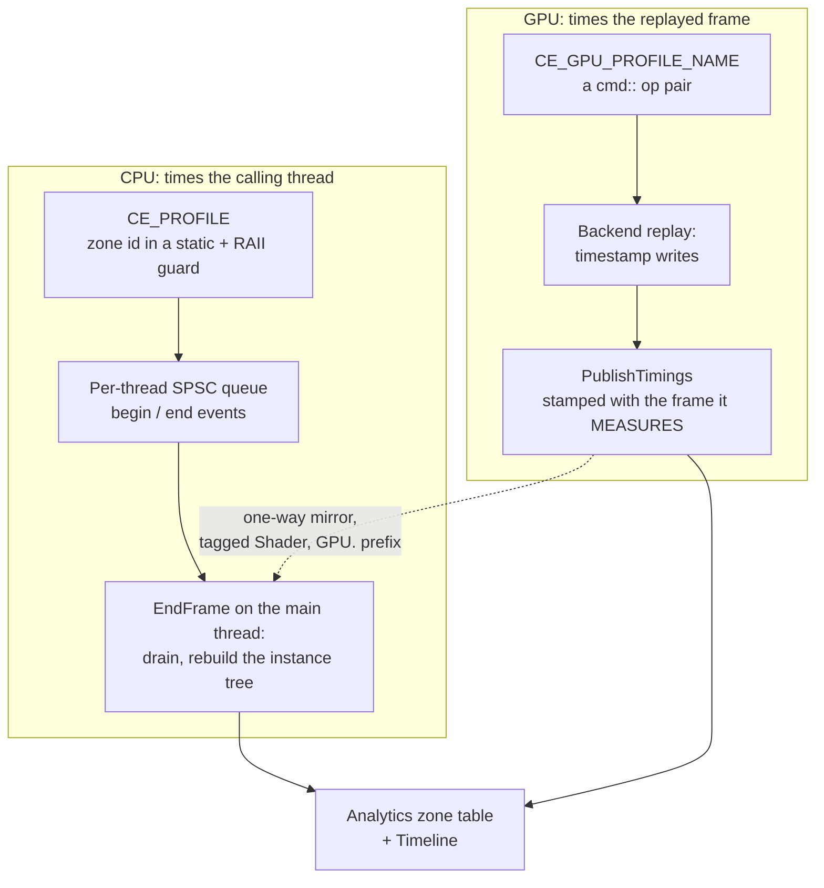

# Profiling

The engine measures itself on two clocks. A CPU profiler times the calling
thread, and a GPU profiler times the work the GPU actually ran. Neither answers
the other's question, and most of the design of both comes from keeping them
apart.

This page covers the CPU zone tree, the GPU timestamp registry, why they cannot
be one table, and the reporting that turns both into something a test can fail
on. It ends with the memory panel, which answers the other question a frame-time
spike raises: where did the bytes go.

Both are gated on one switch. `CE_USE_PROFILE` is defined in the Debug and
profiling configurations and absent from Release, so there is one flag rather
than two that could disagree.

---

## The CPU side: a zone is a scope

You instrument a function by dropping a macro at the top of it:

```cpp
void CullViewUnified(/* ... */)
{
    CE_PROFILE
    // ...
}
```

`CE_PROFILE` names the zone after the enclosing function. `CE_PROFILE_NAME`,
`CE_PROFILE_NAME_COLOR` and `CE_PROFILE_NAME_COLOR_CATEGORY` take a name, a
colour and a category instead. All four expand to a zone id in a function-local
static plus an RAII guard:

```cpp
// Macros/Profile.h
#define CE_PROFILE                                                                                       \
    static auto CE_CONCAT(_s_profile_id_, __LINE__) = ceili::core::profile::CreateZone(CE_FUNC_NAME, ...); \
    ceili::core::profile::ProfileScopeGuard CE_CONCAT(_profile_scope_guard_, __LINE__)(...);
```

Two details in that expansion matter more than they look.

**The names are per line, not per function.** `CE_CONCAT(..., __LINE__)` means a
`CE_PROFILE` and several `CE_PROFILE_NAME` sub-zones can nest inside one
function without the inner declaration hiding the outer one, which this build
treats as an error.

**The zone id is a static, so the name is evaluated once.** That is what makes a
hit cheap, and it is also a trap the header states outright:

```cpp
// Macros/Profile.h
// The static also means ONE zone per call site, with Name/Color evaluated on FIRST execution only
// -- so the arguments must be stable (string literals).  A call site that emits runtime-built names
// (e.g. the shared slice lambda in tasks::ParallelFor) must NOT use these macros: it would bake the
// first name in forever.  Use profile::GetOrCreateZone(name, ...) + ProfileScopeGuard directly.
```

`GetOrCreateZone` is the escape hatch: it keys on a hash of the name and returns
the existing zone when it has seen one before. The parallel-for slices and the
per-cascade shadow zones both take that route.

The guard every macro expands to is small enough to show whole:

```cpp
// Include/Profile.h
class ProfileScopeGuard
{
public:
    ProfileScopeGuard(const ZoneId ZoneId)
        : m_InstanceId(BeginInstance(ZoneId))
    {
    }

    ~ProfileScopeGuard()
    {
        EndInstance(m_InstanceId);
    }

private:
    InstanceId m_InstanceId;
};
```

A zone is a scope, so it closes on every exit path, early returns included. The
engine has no exceptions, so "every exit" means every `return` and the fall
through, which is the whole set. A call site that builds a runtime name uses the
guard directly with an id from `GetOrCreateZone`.

### Reading the clock: RDTSC

Every begin and end stamps itself with the CPU's time-stamp counter, read through
one function:

```cpp
// Include/Time.h
// Low-overhead nanosecond timestamp using RDTSC on x86-64.
// Calibrated at startup against the OS high-resolution timer.
// Falls back to GetNow(Resolution::NanoSeconds) on other architectures.
CE_API Time GetNowRdtsc();
```

`RDTSC` reads a per-core counter in tens of cycles, with no system call. On
modern x86 the counter is invariant: it ticks at a fixed rate whatever the core's
current frequency. The raw value is in ticks, though, and the profiler wants
nanoseconds, so the engine calibrates the ratio once at startup:

```cpp
// Time.cpp
void CalibrateRdtsc()
{
    // Short spin (~2ms) comparing RDTSC against steady_clock to derive
    // the TSC-to-nanosecond conversion factor. On Windows steady_clock
    // uses QPC which reads the same invariant TSC, so accuracy is high
    // even with a brief calibration window.
    using Clock    = ::std::chrono::steady_clock;
    using Duration = ::std::chrono::duration<uint64_t, ::std::nano>;

    const auto         clock_start = Clock::now();
    const uint64_t     tsc_start   = __rdtsc();
    constexpr uint64_t kSpinNs     = 2'000'000ULL; // 2ms
```

The first reading also becomes the session epoch, and every later reading is
rebased to it, so the value multiplied by the ratio stays small:

```cpp
// Time.cpp
Time GetNowRdtsc()
{
#if defined(_M_X64) || defined(__x86_64__)
    const uint64_t ticks = __rdtsc() - g_RdtscEpoch; // Epoch-relative: small value
    const uint64_t ns    = static_cast<uint64_t>(static_cast<double>(ticks) * g_RdtscNsPerTick);
    return Time(Resolution::NanoSeconds, ns);
#else
    return GetNow(Resolution::NanoSeconds);
#endif
}
```

The counter has one property the profiler can live with and the scheduler cannot:
**raw RDTSC is not guaranteed monotonic across a core migration.** A thread that
moves cores between two readings can see the second one land earlier. For a
profile zone that is a rounding error on one span. For code that subtracts two
times and asserts the result is positive, it is a crash, and the task pool's idle
loop says so in the source:

```cpp
// Tasks.cpp
// Two things NOT to "optimize" here: do not park immediately (regresses fan-out to ~8-10 workers),
// and do not swap GetNow for GetNowRdtsc -- the clock is read only on this idle path (its cost is
// irrelevant), and steady_clock is monotonic, whereas raw rdtsc can step backwards across a core
// migration and trip the lhs>=rhs assert in Time::operator-.
```

So the rule is: RDTSC where the cost of reading the clock matters and a tiny
error does not, the OS clock everywhere else.

---

## Getting events off a worker thread

Zones fire on whatever thread runs them, and most of this engine's work runs on
the [task pool](Core.md#tasks-threading-and-the-fixed-tick-clock). Locking a
shared structure on every zone entry would be a profiler that changes what it
measures.

Instead each thread owns a single-producer, single-consumer queue, and a zone
entry is one small record pushed onto it:

```cpp
// Profile.cpp
// Minimal record enqueued by BeginInstance/EndInstance.
// A valid zoneId means Begin; invalid means End.
struct Event
{
    chrono::Time timestamp;
    ZoneId       zoneId;
};

constexpr uint32_t kEventQueueBits = 16; // 65536 events per thread

// Per-thread SPSC event queue. Worker threads push Begin/End events;
// EndFrame drains and reconstructs the instance tree on the main thread.
```

A begin and an end are the same record type, told apart by whether the zone id
is valid. The main thread drains every queue at end of frame and rebuilds the
nesting from the order the events arrived.

**Teardown is where this got interesting.** A thread-local pointer is null before
a thread's first zone and null again after its profile state is destroyed, and
both states have to be tolerated:

```cpp
// Profile.cpp
// Null BEFORE this thread's first CE_PROFILE, and null again AFTER its profile state is torn down
// -- both states must be tolerated by every reader.  The second one is the subtle half: a
// function-local thread_local (GetRegistrar's `registrar`) destroyed at thread / process exit is
// NOT re-created by a later call, and ~ThreadRegistrar nulls this pointer, so any CE_PROFILE
// reached after that point sees null forever.  That is exactly how EVERY executable in the engine
// used to exit with an access violation
```

The fault landed at null plus one megabyte, which is where the queue's index
atomics sit just past its ring, so it read as a wild address rather than a plain
null dereference. Begin and end now drop events when the pointer is null.

---

## What a zone records, and why peak is separate

A zone carries totals, per-frame counters, and two peaks:

```cpp
// Include/Profile.h
// PEAK -- the longest SINGLE call, which totals and averages cannot show.  The two failure shapes a
// total hides are opposite and both matter: a zone entered a thousand times for a microsecond looks
// identical to one entered once for a millisecond, and a zone that is cheap every frame but stalls
// occasionally averages away to nothing.  A spike is exactly what one goes to a profiler to find, and
// it is over before it can be read off a live per-frame view.
//
// framePeak is the worst call within the current frame (reset with the other per-frame stats).
// totalPeak is the high-water mark since stats were last reset -- it PERSISTS, so a stall that
// happened seconds ago is still on screen to be read.
chrono::Time framePeak = chrono::Time(0);
chrono::Time totalPeak = chrono::Time(0);
```

The persistence of `totalPeak` is the point. A live per-frame view cannot show a
spike, because the spike is gone by the time anyone reads the row.

Zones also carry a **language** tag, and it is not cosmetic. A system written in
C#, Lua or C++ profiles through the same API, so the table can show a scripted
system's cost beside a native one. The Analytics panel can hide a language, and
the filter is opt-in rather than opt-out, so a tag nobody anticipated shows up
rather than disappearing.

```cpp
// Include/Language.h
constexpr Language Cpp    = FourCC<Language>('C', '+', '+');
constexpr Language Lua    = FourCC<Language>('L', 'U', 'A');
constexpr Language DotNet = FourCC<Language>('.', 'N', 'e', 't');
constexpr Language Shader = FourCC<Language>('H', 'L', 'S', 'L');
```

---

## The GPU side, and why it cannot be the same table

Here is the problem in one sentence: **no pass in this engine touches a command
list.** A pass records into a backend-agnostic command stream, and the backend
replays the whole frame later. So a CPU zone around a pass measures recording,
not execution.

```cpp
// Include/GpuProfile.h
// The CPU profiler (core::profile) times the CALLING thread. This times the GPU, and the two are
// not interchangeable: passes in this engine never touch a command list, they RECORD into the
// backend-agnostic cmd:: stream and the backend replays the whole frame later in Device::submit.
// So a CE_PROFILE around draw::BuildBatches measures command RECORDING, and the GPU work it
// describes executes somewhere else entirely.
```

A GPU zone therefore travels as a pair of commands in that stream. The backend
turns each into a timestamp write at replay, so the two stamps land either side
of the draws they bracket, on the GPU's timeline.

The macro has the same shape as its CPU sibling, a zone id in a function-local
static and a scope object, and carries a warning about where to put it:

```cpp
// Include/GpuProfile.h
// CE_GPU_PROFILE_NAME("Shadow.Bake") -- brackets the ops recorded in this scope with a GPU timer.
// Gated on the SAME CE_USE_PROFILE as the CPU profiler (Debug / RelDbgSym / Profile; absent from
// Release), so there is one switch, not two.
//
// Place it where the DRAWS ARE RECORDED, not where the CPU work happens. Around
// draw::BuildBatches it measures nothing, because that function records no ops.
#if defined(CE_USE_PROFILE)
    #define CE_GPU_PROFILE_NAME(Name)                                                                                                \
        static const uint16_t                    CE_CONCAT(_s_gpu_zone_id_, __LINE__) = ceili::graphics::gpu::GetOrCreateZone(Name); \
        const ceili::graphics::gpu::GpuZoneScope CE_CONCAT(_gpu_zone_scope_, __LINE__)(CE_CONCAT(_s_gpu_zone_id_, __LINE__));
#else
    #define CE_GPU_PROFILE_NAME(Name)
#endif
```

The scope object is where the difference lives. `ProfileScopeGuard` stamps the
clock. `GpuZoneScope` stamps nothing: its constructor and destructor each append
an op to the command stream being recorded, and the timestamp is written later,
by the GPU, when the backend replays that stream. In use it reads like any CPU
zone:

```cpp
// Render/ShadowMapDirectional.cpp
CE_GPU_PROFILE_NAME("Shadow.Bake")
```

The same static-id rule applies, and so does the same escape hatch. The
per-cascade zones need four distinct ids from one loop, so they are built once
into a table and the scope is constructed directly:

```cpp
// Render/ShadowMapDirectional.cpp
static const uint16_t s_cascade_zone_ids[shadow::kNumCascades] = {
    gpu::GetOrCreateZone("Shadow.Cascade0"),
    gpu::GetOrCreateZone("Shadow.Cascade1"),
    gpu::GetOrCreateZone("Shadow.Cascade2"),
    gpu::GetOrCreateZone("Shadow.Cascade3"),
};
```

### The lag is what forces two registries

A timestamp is readable only once the GPU has finished the frame that wrote it.
That is two frames later on D3D12 and up to sixteen on Vulkan. Folding those
numbers into the CPU profiler's per-frame rows would credit GPU work to the wrong
frame:

```cpp
// Include/GpuProfile.h
// WHY THIS IS NOT core::profile::Zone. A timestamp is only readable once the GPU has finished the
// frame that wrote it, so results lag by the frames-in-flight count -- 2 on D3D12, up to 16 on Vk.
// Folding them into the CPU profiler's per-frame rows would attribute GPU work to the wrong frame
// and break the one property SceneSmoke's WORST FRAME table exists to hold, that a single frame's
// whole zone table cannot lie. This registry stays the record of truth, and every snapshot carries
// the frame number it actually measures so a reader can tell.
```

The GPU registry is the record of truth, and every snapshot carries the frame
number it measures. A separate one-way mirror copies the numbers into the CPU
profiler as flat statistics tagged `Shader`, purely so one table can list them.
The mirror carries no frame identity, which is what keeps the rule intact: a
mirrored row says what a pass cost, never which frame it belongs to.

Mirrored names get a `GPU.` prefix, and that is load-bearing rather than tidy.
The CPU profiler dedupes zones on a hash of the name, so a GPU zone sharing a
name with a CPU zone would merge into one row summing two different clocks, and
the merged row would look authoritative.

### Three ways to have no data, all of which must read as none

```cpp
// Include/GpuProfile.h
// How many frames have contributed to the totals. Zero means nothing has been published yet, which
// is the honest answer on a null device, on hardware without timestamp support, and for the first
// few frames of any run -- all three must read as "no data", never as "this frame was free".
CE_API uint32_t GetNumPublishedFrames();
```

An always-on frame zone covers a fourth ambiguity. Every other GPU zone is
conditional, so a table with no GPU rows could mean the GPU did nothing or that
nothing is instrumented. `Frame.Gpu` is recorded every frame regardless.

### Zone names come from the pass type

The per-pass zones are not hand-written. A pass type packs a FourCC tag
(see [Rendering](Rendering.md)), and the zone name is built from it:

```cpp
// Draw.cpp
core::StrPrintf(zone_name, sizeof(zone_name), "Pass.%c%c%c%c", ...);
Entry.gpuZoneId = gpu::GetOrCreateZone(zone_name);
```

So the deferred lighting pass reports as `Pass.DLIT` and the directional forward
pass as `Pass.DFWD`, with no table to keep in step. Adding a pass type adds its
GPU zone.

### Segmenting around a torn-off panel

A secondary viewport redirects the backend's command list mid-replay and submits
it on its own fence, ahead of the main list. A zone still open at that transition
gets dropped by both backends, so a zone spanning it would vanish the moment
somebody tears an ImGui panel into its own window.

Every open zone therefore segments instead: each is closed before the viewport
scope, innermost first, and reopened after it, outermost first. The registry
already sums several occurrences of one zone within a frame, so the total comes
out as the zone's work minus the redirected lists, which were never on this
timeline anyway.

---

## The two paths, side by side



The dotted arrow is the only connection, it runs one way, and it deliberately
drops the frame number.

<!-- MEDIA: the Analytics Profile table and the Timeline side by side in Studio,
     with GPU. rows visible among the CPU ones and the language filter open. The
     two-clocks point is easier to see than to read. -->

---

## Reporting: making a profile something a test can fail

A live panel is for a person looking at it. The headless smokes need a number
that survives into a log, and getting that right took two corrections worth
repeating.

**The worst frame is always the loading frame, unless you split the window.**

```cpp
// SceneSmoke.cpp
// WITHOUT THE SPLIT THE WORST FRAME IS ALWAYS THE LOADING FRAME, and that made the table useless for
// the thing it is most often read for.  Measured on DirtBox: every run reported frame 4, at 380 to
// 550 ms, whose top rows are a one-off streaming burst -- a texture executeLoad x98, a
// ReconcileDirtySurfaces, a LoadTextureAsyncImpl x1393.  It is a true number about LOADING a scene
// and it says nothing at all about RENDERING one, while looking exactly like it does.
```

Both windows are now reported, never one instead of the other. The load frame is
the only thing that can catch a streaming pathology, and the steady frame is the
only thing that can be compared against `Frame.Gpu` to say whether a frame is
CPU-bound.

**A row cap that hides whatever shrank is worse than no cap.** The steady
window's print cap was set twice to "every zone that fires today with headroom",
and both times new zones pushed the count past it:

```cpp
// SceneSmoke.cpp
// THE CAP MUST STAY AHEAD OF THE ZONE COUNT, and this is the second time it did not.  At 128 it was
// set to "every zone that fires today with headroom" and then per-plugin zones pushed the count to
// 150, so the rows that fell off were exactly the ones an optimisation had just made small - the
// Entities panel dropped out of the table on the run that proved it had got cheaper.  A cap that
// hides whatever shrank is worse than no cap, because it reads as the zone having stopped firing.
```

---

## Comparing two strategies honestly

Once you can measure a pass, the next question is whether a change made it
faster, and that is where measurement usually goes wrong. Running arm A, then
arm B, then comparing has misled this project twice:

```cpp
// Include/GpuAbTest.h
// Two strategies compared as two separate RUNS have misled this project twice.  The second run of a
// pair came out faster whatever it contained, a 3.2x reversal recorded in
// Include/Skinning/SkinningDebug.h, and a whole round sat in a slower machine regime that was gone an
// hour later (Docs/MobilePerformanceStrategies.md).  Blocks of each arm interleaved inside ONE process
// put every arm in the same thermal and scheduling state, seconds apart.  On a thermally limited device
// that is the only comparison worth reporting.
```

So the engine ships an interleaved A/B harness. It flips arms inside one process
and attributes each published GPU timing to a block, keyed on the frame stamp
rather than on when the reading happened, which is what makes the readback lag
harmless.

The attribution refuses to guess. A change that cannot be given to one block
whole, because it straddles a block edge or the frame stamps skipped, is counted
as lost rather than assigned:

```cpp
// Include/GpuAbTest.h
enum class CreditKind : uint8_t
{
    // Nothing was published since the previous read.
    None,
    // Every frame the change covers lies inside one block's measured range.
    Credited,
    // Every frame the change covers lies outside all measured ranges: a warm-up, a discard window, the
    // drain.  Expected, and not a loss.
    Outside,
    // The change covers frames a measured range wants but cannot be given to one block whole: it
    // straddles a range edge, or the frame stamps skipped.  A LOSS, which the report counts.
    Lost,
};
```

The statistics are chosen for frame times rather than for convenience. The report
quotes a median and a Mann-Whitney U count, which asks how many of the pairs
across two samples have the A value larger. It assumes nothing about the shape of
either distribution, and frame-time distributions have long tails. That is where
the "36 of 36 pairs" figures in [Lighting](Lighting.md) come from.

Two habits go with it, both learned the hard way and both cheap:

- **Interleave the arms.** Run as two blocks, a normal-offset shadow bias
  measured a clean 28 percent cost that did not exist.
- **Carry a control the change cannot affect.** In that same measurement the
  shadow bake moved 19 percent, and the bake cannot be touched by a
  receiver-side offset. That was run order, and the control is what said so.

---

## Memory: the other half of a spike

A frame that got slower often got slower because something allocated. The
Analytics Memory panel is the view for that question, and it is organised around
the engine's own memory model rather than around the OS heap. Five tabs, each
answering a narrower question than the one before.

**Scopes.** Every [scope allocator](Core.md#allocators-and-scope) in the process,
one row each, with the bytes allocated, the high-water mark, the bytes committed,
and the chunk count. Because the engine allocates almost everything into a scope,
this table is where most memory is, and it sorts by any column.

**Chunks.** The same scopes drawn as grids of cells, one per chunk, with each
tracked allocation coloured inside its chunk's address range. A fragmented chunk
and a nearly empty one look different at a glance, which a byte count cannot
show.

**Heap.** What lives outside any scope. The heap tracker marks the blocks that
back scope chunks, so the panel can subtract them:

```cpp
// Memory.cpp
// Subtract the bytes backing scope::Allocator chunks so the remaining
// number reflects heap allocations that live outside any scope --
// these are the allocations worth tracing when looking for leaks or
// unexpected heap growth.
const size_t scope_chunks = heap::GetScopeChunkBytes();
const size_t non_scope    = total_heap > scope_chunks ? total_heap - scope_chunks : 0;
```

The non-scope number is the one worth watching, because in this engine a heap
allocation outside a scope is the exception. Two buttons dump a report with the
allocating call stack of every live block, one of them filtered to non-scope
blocks only. That filtered dump is how the profiler's own per-frame instance
buffer was found churning the heap (11 allocations, 113 KB a frame) and moved
into the frame scope.

**Arrays.** Every linked-storage `Array` and `ChunkArray` in the process, with its
size, capacity, high-water mark and block count. Each container records the call
stack of its first allocation, and the panel picks the frame that best names
where the container lives:

```cpp
// Memory.cpp
// Pick the stack frame that best identifies "where this container lives".
// [0] is the container method that called Register, [1] is push_back / emplace
// / insert / reserve, [2] is the user call site. Prefer [2] when the stack is
// deep enough; fall back to [1] or [0] otherwise.
```

Frame 0 would name `Array::push_back` for every row, which is true and useless.
The registry stays cheap by storing a type-erased reader rather than a template
instantiation per element type:

```cpp
// Containers/ArrayTracking.h
// When enabled, each registered container records its first-allocation
// callstack (same kMaxStackFrames depth used by heap::HeapTrackingInfo and
// scope::ScopeTrackingInfo) so the Analytics pane can resolve the origin
// via heap::ResolveFrame. Watermark / size / capacity / block-count are
// read on demand via a typed reader function supplied at registration --
// the registry holds only a void* pHeader and the reader ptr, no
// template instantiation bloat.
```

**GPU.** The static-geometry arena's blocks, each drawn as a strip whose bytes
snake through a fixed number of rows, coloured by what occupies them: vertex
data, index data, or free. The row count is fixed rather than zoom-driven, so two
screenshots of the same arena stay comparable. Block summaries are always
tracked; per-range detail needs a heap-tracking build.

### Tracking is layered and opt-in

Each view has its own build flag, and each one costs something, so they are
separate:

| Flag | What it records | What it costs |
|------|-----------------|---------------|
| `CE_USE_SCOPE_TRACKING` | every allocation inside a scope | a record per allocation |
| `CE_USE_HEAP_TRACKING` | the call stack of every heap block | a stack capture per allocation |
| `CE_USE_ARRAY_WATERMARK_TRACKING` | every linked-storage container | a stack capture per container |

With a flag off, its hooks compile to empty inlines, so the hot paths in `Array`
and `ChunkArray` pay nothing. All three capture up to 16 frames, and stacks are
resolved to names only when a row is drawn, not when the allocation happens.

<!-- MEDIA: the Memory panel's Chunks tab on a loaded scene, with one chunk
     selected and its allocation grid visible. The fragmentation point is a
     picture. -->

---

## What the profiler does not do

- **No sampling profiler.** Every zone is explicit instrumentation, so an
  uninstrumented function is invisible rather than attributed to its caller.
- **GPU zones never appear in the Timeline**, only in the flat table. A GPU span
  has no parent, no thread, and no timestamp comparable with the CPU ones the
  tree is laid out against, so placing one in the tree could only lie about where
  it sat.
- **Zone names are a small fixed set** (256 GPU names, 2048 timestamp writes per
  frame). Past either cap the write is skipped with a warning naming the
  constant, rather than growing a GPU query heap mid-frame.
- **Nothing is instrumented in Release.** `CE_USE_PROFILE` is absent there and
  both macros compile to nothing.
- **A worker thread's queue can overflow.** It holds 65,536 events, and the
  overflow is flagged rather than silently dropped.
- **RDTSC timing is x86-64 only.** Other architectures fall back to the OS
  high-resolution clock, which is correct and costs more per zone.
- **The memory views need tracking builds.** Without the tracking flags the
  Memory panel shows totals and nothing that attributes a byte to a caller.

Next: [Core](Core.md) for the task scheduler these zones measure,
[Rendering](Rendering.md) for the pass types the GPU zones are named after, or
[The Road to 100k Boids](Performance_100kBoids.md) for what this machinery was
pointed at. Back to the [documentation index](README.md).
