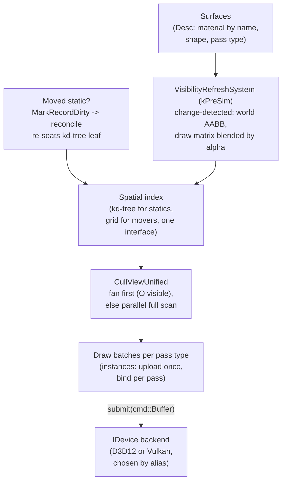

# Rendering & Visibility

The rendering path is where two of the engine's bets meet. From
[Core](Core.md) it inherits the data table store, the fixed-tick clock, and the
task scheduler. From [Components](Components.md) it inherits the trunk-and-backend
pattern that lets one interface stand in for many implementations. Put those
together and you get a renderer where the calling code never names a graphics API,
and a visibility pipeline where "what is on screen this frame" is answered by
draining a spatial index rather than scanning the world.

This page walks the frame from the top: how a device backend is chosen, how a
surface becomes a draw, how the cull decides what survives, and how the picture
stays smooth between simulation ticks. The through-line is that rendering is the
[trunk-and-backend philosophy](Components.md) applied to graphics, all the way
down.

---

## One device interface, two backends

The GPU is behind a single interface, `IDevice`. Every rendering call the rest of
the engine makes goes through it, and nothing above it knows whether the concrete
device is Direct3D 12 or Vulkan:

```cpp
// IDevice.h
struct IDevice : component::IComponentSingleton
{
    virtual ConstStr getName() const = 0;
    // ...
    virtual Result mapPrimitiveData(const primitive::Handle hPrimitive,
                                    void** ppVertexData, void** ppIndexData) = 0;
    virtual void   unmapPrimitiveData(const primitive::Handle hPrimitive,
                                      const uint32_t NumVertices, const uint32_t NumIndices) = 0;
    // ...
    virtual Result submit(cmd::Buffer& Buffer) = 0;
};
CE_DECLARE_INTERFACE_ID(Device)

CE_API IDevice* GetDevice();
```

`IDevice` is itself script-exported, which constrains what can go on it: no new
reference-out or `void**` virtuals, because those do not survive the C / C# / Lua
binding generator (see [Script Generation](ScriptGeneration.md)). The `void**`
pair on `mapPrimitiveData` is a pre-existing exception the generator already
tolerates, not a template for new methods. That constraint is a feature: it keeps
the device surface honest and portable across the three scripting languages.

Which backend answers `GetDevice()` is decided by the **component alias**, the
generic-CID pattern documented in [Components](Components.md#the-alias-pattern).
The trunk (`Graphics`) declares a generic device id alongside a no-op fallback:

```cpp
// Graphics/Module.h
// CID_Device is the generic device CID; each backend's Initializer aliases it
// to its own concrete CID (CID_DeviceD3D12 / CID_DeviceVk). CID_DeviceNull is
// the trunk's default fallback -- a no-op, no-GPU device for headless tests and
// dedicated servers.
CE_DECLARE_COMPONENT_ID(Device)
CE_DECLARE_COMPONENT_ID(DeviceNull)
```

Three layers then compete to resolve that alias, exactly as the pattern
prescribes, and the last word is deterministic:

```cpp
// Graphics/ModuleFactories.cpp:      trunk default, so the package works alone.
component::SetComponentAlias(CID_Device, CID_DeviceNull);

// GraphicsD3D12/ModuleFactories.cpp: this DLL, when loaded, claims the device.
component::SetComponentAlias(CID_Device, CID_DeviceD3D12);

// GraphicsVk/ModuleFactories.cpp:    so does this one.
component::SetComponentAlias(CID_Device, CID_DeviceVk);
```

```lua
-- Resources/Scripts/config.lua -- the deterministic pin (Vk or D3D12).
ceili.core.component.setComponentAlias(ceili.graphics.CID_Device,
                                       ceili.graphics.CID_DeviceVk)
```

The `Null` fallback is what makes the whole engine testable without a GPU: unit
tests and headless servers load no backend DLL, the alias
stays on `CID_DeviceNull`, and rendering calls become no-ops that still exercise
every code path above the device line. This is why the headless smoke test in
[Core's build workflow](Core.md) can validate scene teardown with no window and no
adapter. The commercial heavyweights tend to bury the backend selection in a build
configuration or a platform abstraction layer compiled per-target; here it is a
one-line runtime alias, swappable in a config script, and the same binary carries
both.

---

## Surfaces: a draw described by data

A **surface** is the authoring-side description of a renderable thing. Following
the [Desc-versus-wrapper split](Core.md), the authored `Desc` holds only data a
designer edits, and it references its material **by name**, never by handle:

```cpp
// Surface.h
constexpr uint32_t kMaxMaterialNameLen = 63;

struct Desc
{
    char             materialName[kMaxMaterialNameLen + 1]{};
    primitive::Shape shape  = primitive::Shape::Sphere;
    float            tiling = 1.0f;
    // ...
};
using HandleArray = Array<Handle, 0, uint16_t>;
```

The runtime handle lives on the scene wrapper, hidden from the property grid and
skipped by every serializer, because a handle is a per-process token that must
never be saved:

```cpp
// Surface.h
struct Surface : public ceili::graphics::surface::Desc
{
    // ...
    ceili::graphics::material::Handle hMaterial CE_HIDE CE_NOSERIALIZE;
    // The material resolved from Desc::materialName by OnInsert / ReconcileDirtySurfaces,
    // or set directly as a runtime override ... The render passes skip a surface
    // whose hMaterial is invalid.
};
```

That last sentence is the whole contract in one line: **name resolves to handle,
and an unresolved name renders nothing.** A surface whose `materialName` does not
match a registered material has an invalid `hMaterial`, and every pass silently
skips it. This is a deliberate, checkable failure mode rather than a crash, and it
is verifiable in a headless run with no device at all: material identity is a
`Hash32` of the slash-name, resolved on the CPU side, so the resolution is device
independent. See [Materials](Materials.md) for how names become handles.

Surfaces are drawn under **pass types**. A pass type is a strong 64-bit id that
packs a priority in the high bits and a FourCC tag in the low bits, so passes sort
into a fixed pipeline order without a hand-maintained enum:

```cpp
// Graphics.h
namespace draw { namespace pass {
CE_STRONG_TYPE(Type, uint64_t) // Priority (high 32 bits) + FourCC (low 32 bits)

namespace priority {
constexpr uint32_t kShadow   = 0;   constexpr uint32_t kDepth       = 100;
constexpr uint32_t kGBuffer  = 200; constexpr uint32_t kEnvironment = 300;
constexpr uint32_t kLighting = 400; constexpr uint32_t kForward     = 500;
constexpr uint32_t kPostProcess = 600; constexpr uint32_t kOverlay  = 700;
constexpr uint32_t kUi       = 800;
}
namespace types {
constexpr Type kDepthPrePass       = PriorityFourCC<Type>(priority::kDepth,   'D','P','R','E');
constexpr Type kDirectionalForward = PriorityFourCC<Type>(priority::kForward, 'D','F','W','D');
// ...
```

Each pass is served by an `IRender` looked up by its type, and every renderer
reports the pass it belongs to:

```cpp
// Draw.h
virtual pass::Type getPassType() const = 0;
CE_API IRender* GetRender(const pass::Type Type);
```

The priority ordering (`kDepth` before `kForward` before `kPostProcess`) is the
frame's pipeline written as data. Adding a pass is registering a renderer under a
new FourCC at the right priority, not editing a central switch. The post-process
chain that rides the tail of this order is its own page:
[Post-Processing](PostProcessing.md).

---

## Visibility: a hot-cold split

Before anything is culled, each renderable carries a small amount of
visibility state, and the engine splits it into a **hot** part (touched by the
cull every frame) and a **cold** part (the geometry math that only changes when
the object moves):

```cpp
// Scene/Visibility.h
struct Visibility
{
    math::Bounds world CE_READONLY CE_NOSERIALIZE{};
    VisibleFlags flags CE_HIDE     CE_NOSERIALIZE = VisibleFlags::None;
};

struct VisibilityGeometry
{
    math::Mat4       worldMatrix    CE_HIDE CE_NOSERIALIZE = math::Mat4Identity();
    math::Transform  cachedTransform CE_HIDE CE_NOSERIALIZE{};
    math::Transform  prevTick       CE_HIDE CE_NOSERIALIZE{};
    math::Transform  currTick       CE_HIDE CE_NOSERIALIZE{};
    math::Bounds     local          CE_READONLY CE_NOSERIALIZE{};
    VisibilityStateFlags stateFlags = VisibilityStateFlags::None;
    math::Transform  localTransform{};
    core::chrono::FrameCount lastWarmFrame CE_HIDE CE_NOSERIALIZE{core::chrono::InvalidFrameCount};
};
```

The `Visibility.world` AABB is the *only* thing the cull reads. Everything else,
the world matrix used to draw, the local bounds, the previous and current tick
poses used for interpolation, lives in `VisibilityGeometry` and is recomputed only
when the object's transform changes. Keeping the cull's working set to one bounds
per object is what lets it stay cache-friendly at a hundred thousand objects.

Both structs are stored as columns in the scene's [data table store](Core.md).
`Visibility` is its own table, keyed by type hash like every other component, and
the cull's job is to fill each view's visible-key set from those rows.

---

## Keeping visibility fresh: one generic system

When an object moves, its `Visibility.world` and its `VisibilityGeometry` must be
recomputed, or the cull tests a stale box and the draw uses a stale matrix. The
naive approach is a companion updater per moving type (one for boids, one for the
player, one for every future kind). The engine rejects that. There is exactly
**one** generic, change-detected system that refreshes every renderable surface:

```cpp
// Scene/SceneSystems.cpp
// VisibilityRefreshSystem -- the ONE generic per-frame world-bounds refresh for EVERY renderable
// surface (boids, the player plane, any future moving surface type), replacing the per-writer
// companion pattern...
using VisibilityRefreshContract =
    core::scene::system::Contract<const math::Transform, const surface::scene::Surface, Visibility>;

class VisibilityRefreshSystem final
    : public graphics::scene::SystemVisibilityRefresh<VisibilityRefreshContract>
{
public:
    core::scene::system::Priority getPriority() const override
    {
        return core::PriorityFourCC<core::scene::system::Priority>(
            core::scene::system::band::kPreSim, 'V','R','E','F');
    }
    // No update() override -- inherits the template's change-detected parallel compose
};
```

Read the `Contract` the way [Core's scheduler](Core.md#tasks-threading-and-the-fixed-tick-clock)
does: `const math::Transform` and `const surface::scene::Surface` are reads, the
non-const `Visibility` is a write. The scheduler now knows this system reads
transforms and writes visibility, and can fan it out in parallel against any
system whose writes do not overlap, with no locks and no manual barrier. It runs
in the `kPreSim` band so the visibility set is fresh before the cull looks at it,
and it inherits the base template's change-detected parallel compose, so it only
recomputes objects whose transform actually changed this frame.

This is the single-source-of-truth rule from [Core](Core.md) applied to
visibility: one funnel refreshes every moving surface, so a new renderable type
gets correct culling and correct draw matrices for free, exactly the way a new
reflected field gets serialization for free in [Metadata](Metadata.md).

**Moved statics need one extra nudge.** A static object binned into the scene's
kd-tree has its world AABB stored *inside a tree leaf*. Recomputing its bounds is
not enough; the tree must re-seat it, or a frustum query walks past its old leaf.
The engine enqueues an editor-moved entity onto the surface table's dirty-key
worklist, and the same reconcile pass that [Core's dirty tracking](Core.md#data-the-table-store-the-engine-is-made-of)
drains re-bins it:

```cpp
// Scene/SceneSystems.cpp
// Enqueue a composed (i.e. editor-moved) entity onto the surface table's dirty-key worklist -- the
// generic changed-entity queue ReconcileDirtySurfaces drains -- so the scene kd-tree re-seats the
// entity's world AABB (updateEntity + leaf re-bin) before the next query.
void EnqueueMovedEntityForReconcile(const core::data::DatabaseId Db, const core::data::Key Key)
{
    core::data::MarkRecordDirty(Db, core::data::TableId(core::meta::TypeHash<surface::scene::Surface>()), Key);
}
```

Moving a surface in the editor is a `MarkRecordDirty` call; the reconcile drains
the worklist and calls the tree's `updateEntity`. The same dirty-key primitive
that drives the property grid and undo drives spatial re-seating.

---

## The spatial index: two shapes, one interface

The cull is only fast because it does not scan the world. It queries a **spatial
index**, and the index itself follows the trunk-and-backend pattern one more time:
a base interface with two specializations, selected through `getInterface` rather
than a downcast.

```cpp
// Spatial/SpatialIndex.h
struct ISpatialIndex : component::IComponent
{
    virtual Type getType() const = 0;
    virtual void buildPoints(/* ... */) = 0;
    virtual void queryFrustum(core::Array<core::data::Key>& Out, const math::Frustum& Frustum) const = 0;
    virtual void applyVisibleNodes(core::data::Key* Out, core::atomic::Atomic<uint32_t>& Count,
                                   const VisibleNodeSet& Full, const VisibleNodeSet& Intersect,
                                   const math::Frustum& Frustum) const = 0;
    virtual void warmup(const core::scene::Handle hScene) = 0;
};
CE_DECLARE_INTERFACE_ID(SpatialIndex)

struct ISpatialTree : ISpatialIndex
{
    virtual void buildTree(const math::Bounds& SceneBounds, const int32_t MinLeafSize) = 0;
    virtual void insertEntity(const core::data::Key Key, const math::Bounds& World) = 0;
    virtual void updateEntity(const core::data::Key Key, const math::Bounds& World) = 0;
    virtual void queryFrustumNodes(VisibleNodeSet& OutFull, VisibleNodeSet& OutIntersect,
                                   const math::Frustum& Frustum) const = 0;
    virtual void prepare() = 0;
};
CE_DECLARE_INTERFACE_ID(SpatialTree)

struct ISpatialGrid : ISpatialIndex
{
    virtual void buildLeafCellMap(ISpatialIndex& Tree, const math::Bounds& Region, const float CellSize) = 0;
    virtual bool isMembershipValid() const = 0;
};
CE_DECLARE_INTERFACE_ID(SpatialGrid)

inline ISpatialTree* AsSpatialTree(ISpatialIndex* pIndex) { /* getInterface(IID_SpatialTree, ...) */ }
inline ISpatialGrid* AsSpatialGrid(ISpatialIndex* pIndex) { /* getInterface(IID_SpatialGrid, ...) */ }
```

The **kd-tree** is the static-geometry index. It is built once at scene-load
warmup, ingesting the static `Visibility` rows, and it answers the queries that
matter for a mostly-still world:

```cpp
// Spatial/SceneKdTree.h
// The scene's kd-tree -- the STATIC-entity index: its queryRay returns the static candidates (picking),
// queryFrustum the cull fan's frustum-tested static set, and queryFrustumNodes the visible-leaf set a
// grid expands. Created + warmed (buildTree + ingest the static Visibility rows) by the
// SpatialSetupSystem at scene-load warmup, BEFORE the boid spawn -- this only FINDS it.
CE_API ISpatialTree* GetSceneKdTree(const core::scene::Handle hScene);
```

The **grid** handles the opposite case: a large population of small movers where a
uniform cell map is cheaper to keep current than a tree of tight leaves. It even
bootstraps off the tree, calling `buildLeafCellMap(Tree, ...)` to seed its cells
from the tree's visible-leaf set. Two data structures, two performance profiles,
one interface, and the caller picks between them with `getInterface` rather than
knowing either concrete type. This is the same swap-the-implementation seam as the
device backend, at a finer grain.

---

## The unified cull: one fan for 3D and 2D

The camera and the [2D orthographic views](Studio.md) do not have separate cull
code. Both route through one entry point, which tries the fast spatial-index fan
first and falls back to a parallel full scan only when there is no usable index:

```cpp
// Scene/SceneSystems.cpp
// The unified cull -- try the O(visible) kd-tree/grid fan (descend once + applyVisibleNodes per index,
// gathers parallel), else the parallel full scan (CullVisibilityParallel). BOTH the 3D camera
// (CullSystem, kCull) AND the 2D ortho wireframe views (the DrawSystem loop, kDraw) route here...
void CullViewUnified(const core::scene::Handle hScene, const core::data::DatabaseId Db,
                     const math::Frustum& Frustum, const core::data::Key ViewKey)
{
    CE_PROFILE
    CE_CULL_STAT_RESET();
    if (TryCullViewFan(hScene, Db, Frustum, ViewKey))
    {
        CE_CULL_STAT_LOG("Fan", ViewKey, draw::DebugVisibleSetCount(hScene, ViewKey));
        return;
    }
    const core::data::TableId vis_table = core::data::GetTableId(Db, "ceili::graphics::scene::Visibility");
    if (vis_table == core::data::kInvalidTable) return;
    CullVisibilityParallel(hScene, Db, vis_table, Frustum, ViewKey);
    CE_CULL_STAT_LOG("FullScan", ViewKey, draw::DebugVisibleSetCount(hScene, ViewKey));
}
```

The fan is the fast path: descend the index once, call `applyVisibleNodes` per
index to gather the leaves the frustum touches, and produce the visible-key set in
time proportional to what is *visible*, not to the scene's total object count. The
full scan (`CullVisibilityParallel`) is the fallback, a `ParallelFor` over every
`Visibility.world`, used only when a view has no spatial index yet, and it doubles
as the direct entry point unit tests call. The important detail is that the
**camera takes the same fan-first path as the wireframe views**: there is no
privileged "real" cull and cheap "editor" cull that drift apart. One router, one
set of statistics counters, both dimensions.

Because both paths write the same per-view visible-key set, the rest of the
pipeline downstream of the cull neither knows nor cares which path produced it.

---

## Instance transforms: upload once, bind per pass

A batch of instanced surfaces (a swarm of identical boids, say) shares one mesh
and differs only by transform. Uploading those matrices to the GPU every frame,
for every pass, is pure waste when they have not changed. The engine tags each
instanced upload with a stable id and a changed flag, and the backend keeps a
persistent buffer keyed by that id:

```cpp
// InstanceUpload.h
struct InstanceUploadMeta
{
    uint32_t stableId       = 0;
    bool     contentChanged = true;
};

// draw::UploadInstances routes every INSTANCED batch through UploadInstanceTransformsBatched, tagging it
// with a STABLE per-batch id + whether its transforms changed this frame. The submit-side backend keeps a
// per-batch PERSISTENT instance buffer keyed by that id: a batch unchanged for longer than the backend's
// frames-in-flight is uploaded ONCE and thereafter only BOUND -- no per-frame re-upload of identical
// matrices (the idle-editor win layered on G1).
CE_API InstanceHandle       UploadInstanceTransformsBatched(const math::Mat4* pData, const uint32_t Count,
                                                            const uint32_t StableId, const bool ContentChanged);
CE_API InstanceUploadMeta   GetInstanceUploadMeta(const InstanceHandle Handle);
```

The rule is **upload once, bind per pass.** A batch's matrices go to the GPU a
single time; each of the many passes that draw it (depth pre-pass, then the
forward pass, then any overlay) *binds* the already-resident buffer instead of
re-uploading. For a static or idle scene the per-frame instance-transform traffic
collapses to nothing, which is a large part of how the boids demo holds its frame
budget. The full story of that budget is [The Road to 100k Boids](Performance_100kBoids.md).

---

## Render interpolation: smooth between fixed ticks

Simulation runs on a [fixed-tick clock](Core.md#tasks-threading-and-the-fixed-tick-clock)
so behaviour is deterministic regardless of frame rate. But if the renderer drew
the raw simulated pose, motion would visibly step at the tick rate whenever the
frame rate ran ahead of the sim rate. The fix is to interpolate the *draw* pose
between the last two simulated ticks by the frame's `alpha`, while leaving the
*cull* bounds on the live pose:

```cpp
// Scene/SceneSystems.cpp
bool GetInterpolatedRenderPose(math::Transform& Out, const VisibilityGeometry& Geom,
                               const math::Transform& Live, const float Alpha)
{
    if (Geom.currTick != Live || Geom.prevTick == Geom.currTick)
    {
        return false;
    }
    Out = TransformLerp(Geom.prevTick, Geom.currTick, Alpha);
    return true;
}

void RefreshInterpolatedDrawMatrix(VisibilityGeometry& Geom, const math::Transform& Live, const float Alpha)
{
    math::Transform render_pose;
    if (GetInterpolatedRenderPose(render_pose, Geom, Live, Alpha))
    {
        ComposeDrawMatrix(Geom, math::Mat4FromTransform(render_pose));
    }
}
```

The two tick poses (`prevTick`, `currTick` on `VisibilityGeometry`) are shifted
once per simulation tick by a Play-only shadow system. The frame-domain
`VisibilityRefreshSystem`, running in `kPreSim` every frame, blends the draw matrix
by `ComponentUpdate.alpha`. The result is a clean separation: **draw pose is
interpolated for the eye, cull pose stays on the tick for correctness.** This is
what lets a hundred thousand boids simulate at a fixed rate and still render
buttery-smooth on a faster display; the same decoupling underpins the remote-peer
smoothing the [multiplayer layer](Networking.md#path-a-gameplay-replication) relies
on.

One convention worth carrying into your shaders when you consume these matrices:
`math::Mat4` is row-major with row-vector semantics, so the canonical HLSL
multiply is `mul(v, M)`, vector first. `mul(M, v)` compiles and silently projects
through the transpose. The full rationale is in [Materials](Materials.md).

---

## The frame path, end to end

Putting the pieces in order, one frame of rendering flows like this:



<!-- MEDIA: a side-by-side capture of the same scene rendered through the Vulkan
     backend and the D3D12 backend, pixel-identical, with the config.lua alias
     line that selects each. This is the "no calling code changed" proof. -->

<!-- MEDIA: a debug-overlay screenshot of the kd-tree / grid leaf boxes with the
     camera frustum, and the cull statistics counter showing visible-set count
     versus total object count (the fan's O(visible) win made visual). -->

Read left to right, every arrow crosses a seam the engine deliberately made
swappable. Surfaces are pure data. Visibility refresh is one generic system the
scheduler parallelizes off its contract. The spatial index is an interface with
two backends. The cull is one router serving camera and editor alike. And the
device at the end is chosen by a config line, not a compile flag.

---

## Why it composes

The renderer is not a special subsystem with its own rules; it is the same handful
of Core and Component ideas applied to pixels:

- A **device** is an interface resolved by a runtime **alias**, so the same binary
  ships both Direct3D 12 and Vulkan, and a headless `Null` device makes the whole
  path testable with no GPU.
- A **surface** is authored data that references its material by name; an
  unresolved name is a checkable no-draw, not a crash.
- **Visibility** is a table column, refreshed by **one** change-detected system
  whose read/write **contract** lets the scheduler parallelize it for free.
- The **cull** queries a **spatial index** (a kd-tree or a grid behind one
  interface), and camera and 2D views share the identical fan-first path.
- **Instances upload once and bind per pass**, and the **draw pose interpolates**
  between fixed ticks while the cull pose stays on the tick.

Most engines assemble a renderer from bespoke parts: a platform render hardware
interface, a hand-written visibility system per object kind, a separate editor
viewport path. Ceili reaches the same capabilities by pointing its existing
interfaces, tables, systems, and aliases at rendering. The leverage is that adding
a backend, a pass, or a renderable type is filling in a known seam, not inventing
one.

Next: [Materials](Materials.md) for how a material name becomes a pipeline, or
[The Road to 100k Boids](Performance_100kBoids.md) for the numbers this path was
built to hit. Back to the [documentation index](README.md).
