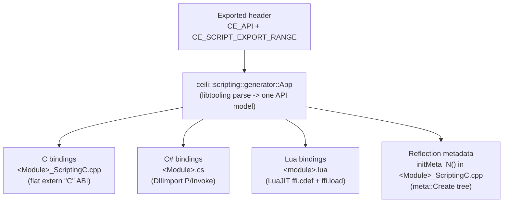

# Script Generation

Ceili is a C++ engine with a deliberately small public surface: C-like free
functions that trade in handles, not objects (see
[Philosophy: Handles, not objects](Philosophy.md#handles-not-objects)). That
surface is meant to be *reachable* from more than C++. The engine runs game code,
tools, and tests in C#, and it authors scenes, systems, and config in Lua. For
that to work, every exported function needs a binding in three languages, and the
runtime needs a reflection description of every exported type.

The wrong way to do this is to hand-write it: a C shim per function, a
`DllImport` per function, an FFI `cdef` per function, a `meta::Create` per field,
all maintained by hand and all drifting quietly out of sync the moment someone
edits a header. Ceili does not do that. **One exported header is the single source
of truth, and a generator emits all four artifacts from it.** Change the header,
rebuild, and the C binding, the C# binding, the Lua binding, and the reflection
metadata all move together, because they are all projections of the same parsed
API.

This page shows how that generator works, walks the same function into all three
languages, connects the metadata it emits to
[Metadata & Reflection](Metadata.md), and then goes through the constraints the
scheme imposes, each with the one-line reason it exists.

---

## The single source of truth

The input is a normal engine header. Two things make a symbol part of the
generated surface: the `CE_API` export macro, and a pair of range markers that
bracket the region the generator should walk.

```cpp
// Macros/Scripting.h -- the markers, defined as tagged attribute variables.
#define CE_SCRIPT_EXPORT_RANGE_START  constexpr int Attribute(ScriptExportRangeStart) ...{0};
#define CE_SCRIPT_EXPORT_RANGE_END    constexpr int Attribute(ScriptExportRangeEnd)   ...{0};
```

They are not preprocessor magic that changes what the compiler sees; they are
attribute markers the generator's parser recognizes. In a real header they wrap an
exported namespace like this:

```cpp
// Component.h -- everything between the markers is walked by the generator.
CE_SCRIPT_EXPORT_RANGE_START
namespace ceili { namespace core { namespace component {

CE_API Result CreateComponent(const ComponentId ComponentId, const InterfaceId InterfaceId,
                              IComponentBase** ppInterface, const scope::Handle hScope = scope::Handle());

} } }
CE_SCRIPT_EXPORT_RANGE_END
```

`CE_API` (from `Macros/Core.h`) expands to `__declspec(dllexport)` /
`dllimport` under MSVC: it is the marker that makes a free function part of the C
ABI surface the engine exposes across the DLL boundary. The generator walks
exactly the functions and types that are both inside a range and part of that ABI.
Nothing else leaks out, which keeps the projected surface deliberate rather than
accidental.

---

## How the generator works

The generator is itself an engine app, `ceili::scripting::generator::App`, which
means it is built from the same Core and component machinery as everything else.
It is a clang libtooling-based parser: it does not scrape text, it parses the
*live* header into an AST and walks the declarations.

```cpp
// ScriptingGenerator/Src/App.cpp -- driven entirely by command-line args.
virtual Result update(...) override
{
    ConstStr input_file_name  = platform::GetCommandLineArgValue("-i");   // the header
    ConstStr output_file_name = platform::GetCommandLineArgValue("-o");   // where to write
    ConstStr include_folders  = platform::GetCommandLineArgValue("-inc"); // parse context
    ConstStr defines          = platform::GetCommandLineArgValue("-def"); // parse context
    const bool standalone     = platform::HasCommandLineArg("-standalone");
    Generate(input_file_name, output_file_name, include_folders, defines, standalone);
    return ceili::app::results::success::Exit;
}
```

That "parse the live header" detail matters more than it looks. Because the parser
reads the header exactly as the compiler would (same include paths, same
defines), the generated bindings can never describe a type differently from how
C++ actually lays it out. There is no separate interface-definition language to
keep in step with the code: the code *is* the IDL.

The package is organized around that one job:
`ScriptingGenerator/Src/{App.cpp, ScriptingGenerator.cpp, Parsers/, Writers/}`.
The `Parsers/` turn the AST into a neutral model of the exported API; the
`Writers/` turn that one model into each output. A single parse feeds every
writer, which is the whole reason the four artifacts cannot disagree.



Each artifact lands in its own sibling tree, and each is stamped by the writer
that produced it so nobody mistakes it for hand-written code:

```
Pkg/Engine/ScriptingGenerator/Src/Writers/Writer_Cpp.cpp:42:    "// Generated File - DO NOT MODIFY"
Pkg/Engine/ScriptingGenerator/Src/Writers/Writer_DotNet.cpp:96: "// Generated File - DO NOT MODIFY"
Pkg/Engine/ScriptingGenerator/Src/Writers/Writer_Lua.cpp:65:    "-- Generated File - DO NOT MODIFY"
```

The outputs are `Pkg/Engine/ScriptingC/` (C), `Pkg/Engine/ScriptingDotNet.Net/`
(C#), and `Pkg/Engine/ScriptingLua/Scripts/` (Lua), and the first line of every
generated file carries that marker verbatim. Do not edit them: the next build
overwrites them.

<!-- MEDIA: a simple side-by-side diagram or short screen capture showing one
     header on the left and the four generated files (Core_ScriptingC.cpp, Core.cs,
     core.lua, and the initMeta_N block) fanning out on the right, each with its
     "Generated File - DO NOT MODIFY" first line highlighted. -->

---

## One function, three languages

The clearest way to see the scheme is to take a single exported function and
follow it into all three bindings. The mechanics are the same for every function;
only the target language changes.

The pattern always has the same shape. The C binding is the real boundary: a flat
`extern "C"` function that takes primitives and handles (never C++ objects), does
any handle-to-pointer conversion internally, and calls the true C++ API. The C#
binding is a `DllImport` declaring that same C symbol. The Lua binding is an
`ffi.cdef` declaring it plus an `ffi.load` of the module's shared library. Three
projections, one underlying symbol.

Here is a real case: a getter that returns a container. On the C++ side it returns
an engine container by const reference, which is the idiomatic engine style (see
[Core: exposing containers to script](Core.md#containers-contiguous-by-default)):

```cpp
// ShaderConstants.h -- the C++ API: const-ref container return.
CE_API const Element::Array& GetElements(const Handle hConstants);
```

The generator recognizes the const-ref container return and emits a C binding that
splits it into the shape C, C#, and Lua can all consume: a pointer to the first
element plus a count written through an out-parameter. This is generated verbatim,
not hand-written:

```cpp
// Graphics_ScriptingC.cpp -- generated C binding for GetElements.
CE_API const ceili::graphics::material::shader::constants::Element*
ceili_graphics_material_shader_constants_GetElements(const uint16_t hConstants, uint64_t* Count)
{
    auto _hConstants_ = ceili::graphics::material::shader::constants::GetHandle(hConstants);
    const auto & val  = ceili::graphics::material::shader::constants::GetElements(_hConstants_);
    if (Count) *Count = val.size();
    return val.data();
}
```

Notice what the shim absorbs. The handle crosses as a bare `uint16_t` and is
turned back into a typed handle internally. The container's identity stays on the
C++ side; only a raw pointer and a size escape. The caller in another language
gets a pointer-plus-count pair it can iterate naturally, and never has to know
what `Element::Array` is. That is the same reason handles, not objects, are the
public currency: a `uint16_t` and a `T*` cross a language boundary trivially; a
C++ type with a vtable and a growth policy does not.

The C# projection of the same symbol is a `DllImport` into that module's shared
library, generated into `Core.cs` / `Graphics.cs`:

```csharp
// A DllImport binding names the same flat C symbol the C writer emitted.
[DllImport("Graphics")]
static extern IntPtr ceili_graphics_material_shader_constants_GetElements(
    ushort hConstants, out ulong Count);
```

And the Lua projection declares the identical symbol to LuaJIT's FFI and loads the
module, generated into `graphics.lua` / `core.lua`:

```lua
-- The Lua binding: one ffi.cdef for the symbol, one ffi.load for the module.
ffi.cdef[[
const void* ceili_graphics_material_shader_constants_GetElements(uint16_t hConstants, uint64_t* Count);
]]
local lib = ffi.load(ceili.sharedLibPath("Graphics"))
```

Three files, three languages, one C symbol underneath all of them. None of it was
typed by a human, and none of it can describe the function differently from the
header, because all three came out of the same parse.

---

## Metadata emission: the reflection tree is generated here

The same generator pass, over the same header, emits one more artifact: the
runtime reflection metadata. This is the registration that
[Metadata & Reflection](Metadata.md) is built on. The property grid, the
serializers, and undo/redo all walk a tree of `meta::Info` nodes; those nodes are
*created here*, one `meta::Create` call per type and per field, generated straight
from the header.

The writer emits a numbered `initMeta_N()` function per registered type, then a
`Create` for the type and a `Create` for each member:

```cpp
// Writer_Cpp.cpp -- the metadata writer builds an initMeta_N per type.
writePrintf("static void %s()\n", func_name);   // "initMeta_%d"
writeText("{\n");
writePrintf("const auto %s = Create<%s>(%s);\n", entry_name.c_str(), type_name, annotation.c_str());
// ... then one Create(...) per member ...
```

The output lands in the *same* `_ScriptingC.cpp` file as the function bindings, so
one generated file per module carries both the ABI shims and the reflection
registration. Here is a real slice:

```cpp
// Core_ScriptingC.cpp -- generated metadata registration (excerpt).
static void initMeta_0()
{
    // ceili::core::types::Meta
    const auto entry_0 = Create<ceili::core::types::Meta>(nullptr, 0, {}, Flags::Bitfield);
    Create<ceili::core::types::Meta>(entry_0, "None", 0, {}, Flags::HasDefault | Flags::Enum);
    // ... one Create per enum value ...
}
static void initMeta_2()
{
    // ceili::core::TypeNameStr
    const auto entry_0 = Create<ceili::core::TypeNameStr>();
    Create(entry_0, &ceili::core::TypeNameStr::start, "start", {}, Flags::None);
    Create(entry_0, &ceili::core::TypeNameStr::len,   "len",   {}, Flags::None);
}
```

`entry_0` is the tree root for the type; each `Create(entry_0, &Type::field, ...)`
hangs a child `meta::Info` off it by member pointer, name, and flags. That is
exactly the "one `Create` per member" shape [Metadata](Metadata.md) describes when
it says the registration is *generated from the header, so you never hand-write
it*. The flags carried here (`Flags::Enum`, `Flags::HasDefault`, and elsewhere
`Hide` / `NoSerialize` / `ReadOnly` from header attributes) are the same flags the
property grid and the serializers later read. The `meta::Create<T>()` template that
these calls target lives in `Pkg/Engine/Core/Include/Meta.h`.

The important structural point: the function bindings and the metadata come out of
**one generator pass over one parsed header into one output file**. A few thousand
lines apart in `Core_ScriptingC.cpp`, you will find both a plain function binding
(say `ceili_core_Hash32`) and the `initMeta_N` reflection tree. They are the same
header, viewed once through two writers. That is why a field you add to a struct is
simultaneously reachable from C#/Lua *and* editable in the property grid,
serializable, and undoable: both projections regenerate from the one edit.

---

## One more output: the MCP tool catalogue

The language bindings and the reflection tree are not the only things this one pass
emits. A scripting-API function can also be tagged as a *tool* for the engine's
embedded AI agent, and another writer turns those tags into a Model Context
Protocol (MCP) catalogue.

```cpp
// A scripting-API function annotated as an agent tool (Agent.h).
CE_AGENT_TOOL("Execute a Lua script in the running Ceili engine.")
inline ConstStr ExecuteLua(CE_AGENT_PARAM("Script", "The Lua source to run.") ConstStr Script);
```

`CE_AGENT_TOOL` and `CE_AGENT_PARAM` are attribute macros, read the same way the
reflection writer reads `CE_HIDE` or `CE_RANGE`. During the *same* parse, a tools
writer selects every function carrying the tag and emits a per-package
`<Module>_Tools.json` in MCP's tool shape:

```json
{
  "name": "ceili_agent_tools_ExecuteLua",
  "description": "Execute a Lua script in the running Ceili engine.",
  "inputSchema": {
    "type": "object",
    "properties": { "Script": { "type": "string", "description": "The Lua source to run." } },
    "required": ["Script"]
  }
}
```

The engine's in-process MCP server loads those catalogues at startup and registers
each entry as a live tool, so the embedded Claude agent's toolset *is* the annotated
scripting API, kept in lockstep by the same generation pass that produced the C#,
Lua, and reflection outputs. The agent and the server are their own story (see
[AI Integration](AiIntegration.md)); the point here is the source. One edit to a
header can light up a C binding, a C# binding, a Lua binding, reflection metadata,
and, where a function is tagged, a tool the AI agent can call.

---

## The constraints, and why each one exists

Projecting one C++ header into a flat C ABI, a P/Invoke surface, and a
single-pass FFI parser is not free. C++ has expressive features (overloading,
namespaces, anonymous types) that the three target surfaces cannot all represent.
So the exported-header surface obeys a handful of house rules. Each rule buys the
generator a guarantee, and violating one produces a build break or, worse, a
silently dropped binding.

**No overloaded function names.** The C binding layer emits flat `extern "C"`
symbols, and C has no overload resolution: two C++ functions with the same name
collide into one conflicting symbol, and the C# generator produces duplicate
delegate names. So every exported name is unique, using a descriptive suffix
instead of parameter-type overloading:

```cpp
// IDevice.h -- a descriptive suffix stands in for a second "resizeRenderTarget" overload.
virtual Result resizeRenderTargetDesc(const renderTarget::Handle hRenderTarget,
                                      const renderTarget::Desc& Desc) = 0;
```

**No Lua reserved words as names.** Exported PascalCase names are lowercased for
the Lua binding, so `End()` would become `ceili.ui.end()`, and `end` is a Lua
keyword that breaks the parser. The fix is to rename at the source:

```cpp
// Ui.cpp -- named EndWindow, not End, so the Lua binding is ceili.ui.endWindow().
void EndWindow();   // called from Lua as ui.EndWindow(), never ui.end()
```

**Container returns become pointer-plus-count.** A C++ container has no
cross-language representation, so a const-ref container return is lowered to a
`T*` plus an out-count (shown in full above with `GetElements`). This keeps the
C++ side idiomatic while giving C, C#, and Lua a shape they can each consume.

**`uint32_t`, not `unsigned int`.** The C# generator maps the fixed-width type
correctly and does not reliably map `unsigned int`, so exported signatures use the
sized spelling.

**Named enums, no anonymous enums in namespaces.** An anonymous
`enum : uint32_t { ... }` gives the C# generator no type name to project, so
every exported enum is named (`enum Enum : uint32_t { ... }`). Relatedly, negative
enum values trip signed/unsigned mismatches in metadata registration, so exported
enums stay non-negative.

**Cross-namespace interface-pointer ordering.** LuaJIT's FFI parser is
single-pass: it reads `core.lua` top to bottom and rejects a forward reference. An
exported function in a *parent* namespace that takes a pointer to an interface
defined in a *child* namespace makes the generator emit that function's `ffi.cdef`
*before* the child's `typedef`, and the whole file fails to parse (while the
order-independent C and C# bindings compile fine and mask the break). The fix is
to spell such a parameter as a base type whose typedef is emitted earlier (for
example an `IComponentBase*`) and `static_cast` to the derived pointer internally.

Every one of these is the same story: the C++ header is more expressive than the
narrowest of the three targets, so the exported surface commits to the intersection
the generator can faithfully project. The rules are small, and staying inside them
is what keeps "edit header, rebuild, three languages update" a reliable move rather
than a hopeful one.

---

## Why this is the multiplier

The engine's central bet is that the public API is a small, handle-based, C-like
surface (see [Philosophy](Philosophy.md)). Script generation is what turns that
bet into leverage. Because the surface is small and C-like, it is *cheap to
project*: a handle is a `uint16_t`, a result is a `uint32_t`, and a container
return lowers to a pointer and a count, all of which cross a language boundary for
free. A generator that understands those few shapes can fan the entire API out into
C, C#, and Lua from one parse, and stamp out the reflection tree in the same pass.

The result is that interop is not a maintenance tax. You do not hand-write a shim,
a P/Invoke, an FFI declaration, and a reflection descriptor per function and pray
they stay aligned. You write one exported function in one header, and the four
projections regenerate together, guaranteed consistent because they are one AST
walk. That is the same "one source, many features" pattern
[Metadata](Metadata.md) uses at the field level and [Core](Core.md) uses at the
data-table level, applied here to language interop: it is precisely what lets a
game system, an editor tool, or a unit test be written in whichever of C++, C#, or
Lua fits, against the very same API, with component instances implementable in any
of them.

Next: [Component Architecture](Components.md) for how those cross-language
instances plug into the engine, or back to the
[documentation index](README.md).
