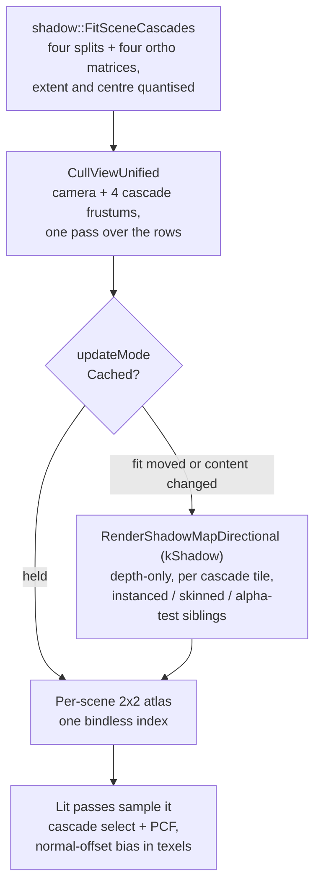

# Shadows

Until the end of August 2026 Ceili cast no shadows at all. Surfaces were lit, and
nothing darkened the ground under them. What landed since is a cascaded shadow
map for the sun: four cascades tiled into one per-scene atlas, fitted to the
camera each frame, baked through the same batch and pass machinery every other
draw uses, and sampled by every lit material family.

This page covers the atlas, the cascade fit, the bake, the filter, the bias, and
the cache that makes the bake skippable. It ends with what shadows still do not
do.

Shadows are on in the shipped default. `display::Settings::renderPasses` carries
`ShadowsDirectional`, and a view without that flag pays none of the cost: no cull
frustums, no bake, no atlas, and no taps in the lighting shader.

---

## Four cascades in one atlas

A directional light has no position to project from, so one shadow map for the
whole view wastes almost all of its resolution on ground the camera never looks
at closely. The standard answer is to split the camera's depth range and give
each slice its own map. Ceili splits it four ways and tiles the four maps into
one square texture:

```cpp
// Src/Shadow/ShadowInternal.h
// Four cascades, tiled 2x2 into one square atlas.  Four is what the legacy corpus authored
// (Shape_Directional_ShadowCascadeDistances carries three interior splits) and what Godot's PSSM
// defaults to; the 2x2 tiling keeps the whole set in ONE texture, so the lighting shader samples a
// single bindless index whichever cascade a pixel lands in.
constexpr uint32_t kNumCascades = 4;
```

One texture means one bindless index. A fragment picks its cascade from its view
depth, scales its lookup into that cascade's quarter of the atlas, and samples.
No branch over four texture slots, and no descriptor change per cascade.

The atlas edge is authored, and the four cascades take a quarter each:

```cpp
// Include/Display.h
enum class ShadowAtlasSize : uint32_t
{
    S1024 = 1024,
    S2048 = 2048,
    S4096 = 4096,
    S8192 = 8192,
};
```

The default is `S4096`, which gives four 2048-texel cascades for 32 MB.

**The atlas is per scene, and that is a correctness requirement.** More than one
scene renders in a frame: the edited scene, the [material preview](MaterialsViewer.md),
and the thumbnail farm all tick at once, and Play mode overlaps them. A single
file-scope atlas would be written by two threads with no ordering between them.
The per-scene slot is the same shape the environment maps use for the same
reason.

---

## Fitting a cascade

Each cascade covers a slice of the camera's depth range. Two questions decide
where the slices fall: how far the shadows reach, and where the three interior
splits sit. Both can be authored on the light, and both can be computed.

```cpp
// Include/Light.h
math::Vec4 shadowCascadeDistances CE_DESC("Directional shadow: the four cascade FAR planes, in view-space distance from the eye, ascending. The fourth is how far the shadow reaches. Only read when computeCascadeSplits is off") = {65.0f, 195.0f, 585.0f, 2048.0f};
```

The default ladder steps by exactly three, which is a fully logarithmic split. It
comes from the ported legacy corpus, where every authored ladder has the same
ratio. `shadow::ResolveCascadeSplits` is the one place the
authored-versus-computed policy lives, and the resolved answer is stamped back
onto the light as a read-only field so the property grid shows what the engine
actually used.

Four inputs can decide the reach, and the light reports which one won:

```cpp
// Src/Shadow/ShadowInternal.h
enum class ReachSource : uint32_t
{
    Authored, // the light's own shadowCascadeDistances.w, taken verbatim
    Computed, // computeCascadeSplits is on, so the ladder was fitted and this is its last plane
    Scene,    // computed AND the scene reached further, so the last cascade was stretched to it
    Seal,     // the atmosphere's horizon seal was nearer, so the last cascade was CAPPED to it
};
```

The seal is the [atmosphere's](Atmosphere.md#the-horizon-seal) gameplay fade at
the edge of a play area. Resolving shadows on geometry it has already turned into
sky would spend atlas resolution on nothing.

Reporting the source is worth the field. Once a reach is authored, the thing left
to surprise you is a template edit that never reached the scene, and that reads
as `Computed` where the author expected `Authored`.

### Stopping the pulse

A cascade fitted exactly to the camera slice changes size and position every
frame the camera moves. Its texel grid slides with it, so the shadow edges crawl
and every straight edge shimmers. Ceili quantises both the extent and the centre:

```cpp
// Src/Shadow/ShadowInternal.h
// How many steps the cascade's world extent is quantised into, as a fraction of the slice's
// rotation-invariant bounding diameter.  The tight light-space box FitCascade builds is ~4x smaller
// in area than that sphere, but its extent moves as the camera turns; rounding it up to one of these
// steps means it changes rarely and by a bounded amount rather than sliding continuously, which is
// what a shadow needs in order not to pulse.  Lower is more stable and more wasteful; 16 costs at
// most 6.25% of the extent.
constexpr float kCascadeExtentSteps = 16.0f;
```

The centre is snapped to the cascade's own texel grid by the same fit. The
scene-derived closing split gets the same treatment against the scene's bounding
diagonal, because the scene does not move and the camera does.

---

## Culling four extra frustums for the price of none

A cascade draws a different set of objects from the camera. An occluder just off
the left edge of the screen still casts into frame, so each cascade needs its own
caster list. Running the cull once per cascade would be five full passes over
every entity in the scene.

Instead the cascade frustums ride along with the camera cull:

```cpp
// Scene/SceneSystems.cpp
// The directional shadow cascades ride ALONG with the camera cull, and that is the whole
// reason the fit lives here rather than in the bake.  Their casters are a different set
// from the camera's - an occluder just off-screen still casts into frame - so each
// cascade needs its own visible-key list; culling them separately would mean a separate
// O(N) pass over every entity for each one.  Handed to CullViewUnified together, the
// rows are read ONCE and tested against all five frustums while their bounds are in
// cache.  A scene without ViewDescFlags::ShadowsDirectional produces none of them and
// the call is exactly what it was before.
```

`CullViewUnified` offers every frustum the spatial-index fan first, on its own,
because a kd-tree descent already costs only what that frustum sees. The
frustums the fan declines are gathered into one list, and the parallel full scan
runs once for all of them. See [Rendering](Rendering.md#the-unified-cull-one-fan-for-3d-and-2d)
for the fan itself.

The cull volume has its own shape setting, kept separate from the fit:

```cpp
// Include/Display.h
enum class ShadowCullShape : uint8_t
{
    // The fit matrix's own six planes -- math::FrustumFromViewProjection of the ortho box.  What
    // shipped, and what every cascade culled against before the hull was measured.
    OrthoBox = 0,
    // The camera's frustum SLICE swept toward the light and capped at the scene's pull-back, which
    // is the exact set of points that can shadow that slice.  The ortho box is the light-space AABB
    // of the same slice, so it over-covers: a truncated pyramid does not fill its own bounding box,
    // and every caster in the difference is drawn into the atlas for nothing.
    SilhouetteHull = 1,
};
```

The fit matrix decides texel layout and has to stay stable and quantised. The
cull volume only decides which casters are drawn. Keeping them apart means
tightening one cannot destabilise the other. `SilhouetteHull` is the default.

---

## The bake, and its three siblings

The bake is a depth-only pass. One shared material
(`base/shadowMap.material`) provides it, with a void fragment shader and a
negative reverse-Z rasterizer bias. It expresses cleanly on both backends: zero
render targets on D3D12, a depth-only render pass on Vulkan.

A caster is drawn through whichever pass type matches its batch shape, exactly as
the forward passes are:

```cpp
// Include/Graphics.h
constexpr Type kShadowMapDirectional = PriorityFourCC<Type>(priority::kShadow, 'S', 'M', 'D', 'R');
// Instanced sibling of kShadowMapDirectional, and the one pass type whose absence was measurable in
// frames rather than in principle.  renderBatch routes off the DRAWN pass's type, so while the bake
// had only the non-instanced spelling a coalesced batch of N casters cost N draws PER CASCADE:
// Example/boids.scene reported 28 batches while issuing 327,534 draws, and the frame ran at 5fps
// against 150 without shadows.  RenderShadowMapDirectional picks this for count>1 batches.
constexpr Type kShadowMapDirectionalInstanced = PriorityFourCC<Type>(priority::kShadow, 'S', 'M', 'D', 'I');
```

The instanced sibling is a performance fix worth 9.7x on the boids scene. The
skinned sibling is a correctness fix:

```cpp
// Include/Graphics.h
// Skinned sibling of kShadowMapDirectional, and it is a CORRECTNESS pass, not a performance one.
// Without it a skinned caster bakes its BIND pose, so a running character throws the shadow of a
// T-pose standing where it started - the same defect kDepthPrePassSkinned exists to prevent one
// pass earlier.  RenderShadowMapDirectional picks it for a batch that is skinned AND carries a bone
// palette; a skinned batch without a palette is not skinned by the forward pass either, so it falls
// through to the ordinary path rather than being dropped.
constexpr Type kShadowMapDirectionalSkinned = PriorityFourCC<Type>(priority::kShadow, 'S', 'M', 'D', 'S');
```

An alpha-tested sibling completes the set, so a grille casts a grille rather than
a solid slab. The rule these three state together: a pass type that exists on the
forward path needs its sibling on the shadow path, or the shadow disagrees with
the shading. See [Meshes and Animation](MeshesAndAnimation.md) for where the bone
palette comes from.

### The guard border follows the filter

Four cascades in one texture share edges. A filter kernel sampling near a tile
edge reads its neighbour, which shows as a hard seam where the cascade changes.
The fix is an unrendered border, and its width is a property of the kernel:

```cpp
// Src/Shadow/ShadowInternal.h
// Integer taps / 2 IS that reach rounded up: 1x1 -> 0, 3x3 -> 1, 4x4 -> 2, 5x5 -> 2.
//
// THREE call sites depend on this and must agree, or the bake and the sample disagree about where a
// tile even is: the bake viewport and scissor (Render/ShadowMapDirectional.cpp), the sampled tile
// scale in shadowParams.z (Render/Base.cpp), and the texel-snap grid handed to FitCascade
// (Shadow/Shadow.cpp).  Add a kernel and all three follow for free; hard-code a border in any one of
// them and they will not.
CE_API uint32_t TileBorderTexels(const display::ShadowPcfKernel Kernel);
```

The border was a constant 1 for a while, which is right for a 3x3 kernel and
silently wrong for anything wider. A 4x4 kernel reaches 1.5 texels from its
centre tap and would sample straight into the next cascade.

---

## Bias: two mechanisms, different units

Shadow acne has one cause: the single depth a shadow texel stores has to serve
every receiver inside that texel. Ceili offers two ways to clear it, and the
units are the interesting part.

`receiverBias` nudges the receiver's depth toward the light, and it is measured
in world metres:

```cpp
// Include/Display.h
float receiverBias CE_DESC("How far toward the light a receiver's depth is nudged before it is compared, in WORLD METRES. It clears the residual self-shadowing the rasterizer bias leaves, so acne wants it larger and a shadow that floats off the surface its caster stands on wants it smaller. Measured in metres rather than depth units on purpose: a cascade's depth range is as deep as the scene reaches toward the light, so the same depth-unit value is centimetres in a small scene and tens of metres in a ported one") = 0.05f;
```

The normal-offset bias moves the lookup instead of the depth, and it is measured
in texels of whichever cascade the fragment landed in. That unit choice removes a
ladder nobody would enjoy authoring: acne scales with the texel's world size, the
shader reads that off the cascade matrix, and a far cascade therefore gets
proportionally more offset with nothing to keep in step with the splits.

Pushing depth lifts a shadow off its caster's contact point. Moving the lookup
reads a neighbouring texel whose stored depth belongs to nearly the same surface,
so the contact stays.

The default was measured rather than guessed. On the shadow contact smoke, with
the rasterizer bias fully zeroed so the offset is measured alone, open sunlit
ground reads 43.5 with no bias and about 48.7 once the acne is cleared. A setting
of 0.25 already clears it and 8.0 still shows no peter-panning, so the shipped
1.0 sits well inside a band with no observed downside at either end.

Its GPU cost measured below the harness noise floor. That measurement needed
interleaved A/B rounds: run as two blocks it showed a clean 28 percent "cost",
and the control gave it away, because the shadow bake moved 19 percent too and
the bake cannot be touched by a receiver-side offset.

---

## The cache

The bake redraws every caster into all four cascades every frame. A cached mode
skips the cascades whose content and fit have not changed:

```cpp
// Include/Display.h
enum class ShadowUpdateMode : uint8_t
{
    // Every cascade re-bakes every frame.  What shipped, and the CONTROL any caching measurement is
    // taken against -- so this path stays byte for byte what it was, the fit included.
    Live = 0,
    // A cascade re-bakes only when its fit moved or something it draws changed.  A PURE CACHE: it
    // never shows a stale shadow, it only skips work that would have produced the same pixels.  The
    // per-cascade period beside it is a backstop against a missed change, not a schedule.
    Cached = 1,
```

Measured on the DirtBox scene through D3D12, over five interleaved rounds, the
shadow bake pass costs 0.383 ms in Live mode against 0.030 ms in Cached, with the
two sets disjoint and the control pass moving 0.01 ms between modes.

The cache needs a margin to hit at all. A cached tile is only valid under the
matrix it was baked with, and without slack the fit re-snaps its centre to the
texel grid on every camera translation past half a texel. `slackTexels` buys that
margin and costs resolution in the same proportion: 64 texels of a 2044-texel
tile spends about 6 percent.

`Off` is the third mode, and it earns its place as a measurement tool. It removes
the cull's extra frustums, the bake, the atlas memory and the lighting shader's
lookup together, which is the only way to state what shadows cost rather than
estimate it.

<!-- MEDIA: the DirtBox terrace with shadows on and off, side by side, plus the
     shadow debug mode that tints each fragment by the cascade that shadowed it.
     The cascade tint is the clearest single image of what this page describes. -->

---

## The frame, in order



Every lit material family samples the atlas, and one place spells the constant
block they all need. `LC.appendShadowConstants` is called by the PBR, clear-coat,
cloth and terrain families, because four hand-kept copies of a seven-field block
were four chances to break silently: a permuted copy compiles and links clean
while reading every field from the wrong offset.

A headless check states the rule rather than counting the families, so a family
added later is covered: every family with a PBR-half layout carries the block,
and at least one pass per family mints the atlas texture index.

---

## What shadows do not do yet

Stated plainly, because the list matters more than the feature list:

- **Only the sun casts.** Point and spot shadow pass types are declared and are
  not rendered. Every local light in the [light grid](Lighting.md) carries the
  `kNoShadow` row value.
- **One shadowing sun per scene.** The fit takes the first directional light that
  qualifies. A second directional light lights the scene and casts nothing.
- **No hardware comparison sampler** on either backend. The filter is manual taps
  against a plain depth read.
- **The soft-shadow filter is fixed-width.** `Tap4x4` is the default and measured
  faster than `Tap1x1` alongside the silhouette-hull cull, because a kernel only
  costs per surviving caster. There is no contact-hardening or variable penumbra.

Next: [Lighting](Lighting.md) for the lights this atlas serves and the grid that
loops them, [Meshes and Animation](MeshesAndAnimation.md) for the skinned casters,
or [Rendering](Rendering.md) for the frame these passes sit in. Back to the
[documentation index](README.md).
