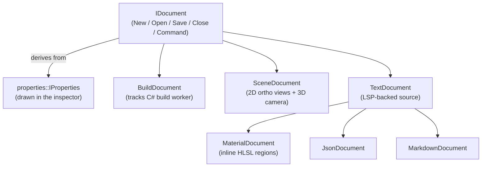

# Studio

Studio is the editor. It is also the engine. Those are not two applications that
happen to share a rendering library: they are the same code, the same component
system, the same [data table store](Core.md#data-the-table-store-the-engine-is-made-of),
and the same render path, wearing an editor UI. When Ceili says
[runtime == tools](Philosophy.md), Studio is where that bet gets cashed.

This page walks the editor from the top down: the document model that organises
its windows, the text documents backed by real language servers, the property
grid that draws itself, the cross-language plugin system that lets you extend the
editor in C#, and the selection and gizmo path that manipulates a live scene. The
recurring theme is that almost nothing here is bespoke editor machinery. It is the
engine's own primitives, viewed through an editing lens.

---

## The editor is the runtime

The first thing to internalise is that Studio does not run a scene in a sandbox
and marshal changes back into a "real" runtime later. The scene you are editing is
a live scene, ticked by the same fixed-tick scheduler that ticks a shipping game,
drawn by the same passes. Editor behaviour is authored as ordinary components and
systems that happen to only run in the editor scope.

Selection is the cleanest example. There is no special "selection subsystem" bolted
onto the renderer: selection is a `core::scene::system::SystemBase<>` ISystem,
ticked on the same substrate as any gameplay producer. A scene gets selection just
by being ticked, because the selection system is a component gathered by the same
scheduler that gathers a flocking system or a culling system. If you understand
[how Core schedules systems](Core.md#tasks-threading-and-the-fixed-tick-clock),
you already understand how the editor's own logic runs.

The Properties panel makes the same point from the UI side. It does not special-case
"documents" versus "entities" versus "materials." It draws every live provider of
an `IProperties` interface each frame, discovered through the generic component
registry, with no manual registration:

```cpp
// Properties.h: a contributor of Properties-panel content. The panel draws EVERY
// live provider each frame in descending getPriority() order via properties::Update;
// a provider with nothing to show this frame draws nothing and returns Ok.
// Providers are discovered through component::GetScopeInstances<IProperties>(...) --
// no manual registration.
struct IProperties : component::IComponent
{
    virtual Priority getPriority() const                                                 = 0;
    virtual Result   updateProperties(const component::ComponentUpdate& ComponentUpdate) = 0;
};
```

New content in the inspector is a new component that implements `IProperties`, not a
wider panel. The panel "knows nothing of documents or scenes." This is the
[component architecture](Components.md) applied to the editor's own surface area:
extend by adding a component, never by editing the host.

<!-- MEDIA: a full Studio screenshot -- the complete editor: menu bar, docked
     panels (Explorer, Properties, Console), a 3D camera viewport with a scene,
     and the 2D ortho views. The "this is one application" establishing shot. -->

---

## The document model

Everything you open in Studio is a **document**. A build, a scene, a Lua script, a
material, a JSON file, a markdown note: each is an `IDocument`, and each is drawn,
saved, and closed through the same interface.

```cpp
// Documents/Document.h: New/Open/Save/Close/Command, with flags for lifecycle.
struct IDocument : properties::IProperties
{
    // ... New / Open / Save / Close / Command ...
};
```

Notice the base class. `IDocument` derives from `properties::IProperties`: a
document *is* a properties provider. Opening a document does not register it with
the inspector; it already satisfies the inspector's contract, so it shows up in the
Properties panel by virtue of what it is. That is the funnel discipline from
[Metadata](Metadata.md) showing up structurally: fewer interfaces, each doing more.

Document types specialise the base where they need to. A **build document** tracks
the C# build worker so the C++ orchestrator can block-wait it before shutting down:

```cpp
// Documents/Build.h: the C++ orchestrator holds a handle to the C# build worker.
void   SetActiveWorker(/* ... */);
Worker GetActiveWorker() const;
```



### Scene documents: 2D and 3D of the same scene

A scene document is the richest case. It hosts the familiar 3D camera viewport, and
alongside it three orthographic views: Top, Front, and Side. Both are windows onto
the *same* live scene database; the 2D views are not a separate representation kept
in sync, they are a different projection of the identical data.

```cpp
// Documents/SceneDocument.h
enum class ViewDirection { Top, Front, Side };
```

The grid under each 2D view is authored, not hard-coded. A `Grid` struct carries the
colours, spacing, and adaptive behaviour, and a single interop call emits every grid
line for the active view:

```cpp
// Documents/SceneDocument.h: one call renders the whole grid for a view.
CE_API void DrawGrid(const ViewDirection Direction,
                     const float         OriginX,
                     const float         OriginY,
                     const float         Width,
                     const float         Height,
                     const float         PanX,
                     const float         PanY,
                     const float         PixelsPerUnit);
```

The C# scene-document plugin drives the three tabs and hands the pan/zoom state
straight back down to `DrawGrid`, so the world-to-screen mapping is computed once,
in C++, and shared between the grid and the wireframe geometry drawn on top of it:

```cs
// SceneDocument.cs: the 2D ortho views live in the SceneDocument's own window,
// the 3D render belongs to the Camera window. DrawGrid (C++) emits every grid
// line for the active view in one interop call.
this.DrawView2D("Top",   Studio.Scene.ViewDirection.Top);
this.DrawView2D("Front", Studio.Scene.ViewDirection.Front);
this.DrawView2D("Side",  Studio.Scene.ViewDirection.Side);
```

```cs
// Inside DrawView2D: pan/zoom from the view state flows into the shared mapping.
Studio.Scene.DrawGrid(Direction, cursor.x, cursor.y, avail.x, avail.y,
                      v.panX, v.panY, v.pixelsPerUnit);
```

Keeping the world-to-screen transform in one place (matched between `DrawGrid` and
the wireframe render, as the package's own design note spells out) is the same
"single source of truth on state mutation" rule from [Core](Core.md) applied to a
coordinate mapping: two paths that must agree funnel through one implementation
rather than drifting.

<!-- MEDIA: the 2D + 3D dual view -- a scene shown simultaneously in the 3D camera
     viewport and in a Top/Front/Side ortho tab, so the reader sees the same
     entities projected two ways from one database. -->

---

## Text documents backed by real language servers

Ceili does not ship a toy syntax highlighter. When you open a Lua script, a C#
file, or a material with inline HLSL, Studio speaks the Language Server Protocol to
a real server for that language, and you get go-to-definition, hover, references,
completion, and document symbols, the same features a full IDE gives you.

A text document exposes the editing surface plus the LSP query positions:

```cpp
// Documents/Text.h: Open/Reload/Save/IsLoaded/Update, plus hover and
// go-to-definition position getters, and embedded-region APIs for HLSL-in-Lua.
```

Behind it sits a small `ILsp` interface with the standard LSP verbs, plus one
addition worth noting:

```cpp
// Documents/Lsp/Lsp.h
struct ILsp : component::IComponent
{
    // didOpen / didClose / didChange
    // hover / definition / declaration / references / completion
    // documentSymbol / semanticTokensFull
    // WorkspaceSymbol -- name-based (non-position) C++ symbol resolution,
    //                    used by non-C++ documents to reach into the engine.
};
```

`WorkspaceSymbol` is the seam that lets a Lua or material document jump into C++:
a name resolves to a C++ symbol without a source position, so clicking through a
binding in a script lands you on the engine function that implements it. The
backends live side by side, one per language:

```
Src/Documents/Lsp/
    LspBase.cpp     -- shared transport + lifecycle
    LspCpp.cpp      -- clangd, for C++
    LspCSharp.cpp   -- csharp-ls, for C#
    LspLua.cpp      -- lua-language-server
    LspShader.cpp   -- clangd again, for HLSL
```

The shader backend literally shells out to `clangd`, the same tool driving the C++
experience, pointed at the HLSL region:

```cpp
// LspShader.cpp:27
StrPrintf(executable, sizeof(executable), "%s/Tools/clangd/clangd.exe", WorkspacePath);
```

This is why a material's inline HLSL gets the full clangd experience:
go-to-definition, hover, *and* inline colour swatches. That last one is the small
delight, a live colour chip rendered inline next to a colour literal in the
shader, so a `float3(0.8, 0.1, 0.1)` shows the red it stands for right where you
type it, with no round trip to the running scene. It all flows through clangd, not
the Lua server: a `MaterialDocument` is a text document whose HLSL regions are
detected, promoted to virtual documents, and handed to the shader LSP, so editing a
shader inside a `.material` feels like editing a standalone shader file. See [Materials](Materials.md) for the material
side and [Rendering](Rendering.md) for where those shaders end up.

### The async-load gate

There is one subtlety that the engine learned the hard way, and it is instructive
because it is a direct consequence of documents loading asynchronously. A text
document's buffer is not available the instant you open it; it loads on a worker.
If you push the buffer to the language server before it has loaded, you send the
server a placeholder ("Loading...") and it indexes garbage.

Every text document therefore carries a `lspPending` gate: it defers starting the
LSP until the real buffer is confirmed loaded, and only then pushes it via
`DidOpen`:

```cs
// TextDocument.cs: don't open the LSP on the placeholder buffer -- wait for the
// real text to load, then start.
if (this.lspPending && Studio.Document.Text.IsLoaded(this.hText))
{
    this.StartLsp();
    this.lspPending = false;
}
```

This gate is easy to miss when you add a new text-document subtype: `MaterialDocument`
overrode `Update()` and initially skipped it, so inline shader colours and HLSL
go-to-definition silently failed until the gate was restored. The lesson generalises
to any [async-loaded document override](Metadata.md): honour the `lspPending` /
`IsLoaded` / `StartLsp` sequence rather than starting the server eagerly.

Two more robustness details round this out. At startup, `WarmupLspServers` spins one
task per discovered `ILsp` instance, so a single hung server (csharp-ls has been the
culprit) cannot starve clangd or the Lua server behind a serial init. And
`WarmupCppLsp()` brings clangd up on a worker ahead of the first request, so the
first go-to-definition into C++ is not paying cold-start latency.

<!-- MEDIA: an LSP interaction -- a hover tooltip or a go-to-definition jump in a
     Lua or material document, ideally the inline-HLSL case showing a colour swatch
     next to a float3 literal. Demonstrates "real IDE features on engine data." -->

---

## The property grid, briefly

The inspector in Studio is the `ui::propertiesGrid` widget, and it is worth being
precise about where it lives: the real implementation is in the **Ui** package, not
in Studio. Studio only provides the `IProperties` glue that feeds it. The grid
itself is driven end to end off `core::meta::Info` reflection: annotations like
`CE_RANGE_DESC` and `CE_DESC` are parsed straight from the reflected `Info` and turn
into slider bounds and tooltips.

```cpp
// PropertiesGrid.h (Ui package): started, fed fields, finished -- all meta-driven.
// ui::propertiesGrid::Start / Add / AddContainer / Finish
// flags: TypeComboBox, Embedded, NoFilterBar, ...
```

Because the grid walks the metadata tree and renders a widget per field, a new field
on any struct becomes editable in Studio with no editor code at all. That story is
told in full, including how a field edit becomes an undoable action for free, in
[Metadata & Reflection](Metadata.md#the-property-grid-builds-itself). The point for
Studio is only that the inspector is not a Studio feature; it is a reflection feature
that Studio surfaces.

---

## Cross-language plugins

Studio is extensible, and the extension seam is deliberately language-neutral. Every
panel, tool, and document handler is an `IPlugin`, a C++-side contract that a plugin
implemented in either C++ or C# satisfies:

```cpp
// Plugin.h: the contract every plugin implements, whatever language it is written in.
struct IPlugin : component::IComponent
{
    // DockPreferences, Flags { Ui, BeforeDockspace, Hide }, ...
};
```

Most of Studio's own UI is authored in C#, in the `EngineStudioPlugins.Net` package.
A C# plugin registers itself through a generic factory that plugs into the same
component registry the C++ side uses:

```cs
// PluginBase.cs: a C# plugin self-registers into the engine's component factories.
public class PluginFactory<T> : Studio.IPlugin.Factory<T>
    where T : Studio.IPlugin, new()
{
    public PluginFactory() : base(Studio.IID_Plugin)
    {
        Core.Component.Factories.Add(this);
    }
}
```

The plugin catalogue is broad, and reading it is a good way to see how much of the
editor is "just plugins": `Explorer.cs`, `Console.cs`, `Camera.cs`, `Menu.cs`,
`Properties.cs`, `Systems.cs`, `ViewportInteraction.cs`, the whole `Documents/`
family, an `Entity/` group, an `AiAssistant/` group, and an `Mcp/` launcher. The
[in-engine AI assistant](AiIntegration.md) is not privileged infrastructure; it is a
plugin like the console. This is the [script generation](ScriptGeneration.md) layer
paying off: the C# bindings that let a plugin call `Studio.Scene.DrawGrid` or
`Core.Component.Factories.Add` are generated from the same headers the C++ engine
compiles, so a C# plugin is a first-class citizen, not a scripting afterthought.

---

## Selection and the gizmo: O(selected), not O(scene)

Manipulating a scene means selecting entities and dragging a gizmo. The naive
implementation walks every renderable every frame to find the selected ones and to
compute the manipulation bounds. Ceili refuses that: selection is cached, and the
gizmo iterates the cache.

The selection system keeps the selected set and a per-frame union bounds, computed
once, so the gizmo walk and the visual-highlight pass share a single recompute:

```cpp
// Selection.cpp: getSelection returns the cached selected set; selectedBounds
// returns a cached per-frame union AABB, so the former O(selected) gizmo walk +
// the highlight walk collapse to ONE recompute.
const scene::selection::SelectionArray& getSelection(const Handle hScene);
```

The gizmo then iterates that cache directly, reading each selected entity's
visibility row by key. It touches exactly the selected entities, never a full scan
of every visibility row in the scene:

```cpp
// Gizmo.cpp: O(selected) -- SelectionSystem's cached Selected set, not a per-frame
// scan of every Visibility row.
for (const core::scene::entity::Handle h_sel : scene::selection::Get(currentScene()))
{
    const core::data::Key key   = core::scene::entity::GetKey(h_sel);
    const auto* const     p_vis = static_cast<const graphics::scene::Visibility*>(
                                      core::data::ReadRecordItem(Db, VisTable, key));
    // ... manipulate this entity ...
}
```

For a scene of a hundred thousand entities with three selected, that is three row
reads, not a hundred thousand. It is the same performance instinct that runs
through [the 100k boids work](Performance_100kBoids.md): make the cost proportional
to the thing you are actually touching.

The gesture side lives in C#. `ViewportInteraction.cs` publishes the pick ray, the
gizmo hover and drag state, and the axis routing, which `Gizmo.cpp` consumes. Hover,
drag, and marquee selection are a gesture pipeline on the C# side feeding a
C++ manipulator, cleanly split across the interop boundary the same way the scene
document's 2D views are.

<!-- MEDIA: the gizmo manipulating a selection -- a translate/rotate gizmo on one or
     more selected entities in the 3D viewport, with the selection highlight visible.
     Ideally a short capture of a drag so the interaction reads. -->

---

## Undo/redo, from the editor's side

Studio owns the undo *history*; the metadata layer owns the *capture*. The two meet
at the `IAction` interface. Any editor operation that can be reversed is an `IAction`
with a `run()` and an `undo()`:

```cpp
// Action.h
struct IAction : component::IComponent
{
    enum class State : uint8_t { Init = 0, Running, Done };
    virtual State    getState() const       = 0;
    virtual ConstStr getDescription() const = 0;
    virtual Result   run()                  = 0;
    virtual Result   undo()                 = 0;
    virtual bool     drawPreview()          { return false; }
};

CE_API Result Run(const Handle hAction, const bool AllowUndo = true);
CE_API Result Undo();
CE_API Result Redo();
```

The crucial part is that property-grid edits do not each write a bespoke action.
Because every field edit routes through `meta::Write`, a write tagged as an action
snapshots the old and new bytes straight from `core::meta::WriteActionParams` and
turns them into a generic `MetaWriteAction`, with no per-type code. Any field that
is editable is undoable, automatically. The full mechanism is documented in
[Metadata: undo/redo is the funnel watching itself](Metadata.md#undoredo-is-the-funnel-watching-itself).

Studio's contribution is the history container. `SimpleActions` is a linear undo
stack: a single history array with an undo/redo cursor that truncates the redo tail
whenever a new action runs (standard linear-undo semantics) and owns the actions it
holds, deleting them on truncate, clear, or destroy:

```cpp
// SimpleActions.h: a single history array + an undo/redo cursor. A new run()
// truncates the redo tail; the component owns (ceDelete-s) the actions it holds.
struct SimpleActions : CComponent<IActions> { /* ... */ };
```

So the division of labour is clean: reflection captures *what changed* into an
action; Studio decides *where that action sits* in history and *when* it is undone.
Neither half knows the specific type being edited.

---

## Studio is the payoff of runtime == tools

Step back and the pattern is consistent. Selection is a system on the normal
scheduler. The inspector is a reflection feature Studio surfaces, not a Studio
feature. Documents are properties providers. Plugins, including the AI assistant,
are components in the same registry the engine uses everywhere. Undo is a flag on
the same `Write` that saves and networks the same field. The editor is not built
*on* the engine; it is the engine, plus a UI.

That is not an aesthetic preference, it is a leverage argument. The property grid
that draws any type, the language servers over live source, the undo that captures
any field: none of them cost per-feature editor code, because each one rides a
primitive the runtime already needed. The clearest proof is what the editor can do
without flinching: a hundred thousand boids simulate and render live inside a Studio
viewport, the same scene you can select into, inspect, and undo edits on. See
[The Road to 100k Boids](Performance_100kBoids.md). And because a plugin is a
first-class component, the [in-engine AI assistant](AiIntegration.md) sits inside
that same editor as one more panel, editing the same data through the same funnels.

Next: [The Road to 100k Boids](Performance_100kBoids.md), or back to the
[documentation index](README.md).
